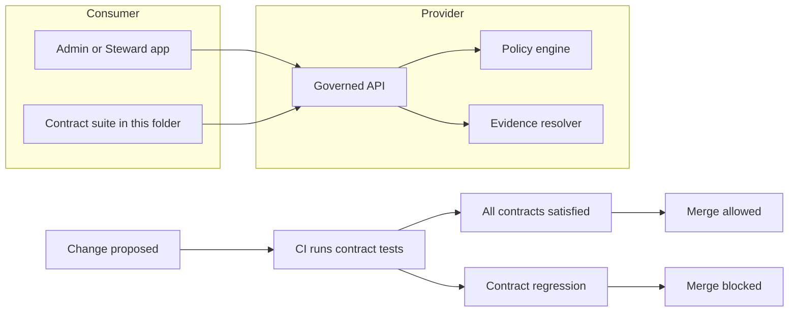

<!-- [KFM_META_BLOCK_V2]
doc_id: kfm://doc/8f3cb3a1-92f6-4b9b-86d6-2ccddf6a9df7
title: apps/admin/tests/contracts — Contract tests
type: standard
version: v1
status: draft
owners: <TODO: team or CODEOWNERS>
created: 2026-02-26
updated: 2026-02-26
policy_label: restricted
related:
  - <TODO: link to governed API OpenAPI/GraphQL/JSON Schema contracts>
  - <TODO: link to policy fixtures and Promotion Contract gates>
tags: [kfm, tests, contracts, admin]
notes:
  - This README is intentionally fail-closed: places that depend on repo wiring are marked TODO.
[/KFM_META_BLOCK_V2] -->

# apps/admin/tests/contracts

**Purpose:** consumer-side contract tests for the **Admin/Steward** app to ensure it stays compatible with **governed APIs** and does not regress policy, evidence, or error-model guarantees.

> Status: **draft** • Owners: **<TODO>** • Policy label: **restricted** (adjust if this folder is safe to be public)


---

## Navigation

- [Why this exists](#why-this-exists)
- [Contract test flow](#contract-test-flow-conceptual)
- [What contract means here](#what-contract-means-here)
- [Contract surface registry](#contract-surface-registry-fill-in-as-you-wire-the-repo)
- [Directory guide](#directory-guide)
- [Run locally](#run-locally)
- [Add or update a contract test](#add-or-update-a-contract-test)
- [Contract assertions checklist](#contract-assertions-checklist)
- [CI and promotion gates](#ci-and-promotion-gates)
- [Governance and safety rules](#governance-and-safety-rules)
- [Troubleshooting](#troubleshooting)

---

## Why this exists

The Admin app is part of the system's **trust membrane**: it helps stewards review, label, and promote dataset versions—so it must never "silently succeed" against drifted API behavior.

This folder exists to:

- Detect **breaking API changes** (schema drift, renamed fields, changed error codes) before merge.
- Enforce **policy-safe behavior** (default-deny, no sensitive leakage through errors).
- Ensure that "governed operation" responses include the **audit/evidence fields** the UI needs.

---

### Contract test flow (conceptual)



---

## What contract means here

A *contract* is an executable assertion about an interface boundary.

In KFM terms, contracts commonly include:

- **OpenAPI / JSON Schema / GraphQL** shapes (request + response)
- **Stable error model** (error_code, policy-safe message, audit_ref)
- **Policy posture** (deny-by-default, consistent 403/404 strategy)
- **Evidence linkage** (EvidenceRefs resolve to EvidenceBundles via the evidence resolver)

> NOTE
>
> This folder is **consumer-side** by default: tests are written from the Admin app's expectations.
> If you also run provider-side verification (e.g., provider verifies consumer pacts), document it in [CI and promotion gates](#ci-and-promotion-gates).

---

## Contract surface registry (fill in as you wire the repo)

| Surface | Contract artifact (source of truth) | Verified by (this suite) | Notes |
|---|---|---|---|
| Dataset discovery | `<TODO: OpenAPI/Schema path>` | Schema validation + policy-safe fixtures | Admin UI typically needs dataset_version_id + policy_label |
| Evidence resolve | `<TODO: OpenAPI/Schema path>` | Schema validation + deny-by-default cases | Must fail closed if unresolvable/unauthorized |
| Admin steward actions | `<TODO: OpenAPI/Schema path>` | Role-scoped fixtures + error-model tests | Ensure no sensitive leakage via error differences |
| Audit and receipts | `<TODO: schema path>` | Presence + schema checks | audit_ref should exist for governed operations |

---

## Directory guide

This README cannot assume the exact repo wiring (runner, scripts, contract file locations). Update this section once the layout is confirmed.

### Expected layout (PROPOSED)

```text
apps/admin/tests/contracts/
├─ README.md
├─ cases/                      # individual contract test files
│  ├─ *.test.(ts|js|py)
│  └─ ...
├─ fixtures/                   # minimal, synthetic request/response payloads
│  ├─ public/
│  └─ restricted_synthetic/
├─ snapshots/                  # frozen schema snapshots (only if you snapshot)
├─ helpers/                    # shared request clients / schema validators
└─ reports/                    # test artifacts (junit, html, diff outputs) [gitignored]
```

### What belongs here

- Contract test code that verifies Admin↔API boundaries.
- Synthetic fixtures that are **safe to commit**.
- Schema snapshots *only if* you have an explicit snapshot policy.

### What must NOT go here

- Unit tests (put them under the unit test folder used by the Admin app).
- End-to-end browser tests (put them under the e2e suite).
- Real secrets, tokens, API keys, or production IDs.
- Real restricted data, precise sensitive coordinates, or anything that would violate policy if leaked.

---

## Run locally

Because repo wiring differs by stack, treat the commands below as templates.

### 1) Find the correct test script (verify wiring)

From repo root, inspect Admin app scripts:

```bash
cat apps/admin/package.json | sed -n '1,200p'
# Look for something like: test:contracts, contracts, pact, openapi:verify, etc.
```

### 2) Example run commands (choose what matches your repo)

```bash
# Option A: pnpm
pnpm -C apps/admin run test:contracts

# Option B: npm
npm --prefix apps/admin run test:contracts

# Option C: yarn
yarn --cwd apps/admin test:contracts
```

### 3) Point tests at a target API

Contract tests should be able to run against:

- a local dev server
- a CI ephemeral environment
- a mocked server generated from the contract (preferred for consumer-side)

Use environment variables instead of hardcoding:

```bash
export ADMIN_CONTRACTS_API_BASE_URL="http://localhost:3000"  # TODO: correct port
export ADMIN_CONTRACTS_AUTH_MODE="stub"                      # TODO: stub|oidc|...
```

> WARNING
>
> Never commit `.env` files containing secrets. Use `.env.example` and CI secret stores.

---

## Add or update a contract test

### Step-by-step

1) **Pick the contract source of truth**
   - OpenAPI spec (`openapi.yaml`), GraphQL schema (`schema.graphql`), or JSON Schemas.
   - Record the path in this README under "Related docs" once known.

2) **Write a minimal fixture**
   - Prefer the smallest payload that proves the behavior.
   - Use synthetic IDs and synthetic geometry (or coarse/generalized geometry if you must include spatial).

3) **Write the assertions (fail closed)**
   - Validate the response **schema**.
   - Validate **policy posture** (deny-by-default for restricted roles).
   - Validate the **error model**.
   - Validate required governance fields (dataset_version_id, policy label, audit_ref, citations) where applicable.

4) **Update snapshots only with intent**
   - If you snapshot schemas/responses, the PR must include a reason:
     - "new backwards-compatible field"
     - "breaking change with version bump (/api/v2)"

5) **Make CI block on regressions**
   - Ensure this suite runs in CI and is required for merge.

### Example: schema-first assertion (pseudocode)

```ts
// PSEUDOCODE — replace with your repo's actual test framework.

import { fetchJson } from './helpers/fetchJson'
import { assertSchema } from './helpers/assertSchema'

it('GET /api/v1/datasets returns policy-safe discovery payload', async () => {
  const res = await fetchJson('/api/v1/datasets')

  assertSchema('contracts/schemas/datasets_list.v1.json', res)

  // Contract invariants the Admin UI relies on
  expect(res).toHaveProperty('items')
  expect(res.items[0]).toHaveProperty('dataset_version_id')
  expect(res.items[0]).toHaveProperty('policy_label')
})
```

---

## Contract assertions checklist

Use this list when adding a new test case.

### Response shape and metadata

- [ ] Response validates against the canonical schema (OpenAPI/JSON Schema/GraphQL).
- [ ] Includes **dataset_version_id** when applicable.
- [ ] Includes **artifact digests** when applicable.
- [ ] Includes a **policy label** that is safe to show.
- [ ] Includes **audit_ref** for governed operations (admin actions, focus/story publish flows).

### Error model and policy posture

- [ ] Errors include: **error_code**, **policy-safe message**, and **audit_ref**.
- [ ] No "ghost metadata" leaks restricted existence through different error shapes.
- [ ] 403/404 behavior is aligned to policy (deny-by-default).

### Evidence and citations (when applicable)

- [ ] EvidenceRefs resolve to EvidenceBundles (or the operation abstains/denies).
- [ ] Citations are resolvable links, not just text.

### Security hygiene

- [ ] No secrets in fixtures.
- [ ] Any sensitive geometry is generalized or replaced with synthetic data.
- [ ] Tests do not depend on production-only identifiers.

---

## CI and promotion gates

Contract tests are part of the **fail-closed** promotion posture.

### Required CI behavior (minimum)

- Run this suite on every PR that changes:
  - Admin API clients
  - Governed API schema / routes
  - policy fixtures or evidence resolver
- Block merge if any contract test fails.

### Recommended artifacts

- JUnit (or similar) report for CI UI
- A machine-readable diff of schema drift
- A short human summary in PR comments (optional)

> TIP
>
> If your repo uses a Promotion Contract lane, treat contract tests as a **gate** (required status check), not optional.

---

## Governance and safety rules

### Default-deny mindset

If a test cannot prove the contract is satisfied, it should fail.

### Synthetic data only

- Do not commit restricted datasets.
- Do not commit precise coordinates for vulnerable locations.
- Prefer **generated fixtures**.

### What to do when a contract breaks

1) Determine if it is:
   - a backwards-compatible addition (update schema, add tests)
   - a breaking change (version bump + migration plan)
2) Update the Admin UI to handle the contract **explicitly**.
3) Update this README if the "source of truth" path changed.

---

## Troubleshooting

### "Test passes locally, fails in CI"

- Confirm the CI is pointing at the same API base URL and auth mode.
- Confirm fixtures are not depending on local-only state.

### "Schema drift detected"

- If the change is intended:
  - update the schema version and regenerate snapshots
  - add a regression test proving compatibility
- If unintended:
  - revert or gate behind a feature flag

### "403 vs 404 mismatch"

- Treat as a security issue until proven otherwise.
- Ensure errors do not reveal restricted existence through different responses.

---

## Related docs (TODO wire-up)

- Governed API contracts: `<TODO: path>`
- Policy fixtures/tests: `<TODO: path>`
- Evidence resolver contract: `<TODO: path>`

---

<a id="back-to-top"></a>
**Back to top:** [apps/admin/tests/contracts](#appsadmintestscontracts)
