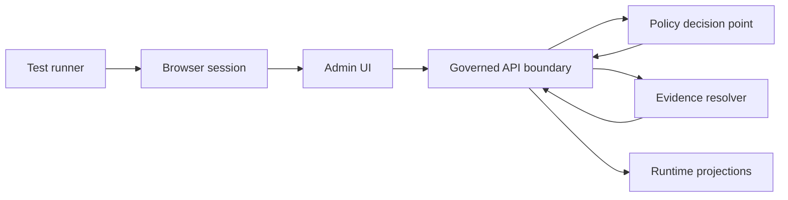

<!-- [KFM_META_BLOCK_V2]
doc_id: kfm://doc/9f0f3b0e-8f1a-4c0b-8ab1-5ec2b0b20d0d
title: Admin E2E Tests
type: standard
version: v1
status: draft
owners: TODO (add team / GitHub handle)
created: 2026-02-26
updated: 2026-02-28
policy_label: public
related:
  - TODO: apps/admin/README.md
  - TODO: docs/testing/README.md
tags: [kfm, admin, tests, e2e]
notes:
  - This README is intentionally runner-agnostic. It includes Playwright-style examples as a commonly used E2E pattern.
  - Replace TODOs once repo scripts/config are confirmed.
[/KFM_META_BLOCK_V2] -->

# Admin E2E Tests
End-to-end tests for the **Admin** app’s governed workflows: **policy enforcement**, **promotion gates**, and **evidence/provenance surfaces**.


**Where this lives (intended):** `apps/admin/tests/e2e/` *(verify in repo)*

---

## Quick links
- [Purpose and non-goals](#purpose-and-non-goals)
- [How E2E fits the trust membrane](#how-e2e-fits-the-trust-membrane)
- [Quickstart](#quickstart)
- [TODO burn-down checklist](#todo-burn-down-checklist)
- [Test suites](#test-suites)
- [Promotion Contract coverage](#promotion-contract-coverage)
- [Env vars and secrets](#env-vars-and-secrets)
- [Fixtures and test data](#fixtures-and-test-data)
- [Snapshots and baselines](#snapshots-and-baselines)
- [Writing a new test](#writing-a-new-test)
- [Network boundary assertions](#network-boundary-assertions)
- [CI expectations](#ci-expectations)
- [Debugging](#debugging)
- [Directory structure](#directory-structure)
- [What must not go here](#what-must-not-go-here)

---

## Purpose and non-goals

### Purpose
These tests verify that the Admin app works **end-to-end**, including:

- UI → **governed API boundary** → **policy enforcement** → **evidence/provenance surfaces**
- “Fail-closed” behavior: when something is missing or disallowed, the system blocks safely
- Regression protection for critical admin workflows (promotion, policy labeling, exports, approvals, audit views, etc.)

### Non-goals
- Unit tests and pure component tests (belong elsewhere)
- Load/perf tests (belong in perf suites)
- Manual scripts for one-off data fixes
- Anything that requires production credentials or production datasets

> [!NOTE]
> E2E tests are the last line of defense for *user-visible trust*. Keep them focused on a small set of high-value flows. Prefer contract/unit tests for exhaustive coverage.

---

## How E2E fits the trust membrane

KFM’s core invariant is that **clients never talk to storage or databases directly**—everything goes through governed APIs so policy + logging + redaction are consistent.

These E2E tests exist to catch accidental violations, such as:
- A UI path that fetches from object storage directly (bypassing policy)
- Error behavior that leaks whether restricted datasets exist
- Export/Download paths that skip policy checks
- Admin actions that bypass required promotion gates
- Evidence/citation UI that renders stale or unresolvable provenance

### Conceptual flow


### What this suite must prove (invariants)
- **Fail-closed:** missing artifacts/rights/policy inputs must block promotion and publishing flows.
- **Policy-safe outputs:** restricted objects must be denied or generalized; errors must not leak existence.
- **Evidence-first UX:** wherever the Admin UI shows a dataset/story/action, it must surface *version + license/rights + evidence links* (when policy allows).
- **Trust membrane:** Admin UI must not bypass the governed API boundary (no direct DB/object storage calls).

---

## Quickstart

### 1) Prereqs
- A running Admin app (local dev server or CI preview env)
- A running API + dependencies (DB, object storage emulator, etc.)
- A known-good **E2E test user** and seeded fixtures
- A clean test namespace (so tests are safe to re-run)

> [!WARNING]
> Never point E2E at production. Use an isolated dev/preview stack with synthetic or explicitly-public fixtures.

### 2) Start the stack (example)
Use the repo’s documented dev workflow (Docker Compose / task runner / Nx / Turborepo / etc.).

Examples (pick what matches this repo):
```bash
# Option A (docker compose)
docker compose up -d

# Option B (monorepo task)
# npm run dev:admin
# pnpm -w dev --filter admin
```

### 3) Run E2E tests (examples)
> Replace these with the real scripts for this repo once confirmed.

```bash
# Generic
# npm run test:e2e --workspace=admin

# If using Playwright
# npx playwright test
# npx playwright test --ui
```

---

## TODO burn-down checklist

This README is intentionally conservative and contains `TODO`s where repo-specific facts must be verified.

Minimum checks to convert “TODO” → “Confirmed”:
- [ ] Capture repo commit hash and root directory tree (`git rev-parse HEAD` and `tree -L 3`)
- [ ] Confirm the E2E runner and exact command(s) (script name, workspace filters, config file)
- [ ] Extract CI gate list from `.github/workflows` and mark which checks are merge-blocking
- [ ] Confirm the Admin E2E seed strategy (fixtures vs API seeding vs DB reset) and document it here
- [ ] Choose one MVP fixture dataset/story and validate it can traverse policy + promotion flows end-to-end
- [ ] Validate the **trust membrane**: UI cannot bypass the governed API boundary (network allowlist + static analysis where possible)

> [!TIP]
> Keep outputs from this checklist as build artifacts (or commit them) so future contributors don’t re-discover the same unknowns.

---

## Test suites

Keep suites aligned to **governance + trust surfaces**, not random UI polish.

| Suite | What it protects | Example assertions | Runs in CI? |
|------|-------------------|-------------------|------------|
| `auth` | Access control correctness | unauth → redirect; role gates enforced | ✅ |
| `policy` | Deny/allow + obligations | restricted objects redacted/generalized; policy-safe errors | ✅ |
| `promotion` | Promotion Contract gates | cannot promote without required artifacts; gate failures are explicit | ✅ |
| `evidence` | Evidence surfaces / provenance | evidence resolves; IDs/digests shown; license/rights visible; links exist (when allowed) | ✅ |
| `exports` | Safe exports | license/attribution attached; restricted export denied | ✅ |
| `audit` | Auditability | admin actions emit audit/receipt identifiers; views are policy-safe | ✅ |
| `smoke` | Minimal “is it alive” | navigation + one golden flow | ✅ |

> [!TIP]
> Keep **`smoke`** fast (<2–3 minutes) so it can run on every PR.

---

## Promotion Contract coverage

E2E is not the only place we test Promotion Contract behavior — but it is where we prove the **Admin workflow** is wired correctly end-to-end.

The Admin UI should make gate failures *actionable* (what failed + what artifact is missing) without leaking restricted details.

| Gate | Admin workflow touchpoint | E2E assertions (examples) |
|---|---|---|
| A — Identity & versioning | View/inspect a dataset version | dataset/version IDs are shown; digests/spec hash are present when policy allows |
| B — Licensing & rights metadata | Promote or export | promotion/export blocks if license/rights missing; UI links to rights/terms evidence |
| C — Sensitivity & redaction plan | Assign policy label; promote | restricted requires obligations; public output does not contain restricted fields/coords |
| D — Catalog triplet validation | Promote | promotion blocks when catalogs/links invalid; evidence refs must resolve |
| E — QA & thresholds | Promote | promotion blocks when QA fails; quarantine is explicit (policy-safe) |
| F — Run receipt & audit record | Promote/approve | promotion emits receipt/audit ID; Admin UI can view/verify it |
| G — Release manifest (optional) | Promote/publish | manifest exists and references promoted artifacts (if implemented) |

> [!NOTE]
> The specific UI wording is repo-specific; keep assertions focused on the invariant, not copy.

---

## Env vars and secrets

Define a single, documented interface so local dev + CI behave the same.

| Variable | Meaning | Example |
|---------|---------|---------|
| `ADMIN_BASE_URL` | Where the Admin UI is running | `http://localhost:3001` |
| `API_BASE_URL` | Governed API base URL | `http://localhost:8000` |
| `E2E_ROLE` | Role context for tests | `admin` |
| `E2E_USER_EMAIL` | E2E login user | `e2e-admin@example.test` |
| `E2E_USER_PASSWORD` | E2E login password | `***` |
| `E2E_ARTIFACTS_DIR` | Where reports/traces go | `./test-results` |
| `E2E_RUN_ID` | Unique namespace per run (avoid collisions) | `2026-02-28T120000Z` |
| `E2E_ALLOWED_ORIGINS` | Comma-separated allowlist for network requests | `http://localhost:3001,http://localhost:8000` |

**Rules**
- Secrets come from: local `.env` (ignored) or CI secret store
- Never commit real tokens, passwords, cookies, or storage state
- Prefer short-lived credentials for preview envs; rotate regularly

---

## Fixtures and test data

E2E tests must be:
- **Deterministic**: same inputs → same result
- **Isolated**: safe to run in parallel and to re-run
- **Governed**: only public/synthetic fixtures unless explicitly approved

Recommended fixture types:
- `fixtures/users/` — seeded users/roles
- `fixtures/datasets/` — minimal dataset versions for:
  - public allowed dataset
  - restricted dataset (to verify deny/redaction)
  - “rights unclear” dataset (to verify quarantine / gate failures)
- `fixtures/promotion/` — minimal catalog triplet + receipt templates (valid/invalid)
- `fixtures/exports/` — known export shapes to assert redaction rules

> [!NOTE]
> If a test needs a “restricted” scenario, use a synthetic dataset labeled restricted and validate that the UI/API do not leak sensitive details.

---

## Snapshots and baselines

If you use snapshot testing (screenshots, PDF exports, map renders), treat baselines as **governed artifacts**:
- Store them in-repo if they’re small and stable
- Prefer deterministic rendering (fonts, viewport, time, locale)
- Any baseline update must be reviewed like a code change
- Baselines must not contain restricted coordinates, PII, or unlicensed media

Examples (if using Playwright):
```bash
# Update snapshots (example)
# npx playwright test --update-snapshots

# Generate HTML report (example)
# npx playwright show-report
```

---

## Writing a new test

### Test anatomy
1) **Setup**: seed data + login + navigate to starting state  
2) **Action**: perform the user action  
3) **Assert**: verify one well-defined outcome

### Rules of thumb
- A test should fail for **one clear reason**
- Use stable selectors (e.g., `data-testid`) instead of brittle CSS/XPath
- Avoid fixed sleeps; wait on specific UI states or network idleness
- Keep tests idempotent: clean up what you create, or use per-test namespaces
- When asserting policy behavior, assert **invariants**, not copy text

### Minimal DoD checklist
- [ ] Covers a trust surface (policy, promotion, evidence, export, auth, audit)
- [ ] Deterministic (no wall-clock dependence; time is controlled/mocked if needed)
- [ ] Uses public/synthetic fixtures
- [ ] Produces useful artifacts on failure (trace/screenshot/log)
- [ ] Runs locally + in CI
- [ ] No secrets committed

---

## Network boundary assertions

A pragmatic trust-membrane guardrail is to **fail tests if the browser makes requests to disallowed origins** (e.g., direct S3/object storage, raw DB endpoints, or ungoverned tile hosts).

Runner-agnostic idea:
1) Define an allowlist (e.g., from `E2E_ALLOWED_ORIGINS`)
2) Capture all requests made by the browser
3) Fail fast when a request target is not allowlisted

Playwright-style sketch (adapt to your runner):
```ts
// PSEUDO: ensure browser never talks to storage/DB directly
const allowed = new Set(process.env.E2E_ALLOWED_ORIGINS?.split(",") ?? []);

page.on("request", (req) => {
  const url = new URL(req.url());
  const origin = url.origin;

  // allow data:, blob: implicitly (runner-specific)
  if (url.protocol === "data:" || url.protocol === "blob:") return;

  if (!allowed.has(origin)) {
    throw new Error(`Disallowed origin in E2E: ${origin} (${req.method()} ${req.url()})`);
  }
});
```

> [!WARNING]
> Don’t “fix” these failures by expanding the allowlist unless it’s a governed decision. A new origin often means a trust membrane bypass.

---

## CI expectations

At minimum, CI should:
- Run `smoke` on every PR
- Run full suite on merges (or nightly if it’s too heavy)
- Upload artifacts (screenshots/traces/logs) on failure
- Fail the build if policy checks regress or “fail-closed” invariants break

> [!WARNING]
> If E2E is flaky, treat it as a production issue. Flaky tests erode the trust membrane by hiding real regressions.

---

## Debugging

Common techniques (adapt to your runner):
- Run headed / slow mode
- Enable traces / videos on failure
- Re-run a single spec with a fixed seed
- Log network requests to confirm calls go through the governed API boundary
- Temporarily tighten network allowlist (to find accidental bypasses)

Example commands (Playwright-style):
```bash
# Headed debugging
# npx playwright test --headed --project=chromium

# Run a single file
# npx playwright test specs/policy/restricted-dataset.spec.ts

# Keep artifacts
# npx playwright test --trace on
```

---

## Directory structure

This README documents the intended structure; adjust if the repo differs.

```text
apps/admin/tests/e2e/                                  # Admin E2E suite (critical journeys across UI + governed APIs)
├── README.md                                          # You are here (how to run locally/CI, env vars, debugging)
├── config/                                            # Runner config (projects, browsers, timeouts, retries)
├── specs/                                             # Test specs organized by suite (keep suites small + focused)
│   ├── smoke/                                         # Fast “is it alive” checks (login, nav, basic reads)
│   ├── auth/                                          # Authentication flows + session handling
│   ├── policy/                                        # Policy-driven behaviors (allow/deny/obligation surfaced in UI)
│   ├── promotion/                                     # Promotion workflows (gates, manifests, approvals, receipts)
│   ├── evidence/                                      # Evidence UX (citations, bundles, resolver states)
│   ├── exports/                                       # Export flows (downloads, redaction rules, audit events)
│   ├── audit/                                         # Audit/receipt surfacing and verification
│   └── ...                                            # Add new suites as named folders (one domain per suite)
├── fixtures/                                          # Synthetic/public seed data (safe, deterministic, versioned)
├── helpers/                                           # Page objects + API helpers + selectors (shared across specs)
├── snapshots/                                         # Approved baselines (only if snapshot testing is used)
└── artifacts/                                         # Local-only outputs (traces/videos/screenshots) — gitignored
```

---

## What must not go here

- Production credentials or tokens
- Real restricted datasets or precise sensitive coordinates
- One-off scripts that mutate shared environments
- Large binary artifacts committed by accident (reports, videos, traces)
- Snapshot baselines containing restricted coordinates, PII, or unlicensed media

---

## Notes for maintainers

- Keep the suite small and high-leverage
- Prefer contract tests for breadth; use E2E for critical user journeys
- When policy behavior changes intentionally, update:
  - fixtures
  - assertions
  - snapshots
  - and the changelog/release notes (if applicable)

---

[↑ Back to top](#admin-e2e-tests)
