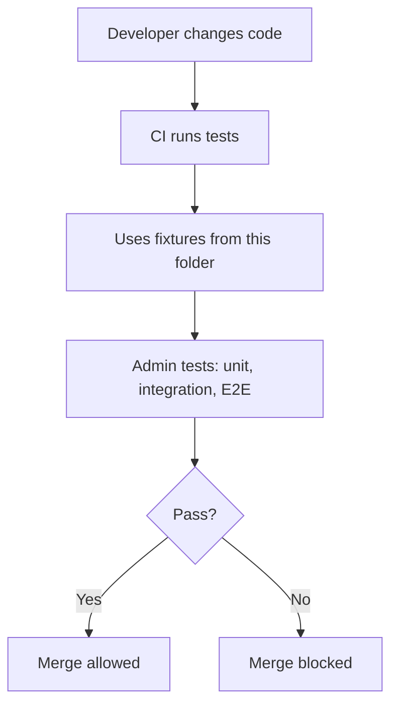

<!-- [KFM_META_BLOCK_V2]
doc_id: kfm://doc/fe31cf9b-1658-4024-ae0a-1e4faffb231c
title: Admin Test Fixtures
type: standard
version: v1
status: draft
owners: KFM Admin Team (TBD)
created: 2026-02-26
updated: 2026-02-26
policy_label: restricted
related:
  - apps/admin/tests/README.md  # TODO: confirm path
  - policy/fixtures/            # TODO: confirm if shared policy fixtures exist
tags: [kfm, tests, fixtures, admin]
notes:
  - This directory is a governed boundary: fixtures must be synthetic, deterministic, and safe to commit.
  - Update this README when new fixture categories or schemas are introduced.
[/KFM_META_BLOCK_V2] -->

# Admin Test Fixtures
> Deterministic, synthetic test inputs for the **Admin/Steward** app — used to prove governance behavior without leaking sensitive data.


**Status:** draft • **Owners:** KFM Admin Team (TBD)

---

## Quick navigation
- [Purpose](#purpose)
- [Where this fits](#where-this-fits)
- [Directory layout](#directory-layout)
- [What belongs here](#what-belongs-here)
- [What must NOT go here](#what-must-not-go-here)
- [Fixture conventions](#fixture-conventions)
- [Adding or changing fixtures](#adding-or-changing-fixtures)
- [Validation gates](#validation-gates)
- [Security and governance rules](#security-and-governance-rules)
- [Appendix: fixture templates](#appendix-fixture-templates)

---

## Purpose
This folder contains **fixtures** used by `apps/admin` tests (unit, integration, and/or E2E). Fixtures are the “known-good” inputs that let tests:
- create deterministic UI state,
- mock governed API responses,
- verify policy-driven behavior (allow/deny + obligations),
- reproduce edge cases reliably.

---

## Where this fits
Fixtures are part of the **trust membrane**: tests should demonstrate that *policy and governance behavior* stays stable across refactors and releases.



---

## Directory layout

> NOTE: The exact subfolders may evolve. Prefer **adding** new fixture categories over renaming existing ones (reduces churn).

```text
apps/admin/tests/fixtures/                             # Admin test fixtures (safe, synthetic, policy-labeled)
├── README.md                                          # You are here (fixture rules, naming, validation, provenance)
├── policy_cases/                                      # Allow/deny + obligations “truth table” cases (source of expectations)
│   └── (case_slug).json                               # Single policy case fixture (inputs → expected decision/obligations)
├── api/                                               # Mock governed API responses (stable shapes, versioned)
│   └── (endpoint_slug).json                           # Mock response per endpoint/variant (use deterministic IDs)
├── ui/                                                # View-state or component fixtures (render states + edge cases)
│   └── (component_slug).json                          # Component/view fixture (props/state payloads)
├── schemas/                                           # JSON Schemas for fixture validation (recommended)
│   └── (fixture_kind).schema.json                     # Schema per fixture kind (policy_case/api/ui) + required fields
└── ...                                                # Add new fixture kinds as folders (must include schema + README updates)
```

---

## What belongs here

✅ **Acceptable inputs**
- Synthetic JSON/YAML/CSV used for deterministic tests.
- Policy decision cases (inputs + expected decision + expected obligations).
- Mock API responses that mirror governed contract shapes.
- UI state snapshots (component props/state, serialized store state) **without secrets**.
- Minimal “golden” datasets used to validate rendering and access control behavior.

---

## What must NOT go here

🚫 **Exclusions**
- **Real PII** (names, emails, phone numbers, addresses), even if “public”.
- **Secrets** (API keys, tokens, passwords, private certificates).
- **Exact sensitive locations** (precise coordinates or site identifiers) unless explicitly approved and policy permits.
- Large binary artifacts (use generated test data or small text fixtures).
- Any fixture that depends on system time, randomness, or network availability.

> WARNING: If you are unsure whether a fixture is safe to commit, treat it as **restricted** and escalate for governance review.

---

## Fixture conventions

### Naming
Use names that are stable and descriptive:
- `snake_case` filenames
- include the **scenario** in the name: `public_user_cannot_publish.json`, `steward_can_approve_promotion.json`
- avoid embedding dates unless they are part of the scenario

### Determinism
Fixtures must be deterministic:
- use stable IDs (UUIDs are fine, but keep them constant once committed)
- avoid “now”, timestamps generated at runtime, random salts, or order-dependent arrays
- keep numeric values small and interpretable

### Minimal-but-complete
Prefer small fixtures that still exercise the real rules:
- include only fields required by the contract/test
- but include enough context to prevent tests from “passing by accident”

### “Golden” fixtures
If a fixture is used as a **golden** baseline:
- it should be stable across time and OS
- changing it should require updating expected snapshots and explaining the change in the PR

---

## Adding or changing fixtures

1. **Pick the right category**
   - Policy behavior → `policy_cases/`
   - API contract mocks → `api/`
   - UI-only or component tests → `ui/`

2. **Add or update a schema** (recommended)
   - put schemas in `schemas/`
   - validate fixtures in CI (see [Validation gates](#validation-gates))

3. **Write the smallest fixture that reproduces the behavior**
   - reduce fields until the test fails, then add back only what is needed

4. **Add a test that uses the fixture**
   - fixtures without tests become stale quickly

5. **Document noteworthy fixtures**
   - add a one-line description in the [Fixture registry](#fixture-registry) table below

---

## Fixture registry

> TIP: Keep this table short. For large sets, split by subfolder and use `<details>`.

| Kind | Folder | Typical format | Used by | Notes |
|---|---|---:|---|---|
| Policy cases | `policy_cases/` | JSON | policy tests + admin flows | Inputs + expected decision + obligations |
| API mocks | `api/` | JSON | integration/E2E | Must mirror governed API contract shapes |
| UI fixtures | `ui/` | JSON | unit/component | Props/state snapshots; no secrets |
| Schemas | `schemas/` | JSON Schema | CI | Validates fixtures (fail closed) |

---

## Validation gates

Minimum gates for fixtures (fail closed):

- [ ] **Schema validation**: fixtures validate against schemas (if present)
- [ ] **No secrets**: automated secret scanning passes
- [ ] **Size check**: fixtures stay small (avoid megabyte+ JSON)
- [ ] **Determinism check**: fixtures do not depend on wall-clock time or randomness
- [ ] **Policy regression**: policy fixtures exercise allow/deny + obligations and block merge on change

> NOTE: If your repo uses a specific test runner (Jest/Vitest/Playwright/etc.), add the exact command(s) here.

```text
# TODO: Replace with your repo's actual commands
npm test
# or
pnpm -C apps/admin test
```

---

## Security and governance rules

### Safe data only
Fixtures must be safe to commit and safe to share with anyone who can read the repo:
- use fake names like `Example User`, `Test Steward`
- use reserved domains like `example.com`
- use synthetic coordinates (or omit geometry entirely) unless the test requires it

### Default-deny mindset
Admin fixtures often model governance flows (promotion review, rights checks, redaction obligations). When in doubt:
- **deny by default**
- include an explicit “steward override” scenario **only if** policy supports it

### Obligations are first-class
If your policy returns obligations (like “generalize geometry” or “remove attributes”):
- fixtures must encode the obligations expected
- UI tests should verify that the Admin app surfaces the obligation to the user (badge, notice, or banner)

---

## Appendix: fixture templates

<details>
<summary><strong>Policy case fixture template (JSON)</strong></summary>

```json
{
  "case_id": "public_user_cannot_read_restricted",
  "input": {
    "user": { "role": "public" },
    "action": "read",
    "resource": { "policy_label": "restricted" }
  },
  "expected": {
    "decision": "deny",
    "obligations": [],
    "reason_codes": ["RESTRICTED"]
  }
}
```

</details>

<details>
<summary><strong>Policy case with obligations template (JSON)</strong></summary>

```json
{
  "case_id": "public_user_reads_public_generalized",
  "input": {
    "user": { "role": "public" },
    "action": "read",
    "resource": { "policy_label": "public_generalized" }
  },
  "expected": {
    "decision": "allow",
    "obligations": [
      { "type": "show_notice", "message": "Geometry generalized due to policy." }
    ],
    "reason_codes": ["GENERALIZED_OUTPUT"]
  }
}
```

</details>

<details>
<summary><strong>Mock API response template (JSON)</strong></summary>

```json
{
  "dataset_version_id": "2026-02.example1234",
  "title": "Example dataset (synthetic)",
  "policy_label": "public",
  "license": { "spdx": "CC-BY-4.0", "attribution": "Example Org" },
  "checks": { "catalog_valid": true, "links_ok": true }
}
```

</details>

---

### Back to top
[↑ Back to top](#admin-test-fixtures)
