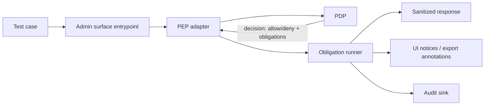

<!-- [KFM_META_BLOCK_V2]
doc_id: kfm://doc/7c30b5d7-7d9d-4cf7-9c5d-7f16c37c8d0b
title: Admin Obligations Test Suite
type: standard
version: v1
status: draft
owners: kfm-admin (TODO: confirm CODEOWNERS)
created: 2026-02-28
updated: 2026-02-28
policy_label: public
related:
  - ../../README.md            # TODO: confirm path exists
  - ../../../policy/README.md  # TODO: confirm path exists
  - ../../../docs/governance/  # TODO: confirm canonical governance doc path
tags: [kfm, admin, tests, policy, obligations, trust-membrane]
notes:
  - This README documents how we test "policy obligations" enforcement in the Admin surface.
  - Some commands/paths are placeholders until verified in the live repo.
[/KFM_META_BLOCK_V2] -->

<a id="top"></a>

# Admin Obligations Tests
Contract tests that prove **policy obligations** (redaction, notices, attribution, export blocks, audit events, etc.) are **enforced** by the Admin surface and cannot be bypassed.


---

## Quick navigation
- [Purpose](#purpose)
- [What “obligations” mean in KFM](#what-obligations-mean-in-kfm)
- [Architecture: where these tests sit](#architecture-where-these-tests-sit)
- [Directory layout](#directory-layout)
- [Running the suite](#running-the-suite)
- [Adding a new obligation test](#adding-a-new-obligation-test)
- [Coverage matrix](#coverage-matrix)
- [Definition of Done](#definition-of-done)
- [Appendix: fixture templates](#appendix-fixture-templates)

---

## Purpose
This directory exists to **prevent regressions** where:
1. A policy decision returns `allow/deny` **plus obligations**, but the Admin app ignores or misapplies the obligations.
2. Admin-only tools inadvertently leak restricted/sensitive information via error messages, previews, exports, logs, or “debug” routes.
3. UI behavior drifts from CI/runtime semantics (the “same policy semantics everywhere” invariant).

> **WARNING:** Admin is *not* a bypass. Even privileged users (stewards/operators) must go through the governed policy boundary and obligation enforcement.

[Back to top](#top)

---

## What “obligations” mean in KFM
In KFM, a policy decision is not just “allow/deny”. It may also include **obligations**: required transformations, side-effects, or UX disclosures that must occur when the action is permitted (or sometimes when it is denied).

Examples (illustrative):
- `show_notice`: display a banner explaining generalization/redaction.
- `redact_fields`: remove or mask sensitive fields from a payload.
- `generalize_geometry`: reduce precision (snap-to-grid, bounding box-only, centroid-only, etc.).
- `require_attribution`: ensure license/rights text is attached to exports/downloads.
- `block_export`: allow viewing but deny export.
- `audit`: emit a structured audit event referencing the policy decision.

> **NOTE:** The **source of truth** for obligation types is the policy+contract layer (e.g., policy pack / schema / API contract).  
> If you add an obligation here that doesn’t exist there, you are inventing semantics—don’t.

[Back to top](#top)

---

## Architecture: where these tests sit
These tests validate Admin’s role as a **Policy Enforcement Point (PEP)**: it must apply the decision it receives (including obligations) and produce only policy-allowed outputs.



**Key invariant:** If obligations are present, Admin must either:
- apply them correctly, or
- fail closed (deny/abort) with a non-leaky error.

[Back to top](#top)

---

## Directory layout
> **NOTE:** This is the **intended** layout. If the live repo differs, update this section to match reality (don’t “document dreams”).

```text
apps/admin/tests/obligations/
  README.md                      # you are here
  fixtures/                      # golden inputs/decisions; keep tiny + readable
    users/                        # user contexts (public, steward, operator, etc.)
    resources/                    # datasets/resources (public, restricted, public_generalized, etc.)
    decisions/                    # allow/deny + obligations payloads
  helpers/                        # obligation application harness + test utilities
  *.test.*                        # obligation-focused unit/integration tests
```

### Acceptable inputs (what belongs here)
- Small, **deterministic** fixtures for:
  - policy decisions (`allow/deny + obligations`)
  - user contexts (roles, groups, authn hints)
  - resource descriptors (policy label, rights metadata)
- Unit tests that validate *pure* transformation behavior (e.g., field redaction).
- Integration-ish tests that validate wiring (decision → obligation runner → output).

### Exclusions (what must NOT go here)
- Large datasets, real production extracts, or anything with unclear licensing.
- Secrets, tokens, API keys, or real user identifiers.
- “Convenience” backdoors that bypass the PEP/PDP path.
- Snapshot tests that embed restricted payloads (even if “it’s just a test”).

[Back to top](#top)

---

## Running the suite
> **TODO (repo verification required):** Confirm the Admin test runner and package manager (pnpm/npm/yarn, jest/vitest/playwright, etc.) and replace the placeholders below with the canonical commands.

### Likely patterns
```bash
# From repo root (example patterns — replace with real commands)
pnpm -C apps/admin test

# or
npm --prefix apps/admin test

# or (if using a monorepo runner)
pnpm test --filter ./apps/admin...
```

### CI expectation
This suite should be **merge-blocking** when it protects policy invariants and prevents leakage.

[Back to top](#top)

---

## Adding a new obligation test
### 1) Add/extend fixtures
- Add a **minimal** decision fixture that contains *only* what the obligation runner needs.
- Add a matching user + resource fixture that expresses the relevant policy label(s).

Suggested naming (example):
- `fixtures/decisions/show_notice.public_generalized.json`
- `fixtures/resources/dataset.public_generalized.json`
- `fixtures/users/public.json`

### 2) Write the test
Each obligation test should include:
- **Given**: user context + resource context + action
- **When**: policy decision includes obligation(s)
- **Then**:
  - output is transformed (or blocked) as required
  - no forbidden fields leak
  - UX notices are surfaced when required
  - audit events are emitted if required

### 3) Negative case (required)
For every obligation type, add at least one test that proves **fail-closed** behavior:
- unknown obligation type → deny / error
- obligation required but cannot be applied → deny / error
- denied request → safe error with no restricted metadata

> **TIP:** Keep obligation enforcement **pure** when possible. Side effects (audit/log) should be injected/mocked so tests remain deterministic.

[Back to top](#top)

---

## Coverage matrix
> **NOTE:** Only include obligation types that exist in the policy/contract layer. Everything else is **PROPOSED** until validated in repo.

| Obligation type | Effect in Admin | Unit test | Integration test | Notes |
|---|---|---:|---:|---|
| `show_notice` | UI displays disclosure text | ✅ | ✅ | Confirmed example obligation pattern: “geometry generalized” notice |
| `redact_fields` | Removes/masks sensitive fields | ⬜ | ⬜ | PROPOSED until obligation schema is verified |
| `generalize_geometry` | Reduces coordinate/shape precision | ⬜ | ⬜ | PROPOSED; must be deterministic + tested for “no precise coords” |
| `require_attribution` | Appends license/rights attribution | ⬜ | ⬜ | PROPOSED; important for export/download paths |
| `block_export` | View allowed; export denied | ⬜ | ⬜ | PROPOSED; verify error responses don’t leak |
| `audit` | Emits a structured audit event | ⬜ | ⬜ | PROPOSED; should record decision_id + obligation summary |

[Back to top](#top)

---

## Definition of Done
- [ ] Every obligation test suite has **at least one pass** and **one fail-closed** test.
- [ ] Fixtures are small, human-readable, and **do not** contain restricted payloads.
- [ ] Admin behavior matches the **shared CI/runtime policy semantics** (no “UI-only” interpretation).
- [ ] No restricted metadata leaks in:
  - errors (403/404/500)
  - debug logs
  - exported artifacts
  - screenshots/snapshots
- [ ] The suite is merge-blocking if it protects core governance invariants.

[Back to top](#top)

---

## Appendix: fixture templates
<details>
  <summary><strong>Example: decision fixture shape (illustrative)</strong></summary>

```json
{
  "allow": true,
  "decision_id": "kfm://policy_decision/example",
  "obligations": [
    { "type": "show_notice", "message": "Geometry generalized due to policy." }
  ]
}
```

</details>

<details>
  <summary><strong>Example: test pseudocode (illustrative)</strong></summary>

```ts
// PSEUDO — adapt to the real test framework (jest/vitest/etc.)

it("applies show_notice obligation", async () => {
  const user = fixture.user.public();
  const resource = fixture.resource.publicGeneralized();
  const decision = fixture.decision.allowWithShowNotice();

  const out = await enforcePolicyAndObligations({ user, resource, action: "read" }, decision);

  expect(out.allow).toBe(true);
  expect(out.notices).toContainEqual(expect.objectContaining({ type: "show_notice" }));
});
```

</details>
