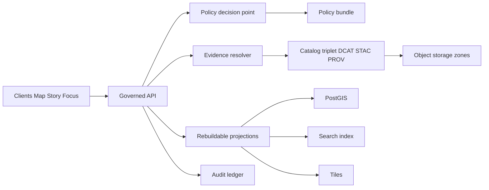
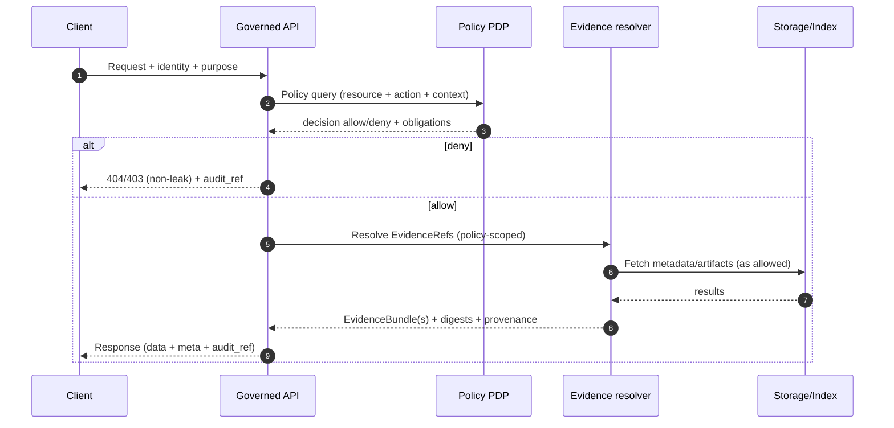

<!-- [KFM_META_BLOCK_V2]
doc_id: kfm://doc/7ef3dbf9-1c55-4d62-9d72-6295b00a8b3a
title: KFM Governed API
type: standard
version: v2
status: draft
owners: API + Policy + Stewardship
created: 2026-02-22
updated: 2026-02-23
policy_label: public
related:
  - apps/api/
  - packages/policy/
  - packages/evidence/
  - packages/catalog/
tags:
  - kfm
  - api
  - governance
  - openapi
notes:
  - Contract-first enforcement boundary for runtime surfaces (Map, Story, Focus).
  - This README contains normative requirements (MUST/SHOULD/MAY) for governed runtime access.
  - This document is normative; do not weaken the trust membrane.
[/KFM_META_BLOCK_V2] -->

# KFM Governed API

Contract-first enforcement boundary for KFM runtime surfaces: Map, Story, Focus.

**Status:** vNext Draft  
**Owners:** See `CODEOWNERS` (API + Policy + Stewardship)


<!--
Optional repo-integrated badges (REPLACE placeholders):
- CI:        https://github.com/<ORG>/<REPO>/actions/workflows/ci.yml/badge.svg
- Coverage:  https://img.shields.io/codecov/c/github/<ORG>/<REPO>
- License:   https://img.shields.io/github/license/<ORG>/<REPO>
- OpenAPI:   https://img.shields.io/badge/openapi-%3Cversion%3E-informational
-->

- Jump to:
  - [Normative language](#normative-language)
  - [What this service is](#what-this-service-is)
  - [Glossary](#glossary)
  - [Where it sits in the repo](#where-it-sits-in-the-repo)
  - [Architecture](#architecture)
  - [API conventions](#api-conventions)
  - [V1 endpoint surface](#v1-endpoint-surface)
  - [Contracts](#contracts)
  - [Policy enforcement](#policy-enforcement)
  - [Evidence resolution](#evidence-resolution)
  - [Audit and observability](#audit-and-observability)
  - [Compatibility and versioning](#compatibility-and-versioning)
  - [Testing and CI gates](#testing-and-ci-gates)
  - [Definition of done](#definition-of-done)

---

## Normative language

This README uses the following terms as requirements keywords:

- **MUST**: required for compliance with the governed API boundary.
- **SHOULD**: strongly recommended; deviations require an explicit rationale and tests.
- **MAY**: optional; implement when it improves safety, performance, or usability.

If you add new normative requirements, add corresponding tests or CI gates wherever feasible.

---

## What this service is

This API is the **trust membrane** for Kansas Frontier Matrix.

Clients (UI, scripts, tools) **never** talk directly to storage or databases. All runtime access flows through this service so that:

- **Policy is enforced server-side** (allow/deny + obligations such as redaction/generalization).
- **Evidence is resolvable** (everything returned can be traced to `EvidenceRef` and `EvidenceBundle` objects).
- **Versioning is explicit** (`dataset_version_id` and artifact digests appear consistently).
- **Auditability is guaranteed** (governed operations emit audit records and return `audit_ref`).

### What this service is not

- Not a general “open query” gateway to underlying databases.
- Not an ungoverned chatbot (Focus Mode is governed and must cite-or-abstain).
- Not a place to “patch” data: published runtime surfaces only serve **promoted** dataset versions.

---

## Glossary

| Term | Meaning |
|---|---|
| Trust membrane | The policy + evidence + audit enforcement boundary between clients and all runtime data surfaces. |
| PDP | Policy decision point: computes allow/deny + obligations for a request. |
| PEP | Policy enforcement point: the component that blocks/filters/redacts using PDP decisions. |
| EvidenceRef | A stable reference to governed evidence (dataset, item, run, doc) used for traceability and citations. |
| EvidenceBundle | The resolved, policy-filtered bundle returned from `EvidenceRef` resolution, including provenance + digests. |
| Obligation | A required transformation or constraint applied to an allowed response (redaction, generalization, attribution, etc.). |
| Dataset version | An immutable, addressable snapshot of a dataset suitable for runtime serving (`kfm://dataset/<slug>@<hash>`). |

---

## Where it sits in the repo

A buildable target layout places this API in a monorepo alongside shared packages:

```text
repo/
├─ apps/
│  ├─ api/                                   # ← YOU ARE HERE: governed API (boundary wiring + adapters)
│  ├─ ui/                                    # Map/Story/Focus frontend
│  └─ worker/                                # Pipeline runner + index builders (background jobs)
│
├─ packages/                                 # Shared libraries (clean architecture layers)
│  ├─ domain/                                # Pure domain model + invariants (no I/O)
│  ├─ usecases/                              # Workflows: ingest/promote/resolve/publish (ports in/out)
│  ├─ policy/                                # Policy engine + fixtures + tests (default-deny, explicit allow)
│  ├─ evidence/                              # EvidenceRef parsing + evidence bundle assembly helpers
│  ├─ catalog/                               # DCAT/STAC/PROV generation + validators
│  └─ shared/                                # DTOs/schemas/utils (cross-cutting primitives)
│
├─ data/                                     # Specs + fixtures + governed policy artifacts (small, deterministic)
├─ ops/                                      # GitOps + runbooks (deployment + operations)
└─ docs/                                     # Stories, ADRs, standards (governed docs hub)
```

If your repository differs, update this README to match reality—**but do not weaken the trust membrane**.

### Acceptable inputs

What belongs in `apps/api/`:

- OpenAPI + schema artifacts (or links to their canonical locations).
- Interface adapters for storage/index/projections behind a governed boundary.
- Policy enforcement middleware and request context assembly.
- Integration tests exercising policy + evidence + audit invariants.

### Exclusions

What must not be introduced into `apps/api/`:

- Direct client access paths to databases/object storage that bypass policy.
- “Admin backdoors” that skip audit logging or evidence capture.
- Ad-hoc query endpoints that return raw records without contract + policy review.

---

## Architecture



### Request flow



### Clean layering rule

Domain logic must not reach into infrastructure directly; it operates through interfaces/contracts. Keep runtime access governed at the API boundary.

---

## API conventions

This section standardizes the “shape” of the API so clients and tests can be consistent.

### Transport

- **Base path:** `/api/v1`
- **Content types:**
  - Requests: `application/json` (unless explicitly documented otherwise)
  - Responses: `application/json` (except tiles/assets)
- **Time format:** ISO 8601
  - Use explicit offsets or `Z`
  - Never interpret ambiguous local time without a timezone

### Authentication and authorization

This README does not assume a specific identity provider. Regardless of implementation:

- Requests that can vary by role MUST be authenticated.
- The server MUST derive roles/claims from the authenticated principal, not from client-provided headers.
- Authorization MUST happen before any data fetch that could leak existence.
- The API MUST implement the **non-leak rule** consistently for restricted objects (see [Error model](#error-model)).

### Standard headers

These headers SHOULD be supported across endpoints (especially governed ones):

| Header | Required | Purpose |
|---|---:|---|
| `X-Request-Id` | SHOULD | Idempotency + trace correlation across logs |
| `X-KFM-Timezone` | SHOULD | Client timezone hint for UI rendering; never changes event-time semantics |
| `X-KFM-Purpose` | MAY | Declared purpose for audit (e.g., `research`, `public_story`, `internal_review`) |

**Security note:** header presence MUST NOT be used to bypass policy.

### Standard response envelope

Responses SHOULD use a consistent envelope so that clients can reliably surface governance metadata:

```json
{
  "data": { "…": "…" },
  "meta": {
    "policy_label": "public",
    "dataset_version_id": "kfm://dataset/<slug>@<hash>",
    "artifact_digests": { "primary": "sha256:…" },
    "audit_ref": "kfm://audit/entry/<id>"
  }
}
```

If `dataset_version_id` is not applicable (for example, service health endpoints), omit it rather than inventing a placeholder.

### Pagination

Where list responses can be large:

- MUST support `limit` with a server-enforced maximum.
- SHOULD support cursor-based pagination (`cursor` token) over offset pagination to avoid inconsistencies.

Recommended pattern:

```json
{
  "data": [ { "…": "…" } ],
  "page": { "limit": 50, "next_cursor": "opaque…" },
  "meta": { "policy_label": "public", "audit_ref": "kfm://audit/entry/<id>" }
}
```

### Caching

- Public resources MAY use caching headers.
- Restricted / role-variant resources SHOULD be `Cache-Control: private` and must avoid shared-cache leakage.

### Rate limiting and abuse protection

- The service SHOULD rate-limit governed endpoints (`/focus/ask`, `/evidence/resolve`, Story writes).
- Rate limiting MUST be policy-safe (do not reveal restricted existence through different limit behavior).
- If the API is public-facing, add bot/abuse protections appropriate to your deployment posture.

---

## V1 endpoint surface

This README documents the **minimal buildable v1 surface**.

Endpoints are **governed**: policy filter applied before returning data or links.

| Method | Path | Purpose | Notes |
|---|---|---|---|
| GET | `/api/v1/datasets` | Dataset discovery + versions | DCAT-backed, supports search/facets, server-side policy filtering |
| GET | `/api/v1/stac/collections` | STAC collections | Policy filter applied before returning assets |
| GET | `/api/v1/stac/items` | STAC item search | Query by bbox/time/collection; policy filter before returning assets |
| POST | `/api/v1/evidence/resolve` | Resolve EvidenceRefs → EvidenceBundles | Fail closed if unresolvable/unauthorized |
| GET, POST | `/api/v1/story` | Story nodes list/create | Versioned; publishing requires resolvable citations + review state |
| GET, PUT | `/api/v1/story/{id}` | Read/update story node | Versioned; policy label and review workflow apply |
| POST | `/api/v1/focus/ask` | Focus Mode Q&A | Cite-or-abstain; returns `audit_ref` |
| GET | `/api/v1/lineage/status` | Pipeline freshness/health | Drives UI trust badges |
| GET | `/api/v1/lineage/stream` | Lineage stream | Optional SSE/WebSocket feed for live updates |
| GET | `/api/v1/tiles/{layer}/{z}/{x}/{y}.pbf` | Vector tiles | Only if tiles are served dynamically |
| GET | `/assets/pmtiles/{dataset_version_id}/{layer}.pmtiles` | PMTiles bundles | Only for policy-safe layers (often public only) |

---

## Contracts

Treat API contracts as **production artifacts**. Contract changes must be versioned and tested.

### Contract sources of truth

At minimum, the repo SHOULD include:

- OpenAPI: `apps/api/openapi/openapi.yaml` (or equivalent)
- JSON Schemas: `packages/shared/schemas/`
- Fixtures: `apps/api/test/fixtures/`

If these paths differ, document the actual locations here.

### Contract change rules

- Every endpoint MUST be represented in OpenAPI (including error models).
- CI MUST block merges that introduce undocumented endpoints.
- Breaking changes MUST trigger a new API version (`/api/v2`) or an explicit deprecation plan.

### Required response fields

Every response MUST include, when applicable:

- `dataset_version_id`
- artifact digests (when applicable)
- a **public-safe** `policy_label`
- `audit_ref` for governed operations (Focus, Story publish, Evidence resolution)

A recommended pattern is to standardize these into a `meta` block (see [Standard response envelope](#standard-response-envelope)).

### Error model

Errors MUST use a stable error model:

- `error_code`
- `message` (policy-safe)
- `audit_ref`
- optional remediation hints

Avoid leaking restricted existence through error differences. Align 403/404 behavior with policy.

```json
{
  "error_code": "POLICY_DENY",
  "message": "Not available to your role.",
  "audit_ref": "kfm://audit/entry/<id>",
  "remediation": ["Try a broader time range", "Use a public layer or generalized view"]
}
```

**Non-leak rule:** for restricted objects, behavior SHOULD be indistinguishable between “does not exist” and “exists but denied” unless policy explicitly allows existence disclosure.

### Error code registry

Reserve a stable, documented set of `error_code` values so clients can handle failures safely:

| error_code | When it is used | Notes |
|---|---|---|
| `POLICY_DENY` | Policy decision denies the request | Prefer non-leak behavior (403/404 alignment) |
| `EVIDENCE_UNRESOLVABLE` | EvidenceRef cannot be resolved (or not disclosed) | Must be policy-safe |
| `CONTRACT_INVALID` | Request violates OpenAPI/schema constraints | 400 |
| `RATE_LIMITED` | Client exceeded server limits | 429, avoid existence leakage |
| `INTERNAL` | Unexpected server error | Must not reveal restricted details |

---

## Policy enforcement

### Policy posture defaults

- **Default deny** for restricted/sensitive-location content.
- If any public representation is allowed, publish a separate generalized dataset version.
- Do not embed precise coordinates in Story Nodes or Focus outputs unless policy explicitly allows.
- Redaction and generalization are first-class transforms recorded in provenance.

### Policy labels

KFM uses a small, stable set of labels. At minimum:

| Label | Meaning | Default handling |
|---|---|---|
| `public` | Safe for broad distribution | Cacheable where appropriate |
| `restricted` | Requires role and obligations | No shared caching; redact/aggregate as required |
| `sensitive` | High-risk / special handling | Default deny unless explicitly allowed |

If your policy taxonomy is richer, document the complete matrix in `packages/policy/` and link it here.

### Obligations

When policy allows access, it may still require obligations. Obligations MUST be applied server-side and surfaced in audit:

| Obligation | Effect | Example |
|---|---|---|
| `redact` | Remove prohibited fields | Remove exact coordinates |
| `generalize` | Replace with coarser representation | Bounding box → centroid at coarse precision |
| `aggregate` | Return only aggregated statistics | Counts by county instead of point features |
| `attribution` | Require attribution strings in UI/output | License attribution in Story |
| `no_cache` | Force private/no-store caching | `Cache-Control: private, no-store` |

### Policy-as-code integration

Recommended shape:

- Policy Decision Point: OPA in-process or sidecar
- Policy Enforcement Points:
  - CI (schema + policy tests block merges)
  - Runtime API (checks before serving data)
  - Evidence resolver (checks before resolving bundles)
  - UI shows badges/notices but does not decide policy

---

## Evidence resolution

Evidence resolution is central: the evidence resolver accepts EvidenceRefs (or structured refs), applies policy, and returns an EvidenceBundle.

### EvidenceRef schemes

Minimum supported schemes (as a contract surface):

- `dcat://…` dataset/distribution metadata
- `stac://…` collection/item/asset metadata
- `prov://…` run lineage (activities/entities/agents)
- `doc://…` governed docs and story citations
- `graph://…` entity relations (if enabled)

### EvidenceBundle shape

A typical bundle contains:

- `bundle_id` (digest)
- `dataset_version_id`
- `policy` decision + obligations applied
- license + attribution
- provenance link (run id)
- artifacts list with `href`, `digest`, `media_type`
- checks (catalog_valid, links_ok)
- `audit_ref`

Example (illustrative):

```json
{
  "bundle_id": "sha256:bundle…",
  "dataset_version_id": "kfm://dataset/<slug>@<hash>",
  "title": "Example record",
  "policy": {
    "decision": "allow",
    "policy_label": "public",
    "obligations_applied": []
  },
  "license": { "spdx": "CC-BY-4.0", "attribution": "Source org" },
  "provenance": { "run_id": "kfm://run/<id>" },
  "artifacts": [
    {
      "href": "kfm://artifact/processed/sha256:<digest>",
      "digest": "sha256:<digest>",
      "media_type": "application/x-parquet"
    }
  ],
  "checks": { "catalog_valid": true, "links_ok": true },
  "audit_ref": "kfm://audit/entry/<id>"
}
```

Fail closed if the reference is unresolvable or unauthorized.

### Cite-or-abstain requirement

For Focus and Story publishing workflows:

- If a claim cannot be backed by resolvable EvidenceRefs, the system MUST abstain (or downgrade the claim to “unknown”).
- Returned citations MUST be stable references (EvidenceRefs) that can be re-resolved later.

---

## Data access rules

Published runtime surfaces (API + UI) may only serve **promoted** dataset versions that have:

- processed artifacts
- validated catalogs
- run receipts
- policy label assignment

The API should never serve RAW/WORK/QUARANTINE artifacts directly unless explicitly required and governed.

---

## Audit and observability

### Audit

Every governed operation MUST emit an audit record containing:

- who (principal, role)
- what (endpoint, parameters)
- when (time)
- why (purpose if declared)
- inputs/outputs (by digest)
- policy decisions (allow/deny, obligations, reason codes)

Audit logs are sensitive; apply redaction and retention policy.

#### Recommended audit event shape

```json
{
  "audit_ref": "kfm://audit/entry/<id>",
  "request_id": "uuid-or-similar",
  "time": "2026-02-23T19:14:33Z",
  "principal": { "subject": "user|service", "roles": ["…"] },
  "purpose": "public_story",
  "action": { "method": "POST", "path": "/api/v1/evidence/resolve" },
  "decision": { "result": "allow|deny", "policy_label": "restricted", "obligations": ["redact"] },
  "inputs": [{ "ref": "stac://…", "digest": "sha256:…" }],
  "outputs": [{ "ref": "kfm://artifact/processed/…", "digest": "sha256:…" }]
}
```

### Observability

Minimum runtime signals:

- structured logs with `request_id`, `audit_ref`, `policy_label`, `dataset_version_id` (when applicable)
- metrics for:
  - request volume and latency by endpoint
  - policy decisions by label/decision
  - evidence resolution success/fail-closed rates
- traces (recommended) linking `X-Request-Id` to downstream calls

---

## Compatibility and versioning

- Freeze `/api/v1` semantics; only add backwards-compatible fields.
- Introduce `/api/v2` only for breaking changes.
- Schema versioning exists alongside API versioning (DCAT/STAC/PROV profiles; Story template versions).

### Deprecation

- Deprecations MUST be documented in OpenAPI and in release notes.
- Deprecated fields SHOULD remain for at least one minor release unless there is a security/policy reason to remove sooner.
- Clients SHOULD treat unknown fields as ignorable to preserve forwards compatibility.

---

## Testing and CI gates

Minimum expectations for merge safety:

- Contract validation in CI (OpenAPI + JSON Schemas + fixtures).
- Policy fixtures-driven tests (deny-by-default is tested).
- Integration tests for:
  - policy filtering
  - 403/404 non-leak behavior
  - evidence resolution fail-closed
  - `audit_ref` emission

Recommended gates matrix:

| Gate | Blocks merge | Evidence |
|---|---:|---|
| OpenAPI lint + diff check | ✅ | schema is valid; breaking changes flagged |
| Policy fixture tests | ✅ | deny-by-default and obligations tests pass |
| Integration smoke tests | ✅ | critical endpoints are exercised |
| Dependency audit | ✅ | known critical vulnerabilities blocked |
| Documentation link check | SHOULD | prevents broken internal refs |

---

## Definition of done

A change to this API is “done” only when:

- [ ] Contract updated (OpenAPI + schemas) and validated in CI
- [ ] New/changed endpoints apply policy server-side
- [ ] Responses include required `meta` fields (`policy_label`, `dataset_version_id` when applicable, `audit_ref` when required)
- [ ] Error behavior does not leak restricted existence (403/404 aligned)
- [ ] EvidenceRefs used by Story/Focus resolve or fail closed with `audit_ref`
- [ ] Governed operations emit audit records with inputs/outputs by digest
- [ ] Any redaction/generalization is recorded as provenance and surfaced in evidence
- [ ] New normative requirements include tests or CI gates (fail closed)

---

[Back to top](#kfm-governed-api)
