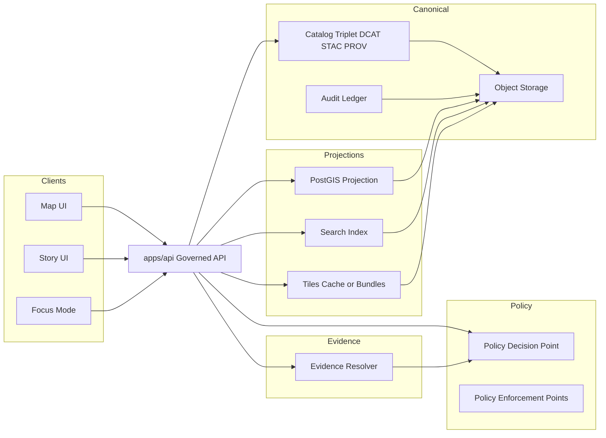

<!-- [KFM_META_BLOCK_V2]
doc_id: kfm://doc/9a7af60b-7aa7-4d43-8e6b-375d4450b286
title: apps/api — Governed API
type: standard
version: v1
status: draft
owners: TODO: Platform/API owners
created: 2026-02-27
updated: 2026-02-27
policy_label: public
related:
  - TODO: ../../README.md
  - TODO: ../../contracts/openapi/
  - TODO: ../../apps/web/
tags: [kfm, api, governed, openapi, policy, evidence]
notes:
  - This README captures KFM API invariants and contract expectations; replace repo-specific TODOs after verifying actual code layout and toolchain.
[/KFM_META_BLOCK_V2] -->

# apps/api — Governed API
Policy-enforced, evidence-first API boundary for KFM Map/Story UI and Focus Mode.


> [!WARNING]
> This README is **governance-first**. The invariants below are non-negotiable.  
> The **local commands, ports, and directory tree** are **TODOs** until verified against this repo.

## Quick navigation
- [Purpose](#purpose)
- [Where this fits](#where-this-fits)
- [Non-negotiable invariants](#non-negotiable-invariants)
- [API surface](#api-surface)
- [Contracts and error model](#contracts-and-error-model)
- [Policy enforcement](#policy-enforcement)
- [Evidence resolver](#evidence-resolver)
- [Audit and observability](#audit-and-observability)
- [Security posture](#security-posture)
- [Testing and CI gates](#testing-and-ci-gates)
- [Directory layout](#directory-layout)
- [Change management](#change-management)
- [Glossary](#glossary)

---

## Purpose
`apps/api` is the **governed API** for Kansas Frontier Matrix (KFM). It is the **enforcement boundary** that:

- Applies **policy decisions**, **redactions/generalizations**, and **versioning**
- Serves **only promoted dataset versions** (Published surfaces)
- Resolves **EvidenceRefs → EvidenceBundles** for UI evidence drawers and Focus Mode citations
- Emits **audit_ref** and structured audit logs so every governed operation is reviewable

## Where this fits
KFM’s runtime is explicitly designed as a **trust membrane**:

- Clients (Map UI, Story UI, Focus Mode) **never access databases/object stores directly**
- All runtime access is mediated through **this API**, which enforces policy and produces audit trails

### Architecture sketch


---

## Non-negotiable invariants
These are **hard rules** that must be enforceable by tests and policy checks.

| Invariant | What it means in practice | How we enforce it |
|---|---|---|
| Trust membrane | UI/clients never hit storage/DB directly; the API is the access boundary | Network segmentation + repo layering + runtime checks |
| Truth path lifecycle | Runtime serves only **promoted** dataset versions (Published) with catalogs + receipts + policy labels | API rejects non-promoted versions; catalog validation |
| Contract-first | OpenAPI is the API contract; changes are reviewed as contract diffs | Contract tests in CI; schema validation |
| Policy semantics parity | CI and runtime must share the **same** policy fixtures/outcomes | Policy test suite + fixtures; deny-by-default |
| Cite-or-abstain | Focus Mode must return citations or abstain with audit_ref, without leaking restricted existence | Evidence resolver; policy-safe errors; audit logging |

---

## Responsibilities
✅ This directory **should contain**:
- HTTP routing/controllers for `/api/v1/...`
- DTOs aligned with OpenAPI contract
- Policy enforcement adapter calls (PDP/OPA sidecar or in-process)
- Evidence resolver endpoint integration
- Catalog access adapters (DCAT/STAC/PROV)
- Audit log emission and `audit_ref` handling

🚫 This directory **should not contain**:
- Raw ingestion connectors or pipeline runner logic (belongs upstream in ingest/pipelines)
- “Backdoor” storage access bypassing policy enforcement
- UI rendering logic
- Business/domain rules that should live in domain/use-case layers

---

## API surface
> [!NOTE]
> The endpoints below reflect KFM’s “buildable v1” and “illustrative” surfaces.  
> Treat the **OpenAPI spec** as the source of truth.

### Minimal v1 endpoints (recommended)
| Endpoint | Purpose | Policy posture |
|---|---|---|
| `GET /api/v1/datasets` | Dataset + version discovery | Policy filter server-side |
| `GET /api/v1/stac/collections` | STAC collection discovery | Policy filter before returning assets |
| `GET /api/v1/stac/items` | STAC item query (bbox/time/collection) | Policy filter before returning assets |
| `POST /api/v1/evidence/resolve` | Resolve EvidenceRefs → EvidenceBundles | Fail closed if unauthorized/unresolvable |
| `GET/POST /api/v1/story` and `GET/PUT /api/v1/story/{id}` | Story nodes with versioning | Publishing requires citations + review state |
| `POST /api/v1/focus/ask` | Focus Mode Q&A | Must cite or abstain; emit audit_ref |
| `GET /api/v1/lineage/status` and `/api/v1/lineage/stream` | Lineage + pipeline health feeds | May redact sensitive fields |
| (Optional) `GET /api/v1/tiles/{layer}/{z}/{x}/{y}.pbf` | Dynamic tiles | Policy-safe tiles; caching varies by auth/policy |
| (Optional) `GET /assets/pmtiles/{dataset_version_id}/{layer}.pmtiles` | Static tile bundles | Only for public-safe layers or behind policy gating |

---

## Contracts and error model
### OpenAPI (contract-first)
- The API must be described by an OpenAPI contract.
- Contract changes should be reviewed like code: **diffs + tests + backward compatibility**.

> [!TIP]
> Recommended contract location (update if your repo differs): `contracts/openapi/kfm-api-v1.yaml`

### Versioning policy
- Freeze `/api/v1` semantics; only add backward-compatible fields.
- Introduce `/api/v2` only for breaking changes.

### Stable error model (policy-safe)
Errors must:
- Use a stable `error_code`
- Provide a policy-safe `message`
- Include `audit_ref` for steward/operator review
- Avoid leaking restricted existence via 403/404 differences or timing behavior

Example (shape only; confirm against OpenAPI):
```yaml
ErrorResponse:
  required: [error_code, message, audit_ref]
  properties:
    error_code: string
    message: string
    audit_ref: string
    remediation: # optional hints
      type: array
      items: string
```

---

## Policy enforcement
### Policy-as-code pattern
- **PDP**: OPA (in-process or sidecar)
- **PEPs**:
  - CI: schema + policy tests block merges
  - Runtime API: policy checks before serving data
  - Evidence resolver: policy checks before bundling evidence
  - UI: shows badges/notices; UI never decides policy

### Sensitivity defaults (expected posture)
- Default deny for restricted/sensitive-location datasets
- Prefer publish-safe `public_generalized` derivatives where appropriate
- Never embed precise coordinates in Story Nodes / Focus Mode outputs unless explicitly allowed
- Treat redaction/generalization as first-class transforms recorded in lineage/provenance

### Controlled vocabulary (starter)
Policy labels are versioned vocabulary; starter list:
- `public`
- `public_generalized`
- `restricted`
- `restricted_sensitive_location`
- `internal`
- `embargoed`
- `quarantine`

---

## Evidence resolver
Evidence resolution is central: the API must make evidence usable in **≤ 2 calls** for the UI.

### EvidenceBundle expectations
An EvidenceBundle should include:
- Stable `bundle_id` + `digest` (immutable bundle identity)
- `policy` decision + obligations
- Renderable evidence “cards”
- Machine metadata: dataset_version_id, artifact digests, provenance links, rights metadata
- `audit_ref` when the operation is governed/reviewable

Example (illustrative; adapt to actual schema):
```json
{
  "bundle_id": "sha256:...",
  "digest": "sha256:...",
  "dataset_version_id": "YYYY-MM.hash",
  "title": "Example evidence",
  "policy": { "decision": "allow", "policy_label": "public", "obligations": [] },
  "license": { "spdx": "CC-BY-4.0", "attribution": "Source org" },
  "provenance": { "run_id": "kfm://run/..." },
  "artifacts": [{ "href": "processed/data.parquet", "digest": "sha256:...", "media_type": "application/x-parquet" }],
  "checks": { "catalog_valid": true, "links_ok": true },
  "audit_ref": "kfm://audit/..."
}
```

---

## Audit and observability
Every governed operation must emit a structured log record including:
- who (principal, role)
- what (endpoint, parameters)
- when (time)
- why (purpose if declared)
- inputs/outputs (by digest)
- policy decisions (allow/deny, obligations, reason codes)

> [!WARNING]
> Audit logs are sensitive datasets: apply redaction and retention policy, and restrict access.

### Run receipts
Pipelines and Focus Mode queries should emit run receipts containing:
- inputs (by digest/upstream version)
- outputs (artifact digests)
- environment (image digest, parameters)
- validation results
- policy decisions

---

## Security posture
### Threat model checklist (minimum)
Treat as required work for any new endpoint or capability:
- attacker assumptions
- assets to protect (sensitive locations, partner datasets, audit logs)
- threats (scraping, inference via errors/timing, token leakage, supply chain)
- mitigations
- tests that prove mitigations

### Authentication & authorization
- Recommended default: OIDC + RBAC with policy labels
- Introduce ABAC only if partner datasets require attributes beyond role + label

### Secrets hygiene and least privilege
- Secrets in a secrets manager (not in repo)
- Scoped credentials per source/pipeline runner
- UI never receives privileged tokens beyond session needs
- Rotate secrets and record rotation events

### Supply chain integrity (recommended before broad release)
- SBOMs for built images
- Build provenance attestations (SLSA/in-toto)
- Verify attestations server-side
- Pin dependencies and verify checksums

---

## Testing and CI gates
> [!NOTE]
> KFM is “governed” only if invariants are encoded as tests that fail closed.

Minimum categories:
- Unit tests (domain rules, normalization, controlled vocab validation)
- Schema tests (DCAT/STAC/PROV profile validation)
- Policy tests (fixture-driven allow/deny/obligation outcomes)
- Contract tests (OpenAPI schema diff checks)
- Integration tests (evidence resolver resolves representative refs)
- E2E tests (UI flows: layer → evidence drawer; story → citations resolve; focus → cite-or-abstain)

### Definition of done for API changes (PR checklist)
- [ ] OpenAPI updated (or confirmed unchanged) + contract tests updated
- [ ] Policy fixtures updated (if behavior changed) + policy tests pass
- [ ] No “restricted existence” leakage via error/status/timing differences
- [ ] Every governed operation emits `audit_ref` and structured audit logs
- [ ] Evidence resolver returns bundles that are renderable + policy-safe
- [ ] Docs updated (this README + any contract docs)

---

## Local development
> [!IMPORTANT]
> Repo-specific commands are intentionally TODO until verified.

```bash
# TODO: replace with real commands from this repo
cd apps/api

# TODO: run the API locally
# e.g. docker compose up api
# e.g. pnpm dev
# e.g. poetry run uvicorn ...
```

---

## Directory layout
> [!NOTE]
> Replace this with the *actual* `tree -a -L 3 apps/api` output once verified.

```text
apps/api/
  README.md
  src/                  # TODO: server code (routes, handlers, adapters)
  tests/                # TODO: unit + integration tests
  contracts/            # TODO: local DTOs / generated clients (if any)
  scripts/              # TODO: dev helpers
  Dockerfile            # TODO: container build (if applicable)
```

**Acceptable inputs (what belongs here)**
- API route handlers, DTOs, policy enforcement hooks, evidence resolver integration
- Contract and schema validation wiring (OpenAPI, DTO validation, contract tests)
- Audit logging utilities

**Exclusions (what must not go here)**
- Direct storage credentials or bypass paths
- Ingestion runners/connectors (keep upstream)
- UI components
- Unreviewed endpoints that skip policy checks

---

## Change management
- Prefer additive, backwards-compatible changes to `/api/v1`.
- Breaking changes require `/api/v2` *and* a migration story (dual read or compatibility layer).
- Every behavior change should be traceable:
  - OpenAPI diff
  - policy fixture diff
  - tests proving invariants still hold

---

## Glossary
- **Truth path**: The lifecycle from upstream acquisition through promoted, published surfaces.
- **Trust membrane**: Boundary rule—clients do not access storage directly; governed API enforces policy.
- **EvidenceRef**: A resolvable reference to evidence.
- **EvidenceBundle**: Human + machine evidence payload, policy-aware, immutable by digest.
- **audit_ref**: Stable reference for debugging/review without leaking restricted details.

---

[Back to top](#appsapi--governed-api)
