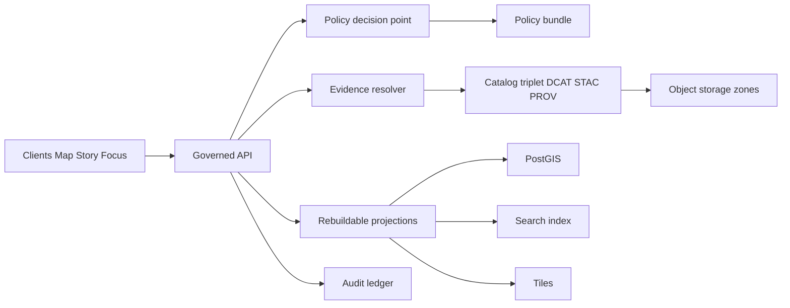
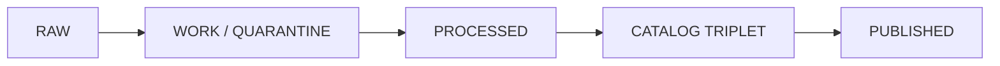

<!-- [KFM_META_BLOCK_V2]
doc_id: kfm://doc/0e0c7f0b-57c5-4d8e-9b26-1d0b0e6a6a2f
title: KFM Governed API
type: standard
version: vNext
status: draft
owners: See CODEOWNERS (API + Policy + Stewardship)
created: 2026-02-22
updated: 2026-02-22
policy_label: restricted
related:
  - apps/api/
tags:
  - kfm
  - api
  - governance
  - contracts
  - policy
notes:
  - Contract-first enforcement boundary for KFM runtime surfaces (Map, Story, Focus).
[/KFM_META_BLOCK_V2] -->

# KFM Governed API

Contract-first enforcement boundary for KFM runtime surfaces (Map, Story, Focus).

**Status:** vNext • Draft  
**Owners:** See `CODEOWNERS` (API + Policy + Stewardship)  
**Principles:** `Map-first` • `Time-aware` • `Governed` • `Evidence-first` • `Cite-or-abstain`

**Quick navigation:**  
[What this service is](#what-this-service-is) • [Repo layout](#where-it-sits-in-the-repo) • [Architecture](#architecture) • [V1 endpoint surface](#v1-endpoint-surface) • [Contracts](#contracts) • [Policy enforcement](#policy-enforcement) • [Evidence resolution](#evidence-resolution) • [Audit and observability](#audit-and-observability) • [Compatibility and versioning](#compatibility-and-versioning) • [Testing and CI gates](#testing-and-ci-gates) • [Definition of done](#definition-of-done)

---

## Normative language

This document uses **RFC 2119-style** keywords:

- **MUST / MUST NOT**: non-negotiable invariants for correctness, safety, and governance.
- **SHOULD / SHOULD NOT**: strong defaults; deviations require an explicit rationale.
- **MAY**: optional, context-dependent.

---

## What this service is

This API is the **trust membrane** for Kansas Frontier Matrix.

Clients (UI, scripts, tools) **MUST NOT** talk directly to storage or databases. All runtime access flows through this service so that:

- **Policy is enforced server-side** (allow/deny + obligations like redaction/generalization).
- **Evidence is resolvable** (everything returned can be traced to EvidenceRefs and bundles).
- **Versioning is explicit** (`dataset_version_id` and artifact digests appear consistently).
- **Auditability is guaranteed** (governed operations emit audit records and return `audit_ref`).

> **WARNING**
> If any runtime surface bypasses this API, governance guarantees are void.

### What this service is not

- Not a general “open query” gateway to underlying databases.
- Not an ungoverned chatbot (Focus Mode is governed and must cite-or-abstain).
- Not a place to “patch” data: runtime surfaces only serve **promoted** dataset versions.

---

## Where it sits in the repo

A buildable target layout places this API in a monorepo alongside shared packages:

```text
repo/
  apps/
    api/                  # governed API (interfaces + adapters)  <-- you are here
    ui/                   # map/story/focus frontend
    worker/               # pipeline runner + index builders
  packages/
    domain/               # pure domain model + invariants
    usecases/             # workflows: ingest/promote/resolve/publish
    policy/               # policy engine + fixtures + tests
    evidence/             # EvidenceRef parsing + bundle assembly
    catalog/              # DCAT/STAC/PROV generation + validators
    shared/               # DTOs, schemas, utils
  data/                   # specs, fixtures, governed policy artifacts
  ops/                    # gitops and runbooks
  docs/                   # stories, ADRs, standards
```

If your repository differs, update this README to match reality—**but do not weaken the trust membrane**.

---

## Architecture



### Clean layering rule

- Domain logic **MUST NOT** reach into infrastructure directly; it operates through interfaces/contracts.
- Runtime access **MUST** be governed at the API boundary.

### Truth path lifecycle

Runtime surfaces **MUST** only serve datasets that have cleared the “truth path” lifecycle.



---

## V1 endpoint surface

This README documents the **minimal buildable v1 surface**.

All endpoints below are **governed**: policy filters and obligations are applied **before** returning data, links, or assets.

| Method | Path | Purpose | Governance notes |
|---|---|---|---|
| GET | `/api/v1/datasets` | Dataset discovery + versions | DCAT-backed; supports search/facets; server-side policy filtering |
| GET | `/api/v1/stac/collections` | STAC collections | Policy filter applied before returning assets |
| GET | `/api/v1/stac/items` | STAC item search | Query by bbox/time/collection; policy filter before returning assets |
| POST | `/api/v1/evidence/resolve` | Resolve EvidenceRefs → EvidenceBundles | **Fail closed** if unresolvable/unauthorized |
| GET, POST | `/api/v1/story` | Story nodes list/create | Versioned; publishing requires resolvable citations + review state |
| GET, PUT | `/api/v1/story/{id}` | Read/update story node | Versioned; policy label and review workflow apply |
| POST | `/api/v1/focus/ask` | Focus Mode Q&A | Cite-or-abstain; always returns `audit_ref` |
| GET | `/api/v1/lineage/status` | Pipeline freshness/health | Drives UI trust badges |
| GET | `/api/v1/lineage/stream` | Lineage stream | Optional SSE/WebSocket feed for live updates |
| GET | `/api/v1/tiles/{layer}/{z}/{x}/{y}.pbf` | Vector tiles | Only if tiles are served dynamically |
| GET | `/assets/pmtiles/{dataset_version_id}/{layer}.pmtiles` | PMTiles bundles | Only for policy-safe layers (often public-only) |

---

## Contracts

API contracts are **production artifacts**. Contract changes **MUST** be versioned and tested.

### Response envelope

For governed surfaces, responses **SHOULD** use a consistent envelope:

- `data`: payload
- `meta`: governance-critical metadata
- `links`: policy-safe links (optional; only if authorized)

```json
{
  "data": { "…": "…" },
  "meta": {
    "dataset_version_id": "kfm://dataset/<slug>@<hash>",
    "artifact_digests": { "primary": "sha256:…" },
    "policy_label": "public",
    "audit_ref": "kfm://audit/entry/<id>"
  },
  "links": []
}
```

### Required metadata fields

Every response **MUST** include, when applicable:

- `dataset_version_id` (if the response depends on a dataset version)
- artifact digests (when returning or linking artifacts)
- a public-safe `policy_label`
- `audit_ref` for governed operations (Focus, Story publish, Evidence resolution)

> **NOTE**
> If a response is truly not dataset-backed (e.g., `/lineage/status`), omit `dataset_version_id`, but still include a policy-safe `policy_label` and `audit_ref` if it is governed.

### Error model

Errors **MUST** use a stable error model:

- `error_code`
- `message` (policy-safe)
- `audit_ref`
- optional remediation hints (policy-safe)

Avoid leaking restricted existence through error differences. Align 403/404 behavior with policy posture.

```json
{
  "error_code": "POLICY_DENY",
  "message": "Not available to your role.",
  "audit_ref": "kfm://audit/entry/<id>",
  "remediation": [
    "Try a broader time range",
    "Use a public layer or generalized view"
  ]
}
```

---

## Policy enforcement

### Policy posture defaults

- **Default deny** for restricted/sensitive-location content.
- If any public representation is allowed, publish a separate generalized dataset version.
- Story Nodes and Focus outputs **MUST NOT** include precise coordinates unless policy explicitly allows.
- Redaction and generalization are first-class transforms **recorded in provenance**.

### Obligation handling

Policy decisions may carry **obligations** (e.g., redact fields, generalize geometry, degrade precision, remove links).

- The API **MUST** apply obligations server-side.
- The API **MUST** record obligations in audit/provenance where applicable.
- The UI **MAY** display policy badges/notices but **MUST NOT** be the decision-maker.

### Policy-as-code integration

Recommended shape:

- Policy Decision Point: OPA in-process or sidecar
- Policy Enforcement Points:
  - CI (schema + policy tests block merges)
  - Runtime API (checks before serving data)
  - Evidence resolver (checks before resolving bundles)
  - UI shows badges/notices but does not decide policy

### Non-leak behavior

The API **MUST** prevent “existence leakage” for restricted content:

- Prefer consistent error shapes and timing for deny vs not-found when policy requires.
- Avoid error messages that imply restricted resources exist.
- Avoid differential response payload sizes that reveal restricted counts.

---

## Evidence resolution

Evidence resolution is central: the evidence resolver accepts EvidenceRefs (or structured refs), applies policy, and returns an EvidenceBundle.

### EvidenceRef schemes

Minimum supported schemes (as a contract surface):

- `dcat://…` dataset/distribution metadata
- `stac://…` collection/item/asset metadata
- `prov://…` run lineage (activities/entities/agents)
- `doc://…` governed docs and story citations
- `graph://…` entity relations (if enabled)

### EvidenceBundle shape

A typical bundle contains:

- `bundle_id` (digest)
- `dataset_version_id`
- `policy` decision + obligations applied
- license + attribution
- provenance link (run id)
- artifacts list with `href`, `digest`, `media_type`
- checks (catalog_valid, links_ok)
- `audit_ref`

Example (illustrative):

```json
{
  "bundle_id": "sha256:bundle…",
  "dataset_version_id": "kfm://dataset/<slug>@<hash>",
  "title": "Example record",
  "policy": {
    "decision": "allow",
    "policy_label": "public",
    "obligations_applied": []
  },
  "license": { "spdx": "CC-BY-4.0", "attribution": "Source org" },
  "provenance": { "run_id": "kfm://run/<id>" },
  "artifacts": [
    {
      "href": "kfm://artifact/processed/sha256:<digest>",
      "digest": "sha256:<digest>",
      "media_type": "application/x-parquet"
    }
  ],
  "checks": { "catalog_valid": true, "links_ok": true },
  "audit_ref": "kfm://audit/entry/<id>"
}
```

Evidence resolution **MUST fail closed** if the reference is unresolvable or unauthorized.

---

## Data access rules

Published runtime surfaces (API + UI) **MAY ONLY** serve **promoted** dataset versions that have:

- processed artifacts
- validated catalogs
- run receipts
- policy label assignment

The API **MUST NOT** serve RAW/WORK/QUARANTINE artifacts directly unless explicitly required and governed.

---

## Audit and observability

Every governed operation **MUST** emit an audit record containing:

- who (principal, role)
- what (endpoint, parameters)
- when (time)
- why (purpose if declared)
- inputs/outputs (by digest)
- policy decisions (allow/deny, obligations, reason codes)

Audit logs are sensitive; apply redaction and retention policy.

---

## Compatibility and versioning

- Freeze `/api/v1` semantics; only add backwards-compatible fields.
- Introduce `/api/v2` only for breaking changes.
- Schema versioning exists alongside API versioning (DCAT/STAC/PROV profiles; Story template versions).

---

## Testing and CI gates

Minimum expectations for merge safety:

- Contract validation in CI (OpenAPI + JSON Schemas + fixtures).
- Policy fixtures-driven tests (deny-by-default is tested).
- Integration tests for:
  - policy filtering
  - 403/404 non-leak behavior
  - evidence resolution fail-closed
  - `audit_ref` emission

---

## Definition of done

A change to this API is “done” only when:

- [ ] Contract updated (OpenAPI + schemas) and validated in CI
- [ ] New/changed endpoints apply policy server-side
- [ ] Responses include required `meta` fields (policy label, dataset_version_id when applicable, audit_ref when required)
- [ ] Error behavior does not leak restricted existence (403/404 aligned)
- [ ] EvidenceRefs used by Story/Focus resolve or fail closed with audit_ref
- [ ] Governed operations emit audit records with inputs/outputs by digest
- [ ] Any redaction/generalization is recorded as provenance and surfaced in evidence

---

<details>
<summary><strong>Appendix: Conventions (recommended)</strong></summary>

### Identifiers

- Prefer deterministic, namespaced identifiers (e.g., `kfm://dataset/...`, `kfm://audit/...`).
- Prefer content-addressed integrity for artifacts (e.g., `sha256:<digest>`).

### Policy labels

Keep policy labels **stable and enumerable**, and treat them as part of governance:

- `public`
- `restricted`
- `sensitive`
- `internal`

> Adjust to your policy vocabulary; do not invent “one-off” labels per dataset.

</details>

---

[Back to top](#kfm-governed-api)
