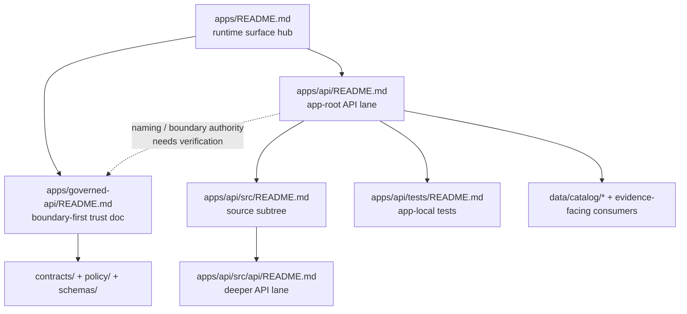

<!-- [KFM_META_BLOCK_V2]
doc_id: kfm://doc/NEEDS-VERIFICATION
title: apps/api
type: standard
version: v1
status: draft
owners: @bartytime4life
created: YYYY-MM-DD
updated: YYYY-MM-DD
policy_label: public
related: [../README.md, ../governed-api/README.md, ./src/README.md, ./src/api/README.md, ./tests/README.md, ../../contracts/README.md, ../../policy/README.md, ../../data/catalog/stac/README.md, ../../data/registry/README.md]
tags: [kfm, apps, api, runtime, governed-api]
notes: [Populate doc_id and dates after mounted-branch verification; current public-main apps/api subtree is scaffold-heavy; final naming authority between apps/api and apps/governed-api still needs verification.]
[/KFM_META_BLOCK_V2] -->

# apps/api

_App-root README for the KFM API subtree: boundary, current tree, and maintenance routing for the `apps/api/` lane._

> **Status:** experimental  
> **Doc state:** draft  
> **Owners:** `@bartytime4life`  
> **Path:** `apps/api/README.md`  
>        
> **Quick jumps:** [Scope](#scope) · [Repo fit](#repo-fit) · [Accepted inputs](#accepted-inputs) · [Exclusions](#exclusions) · [Current public evidence snapshot](#current-public-evidence-snapshot) · [Directory tree](#directory-tree) · [Quickstart](#quickstart) · [Usage](#usage) · [Diagram](#diagram) · [Tables](#tables) · [Task list](#task-list--definition-of-done) · [FAQ](#faq) · [Appendix](#appendix)  
> **Repo fit:** `apps/api/README.md` → parent [`../README.md`](../README.md) · parallel boundary [`../governed-api/README.md`](../governed-api/README.md) · source subtree [`./src/README.md`](./src/README.md) · deeper API lane [`./src/api/README.md`](./src/api/README.md) · tests [`./tests/README.md`](./tests/README.md)

> [!IMPORTANT]
> Keep this README **app-root and boundary-aware**.
>
> It should explain what `apps/api/` is, what the subtree currently contains, what this lane is expected to own, and where deeper detail belongs. It should **not** silently absorb the sibling trust-boundary role of [`../governed-api/README.md`](../governed-api/README.md), and it should **not** duplicate source-file, route-handler, or test-suite detail that belongs in downstream app-local docs.

> [!WARNING]
> Current public `main` shows `apps/api/` as a **scaffold-heavy** subtree:
> - `apps/api/README.md` is currently a placeholder
> - `apps/api/src/README.md` currently exists but is empty
> - `apps/api/src/api/README.md` is currently a placeholder
> - `apps/api/tests/README.md` is currently a placeholder
>
> Treat local bootstrap commands, package-manager claims, ports, endpoint inventories, test depth, and workflow guarantees as **NEEDS VERIFICATION** until the target branch proves them.

## Scope

`apps/api/` is the app-root documentation surface for the API-facing lane currently living under `apps/`.

In repo terms, this README should own four things:

1. the subtree’s identity and routing
2. the current verified file inventory
3. app-root maintenance rules
4. the handoff into deeper API, contract, policy, and test surfaces

It should **not** try to become the entire authority for whole-system trust-membrane doctrine, route-by-route implementation detail, or the final live runtime story.

### Truth labels used here

| Label | Meaning in this README |
| --- | --- |
| **CONFIRMED** | Directly supported by the current public repo tree or stable KFM doctrine carried by the attached corpus |
| **INFERRED** | Small structural completion that fits adjacent repo docs and KFM doctrine, but is not freshly proven as current branch reality |
| **PROPOSED** | Recommended next shape or maintenance rule that fits KFM and improves reviewability |
| **NEEDS VERIFICATION** | A path, owner split, command, or implementation claim that should be checked on the target branch before merge |
| **UNKNOWN** | Not supported strongly enough in the current session to present as current repo fact |

### Stable doctrine carried into this subtree

| Rule | Practical consequence for `apps/api/` |
| --- | --- |
| Trust membrane | Client-facing surfaces should cross governed API boundaries rather than reaching into canonical stores or unpublished artifacts directly. |
| Truth path | Runtime-facing docs should assume release-linked, promoted scope rather than ad hoc source access. |
| Evidence resolution | Consequential API paths should remain one hop from `EvidenceRef → EvidenceBundle` resolution. |
| Fail-closed posture | Rights, policy, or verification uncertainty should not be documented as successful outward behavior. |
| Bounded assistance | Any AI-facing runtime surface belongs downstream of evidence, policy, and release state, not beside or above them. |

[Back to top](#appsapi)

## Repo fit

`apps/api/README.md` sits inside the runtime-facing `apps/` family and should stay explicit about both its upstream doctrine and its downstream local surfaces.

| Path | Role | Relationship |
| --- | --- | --- |
| [`../README.md`](../README.md) | app-family boundary README | parent runtime surface hub |
| [`../governed-api/README.md`](../governed-api/README.md) | trust-boundary / membrane README | parallel sibling; final naming authority still needs verification |
| [`./src/README.md`](./src/README.md) | source subtree README | downstream local source lane; currently thin |
| [`./src/api/README.md`](./src/api/README.md) | deeper API lane | downstream HTTP / controller / adapter doc surface; currently thin |
| [`./tests/README.md`](./tests/README.md) | app-local test lane | downstream verification surface; currently thin |
| [`../../contracts/README.md`](../../contracts/README.md) | shared contract authority | upstream machine-contract neighbor |
| [`../../policy/README.md`](../../policy/README.md) | policy authority | upstream rights / sensitivity / obligation authority |
| [`../../data/catalog/stac/README.md`](../../data/catalog/stac/README.md) | discovery-facing catalog lane | downstream discovery consumer of API-shaped release scope |
| [`../../data/registry/README.md`](../../data/registry/README.md) | onboarding / identity seam | adjacent upstream source-governance lane |
| [`../../tests/README.md`](../../tests/README.md) | repo-wide verification lane | upstream shared test surface |

### Boundary rule for this file

This README should stay focused on **app-root ownership**:

- what `apps/api/` is for
- how it relates to `apps/governed-api/`
- how to navigate the local subtree
- what can be stated today without overclaiming

It should not become a hidden second home for:

- full route catalogs
- DTO or handler inventories
- full policy semantics
- endpoint-by-endpoint implementation notes
- branch-local runtime claims that have not been directly checked

[Back to top](#appsapi)

## Accepted inputs

Place the following here when they are primarily **app-root concerns** for `apps/api/`:

- current verified subtree inventory and path changes
- app-root ownership notes and local conventions
- verified local bootstrap, smoke-test, and inspection commands
- links to deeper API, contract, policy, and test surfaces
- reconciliation notes for the `apps/api` ↔ `apps/governed-api` split
- short maintenance rules that help reviewers know where deeper material belongs

## Exclusions

Do **not** place the following here:

- route-by-route endpoint details or handler notes → [`./src/api/README.md`](./src/api/README.md)
- source-tree implementation walkthroughs → [`./src/README.md`](./src/README.md)
- app-local test matrix details → [`./tests/README.md`](./tests/README.md)
- whole-of-system trust-membrane doctrine or public/steward shell law → [`../governed-api/README.md`](../governed-api/README.md) and [`../README.md`](../README.md)
- source onboarding or dataset identity rules → [`../../data/registry/README.md`](../../data/registry/README.md)
- STAC / DCAT / PROV field law → catalog and standards surfaces under `../../data/` and `../../docs/`
- speculative claims about package manager, ports, local run commands, workflow gates, or enforcement depth that are not directly verified on the target branch
- copied contract prose that should stay authoritative in `../../contracts/` or `../../policy/`

## Current public evidence snapshot

This section intentionally describes what the current public tree proves **today**, without inflating it into live runtime certainty.

| Signal | Status | Current reading |
| --- | --- | --- |
| `apps/api/README.md` | **CONFIRMED** | Placeholder file on current public `main` |
| `apps/api/` tree | **CONFIRMED** | Contains `src/`, `tests/`, and `README.md` |
| `apps/api/src/README.md` | **CONFIRMED** | File exists and is currently empty on public `main` |
| `apps/api/src/api/README.md` | **CONFIRMED** | Placeholder file on current public `main` |
| `apps/api/tests/README.md` | **CONFIRMED** | Placeholder file on current public `main` |
| `apps/README.md` | **CONFIRMED** | App-family boundary README keeps both `./governed-api/README.md` and `./api/README.md` visible |
| `apps/governed-api/README.md` | **CONFIRMED** | Parallel boundary README exists and already frames the governed API as part of the trust model |
| owner routing | **CONFIRMED** | Broad public `.github/CODEOWNERS` fallback routes `/apps/` to `@bartytime4life` |
| final naming authority between `apps/api` and `apps/governed-api` | **NEEDS VERIFICATION** | Keep both surfaces visible until the target branch resolves canonical ownership |
| local bootstrap commands, package manager, ports, endpoint inventory, and app-local CI depth | **UNKNOWN** | Not proven from current public subtree inspection |

> [!NOTE]
> This README is written to be **useful now** and **safe later**:
> it is specific enough to guide maintainers, but conservative enough that later mounted-branch verification can tighten it without needing a doctrinal rewrite.

## Directory tree

Current public-main snapshot:

```text
apps/api/
├── README.md
├── src/
│   ├── README.md
│   └── api/
│       └── README.md
└── tests/
    └── README.md
```

Suggested reading order inside the subtree:

1. this file — app-root ownership and routing
2. `../governed-api/README.md` — trust-boundary doctrine and surface classes
3. `./src/api/README.md` — deeper API lane detail once substantive
4. `./tests/README.md` — app-local verification surface once substantive

[Back to top](#appsapi)

## Quickstart

### 1) Inspect what is actually present

```bash
find apps/api -maxdepth 3 -type f | sort
```

### 2) Check which local docs are still thin

```bash
wc -l \
  apps/api/README.md \
  apps/api/src/README.md \
  apps/api/src/api/README.md \
  apps/api/tests/README.md
```

### 3) Read adjacent authority docs before editing this lane

```bash
sed -n '1,220p' apps/README.md
sed -n '1,220p' apps/governed-api/README.md
sed -n '1,220p' apps/api/README.md
```

### 4) Add verified run/test commands only after they work on the target branch

```bash
# TODO: replace with branch-verified commands only.
# Examples to add only after proof:
# - package manager bootstrap
# - local API start command
# - smoke-test or health-check command
# - app-local test command
# - required env file or secrets reference
```

> [!IMPORTANT]
> Do not guess the package manager, server command, port, or env shape here.
> This app-root README should become the place a maintainer starts for local use, but only after the commands have been checked against the actual branch.

## Usage

### Update this README when

- the `apps/api/` subtree inventory changes
- the ownership split between `apps/api` and `apps/governed-api` is clarified
- local bootstrap or smoke-test commands are verified
- downstream README targets are renamed, added, or removed
- app-root conventions change and reviewers need a stable routing surface

### Keep the doc split clean

| Change type | Update here? | Also update |
| --- | --- | --- |
| subtree inventory changed | Yes | [`../README.md`](../README.md) if the app-family inventory changes too |
| authoritative naming between `apps/api` and `apps/governed-api` changed | Yes | [`../governed-api/README.md`](../governed-api/README.md) and [`../README.md`](../README.md) |
| route/controller/adapter detail changed | Summary only | [`./src/api/README.md`](./src/api/README.md) |
| source subtree organization changed | Summary only | [`./src/README.md`](./src/README.md) |
| app-local tests changed | Summary only | [`./tests/README.md`](./tests/README.md) |
| contract or policy authority moved | Yes | [`../../contracts/README.md`](../../contracts/README.md), [`../../policy/README.md`](../../policy/README.md) |

### Use this README as the handoff point

A good maintainer experience for this lane should look like this:

- start here to learn what the subtree is supposed to own
- confirm what the public tree actually contains
- branch outward into boundary, source, or test docs as needed
- avoid inventing runtime maturity the tree does not yet prove

## Diagram


```mermaid
flowchart TD
    A[apps/README.md<br/>runtime surface hub] --> B[apps/api/README.md<br/>app-root API lane]
    A --> C[apps/governed-api/README.md<br/>boundary-first trust doc]

    B -. naming / boundary authority<br/>needs verification .-> C

    B --> D[apps/api/src/README.md<br/>source subtree]
    D --> E[apps/api/src/api/README.md<br/>deeper API lane]
    B --> F[apps/api/tests/README.md<br/>app-local tests]

    C --> G[contracts/ + policy/ + schemas/]
    B --> H[data/catalog/* + evidence-facing consumers]
```

## Tables

### Responsibility split

| Surface | What it should own | What it should not quietly own |
| --- | --- | --- |
| `apps/api/README.md` | app-root identity, subtree routing, verified inventory, bootstrap handoff | final route catalog, handler detail, whole-system doctrine |
| `apps/governed-api/README.md` | trust-boundary law, governed request classes, membrane rules, edge-facing API posture | app-root inventory churn, source-tree walkthroughs, route-handler duplication |
| `apps/api/src/README.md` | source subtree structure and local implementation entrypoints | whole-boundary doctrine or sibling app-family ownership |
| `apps/api/src/api/README.md` | deeper API internals, route/controller/adapter notes, module layout | app-root tree inventory or whole-app ownership |
| `apps/api/tests/README.md` | app-local verification organization and test surfaces | repo-wide testing doctrine or shared policy law |

### Doctrine-backed route families

These are the route families KFM doctrine expects an API boundary to handle. The table below is included to keep this app-root README aligned with project law **without** claiming that the current subtree already proves every endpoint.

| Route family | Why `apps/api/` should care | Current implementation claim |
| --- | --- | --- |
| Catalog / discovery | dataset, version, and outward metadata reads shape what the app-root API lane eventually exposes | **Doctrine-backed / implementation NEEDS VERIFICATION** |
| Feature / subject read | authoritative released reads are part of the public/steward runtime boundary | **Doctrine-backed / implementation UNKNOWN** |
| Map / tile / portrayal | map-facing delivery belongs downstream of release scope and policy | **Doctrine-backed / implementation UNKNOWN** |
| Evidence resolution | `EvidenceRef → EvidenceBundle` is load-bearing for Evidence Drawer and related trust surfaces | **Doctrine-backed / implementation UNKNOWN** |
| Story / dossier / compare | API-facing narrative and comparison surfaces stay anchored to the same geography/time shell | **Doctrine-backed / implementation UNKNOWN** |
| Export / report | public-safe outward artifacts inherit release, policy, and correction state | **Doctrine-backed / implementation UNKNOWN** |
| Focus / governed assistance | bounded runtime assistance should remain cite-or-abstain and evidence-shaped | **Doctrine-backed / implementation UNKNOWN** |
| Review / stewardship | internal-only moderation, rollback, rights, and denial flows are part of the same API world, but not public by default | **Doctrine-backed / implementation UNKNOWN** |
| Ops / status | health and audit-facing status may exist, but must not become a second truth surface | **Doctrine-backed / implementation UNKNOWN** |

[Back to top](#appsapi)

## Task list -- definition of done

A strong, review-ready `apps/api/README.md` is done when all of the following are true:

- [ ] top-level placeholders in the meta block are replaced with real values after mounted-branch verification
- [ ] the current `apps/api/` tree snapshot is accurate
- [ ] the relationship between `apps/api` and `apps/governed-api` is explicitly settled or clearly flagged
- [ ] local bootstrap and smoke-test commands have been verified and added
- [ ] route-level detail is routed to `./src/api/README.md` rather than duplicated here
- [ ] test-surface detail is routed to `./tests/README.md` rather than duplicated here
- [ ] any endpoint or runtime claims are anchored to visible code, contracts, or tests
- [ ] relative links still resolve after every subtree change

## FAQ

### Why keep both `apps/api` and `apps/governed-api` visible?

Because current public `main` exposes **both** surfaces. Until the target branch resolves which path owns which layer of API documentation, this README should keep the split visible instead of flattening it into confident prose.

### Does this README prove a runnable API today?

No. Current public `main` proves the subtree paths and placeholder docs, not the final runtime command set, route inventory, enforcement depth, or test matrix.

### Where should endpoint detail live?

In the deeper API lane under [`./src/api/README.md`](./src/api/README.md) and in authoritative contract surfaces under `../../contracts/` and related schema/policy lanes once those are verified for the target branch.

### Why is this file doctrine-aware if the subtree is still thin?

Because KFM treats runtime boundaries as part of the trust model. Even when implementation depth is not yet proven, boundary docs should still preserve the trust membrane, truth-path discipline, and evidence-first posture that later code must satisfy.

## Appendix

<details>
<summary><strong>Open verification backlog</strong></summary>

### Still needs direct branch proof

- final naming authority between `apps/api` and `apps/governed-api`
- actual source layout under `apps/api/src/api/`
- actual app-local tests under `apps/api/tests/`
- package manager and bootstrap workflow
- local port, auth, and health-check behavior
- concrete OpenAPI / schema / policy entrypoints used by this subtree
- workflow YAML and merge-blocking checks that apply specifically to this lane

### Safe rule while those remain open

Keep path facts explicit, keep doctrine visible, and downgrade anything else to **NEEDS VERIFICATION** or **UNKNOWN** instead of smoothing the gap away.

</details>

<details>
<summary><strong>Current public-main tree snapshot to refresh when the subtree changes</strong></summary>

```text
apps/api/
├── README.md                  # placeholder on current public main
├── src/
│   ├── README.md              # present; currently empty on public main
│   └── api/
│       └── README.md          # placeholder on current public main
└── tests/
    └── README.md              # placeholder on current public main
```

Refresh this snapshot whenever files are added, renamed, or moved under `apps/api/`.

</details>

[Back to top](#appsapi)
