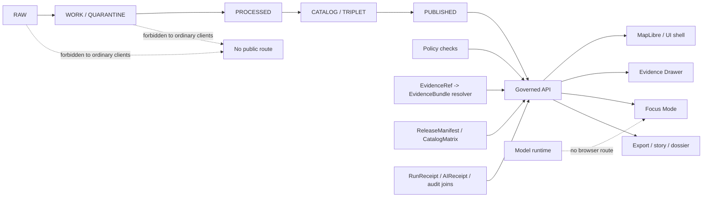
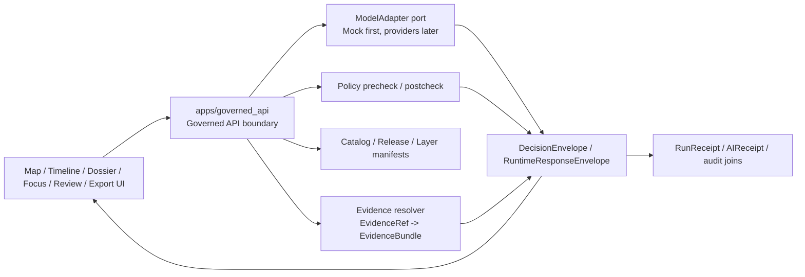

<!-- [KFM_META_BLOCK_V2]
doc_id: kfm://doc/TODO-governed-api-readme-uuid-NEEDS-VERIFICATION
title: Governed API
type: standard
version: v1
status: draft
owners: TODO-governed-api-owner-NEEDS-VERIFICATION
created: TODO-created-date-NEEDS-VERIFICATION
updated: 2026-04-29
policy_label: TODO-policy-label-NEEDS-VERIFICATION
related: [./openapi/README.md, TODO-related-docs-NEEDS-VERIFICATION]
tags: [kfm, governed-api, evidence-bundle, decision-envelope, runtime-response-envelope, policy, release, focus-mode]
notes: [Combined and updated from the prior governed API boundary README plus the OpenAPI README. Repo evidence mode remains CORPUS_ONLY / NO_LOCAL_REPO_EVIDENCE; path, owners, route files, framework, ecology scaffold files, OpenAPI target version, validators, CI, deployment, and runtime behavior remain NEEDS VERIFICATION until checked in the mounted repository.]
[/KFM_META_BLOCK_V2] -->

<a id="top"></a>

# Governed API

<p align="center">
  <strong>Trust boundary for release-aware, evidence-resolving, policy-checked KFM responses.</strong><br>
  Kansas Frontier Matrix · evidence-first · map-first · time-aware · governed
</p>

<p align="center">
  
  
  
  
  
</p>

<p align="center">
  <a href="#overview">Overview</a> ·
  <a href="#source-and-truth-posture">Truth posture</a> ·
  <a href="#scope">Scope</a> ·
  <a href="#trust-boundary">Trust boundary</a> ·
  <a href="#repo-fit">Repo fit</a> ·
  <a href="#accepted-inputs">Inputs</a> ·
  <a href="#exclusions">Exclusions</a> ·
  <a href="#directory-map">Directory map</a> ·
  <a href="#route-families">Routes</a> ·
  <a href="#runtime-outcomes">Outcomes</a> ·
  <a href="#validation">Validation</a> ·
  <a href="#task-list--definition-of-done">Definition of done</a>
</p>

> [!IMPORTANT]
> This README is repo-ready boundary guidance, not proof of current implementation. The source drafts explicitly carried a `CORPUS_ONLY / NO_LOCAL_REPO_EVIDENCE` posture. Treat paths, route names, DTOs, framework assumptions, OpenAPI files, ecology scaffold files, validator commands, owners, CI behavior, deployment posture, and runtime behavior as `PROPOSED`, `UNKNOWN`, or `NEEDS VERIFICATION` until the live repository is inspected.

| Field | Value |
|---|---|
| Status | `draft` |
| Intended path | `apps/governed_api/README.md` — `NEEDS VERIFICATION` |
| Document role | Parent boundary README for the governed API surface |
| Evidence mode | `CORPUS_ONLY / NO_LOCAL_REPO_EVIDENCE` |
| Owners | `TODO-governed-api-owner-NEEDS-VERIFICATION` |
| Policy label | `TODO-policy-label-NEEDS-VERIFICATION` |
| Public posture | Cite-or-abstain; fail closed on unresolved rights, sensitivity, review state, release state, or source authority |
| Implementation posture | Contract-first, evidence-resolving, policy-aware, finite-outcome, rollback-capable |

---

## Overview

The governed API is the executable trust membrane where KFM clients receive release-aware, evidence-resolving, policy-checked responses instead of raw data, direct model output, direct canonical-store reads, or unpublished project state.

It is not a generic backend README. Its job is to make the boundary legible before anyone adds routes, adapters, model calls, export jobs, UI integrations, or public deployment rules.

| This README does | This README does not do |
|---|---|
| Defines the KFM API trust boundary and the behavior it must preserve. | Does not prove `apps/governed_api/` exists or is code-bearing. |
| Separates parent API boundary guidance from child OpenAPI contract guidance. | Does not claim route handlers, framework conventions, tests, workflows, or deployment settings are implemented. |
| Preserves the finite outcomes `ANSWER`, `ABSTAIN`, `DENY`, and `ERROR`. | Does not authorize public release or bypass promotion gates. |
| Describes how Focus Mode, Evidence Drawer, exports, review, and map clients should call governed interfaces. | Does not let AI, MapLibre, generated clients, vector indexes, graph projections, summaries, or tiles become sovereign truth. |

Core rule:

> Public and ordinary UI clients call governed APIs over released or review-authorized scope. They do not call `RAW`, `WORK`, `QUARANTINE`, canonical restricted stores, direct source feeds, vector indexes, graph internals, or model runtimes directly.

<p align="right"><a href="#top">Back to top ↑</a></p>

---

## Source and truth posture

| Label | Use in this README |
|---|---|
| `CONFIRMED` | Verified from supplied source drafts or explicit KFM doctrine. |
| `PROPOSED` | Recommended design, path, route family, contract, or validator not verified in the live repo. |
| `UNKNOWN` | Not verifiable without mounted repo, tests, manifests, dashboards, logs, CI, or runtime traces. |
| `NEEDS VERIFICATION` | Must be checked in live repo or current official source before being treated as operational fact. |
| `CONFLICTED` | Repo path, schema home, or authority convention may have competing candidates and needs ADR resolution. |

Memory is not evidence. Documentation is evidence of intended doctrine, not proof of implemented runtime behavior.

<p align="right"><a href="#top">Back to top ↑</a></p>

---

## Scope

This README documents the parent governed API boundary for Kansas Frontier Matrix.

The governed API should be the executable place where KFM:

- resolves `EvidenceRef -> EvidenceBundle` before consequential answers;
- enforces release scope, policy posture, source authority, rights, sensitivity, and review state;
- emits finite outcomes instead of smoothing over failure;
- keeps public clients away from `RAW`, `WORK`, `QUARANTINE`, unpublished candidate data, restricted canonical stores, and direct model runtimes;
- returns response envelopes that can be audited, corrected, superseded, withdrawn, or rolled back.

### Parent versus child README split

This combined update preserves two appropriate documentation surfaces:

| File | Role | What belongs there |
|---|---|---|
| `apps/governed_api/README.md` | Parent boundary README | Trust boundary, responsibilities, route-family posture, accepted inputs, exclusions, runtime outcomes, validation gates, rollback posture. |
| `apps/governed_api/openapi/README.md` | Child OpenAPI README | Contract-file conventions, spec rules, `$ref` posture, OpenAPI version pinning, examples, operation metadata, OpenAPI-specific validation. |

Do not collapse these into one repo file unless the mounted repository proves a different documentation convention. If the repo uses `apps/governed-api/`, `apps/api/`, or `packages/api/`, resolve the durable home through an ADR rather than duplicating authority.

### Ecology scaffold note

The prior boundary draft referenced a minimal ecology dry-run API involving:

```text
GET /ecology/timeslices/{id}
GET /ecology/evidence/{bundle_id}
GET /ecology/catalog/stac
GET /healthz
```

This update preserves that as `PROPOSED / SCAFFOLDED / NEEDS REPO VERIFICATION`, not as a confirmed implementation claim. Upgrade it only after the live repo confirms the files, tests, route behavior, artifact root, and public-safety checks.

<p align="right"><a href="#top">Back to top ↑</a></p>

---

## Trust boundary

> [!CAUTION]
> Public clients, normal UI surfaces, Focus Mode, exports, stories, and map popups must not read directly from `RAW`, `WORK`, `QUARANTINE`, unpublished candidate data, restricted canonical stores, direct model-runtime output, or direct source-system side effects.


```mermaid
flowchart LR
  RAW[RAW] --> WORK[WORK / QUARANTINE]
  WORK --> PROCESSED[PROCESSED]
  PROCESSED --> CATALOG[CATALOG / TRIPLET]
  CATALOG --> PUBLISHED[PUBLISHED]
  PUBLISHED --> API[Governed API]
  API --> UI[MapLibre / UI shell]
  API --> DRAWER[Evidence Drawer]
  API --> FOCUS[Focus Mode]
  API --> EXPORT[Export / story / dossier]

  Policy[Policy checks] --> API
  Evidence[EvidenceRef -> EvidenceBundle resolver] --> API
  Release[ReleaseManifest / CatalogMatrix] --> API
  Audit[RunReceipt / AIReceipt / audit joins] --> API

  RAW -. forbidden to ordinary clients .-> BLOCKED[No public route]
  WORK -. forbidden to ordinary clients .-> BLOCKED
  MODEL[Model runtime] -. no browser route .-> FOCUS
```

Healthy routes preserve these boundaries:

| Boundary | Required posture |
|---|---|
| Evidence | Consequential `ANSWER` responses resolve `EvidenceRef -> EvidenceBundle`. |
| Policy | Rights, sensitivity, review, role, release, exact-location, source-role, and freshness checks are visible as outcomes. |
| Lifecycle | Public paths start from released or explicitly review-authorized artifacts, not internal lifecycle stores. |
| AI / Focus Mode | Model output is interpretive and bounded; it never becomes proof. |
| UI / maps | Map features, popups, drawers, exports, and stories consume governed payloads. |
| Rollback | Release-linked outputs preserve replacement, alias, deprecation, correction, withdrawal, or rollback references. |

<p align="right"><a href="#top">Back to top ↑</a></p>

---

## Repo fit

### Intended location

`apps/governed_api/README.md` — `NEEDS VERIFICATION`

### Boundary role

This directory should sit between outward-facing product surfaces and lower-level evidence, catalog, policy, release, runtime, source, and model-adapter internals.


```mermaid
flowchart LR
  Client[Map / Timeline / Dossier / Focus / Review / Export UI]
  API[apps/governed_api<br/>Governed API boundary]
  Policy[Policy precheck / postcheck]
  Evidence[Evidence resolver<br/>EvidenceRef -> EvidenceBundle]
  Catalog[Catalog / Release / Layer manifests]
  Adapter[ModelAdapter port<br/>Mock first, providers later]
  Envelope[DecisionEnvelope / RuntimeResponseEnvelope]
  Audit[RunReceipt / AIReceipt / audit joins]

  Client --> API
  API --> Policy
  API --> Evidence
  API --> Catalog
  API --> Adapter
  Adapter --> Envelope
  Policy --> Envelope
  Evidence --> Envelope
  Envelope --> Audit
  Envelope --> Client
```

### Upstream and downstream references

Convert these to relative links only after the mounted repo confirms the paths.

| Relationship | Candidate reference | Status | Why it matters |
|---|---|---:|---|
| Child OpenAPI README | `./openapi/README.md` | **PROPOSED / NEEDS VERIFICATION** | Contract-file guidance belongs below this boundary README. |
| OpenAPI specs | `./openapi/*.openapi.yaml` or repo-native convention | **UNKNOWN** | Specs should document governed routes without becoming truth authority. |
| Upstream contracts | `../../contracts/README.md` | **NEEDS VERIFICATION** | API behavior should be contract-led, not route-led. |
| Upstream schemas | `../../schemas/contracts/README.md` | **NEEDS VERIFICATION** | `EvidenceBundle`, `DecisionEnvelope`, and runtime envelopes need one canonical schema home. |
| Upstream policy | `../../policy/README.md` | **NEEDS VERIFICATION** | Runtime allow/deny behavior must mirror policy files and invalid fixtures. |
| Upstream tests | `../../tests/README.md` | **NEEDS VERIFICATION** | README claims must align with actual test coverage. |
| Adjacent API module | `../api/src/api/README.md`, `apps/api`, or repo-native equivalent | **UNKNOWN** | Route implementation docs may belong elsewhere. |
| Decisions | `../../docs/adr/` | **NEEDS VERIFICATION** | Path conflicts such as `governed-api` vs `governed_api` need ADR treatment. |
| Downstream UI | `apps/web`, `apps/explorer-web`, or repo-native equivalent | **UNKNOWN** | Map shell, Evidence Drawer, Focus Mode, review, and export surfaces consume this boundary. |

> [!WARNING]
> Do not maintain parallel authority between `contracts/` and `schemas/contracts/v1/`. If both exist in the live repo, resolve canonical schema home through an ADR before adding or duplicating schema definitions.

<p align="right"><a href="#top">Back to top ↑</a></p>

---

## Accepted inputs

### Boundary documentation and implementation inputs

| Accepted input | Status | Belongs here when... |
|---|---:|---|
| Boundary README and route-family documentation | **CONFIRMED DOC INTENT / NEEDS REPO VERIFICATION** | it explains trust behavior without inventing implementation. |
| OpenAPI contract entry points | **PROPOSED** | the repo confirms this app owns contract generation, serving, or local contract docs. |
| Route handlers for released public reads | **PROPOSED** | they enforce release scope and emit finite outcomes. |
| Evidence resolution endpoints | **PROPOSED** | they resolve `EvidenceRef -> EvidenceBundle` server-side. |
| Focus Mode request endpoint | **PROPOSED / MOCK FIRST** | it uses policy, evidence, citation validation, and `RuntimeResponseEnvelope`. |
| Review and stewardship endpoints | **PROPOSED / INTERNAL GOVERNED** | they are authenticated, audited, and do not become normal public paths. |
| Safe telemetry / health endpoints | **PROPOSED** | they expose health and explainability without raw-store leakage. |

### Runtime request inputs this boundary may accept

| Input | Required guardrail |
|---|---|
| `release_id`, `layer_id`, `claim_id`, `source_id`, stable subject IDs | Must resolve to published or explicitly permitted scope. |
| `EvidenceRef` | Must resolve server-side to an admissible `EvidenceBundle` or return `ABSTAIN`, `DENY`, or `ERROR`. |
| `FocusQueryRequest` | Must pass scope resolution and policy precheck before retrieval or model-adapter use. |
| `LayerManifest`, `StoryManifest`, `ExportManifest` requests | Must not outrun catalog, release, rights, sensitivity, or correction state. |
| `PolicyDecision` and obligation context | Must be emitted when it changes public meaning. |
| Valid and invalid fixtures | Must exist before claiming implemented behavior. |

<p align="right"><a href="#top">Back to top ↑</a></p>

---

## Exclusions

| Excluded from normal boundary | Goes instead | Why |
|---|---|---|
| `RAW`, `WORK`, or `QUARANTINE` data | Pipeline lifecycle stores | Public request paths must not see unpublished candidate material. |
| Direct browser access to databases or object stores | Governed API plus released artifacts | Direct reads bypass evidence, policy, audit, and correction behavior. |
| Direct browser access to Ollama or other model runtimes | Provider adapter behind governed API | Model runtimes are not public truth surfaces. |
| Source connectors and harvesters | Ingestion / pipeline packages | Intake must happen before publication and proof gates. |
| Canonical schema authority | `contracts/` or `schemas/contracts/` after ADR | Avoid duplicate contract authority. |
| Policy source of truth | `policy/` | API code should consume/enforce policy, not silently redefine it. |
| UI components | Repo-native web app path | Evidence Drawer and Focus Mode consume governed envelopes; they do not own API truth. |
| Chain-of-thought or free-form model traces | Not a KFM truth object | Persist auditable receipts and hashes, not private reasoning. |
| Emergency or life-safety instructions | Official source systems | KFM should cite official guidance or abstain/deny when life-safety action is requested. |
| Generated clients as contract authority | Generated output path, if repo allows | Generated clients are downstream derivatives. |

<p align="right"><a href="#top">Back to top ↑</a></p>

---

## Directory map

The live directory was not inspectable in the authoring pass. The tree below is a proposed shape plus specific items carried forward from the prior draft as `PROPOSED / NEEDS VERIFICATION`.

```text
apps/governed_api/
├── README.md                         # this parent boundary README
├── openapi/
│   ├── README.md                     # child OpenAPI README
│   ├── index.openapi.yaml            # PROPOSED: aggregate/index spec, if repo uses one
│   ├── runtime.openapi.yaml          # PROPOSED: runtime envelope / Focus Mode route family
│   ├── evidence.openapi.yaml         # PROPOSED: EvidenceRef -> EvidenceBundle routes
│   ├── catalog.openapi.yaml          # PROPOSED: discovery and release metadata routes
│   ├── review.openapi.yaml           # PROPOSED: steward/reviewer routes; not public
│   ├── ecology.openapi.yaml          # PROPOSED: rename/verify prior ecology.yaml if present
│   └── examples/                     # PROPOSED: public-safe examples
│       ├── answer.example.json
│       ├── abstain.example.json
│       ├── deny.example.json
│       └── error.example.json
├── server.py                         # PROPOSED / NEEDS VERIFICATION: prior ecology dry-run server reference
├── src/                              # PROPOSED: use only if repo framework supports it
│   ├── routes/
│   ├── middleware/
│   ├── evidence/
│   ├── ai/
│   └── envelopes/
├── fixtures/                         # PROPOSED
│   ├── valid/
│   └── invalid/
└── tests/                            # PROPOSED
    ├── contract/
    ├── policy/
    ├── integration/
    └── no-direct-model-client/
```

Naming rule:

> Use one repo convention. Do not keep both `apps/governed-api` and `apps/governed_api`, or both `ecology.yaml` and `ecology.openapi.yaml`, unless the live repo already has a documented versioning or alias policy.

<p align="right"><a href="#top">Back to top ↑</a></p>

---

## Route families

Concrete implementation depth is `UNKNOWN` until the live repo is inspected.

| Route family | Exposure | Primary objects | Trust obligation |
|---|---|---|---|
| Catalog and discovery | Public governed | Release metadata, dataset/distribution discovery, catalog closure | Catalog closure and identifier consistency must resolve cleanly. |
| Feature / subject / claim read | Public governed | Released features, places, dossiers, claims, detail views | Stable subject ID, support/time semantics, rights posture, and release scope are mandatory. |
| Map / tile / portrayal | Public governed | Released maps, tiles, legends, styles, portrayals | Must inherit release linkage, policy posture, freshness, and correction state. |
| Evidence resolution | Public governed | `EvidenceRef`, `EvidenceBundle`, related trust objects | Every bundle must resolve to admissible published scope with rights, sensitivity, and audit linkage visible. |
| Focus / governed assistance | Public governed | `RuntimeResponseEnvelope`, citations, bounded context | Scope, citations, policy, and audit linkage must be visible. |
| Story / dossier / compare | Public governed | Narrative and comparison inputs anchored in the same shell | Preserve spatial anchor, temporal anchor, and drill-through to evidence. |
| Export and report | Public governed | Public-safe exports, previews, packaged report objects | Exports never outrun release state, policy posture, or correction linkage. |
| Review / stewardship | Internal governed | Moderation, quarantine inspection, approval, denial, rollback, rights handling | Every action emits review and decision artifacts. |
| Ops / status | Internal by default | Health, metrics, traces, audit joins | Must not expose raw canonical data or become a second truth surface. |

<p align="right"><a href="#top">Back to top ↑</a></p>

---

## Runtime outcomes

Negative states are normal governed outputs, not failures to hide.

| Outcome | Use when | Required response posture |
|---|---|---|
| `ANSWER` | Evidence is sufficient, released or authorized, in scope, citation-valid, and policy-safe. | Include citations or citation-ready references, release scope, policy state, and audit reference. |
| `ABSTAIN` | Evidence is missing, weak, stale, conflicted, unresolved, or scope is too broad. | Explain what is missing without inventing support. |
| `DENY` | Rights, sensitivity, role, source status, policy, or publication state blocks response. | Include safe reason and obligation codes where allowed; do not leak protected detail. |
| `ERROR` | Technical failure prevents reliable execution. | Fail closed; do not fall back to raw model text, raw feature properties, or partial truth. |

<p align="right"><a href="#top">Back to top ↑</a></p>

---

## Focus Mode and model adapter boundary

Focus Mode must be evidence-bounded.

```text
user request
-> scope resolution
-> policy precheck
-> release-scoped evidence retrieval
-> EvidenceRef / EvidenceBundle resolution
-> bounded context assembly
-> ModelAdapter call, MockAdapter first
-> structured-output validation
-> citation validation
-> policy postcheck
-> RuntimeResponseEnvelope
-> audit / receipt joins
```

Provider choice is internal. The public contract should not expose whether the runtime behind the adapter is `MockAdapter`, Ollama, an OpenAI-compatible API, or another provider.

Required posture:

- define `ModelAdapterPort` before selecting providers;
- use `MockAdapter` for deterministic contract and policy tests first;
- pass only released, policy-safe evidence excerpts or safe summaries;
- validate citations before `ANSWER`;
- never let a model runtime read canonical stores, `RAW`, `WORK`, or `QUARANTINE`;
- never let browser code call a model server directly.

<p align="right"><a href="#top">Back to top ↑</a></p>

---

## OpenAPI relationship

OpenAPI belongs under this boundary as an inspectable contract surface. It does not make OpenAPI the root truth source.

| Parent README owns | Child OpenAPI README owns |
|---|---|
| Boundary law, lifecycle exclusions, route-family posture, Focus/AI placement, validation gates, rollback expectations. | Spec-file naming, component `$ref` posture, operation metadata, OpenAPI target pinning, examples, and OpenAPI-specific validation. |

OpenAPI should describe how clients reach governed evidence. It must not become a shortcut around evidence, policy, release state, review state, or correction lineage.

<p align="right"><a href="#top">Back to top ↑</a></p>

---

## Validation

Exact commands are `NEEDS VERIFICATION` because package manager, framework, validator tooling, and CI are unknown.

### Verification-first review loop

Run from repository root after the real checkout is mounted:

```bash
find apps/governed-api -maxdepth 3 -type f | sort
find apps/governed_api -maxdepth 3 -type f | sort
find apps/api/src/api -maxdepth 3 -type f | sort
find contracts schemas policy tests .github/workflows -maxdepth 4 -type f | sort
```

Check for direct model or raw-store paths that should not be reachable from public clients:

```bash
grep -RInE "localhost:11434|OLLAMA_HOST|/api/generate|/api/chat|/v1/chat|/v1/responses" apps packages 2>/dev/null || true
grep -RInE "raw|quarantine|work" apps/governed-api apps/governed_api apps/api packages 2>/dev/null || true
```

Check whether README claims can be backed by contracts and tests:

```bash
find contracts schemas -maxdepth 5 -type f | grep -Ei "evidence|decision|runtime|policy|focus|drawer|release|catalog" || true
find tests -maxdepth 5 -type f | grep -Ei "evidence|policy|focus|runtime|citation|deny|abstain|error" || true
```

Minimum gates:

| Gate | Expected result |
|---|---|
| Contracts gate | Schema compile plus valid and invalid fixtures. |
| Policy gate | Deny-by-default reason and obligation grammar. |
| Resolver gate | Positive and negative `EvidenceBundle` traces. |
| Runtime gate | Finite envelope validation for `ANSWER`, `ABSTAIN`, `DENY`, and `ERROR`. |
| Citation gate | Invalid or blocked citations prevent `ANSWER`. |
| No-direct-model-client gate | Browser and public clients cannot call provider runtimes. |
| No-raw-public-path gate | Governed routes cannot serve `RAW`, `WORK`, or `QUARANTINE`. |
| Correction gate | Visible supersession, withdrawal, or rollback behavior. |
| Docs gate | Boundary README, route docs, contracts, policy, tests, and runbooks stay aligned. |

<p align="right"><a href="#top">Back to top ↑</a></p>

---

## Change and rollback posture

| Change type | Review burden | Rollback or correction expectation |
|---|---|---|
| New public route | Evidence, policy, release, examples, tests, and client impact review. | Route can be disabled, hidden, aliased, or removed without orphaning release records. |
| New stewardship route | Role, audit, sensitivity, and review-state validation. | Roll back without exposing steward-only payloads. |
| Response schema change | Client compatibility and generated-client impact review. | Preserve old schema, alias, or deprecation window when needed. |
| Route removal or rename | Deprecation, migration, and release impact review. | Replacement route and rollback note required. |
| Example fixture change | Public-safety and schema-validation review. | Restore prior fixture or correction note if example shaped public behavior. |
| Model-adapter change | Provider, policy, citation, and deterministic test review. | Revert adapter while preserving receipts for diagnosis. |

<p align="right"><a href="#top">Back to top ↑</a></p>

---

## Task list / definition of done

- [ ] Confirm whether `apps/governed_api/` exists, is README-only, or is code-bearing.
- [ ] Confirm whether `apps/governed-api`, `apps/governed_api`, `apps/api`, or `packages/api` is the durable API home.
- [ ] Fill `doc_id`, owners, created date, policy label, and related links in the KFM meta block from repo-authoritative sources.
- [ ] Document the canonical relationship between this README and any deeper API module README.
- [ ] Confirm whether prior scaffold files such as `apps/governed_api/openapi/ecology.yaml` and `apps/governed_api/server.py` exist before marking them complete.
- [ ] Resolve canonical schema home through repo evidence or an ADR.
- [ ] Pin OpenAPI target version and linter/toolchain in the child OpenAPI README.
- [ ] Link or reference one public governed-read contract after path verification.
- [ ] Link or reference one internal/steward contract after path verification.
- [ ] Link one positive `EvidenceRef -> EvidenceBundle` trace.
- [ ] Link one negative runtime trace for each of `ABSTAIN`, `DENY`, and `ERROR`.
- [ ] Link one correction, supersession, withdrawal, or rollback example.
- [ ] Confirm CI gates match actual workflow files, not README intent.
- [ ] Confirm no public or browser path directly calls Ollama, a provider API, a canonical store, or raw lifecycle paths.

### Rollback checklist

- [ ] Disable new route family behind feature flag.
- [ ] Revert route PR while preserving fixtures and receipts for diagnosis.
- [ ] Downgrade README claims back to `PROPOSED` or `UNKNOWN`.
- [ ] Add unresolved items to the verification backlog.
- [ ] Preserve correction or withdrawal notes if any public artifact was affected.

<p align="right"><a href="#top">Back to top ↑</a></p>

---

## FAQ

### Why “governed API” instead of just “backend”?

Because KFM treats this API boundary as part of the trust model. It is where client requests inherit release state, evidence drill-through, policy posture, finite outcomes, and correction visibility.

### Can the UI call the database, object store, or model server directly?

No. That would collapse the trust membrane. Browser shells consume governed envelopes, released artifacts, and safe summaries. They do not reach around the API for canonical truth, raw lifecycle stores, or model output.

### Where should endpoint-level details live?

`NEEDS VERIFICATION.` If the repo has a deeper API module README such as `apps/api/src/api/README.md`, keep endpoint implementation details there and keep this file focused on boundary law, accepted inputs, exclusions, gates, and review posture.

### Is this directory currently implemented?

`UNKNOWN / NEEDS VERIFICATION.` The prior draft referenced an ecology scaffold, but this combined update does not upgrade that to a confirmed implementation claim without a mounted repo inspection.

### Why is MockAdapter first?

MockAdapter lets the project test finite outcomes, schema validation, citation validation, source coverage, and policy behavior without network access, model nondeterminism, provider drift, or premature public AI behavior.

### What should happen when evidence is missing?

Return `ABSTAIN` or `ERROR`, depending on whether the issue is evidentiary or technical. Do not fabricate a plausible answer. Do not ask the model to bridge the gap.

### What should happen when policy blocks an answer?

Return `DENY` with safe reason and obligation information where permitted. Do not leak restricted details in the denial explanation.

<p align="right"><a href="#top">Back to top ↑</a></p>

---

## Appendix

<details>
<summary>Glossary</summary>

| Term | Meaning in this README |
|---|---|
| Governed API | The executable trust boundary for public, UI, Focus, review, and export calls. |
| EvidenceRef | Stable reference to evidence that must resolve before consequential output. |
| EvidenceBundle | Inspectable evidence packet that outranks generated text. |
| DecisionEnvelope | Finite decision wrapper for governed responses. |
| RuntimeResponseEnvelope | Runtime result wrapper for model-assisted and Focus surfaces. |
| Focus Mode | Evidence-bounded synthesis surface, not a free-form AI tab. |
| Evidence Drawer | Trust-visible UI object showing support, policy, review, release, corrections, and caveats. |
| SourceDescriptor | Source-role and authority record for source families. |
| CatalogMatrix | Catalog closure object that helps prove release/readiness state. |
| ReleaseManifest | Published release description and linkage object. |
| AIReceipt | Audit record for adapter/model-assisted execution, not public truth. |
| RunReceipt | Process receipt for run reconstruction, not public truth by itself. |
| Trust membrane | Boundary that prevents public surfaces from bypassing evidence, policy, release, and audit controls. |

</details>

<details>
<summary>Open verification backlog</summary>

| Item | Status | Verification step |
|---|---|---|
| Target directory exists | **UNKNOWN** | Inspect live repo for `apps/governed_api/`. |
| Parent API framework | **UNKNOWN** | Inspect package files, app entrypoint, route modules, tests, and OpenAPI generation hooks. |
| Canonical schema home | **CONFLICTED / NEEDS VERIFICATION** | Inspect `contracts/`, `schemas/`, existing ADRs, and schema tests. |
| Ecology scaffold files | **UNKNOWN** | Verify `openapi/ecology.yaml`, `server.py`, fixtures, and tests before claiming scaffolded behavior. |
| Validator commands | **UNKNOWN** | Inspect CI, `Makefile`, package manager, and validator scripts. |
| Owners | **UNKNOWN** | Inspect `CODEOWNERS`, team docs, or repo ownership registers. |
| Policy label | **UNKNOWN** | Confirm whether this README is public, restricted, or internal. |
| Public route status | **UNKNOWN** | Confirm route families are public, internal, steward-only, or not implemented. |
| Generated clients | **UNKNOWN** | Confirm whether clients are generated and where generated outputs belong. |

</details>

<p align="right"><a href="#top">Back to top ↑</a></p>
