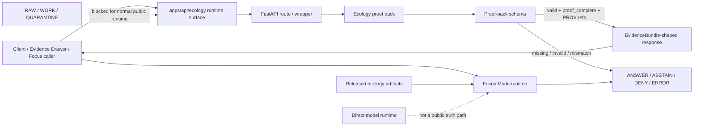

<!-- [KFM_META_BLOCK_V2]
doc_id: kfm://doc/TODO-apps-api-ecology-readme-uuid
title: API Ecology Evidence Runtime
type: standard
version: v1
status: draft
owners: @bartytime4life
created: 2026-04-24
updated: 2026-05-06
policy_label: TODO-NEEDS-VERIFICATION
related: [
  ../README.md,
  ../openapi/README.md,
  tests/README.md,
  ../../../docs/adr/ADR-0202-governed-api-path-canonicalization.md,
  ../../../docs/domains/ecology/RUNBOOK.md,
  ../../../contracts/runtime/ecology_evidencebundle_resolver.md,
  ../../../contracts/runtime/ecology_focus_mode.md,
  ../../../contracts/ui/ecology_evidence_drawer_payload.md,
  ../../../contracts/ui/ecology_maplibre_layer_binding.md,
  ../../../schemas/ecology/ecology_proof_pack.schema.json,
  ../../../schemas/contracts/v1/runtime/runtime_response_envelope.schema.json,
  ../../../tools/validators/ecology/README.md,
  ../../../.github/workflows/verify-runtime.yml
]
tags: [kfm, apps-api, ecology, governed-api, evidencebundle, focus-mode, proof-pack, runtime, cite-or-abstain]
notes: [
  "Owner is grounded in current CODEOWNERS fallback coverage; named domain steward remains NEEDS VERIFICATION.",
  "Policy label remains unresolved until policy registry or document registry confirms classification.",
  "This README documents the current apps/api/ecology surface while preserving ADR-0202 path-canonicalization caution."
]
[/KFM_META_BLOCK_V2] -->

<a id="top"></a>

# API Ecology Evidence Runtime

Evidence-bounded ecology API surface for proof-pack-backed EvidenceBundles and public-safe Focus Mode responses.

<p align="center">
  
  
  
  
  
  
</p>

> [!IMPORTANT]
> **Status:** `experimental`  
> **Owners:** `@bartytime4life` via current CODEOWNERS fallback; ecology-specific steward ownership still `NEEDS VERIFICATION`.  
> **Path:** `apps/api/ecology/README.md`  
> **Role:** app-local ecology API runtime surface for EvidenceBundle resolution and bounded Focus Mode behavior.  
> **Quick jumps:** [Scope](#scope) · [Repo fit](#repo-fit) · [Inputs](#accepted-inputs) · [Exclusions](#exclusions) · [Runtime surface](#runtime-surface) · [Flow](#flow) · [Validation](#validation) · [Definition of done](#definition-of-done) · [Open verification](#open-verification)

> [!WARNING]
> ADR-0202 identifies `apps/governed_api/...` as the canonical governed API implementation home and `apps/governed-api/...` as legacy shim-only. This directory currently carries ecology API implementation files, so changes here must preserve behavior while the `apps/api/...` relationship to the canonical governed API path remains **NEEDS VERIFICATION**.

---

## Scope

`apps/api/ecology/` is the current app-local ecology runtime surface for two trust-critical behaviors:

1. resolving ecology proof packs into runtime EvidenceBundle-shaped responses; and
2. answering bounded Ecology Focus Mode requests from released, public-safe evidence.

This directory is not a source-ingestion lane, not a canonical ecology store, and not a place to publish ecological claims by assertion. Its outward behavior should remain aligned with KFM’s core trust law:

```text
RAW → WORK / QUARANTINE → PROCESSED → CATALOG / TRIPLET → PUBLISHED → governed API → UI / Focus / Evidence Drawer
```

A positive runtime answer is allowed only when evidence is resolved, policy permits release, and the response remains inspectable. Missing proof, unresolved catalog closure, unknown rights, restricted geometry, or broken runtime shape must produce visible `ABSTAIN`, `DENY`, or `ERROR` behavior rather than a persuasive unsupported answer.

[Back to top](#top)

---

## Repo fit

| Relationship | Relative link | Role | Status |
|---|---|---|---|
| Current directory | `apps/api/ecology/` | App-local ecology runtime implementation and README. | **CONFIRMED** |
| Parent API README | [`../README.md`](../README.md) | App-level governed API boundary guidance. | **CONFIRMED** |
| OpenAPI docs | [`../openapi/README.md`](../openapi/README.md) | API contract documentation surface. | **CONFIRMED / verify route coverage** |
| App-local tests | [`tests/README.md`](tests/README.md) | Ecology API and runtime behavior tests. | **CONFIRMED** |
| Path ADR | [`../../../docs/adr/ADR-0202-governed-api-path-canonicalization.md`](../../../docs/adr/ADR-0202-governed-api-path-canonicalization.md) | Canonical/legacy governed API path decision. | **CONFIRMED** |
| Ecology runbook | [`../../../docs/domains/ecology/RUNBOOK.md`](../../../docs/domains/ecology/RUNBOOK.md) | Operator sequence for ecology fixture, release, and Focus checks. | **CONFIRMED** |
| Resolver contract | [`../../../contracts/runtime/ecology_evidencebundle_resolver.md`](../../../contracts/runtime/ecology_evidencebundle_resolver.md) | Semantic contract for proof-pack-backed EvidenceBundle resolution. | **CONFIRMED** |
| Focus contract | [`../../../contracts/runtime/ecology_focus_mode.md`](../../../contracts/runtime/ecology_focus_mode.md) | Semantic contract for bounded ecology Focus Mode. | **CONFIRMED** |
| Proof-pack schema | [`../../../schemas/ecology/ecology_proof_pack.schema.json`](../../../schemas/ecology/ecology_proof_pack.schema.json) | Machine-checkable proof-pack shape used by resolver code. | **CONFIRMED** |
| Runtime envelope schema | [`../../../schemas/contracts/v1/runtime/runtime_response_envelope.schema.json`](../../../schemas/contracts/v1/runtime/runtime_response_envelope.schema.json) | Runtime response schema target. | **CONFIRMED / compatibility NEEDS VERIFICATION** |
| Ecology validators | [`../../../tools/validators/ecology/README.md`](../../../tools/validators/ecology/README.md) | Fail-closed validator lane for ecology candidates and release checks. | **CONFIRMED** |
| Runtime workflow | [`../../../.github/workflows/verify-runtime.yml`](../../../.github/workflows/verify-runtime.yml) | Runtime verification workflow for changed runtime surfaces. | **CONFIRMED / app-local test pickup NEEDS VERIFICATION** |

### Current directory tree

```text
apps/api/ecology/
├── README.md
├── __init__.py
├── app.py
├── evidencebundle_resolver.py
├── fastapi_routes.py
├── focus_mode.py
├── routes.py
└── tests/
    ├── README.md
    ├── test_evidencebundle_resolver.py
    ├── test_fastapi_routes.py
    ├── test_focus_app.py
    ├── test_route_response_contract_schema.py
    ├── test_routes.py
    └── test_runtime_envelope_compatibility.py
```

> [!NOTE]
> The visible files are current repository evidence. Runtime deployment, branch-protection enforcement, and successful CI execution still require run evidence.

[Back to top](#top)

---

## Accepted inputs

Only governed, reviewable runtime inputs belong in this surface.

| Input | Accepted when | Required behavior |
|---|---|---|
| `candidate_id` | It names an ecology candidate whose proof pack can be looked up. | Resolve proof pack or return `abstain`. |
| Optional `spec_hash` | Caller expects deterministic proof-pack identity. | Mismatch returns `abstain`; never silently answer. |
| Ecology proof pack | It validates against the proof-pack schema and has `status: proof_complete`. | Build a cite-capable EvidenceBundle response. |
| Receipt summaries | They are declared inside the proof pack. | Include only when requested and safe to expose. |
| Catalog refs | `dcat`, `stac`, and especially `prov` refs are present. | Missing required refs block citation. |
| Focus request payload | It describes a public-surface, evidence-bounded request. | Produce finite `ANSWER`, `ABSTAIN`, `DENY`, or `ERROR`. |
| Released ecology artifacts | They come from public-safe `data/processed`, `data/triplets`, and `data/published` ecology lanes. | Use as context only through governed runtime logic. |
| Synthetic/no-network fixtures | They prove valid and invalid behavior. | Keep test data public-safe and deterministic. |

[Back to top](#top)

---

## Exclusions

| Does not belong here | Goes instead | Why |
|---|---|---|
| Live source fetching | `pipelines/`, `connectors/`, or source-specific watcher lanes | API runtime must not become ingestion. |
| RAW, WORK, or QUARANTINE access for normal public clients | `data/raw/`, `data/work/`, `data/quarantine/` plus pipeline validators | Public runtime must not bypass lifecycle gates. |
| Canonical ecology records | Domain data/model packages and processed/catalog lanes | This surface resolves evidence; it does not own root truth. |
| Proof-pack construction | `tools/proofs/` or validator/proof builder lanes | Runtime consumes proof packs; it does not mint them ad hoc. |
| Policy source of truth | `policy/` and policy validators | API code enforces policy; it does not redefine it. |
| Map style, tile, or renderer logic | Map/UI delivery surfaces | MapLibre is a downstream renderer, not evidence authority. |
| Free-form AI claims | Governed AI / Focus contracts after EvidenceBundle resolution | Model text is interpretive and subordinate to evidence. |
| Exact sensitive species locations | Restricted lifecycle lanes with geoprivacy review | Public exposure fails closed without steward-reviewed transform. |

[Back to top](#top)

---

## Runtime surface

### Declared API endpoints

| Endpoint | Declared in | Purpose | Runtime posture |
|---|---|---|---|
| `GET /v1/ecology/evidence-bundles/{candidate_id}` | [`fastapi_routes.py`](fastapi_routes.py) | Resolve an ecology proof pack into a cite/abstain response. | EvidenceBundle resolver boundary. |
| `POST /ecology/focus` | [`app.py`](app.py) | Answer a bounded Ecology Focus Mode request. | Public-surface Focus runtime; finite outcomes. |

### Main modules

| Module | Responsibility | Must not do |
|---|---|---|
| [`evidencebundle_resolver.py`](evidencebundle_resolver.py) | Load proof pack, validate schema, compare `spec_hash`, require PROV refs, emit cite/abstain responses. | Fetch live sources, invent support, or expose restricted material. |
| [`routes.py`](routes.py) | Route-adjacent wrapper with include/exclude flags for receipts, catalog refs, and uncertainty. | Override resolver decisions. |
| [`fastapi_routes.py`](fastapi_routes.py) | FastAPI router for `GET /v1/ecology/evidence-bundles/{candidate_id}`. | Treat transport success as evidence success. |
| [`focus_mode.py`](focus_mode.py) | No-network Ecology Focus runtime over released ecology artifacts. | Use non-public surfaces, unknown rights, restricted exact geometry, or missing evidence as answerable context. |
| [`app.py`](app.py) | FastAPI app declaration and Focus endpoint wrapper. | Hide runtime failures as supported claims. |

### Resolver decisions

| Condition | Expected decision | Reason / code |
|---|---|---|
| Proof pack missing | `abstain` | `proof_pack_missing` / `ECO_EB_PROOF_PACK_MISSING` |
| Malformed or non-object proof pack | `abstain` | `proof_pack_invalid` / `ECO_EB_PROOF_PACK_INVALID` |
| Schema validation failure | `abstain` | `proof_pack_invalid` |
| `spec_hash` mismatch | `abstain` | `spec_hash_mismatch` / `ECO_EB_SPEC_HASH_MISMATCH` |
| `status` not `proof_complete` | `abstain` | `proof_pack_invalid` |
| Required PROV catalog refs missing | `abstain` | `catalog_refs_unresolved` or schema-invalid, depending on validator path |
| Valid proof pack with required refs | `cite` | Build resolved EvidenceBundle response |

### Focus outcomes

| Outcome | Use when |
|---|---|
| `ANSWER` | Public release exists, policy-safe decision exists, matching claim resolves, and claim support is not overstated. |
| `ABSTAIN` | Evidence is missing, release manifest is absent, requested evidence is unresolved, or no matching claim exists. |
| `DENY` | Surface is non-public, rights are unknown, policy label blocks publication, or sensitive exact geometry is requested. |
| `ERROR` | Runtime shape or execution fails before a reliable governed outcome can be emitted. |

[Back to top](#top)

---

## Flow



The diagram is intentionally narrow: this directory sits downstream of source admission, validation, catalog closure, and publication. It should make evidence state visible; it should not create evidence state casually.

[Back to top](#top)

---

## Quickstart

Run from repository root.

```bash
python -m pytest -q apps/api/ecology/tests
```

Run the ecology operator gates in the order documented by the runbook:

```bash
tools/validators/ecology/run_ecology_fixture_checks.sh
tools/validators/ecology/run_ecology_release_checks.sh
tools/validators/ecology/run_ecology_focus_mode_checks.sh
```

Run path-canonicalization policy when touching governed API path names or compatibility shims:

```bash
python3 tools/ci/check_governed_api_path_policy.py --root .
```

> [!CAUTION]
> The local test command is valid as an app-local target, but CI pickup for `apps/api/ecology/tests` should be verified separately. The runtime workflow watches `apps/api/**`, yet its discovered pytest targets are primarily under `tests/` and explicit runtime-proof lists.

[Back to top](#top)

---

## Validation

### Required checks before claiming behavior is release-ready

| Check | Command or evidence | Passing signal |
|---|---|---|
| Proof-pack resolver tests | `python -m pytest -q apps/api/ecology/tests/test_evidencebundle_resolver.py` | Valid proof packs cite; missing/invalid proof packs abstain. |
| Route wrapper tests | `python -m pytest -q apps/api/ecology/tests/test_routes.py` | Missing proof pack returns governed abstain. |
| FastAPI route tests | `python -m pytest -q apps/api/ecology/tests/test_fastapi_routes.py` | Route registers and returns finite resolver payload. |
| Focus app tests | `python -m pytest -q apps/api/ecology/tests/test_focus_app.py` | Focus endpoint returns runtime response or wraps runtime error. |
| Runtime envelope compatibility | `python -m pytest -q apps/api/ecology/tests/test_runtime_envelope_compatibility.py` | Resolver output aligns with runtime envelope schema. |
| Ecology runbook gates | `tools/validators/ecology/run_ecology_*_checks.sh` | Fixture, release, and Focus gates complete in order. |
| Path policy | `python3 tools/ci/check_governed_api_path_policy.py --root .` | Canonical/legacy governed API path policy passes. |
| CI workflow | `.github/workflows/verify-runtime.yml` run evidence | Runtime-relevant changes have tests or actual-response proof. |

### Known reconciliation items

| Item | Why it matters |
|---|---|
| `apps/api/ecology` vs `apps/governed_api/ecology` | ADR-0202 names `apps/governed_api` canonical, but current app-local files are under `apps/api/ecology`. |
| App-local imports | Tests and app code reference `apps.governed_api.ecology`; confirm aliasing, migration, or package-path strategy before claiming tests are green. |
| Runtime envelope schema | Current resolver responses use `status` / `data` / `meta`; confirm compatibility with the runtime envelope schema before calling this a stable envelope. |
| FastAPI dependency | FastAPI tests skip when FastAPI is unavailable; dependency policy should be explicit if the endpoint is release-significant. |
| CI discovery | Verify app-local ecology tests are actually included in required checks or mirrored under the repo’s runtime-proof test home. |

[Back to top](#top)

---

## Change discipline

When editing this directory:

1. Preserve cite-or-abstain behavior before improving response polish.
2. Keep proof-pack validation ahead of any public `cite` decision.
3. Keep Focus Mode no-network unless a governed adapter and policy gate are explicitly added.
4. Do not add source fetches, raw-store reads, or direct model calls.
5. Add negative fixtures for every new positive behavior.
6. Keep relative links aligned with adjacent docs and contracts.
7. Update this README when route behavior, proof-pack schema, Focus behavior, or path ownership changes.

> [!TIP]
> A visible `ABSTAIN` or `DENY` is a successful trust outcome when evidence, rights, sensitivity, or release state is unresolved.

[Back to top](#top)

---

## Definition of done

A change to `apps/api/ecology/` is review-ready when:

- [ ] The target path and any migration relationship to `apps/governed_api/ecology` are documented.
- [ ] Proof-pack resolver tests pass for cite and abstain cases.
- [ ] `spec_hash` mismatch, invalid JSON, invalid schema, missing proof pack, and missing catalog support remain negative paths.
- [ ] Focus Mode tests prove public-safe `ANSWER`, `ABSTAIN`, `DENY`, and error-wrapping behavior where applicable.
- [ ] No normal public runtime path reads `RAW`, `WORK`, `QUARANTINE`, restricted canonical stores, graph internals, or direct source APIs.
- [ ] No browser or public client path calls a model runtime directly.
- [ ] Runtime envelope compatibility is either passing or clearly marked as `NEEDS VERIFICATION`.
- [ ] Ecology operator runbook gates are green or blocked with a recorded reason.
- [ ] CI includes the changed runtime surface or a reviewer-visible waiver explains why not.
- [ ] Evidence Drawer / Focus consumers receive enough evidence, policy, uncertainty, and negative-state context to stay inspectable.
- [ ] Corrections or rollback impacts are documented when published ecology artifacts or runtime response shapes change.
- [ ] Meta block values, owners, policy label, and related links are updated when registry evidence becomes available.

[Back to top](#top)

---

## FAQ

### Is this the canonical governed API home?

Not by itself. ADR-0202 names `apps/governed_api/...` as the canonical governed API implementation home. This directory is the current `apps/api/ecology` surface and must be reconciled with that ADR before stronger path-canonicalization claims are made.

### Can this API return an answer when a proof pack is missing?

No. The resolver should return `abstain` for missing or invalid proof support.

### Can Focus Mode infer ecological causes from nearby layers?

No. Focus Mode may summarize released evidence. It must not turn association, habitat context, or model output into unsupported causal truth.

### Can a map layer prove an ecology claim?

No. A map layer may point to evidence, but the claim still needs EvidenceBundle support and governed runtime behavior.

### Why is PROV required?

PROV references help keep catalog and provenance closure visible. Without provenance, a response can look supported while losing the trail that makes it inspectable.

[Back to top](#top)

---

## Open verification

| Item | Status | Close when |
|---|---|---|
| Stable `doc_id` | `NEEDS VERIFICATION` | Document registry assigns a durable KFM doc id. |
| Policy label | `NEEDS VERIFICATION` | Policy/document registry confirms public/restricted/internal label. |
| Ecology steward ownership | `NEEDS VERIFICATION` | CODEOWNERS or governance registry narrows ownership beyond fallback owner. |
| Path canonicalization | `NEEDS VERIFICATION` | `apps/api/ecology`, `apps/governed_api/ecology`, and any legacy shim roles are resolved by ADR/migration evidence. |
| App-local import strategy | `NEEDS VERIFICATION` | Imports, package paths, and tests resolve consistently in CI. |
| Runtime envelope schema match | `NEEDS VERIFICATION` | Resolver and Focus payloads validate against the active schema. |
| CI coverage for this test directory | `NEEDS VERIFICATION` | Required workflow run demonstrates app-local ecology tests are included or mirrored. |
| Public release readiness | `NEEDS VERIFICATION` | Proof packs, catalog refs, policy checks, release manifests, and rollback targets are verified in a release run. |

[Back to top](#top)
