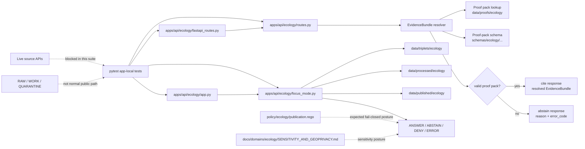

<!-- [KFM_META_BLOCK_V2]
doc_id: kfm://doc/NEEDS-VERIFICATION-apps-api-ecology-tests-readme
title: Ecology API Tests
type: standard
version: v1
status: draft
owners: <NEEDS_VERIFICATION_OWNER>
created: 2026-04-24
updated: 2026-05-06
policy_label: NEEDS_VERIFICATION
related: [../README.md, ../../README.md, ../../openapi/ecology.yaml, ../../../../docs/adr/ADR-0202-governed-api-path-canonicalization.md, ../../../../docs/adr/ADR-0001-schema-home.md, ../../../../docs/domains/ecology/SENSITIVITY_AND_GEOPRIVACY.md, ../../../../policy/ecology/publication.rego, ../../../../schemas/ecology/ecology_proof_pack.schema.json, ../../../../schemas/contracts/v1/runtime/runtime_response_envelope.schema.json]
tags: [kfm, ecology, api, governed-api, tests, pytest, evidencebundle, focus-mode, runtime-envelope, cite-or-abstain, geoprivacy]
notes: [Target file path is confirmed as apps/api/ecology/tests/README.md in the accessible repository. Owners and policy label still need authoritative repo verification. The physical apps/api path and imported apps.governed_api namespace remain a documented path-governance verification item.]
[/KFM_META_BLOCK_V2] -->

<a id="top"></a>

# Ecology API Tests

App-local tests for the ecology API trust boundary: proof-pack resolution, cite-or-abstain behavior, FastAPI route wiring, Focus Mode envelopes, and schema compatibility.

<div align="left">


</div>

| Field | Value |
|---|---|
| **Status** | `experimental` |
| **Owners** | `<NEEDS_VERIFICATION_OWNER>` |
| **Path** | `apps/api/ecology/tests/README.md` |
| **Repo fit** | app-local pytest suite for ecology API behavior and governed runtime seams |
| **Quick jumps** | [Scope](#scope) · [Repo fit](#repo-fit) · [Accepted inputs](#accepted-inputs) · [Exclusions](#exclusions) · [Directory tree](#directory-tree) · [Quickstart](#quickstart) · [Usage](#usage) · [Diagram](#diagram) · [Test matrix](#test-matrix) · [Definition of done](#definition-of-done) · [FAQ](#faq) · [Appendix](#appendix) |

> [!IMPORTANT]
> These tests are part of the trust membrane. They should prove that ecology API responses are bounded by evidence, policy, release state, schema shape, and finite runtime outcomes. They must not become a second source of ecological truth.

> [!WARNING]
> The target file lives under `apps/api/ecology/tests/`, while several test modules import `apps.governed_api.ecology`. That mismatch is a **NEEDS VERIFICATION** path-governance item. Do not “fix” it from this README alone; check the accepted ADR, import shims, CI path-policy checker, and active package layout first.

---

## Scope

This directory covers app-local tests for ecology API behavior that is close to route/runtime code.

It focuses on four seams:

1. **EvidenceBundle resolution** from ecology proof packs.
2. **Cite-or-abstain responses** when proof packs are complete, missing, malformed, stale, or mismatched.
3. **FastAPI route behavior** for ecology evidence-bundle and Focus Mode endpoints.
4. **Schema/runtime compatibility** for response envelopes and route payloads.

The tests should preserve KFM’s operating law:

```text
RAW -> WORK / QUARANTINE -> PROCESSED -> CATALOG / TRIPLET -> PUBLISHED -> governed API -> trust-visible UI
```

### What this suite should prove

| Proof burden | Current local expression |
|---|---|
| Missing proof packs do not produce unsupported claims. | Resolver and route tests expect `abstain` with reason/error code. |
| Valid proof packs can produce a citeable response. | Resolver tests synthesize a proof pack with receipts and PROV refs. |
| FastAPI ecology evidence-bundle route is registered. | Route adapter test calls `/v1/ecology/evidence-bundles/{candidate_id}`. |
| Focus Mode is bounded by the API runtime boundary. | Focus app tests call `/ecology/focus` and assert runtime/error wrapping. |
| Runtime payloads stay schema-compatible. | Runtime-envelope and route-response schema tests validate payload shape. |

> [!NOTE]
> This README documents the test boundary. It does not claim that CI currently blocks merges, that every referenced schema exists, or that runtime deployment is active.

[Back to top](#top)

---

## Repo fit

`apps/api/ecology/tests/` sits next to the ecology API implementation and below broader app/API, schema, policy, and documentation control surfaces.

| Relationship | Relative link | Role | Status |
|---|---|---|---|
| Parent ecology API README | [`../README.md`](../README.md) | Documents ecology EvidenceBundle resolver and API boundary. | **CONFIRMED file** |
| Parent API README | [`../../README.md`](../../README.md) | Describes governed API posture, route-family expectations, and finite outcomes. | **CONFIRMED file** |
| Ecology OpenAPI contract | [`../../openapi/ecology.yaml`](../../openapi/ecology.yaml) | Documents ecology layer, time-slice, evidence, and STAC routes. | **CONFIRMED file** |
| Ecology route wrapper | [`../routes.py`](../routes.py) | Calls the EvidenceBundle resolver and applies include/exclude response flags. | **CONFIRMED file** |
| FastAPI adapter | [`../fastapi_routes.py`](../fastapi_routes.py) | Registers `/v1/ecology/evidence-bundles/{candidate_id}`. | **CONFIRMED file** |
| EvidenceBundle resolver | [`../evidencebundle_resolver.py`](../evidencebundle_resolver.py) | Loads proof packs, validates schema, returns cite or abstain responses. | **CONFIRMED file** |
| Focus Mode runtime | [`../focus_mode.py`](../focus_mode.py) | Reads released ecology artifacts and emits finite Focus Mode outcomes. | **CONFIRMED file** |
| FastAPI app | [`../app.py`](../app.py) | Includes ecology router and exposes `/ecology/focus`. | **CONFIRMED file** |
| Governed API path ADR | [`../../../../docs/adr/ADR-0202-governed-api-path-canonicalization.md`](../../../../docs/adr/ADR-0202-governed-api-path-canonicalization.md) | Decides canonical `apps/governed_api/...` path and legacy shim posture. | **CONFIRMED file / path relationship still needs verification** |
| Schema-home ADR | [`../../../../docs/adr/ADR-0001-schema-home.md`](../../../../docs/adr/ADR-0001-schema-home.md) | Proposes `schemas/contracts/v1/` for machine-checkable contract schemas. | **CONFIRMED file / decision still proposed** |
| Ecology geoprivacy doc | [`../../../../docs/domains/ecology/SENSITIVITY_AND_GEOPRIVACY.md`](../../../../docs/domains/ecology/SENSITIVITY_AND_GEOPRIVACY.md) | Defines public/generalize/restricted/review-required sensitivity posture. | **CONFIRMED file** |
| Ecology publication policy | [`../../../../policy/ecology/publication.rego`](../../../../policy/ecology/publication.rego) | Fail-closed public publication policy for ecology objects. | **CONFIRMED file** |

### Upstream

These tests consume or mirror expectations from schemas, proof packs, policy, OpenAPI contracts, sensitivity docs, and route/runtime code.

### Downstream

Passing tests should give maintainers review evidence that the ecology API does not produce public-facing ecological claims without proof-pack closure, schema compatibility, policy-safe status, and governed runtime outcomes.

[Back to top](#top)

---

## Accepted inputs

Only small, deterministic, reviewable test inputs belong here.

| Accepted input | Belongs here when | Required posture |
|---|---|---|
| Synthetic proof-pack JSON | It is created inside a test temporary directory. | Must include required receipts, catalog refs, status, candidate ID, and `spec_hash`. |
| Minimal proof-pack schema | It is scoped to resolver behavior in a test. | Must be explicit about required fields and negative cases. |
| Missing proof-pack candidate IDs | They exercise abstention behavior. | Must assert reason and error code. |
| Malformed or non-object JSON | It exercises invalid proof-pack handling. | Must produce `abstain`, not an exception surfaced as a claim. |
| Spec-hash mismatch inputs | They prove deterministic identity checks matter. | Must produce `ECO_EB_SPEC_HASH_MISMATCH` or equivalent governed negative state. |
| FastAPI test clients | They call local route adapters without live source access. | FastAPI availability may be optional via `pytest.importorskip`. |
| Runtime-envelope fixtures | They validate response compatibility with machine schemas. | Schema path and payload shape must be verified before claiming CI enforcement. |
| Monkeypatched Focus Mode responses | They isolate API app error wrapping and route behavior. | Must not call a model provider or live ecological source. |

[Back to top](#top)

---

## Exclusions

| Does **not** belong here | Goes instead | Reason |
|---|---|---|
| Live GBIF, eBird, iNaturalist, KDWP, NatureServe, USFWS, NLCD, LANDFIRE, NWI, HLS, or provider fetches | `pipelines/`, connector tests, or source-specific integration suites | App-local tests should remain no-network by default. |
| RAW, WORK, or QUARANTINE payloads | `data/raw/`, `data/work/`, `data/quarantine/`, or controlled fixture lanes | Public API tests must not normalize pre-publication access. |
| Canonical ecological records | Domain data lifecycle roots | Tests prove behavior; they do not store truth. |
| Production proof packs | `data/proofs/ecology/` | Tests may synthesize proof packs, but production proof custody belongs in data/proof lanes. |
| Production receipts | `data/receipts/` | Tests may use tiny synthetic receipt snippets only. |
| Policy source of truth | `policy/ecology/` | Tests assert policy behavior; they do not govern it. |
| Machine-schema source of truth | `schemas/` or ADR-confirmed schema home | Tests consume schemas; they do not define schema authority. |
| UI rendering tests | `apps/web/`, `apps/ui/`, or E2E/UI test lanes | This suite validates API payload behavior, not visual rendering. |
| Free-form AI/model outputs | Governed AI runtime tests with receipts and citation validation | Focus Mode remains evidence-bounded and finite-outcome. |

[Back to top](#top)

---

## Directory tree

**CONFIRMED in accessible repository search:** the current app-local ecology test directory contains this README plus six pytest files.

```text
apps/api/ecology/tests/
├── README.md
├── test_evidencebundle_resolver.py
├── test_fastapi_routes.py
├── test_focus_app.py
├── test_route_response_contract_schema.py
├── test_routes.py
└── test_runtime_envelope_compatibility.py
```

Nearby implementation files tested by this directory:

```text
apps/api/ecology/
├── __init__.py
├── app.py
├── evidencebundle_resolver.py
├── fastapi_routes.py
├── focus_mode.py
├── routes.py
└── tests/
```

> [!CAUTION]
> The file tree above is a repository snapshot from the accessible GitHub connector. Re-check the active branch before using it as merge evidence.

[Back to top](#top)

---

## Quickstart

Run from the repository root after checking out the active branch.

```bash
git status --short
git branch --show-current
```

Run the app-local ecology API tests:

```bash
python -m pytest apps/api/ecology/tests -q
```

Run the resolver-focused tests:

```bash
python -m pytest apps/api/ecology/tests/test_evidencebundle_resolver.py -q
```

Run the FastAPI-related tests:

```bash
python -m pytest \
  apps/api/ecology/tests/test_fastapi_routes.py \
  apps/api/ecology/tests/test_focus_app.py \
  -q
```

Run schema/runtime compatibility tests:

```bash
python -m pytest \
  apps/api/ecology/tests/test_route_response_contract_schema.py \
  apps/api/ecology/tests/test_runtime_envelope_compatibility.py \
  -q
```

> [!WARNING]
> Some tests depend on optional packages such as `fastapi`, `fastapi.testclient`, or `jsonschema`. Do not interpret skipped tests as proof of runtime enforcement.

### Quick health checks before editing

```bash
find apps/api/ecology -maxdepth 3 -type f | sort
find schemas policy docs/adr docs/domains/ecology -maxdepth 4 -type f 2>/dev/null | sort
grep -RInE 'GBIF|eBird|iNaturalist|NatureServe|KDWP|USFWS|requests\.|httpx\.|urllib' apps/api/ecology/tests || true
```

[Back to top](#top)

---

## Usage

### Add or revise a test

1. Identify the trust seam: resolver, route wrapper, FastAPI adapter, Focus Mode app, schema contract, or runtime envelope.
2. Add one positive case and at least one negative case where practical.
3. Use synthetic, local-only inputs.
4. Assert the governed result explicitly: `cite`, `abstain`, `ANSWER`, `ABSTAIN`, `DENY`, or `ERROR`.
5. Preserve reason codes for negative outcomes.
6. Avoid live source calls and provider calls.
7. Update this README if a new test family, route, schema, or proof object becomes part of the suite.

### Naming guidance

| Prefer | Avoid |
|---|---|
| `test_resolver_abstains_on_spec_hash_mismatch` | `test_bad_hash` |
| `test_focus_app_wraps_runtime_errors` | `test_exception` |
| `test_route_cite_payload_matches_contract_schema` | `test_schema` |
| `test_abstain_response_matches_runtime_envelope` | `test_payload` |

### Keep tests local

These tests should not fetch source systems, invoke model runtimes, generate production proofs, or mutate lifecycle data. They should create temporary proof-pack and schema files where they need controlled behavior.

[Back to top](#top)

---

## Diagram



The suite should keep the outward contract clear: a missing or invalid proof path is not an invitation to improvise; it is a governed negative result.

[Back to top](#top)

---

## Test matrix

| Test file | Current proof burden | Key expected behavior | Review pressure |
|---|---|---|---|
| `test_evidencebundle_resolver.py` | Pure resolver behavior over synthetic proof packs and schemas. | Valid proof pack returns `decision: cite`; missing, malformed, non-object, schema-failed, mismatched, missing-PROV, or incomplete-status proof packs return `decision: abstain`. | Keep negative cases broad and explicit. |
| `test_routes.py` | Route-adjacent wrapper defaults and missing proof-pack behavior. | `DEFAULT_SCHEMA_PATH` exists; missing candidate abstains with `ECO_EB_PROOF_PACK_MISSING`. | Confirm default schema path stays valid. |
| `test_fastapi_routes.py` | FastAPI router registration for evidence bundles. | `/v1/ecology/evidence-bundles/not_found` returns `200` with `decision: abstain`. | Confirm route remains intentional and documented in OpenAPI if public. |
| `test_focus_app.py` | FastAPI app boundary for Focus Mode. | `/ecology/focus` returns runtime payload from `answer_focus_request`; runtime exceptions become HTTP `500`. | Confirm runtime errors do not leak sensitive details in production mode. |
| `test_route_response_contract_schema.py` | Route response schema compatibility. | Cite and abstain payloads match expected contract; missing `candidate_id` is rejected. | Verify referenced response schema exists and is authoritative. |
| `test_runtime_envelope_compatibility.py` | Runtime envelope compatibility for resolver outputs. | Cite and abstain resolver payloads validate against the runtime envelope schema. | Reconcile runtime schema requirements with actual resolver payload fields. |

### Known verification pressure

| Item | Status | Why it matters |
|---|---:|---|
| Physical path vs import namespace | **NEEDS VERIFICATION** | Tests import `apps.governed_api.ecology`, while the target files are under `apps/api/ecology`. This must be resolved through path policy, package shims, or migration notes. |
| `schemas/contracts/v1/runtime/ecology_evidence_bundle_response.schema.json` | **NEEDS VERIFICATION** | A test references this path. Confirm it exists or update the test/contract path before claiming jsonschema-backed enforcement. |
| `schemas/contracts/v1/runtime/runtime_response_envelope.schema.json` | **NEEDS VERIFICATION** | Runtime envelope tests depend on the schema matching resolver payloads. |
| CI workflow coverage | **UNKNOWN** | File-level tests exist, but merge-blocking workflow enforcement was not verified in this README pass. |
| Owner and policy label | **NEEDS VERIFICATION** | Meta block placeholders should be replaced from CODEOWNERS or a repo governance register. |

[Back to top](#top)

---

## Definition of done

A change touching `apps/api/ecology/tests/` is review-ready when the relevant boxes are true.

- [ ] Tests run locally with the repo-native Python environment.
- [ ] Optional-dependency skips are understood and documented in PR notes.
- [ ] No default app-local test uses live network access.
- [ ] No default app-local test reads RAW, WORK, or QUARANTINE as a normal public path.
- [ ] Positive resolver cases require complete synthetic proof packs.
- [ ] Negative resolver cases preserve governed reasons and error codes.
- [ ] FastAPI route tests are aligned with the documented OpenAPI route family or deliberately marked test-only.
- [ ] Focus Mode tests assert finite outcomes or explicit HTTP error behavior.
- [ ] Schema paths referenced by tests are confirmed or marked for correction.
- [ ] Runtime-envelope tests match the current canonical schema, not stale assumptions.
- [ ] Ecology sensitivity and publication policy expectations are not weakened.
- [ ] Path-governance impact is checked when imports or app paths change.
- [ ] README related links, meta block placeholders, and test matrix entries are updated with behavior changes.

[Back to top](#top)

---

## FAQ

### Can these tests call live ecology sources?

No. Keep default app-local tests no-network. Live source behavior belongs in source connector or integration suites with rights, credentials, fixture replay, and policy gates.

### Why does a missing proof pack return `abstain` instead of `404`?

The resolver-level contract treats missing proof evidence as an evidence-resolution outcome. HTTP route behavior may still be revised, but the current tested behavior is cite-or-abstain inside the response payload.

### Are synthetic proof packs authoritative?

No. Synthetic proof packs are fixtures used to prove behavior. They do not become production evidence, release proofs, or canonical ecology records.

### Can Focus Mode answer without evidence?

Focus Mode should remain bounded by released, policy-safe evidence. Tests may monkeypatch its function to isolate FastAPI behavior, but production behavior should not bypass evidence and policy checks.

### Should this README resolve `apps/api` vs `apps/governed_api`?

No. This README records the mismatch and points reviewers to the ADR and path-policy checks. Code movement or import canonicalization requires repo-wide verification.

[Back to top](#top)

---

## Appendix

<details>
<summary><strong>Glossary</strong></summary>

| Term | Meaning in this directory |
|---|---|
| `candidate_id` | Resolver input used to locate an ecology proof pack. |
| Proof pack | Test or production object expected to contain candidate metadata, `spec_hash`, receipts, catalog refs, generated time, and complete proof status. |
| `spec_hash` | Deterministic identity check used to detect mismatch between request and proof material. |
| `cite` | Resolver decision for complete, valid, catalog-backed proof material. |
| `abstain` | Resolver decision for missing, invalid, mismatched, incomplete, or unresolved proof material. |
| Runtime envelope | Governed response shape expected to remain finite, inspectable, and schema-compatible. |
| Focus Mode | Evidence-bounded synthesis endpoint; not a free-form ecological truth source. |
| Geoprivacy | Publication-safe handling of sensitive ecological geometry and location precision. |

</details>

<details>
<summary><strong>Open verification backlog</strong></summary>

- Replace `doc_id` with a registry-backed identifier.
- Confirm owner from CODEOWNERS, governance register, or maintainer assignment.
- Confirm `policy_label`.
- Confirm whether this suite is expected to live permanently under `apps/api/ecology/tests/`.
- Confirm import namespace behavior for `apps.governed_api.ecology`.
- Confirm whether ADR-0202’s canonical path decision has been enforced for ecology API runtime code.
- Confirm existence and authority of `schemas/contracts/v1/runtime/ecology_evidence_bundle_response.schema.json`.
- Confirm runtime response schema compatibility with resolver outputs.
- Confirm CI workflow names and whether this test directory is merge-blocking.
- Confirm whether OpenAPI route paths and implemented FastAPI paths intentionally differ.
- Confirm production error-wrapping behavior for `/ecology/focus`.

</details>

[Back to top](#top)
