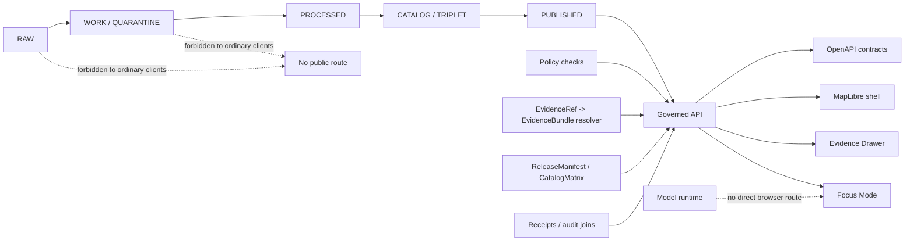
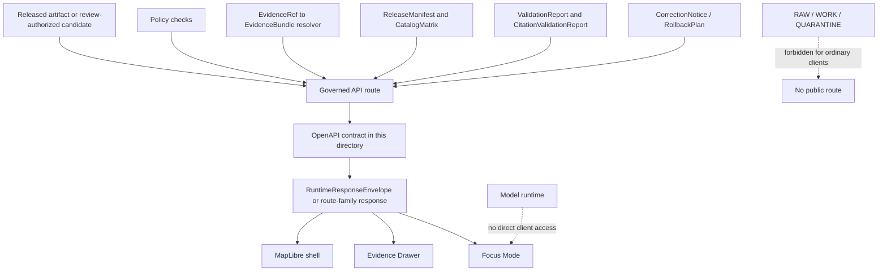

<!-- [KFM_META_BLOCK_V2]
doc_id: kfm://doc/TODO-governed-api-openapi-readme-uuid-NEEDS-VERIFICATION
title: Governed API OpenAPI
type: standard
version: v1
status: draft
owners: TODO-governed-api-owner-NEEDS-VERIFICATION
created: TODO-created-date-NEEDS-VERIFICATION
updated: 2026-04-29
policy_label: TODO-policy-label-NEEDS-VERIFICATION
related: [../README.md, ./, TODO-related-docs-NEEDS-VERIFICATION]
tags: [kfm, governed-api, openapi, contracts, evidence-bundle, decision-envelope, runtime-response-envelope, finite-outcomes]
notes: [Child README for apps/governed_api/openapi/README.md, updated to align with the parent Governed API README. Repo evidence mode remains CORPUS_ONLY / NO_LOCAL_REPO_EVIDENCE; target repo path, owner, policy label, adjacent files, schema home, OpenAPI target version, validator commands, routes, and CI remain NEEDS VERIFICATION.]
[/KFM_META_BLOCK_V2] -->

<a id="top"></a>

# Governed API OpenAPI

<p align="center">
  <strong>Contract surface for evidence-resolving, policy-aware KFM API envelopes.</strong><br>
  Kansas Frontier Matrix · evidence-first · map-first · time-aware · governed
</p>

<p align="center">
  
  
  
  
  
</p>

<p align="center">
  <a href="#overview">Overview</a> ·
  <a href="#scope">Scope</a> ·
  <a href="#parent-boundary-relationship">Parent boundary</a> ·
  <a href="#repo-fit">Repo fit</a> ·
  <a href="#accepted-inputs">Inputs</a> ·
  <a href="#exclusions">Exclusions</a> ·
  <a href="#directory-map">Tree</a> ·
  <a href="#route-families">Routes</a> ·
  <a href="#spec-rules">Rules</a> ·
  <a href="#validation">Validation</a> ·
  <a href="#task-list--definition-of-done">Definition of done</a>
</p>

> [!IMPORTANT]
> This README is repo-ready OpenAPI contract guidance, not proof of current implementation. Treat paths, route names, schema references, validator commands, owners, CI behavior, OpenAPI target version, and runtime behavior below as `PROPOSED`, `UNKNOWN`, or `NEEDS VERIFICATION` until checked against the live repository.

| Field | Value |
|---|---|
| Status | `draft` |
| Intended path | `apps/governed_api/openapi/README.md` — `NEEDS VERIFICATION` |
| Document role | Child directory README for governed OpenAPI contracts |
| Evidence mode | `CORPUS_ONLY / NO_LOCAL_REPO_EVIDENCE` |
| Owners | `TODO-governed-api-owner-NEEDS-VERIFICATION` |
| Policy label | `TODO-policy-label-NEEDS-VERIFICATION` |
| Parent boundary | `../README.md` — `NEEDS VERIFICATION` |
| Public posture | Cite-or-abstain; fail closed on unresolved rights, sensitivity, review state, release state, or source authority |
| Implementation posture | Contract-first, evidence-resolving, policy-aware, rollback-capable |

---

## Overview

OpenAPI in KFM exists to make the governed API boundary inspectable. It describes how clients request released or review-authorized KFM outputs and how those outputs return evidence, policy, release, freshness, correction, rollback, and audit context.

It does **not** make OpenAPI the source of truth.

| What this document does | What it does not do |
|---|---|
| Defines the expected OpenAPI role for governed API surfaces. | Does not prove the target directory exists. |
| Lists accepted spec inputs, exclusions, route families, metadata expectations, validation gates, and rollback concerns. | Does not authorize public release or bypass promotion gates. |
| Preserves finite outcomes: `ANSWER`, `ABSTAIN`, `DENY`, `ERROR`. | Does not replace canonical schemas, `EvidenceBundle` resolution, policy checks, or review artifacts. |
| Provides a review-ready checklist for future specs. | Does not claim routes, DTOs, tests, workflows, owners, or clients are implemented. |

Core obligation:

> OpenAPI describes how clients reach governed evidence. It must not become a shortcut around evidence, policy, release state, review state, sensitivity handling, source authority, or correction lineage.

<p align="right"><a href="#top">Back to top ↑</a></p>

---

## Scope

This directory is the proposed OpenAPI contract surface for the governed API.

It should describe the governed API boundary where public, reviewer, Focus Mode, Evidence Drawer, export, map, and stewardship clients receive typed responses from released or review-authorized KFM artifacts.

This directory is in scope for:

- KFM-specific OpenAPI specs for route families not fully covered by external standards.
- Operation examples for finite runtime outcomes: `ANSWER`, `ABSTAIN`, `DENY`, `ERROR`.
- Response envelopes that expose evidence, policy, freshness, release state, correction state, and audit linkage.
- Internal or stewardship API descriptions when visibly separated from public route families.
- Compatibility notes, deprecation notes, version-pinning notes, and rollback references for API contracts.
- Contract-level metadata that lets reviewers ask: **what claim is exposed, what evidence supports it, what policy can block it, what failure looks like, and what can be rolled back?**

This directory is not a canonical truth store. It is a reviewable interface layer over the governed truth path.

<p align="right"><a href="#top">Back to top ↑</a></p>

---

## Parent boundary relationship

The parent governed API README owns the trust-boundary law. This OpenAPI README owns the contract-file discipline.

| Parent README should cover | This child README should cover |
|---|---|
| Public clients cross governed interfaces, not raw/canonical stores. | Spec-file naming, examples, OpenAPI target version, `$ref` strategy, and operation metadata. |
| Evidence, policy, release, review, Focus Mode, export, and rollback posture. | How those postures appear in OpenAPI operations and examples. |
| Route-family responsibilities and runtime outcomes. | How route families are grouped, described, linted, and referenced. |
| No direct model-client and no raw-public-path gates. | How specs avoid documenting bypass routes. |

If the live repo proves a different documentation split, record the decision in an ADR and update both READMEs together.

<p align="right"><a href="#top">Back to top ↑</a></p>

---

## Trust boundary

OpenAPI belongs downstream of KFM governance.



Healthy contracts preserve these boundaries:

| Boundary | Required posture |
|---|---|
| Evidence | Consequential `ANSWER` responses resolve `EvidenceRef -> EvidenceBundle`. |
| Policy | Rights, sensitivity, review, role, release, exact-location, source-role, and freshness checks are visible as contract outcomes. |
| Lifecycle | Public paths start from released or explicitly review-authorized artifacts, not internal lifecycle stores. |
| AI / Focus Mode | Model output is interpretive and bounded; it never becomes proof. |
| UI / maps | Map features, popups, drawers, exports, and stories consume governed payloads. |
| Rollback | Release-linked outputs preserve replacement, alias, deprecation, correction, withdrawal, or rollback references. |

<p align="right"><a href="#top">Back to top ↑</a></p>

---

## Repo fit

| Surface | Path or link | Status | What belongs here |
|---|---|---:|---|
| Parent governed API README | `../README.md` | **NEEDS VERIFICATION** | Boundary law, route-family posture, Focus/AI placement, validation and rollback expectations. |
| Current README | `apps/governed_api/openapi/README.md` | **NEEDS VERIFICATION** | This OpenAPI orientation file. |
| Local OpenAPI specs | `./` | **NEEDS VERIFICATION** | Contract files such as `<domain>.openapi.yaml`, shared runtime specs, or index spec once confirmed. |
| Route handlers | `../routes/`, `../src/routes/`, or repo-native route home | **UNKNOWN** | Add a relative link only after live repo inspection confirms the route home. |
| Canonical schema home | `schemas/contracts/v1/...` or `contracts/...` | **CONFLICTED / NEEDS VERIFICATION** | OpenAPI should reference the repo’s canonical schema lane, not fork it. |
| Policy lane | `policy/...` or repo-confirmed policy path | **UNKNOWN** | Policy-as-code decides policy; OpenAPI documents inputs, outputs, and denial shapes. |
| Downstream clients | UI app path, Focus Mode, Evidence Drawer, tests | **UNKNOWN** | Consumers should use governed envelopes only; exact paths require repo inspection. |

> [!WARNING]
> Do not maintain parallel authority between `contracts/` and `schemas/contracts/v1/`. If both exist in the live repo, resolve the canonical schema home through an ADR before adding or duplicating OpenAPI component definitions.

<p align="right"><a href="#top">Back to top ↑</a></p>

---

## Accepted inputs

OpenAPI work in this directory should be small, typed, and reviewable.

Accepted inputs include:

- `*.openapi.yaml`, `*.openapi.yml`, or `*.openapi.json` files that describe KFM governed API routes.
- Operation examples using released or synthetic public-safe fixtures.
- `$ref` links to canonical schema objects after the canonical schema home is verified.
- Contract metadata for route family, evidence requirements, policy scope, sensitivity posture, release scope, and finite outcomes.
- Deprecation and compatibility notes for renamed routes, versioned specs, or route-family migrations.
- Contract test fixtures when the repo convention places small examples adjacent to OpenAPI specs.

Every accepted input should answer five review questions:

| Question | Required answer |
|---|---|
| What claim or surface does this route expose? | Route family, scope, audience, and release state. |
| What evidence supports the response? | `EvidenceRef`, `EvidenceBundle`, source role, citation, or reason for abstention/denial. |
| What policy can block it? | Rights, sensitivity, role, exact-location exposure, freshness, review state, or source-role mismatch. |
| What does failure look like? | A bounded `ABSTAIN`, `DENY`, or `ERROR` shape; no bluffing prose. |
| What can be rolled back? | Release manifest, route alias, generated client, layer descriptor, export, story node, or public link. |

<p align="right"><a href="#top">Back to top ↑</a></p>

---

## Exclusions

Do not place these here:

| Excluded item | Goes instead | Why |
|---|---|---|
| Canonical JSON Schemas | `schemas/contracts/v1/...` or repo-confirmed schema home | OpenAPI should reference canonical contracts instead of redefining them. |
| Route implementation code | `../routes/`, `../src/routes/`, or repo-confirmed API route home | Contracts and runtime behavior must remain separately testable. |
| `RAW` / `WORK` / `QUARANTINE` paths | Data lifecycle directories only | Public and ordinary API clients must not see internal lifecycle stores. |
| Source connector code | `pipelines/`, `packages/`, `tools/`, or repo-confirmed connector lane | Runtime routes should not fetch live source systems directly. |
| Policy-as-code rules | `policy/` or repo-confirmed policy lane | OpenAPI documents policy outcomes; policy engines decide them. |
| Evidence Drawer components | UI app path, once verified | The drawer consumes governed payloads; it is not an OpenAPI spec file. |
| Model prompts or adapter code | AI/model package lane | Focus Mode uses governed API contracts; model runtimes do not own public truth. |
| Secrets, API keys, private endpoint details | Never committed; use deployment secret management | OpenAPI must not leak credentials or sensitive access paths. |
| Generated clients as contract authority | Generated output path, if repo allows | Generated clients are downstream derivatives. |

<p align="right"><a href="#top">Back to top ↑</a></p>

---

## Directory map

The live directory was not inspectable in this authoring pass. The tree below is `PROPOSED`, not a claim that these files currently exist.

```text
apps/governed_api/openapi/
├── README.md                         # this file
├── index.openapi.yaml                # PROPOSED: aggregate/index spec, if repo uses one
├── governance.openapi.yaml           # PROPOSED: shared governance and evidence routes
├── runtime.openapi.yaml              # PROPOSED: runtime envelope / Focus Mode route family
├── catalog.openapi.yaml              # PROPOSED: discovery and release metadata routes
├── evidence.openapi.yaml             # PROPOSED: EvidenceRef -> EvidenceBundle routes
├── review.openapi.yaml               # PROPOSED: steward/reviewer routes; not public
├── ecology.openapi.yaml              # PROPOSED: verify or migrate prior ecology.yaml reference
├── <domain>.openapi.yaml             # PROPOSED: domain route contract, one per domain when needed
├── examples/                         # PROPOSED: small public-safe examples, if repo convention allows
│   ├── answer.example.json
│   ├── abstain.example.json
│   ├── deny.example.json
│   └── error.example.json
└── CHANGELOG.md                      # PROPOSED: only if local changelog convention is confirmed
```

Naming rule:

> Use one repo convention. Do not keep both `<domain>.openapi.yaml` and `<domain>.v1.yaml`, or both `ecology.yaml` and `ecology.openapi.yaml`, for the same contract unless the live repo already has a documented versioning or alias policy.

<p align="right"><a href="#top">Back to top ↑</a></p>

---

## Contract flow



The contract is healthy only when this remains true after implementation:

- Public clients call governed API surfaces, not canonical/internal stores.
- Evidence resolution happens before consequential answers are released.
- Focus Mode receives bounded evidence context, not raw stores, hidden geometry, or direct source feeds.
- Negative outcomes are visible and typed.
- Release, catalog, proof, correction, and rollback references remain traceable.

<p align="right"><a href="#top">Back to top ↑</a></p>

---

## Route families

| Route family | Primary objects | OpenAPI boundary | Trust obligation |
|---|---|---|---|
| Catalog and discovery | Release metadata, dataset/distribution discovery, catalog closure lists | DCAT, STAC, OGC API Records, and KFM-specific OpenAPI where needed | Catalog closure and identifier consistency must resolve cleanly. |
| Feature or subject read | Released features, places, dossiers, claims, detail views | OGC API Features where fit; KFM-specific OpenAPI where needed | Stable subject ID, support/time semantics, rights posture, and release scope are mandatory. |
| Map / tile / portrayal | Released maps, tiles, legends, styles, portrayals | OGC API Maps/Tiles plus internal portrayal contracts | Must inherit release linkage, policy posture, freshness, and correction state. |
| Evidence resolution | `EvidenceRef`, `EvidenceBundle`, related trust objects | KFM-specific governed API described in OpenAPI | Every bundle must resolve to admissible published scope with rights, sensitivity, and audit linkage visible. |
| Story / dossier / compare | Narrative and comparison inputs anchored in the same shell | KFM-specific governed API | Preserve spatial anchor, temporal anchor, and drill-through to evidence. |
| Export and report | Public-safe exports, previews, packaged report objects | Governed API plus release-manifest references | Exports never outrun release state, policy posture, or correction linkage. |
| Focus / governed assistance | Bounded natural-language investigation over released scope | Governed API plus `RuntimeResponseEnvelope` | Scope, citations, policy, and audit linkage must be visible. |
| Review / stewardship | Moderation, quarantine inspection, approval, denial, rollback, rights handling | Internal governed API; not a public route family | No hidden approvals; every action emits review and decision artifacts. |
| Ops / status | Health, status, metrics, traces, audit joins | Internal ops endpoints only | Must not expose raw canonical data or become a second truth surface. |

<p align="right"><a href="#top">Back to top ↑</a></p>

---

## Core object families

OpenAPI should not define these objects as a parallel schema universe. It should reference the canonical schema home once verified.

| Object family | Contract role | OpenAPI expectation |
|---|---|---|
| `EvidenceRef` | Stable pointer to evidence support. | Used in responses that need drill-through or citation validation. |
| `EvidenceBundle` | Resolved evidence support, source role, scope, and admissibility. | Returned by evidence-resolution routes or linked by consequential answers. |
| `DecisionEnvelope` | Review or governance decision wrapper. | Used for reviewer/stewardship routes and policy-significant changes. |
| `PolicyDecision` | Safe policy outcome and reason class. | Present for `DENY`, sensitive routes, and role-gated operations. |
| `RuntimeResponseEnvelope` | Finite `ANSWER` / `ABSTAIN` / `DENY` / `ERROR` runtime response. | Required for Focus Mode and other bounded assistance routes. |
| `CitationValidationReport` | Citation and claim-support validation result. | Required before generated language is exposed as a consequential answer. |
| `ReleaseManifest` | Release identity, scope, integrity, and rollback anchor. | Referenced by published routes, exports, layers, and stories. |
| `CatalogMatrix` | Catalog closure and discoverability proof. | Referenced by catalog/discovery routes. |
| `CorrectionNotice` | Public correction lineage. | Referenced when a released claim or route output has been corrected. |
| `RollbackPlan` | Reversal target and scope. | Required for release-linked route changes and public export changes. |

<p align="right"><a href="#top">Back to top ↑</a></p>

---

## Spec rules

### 1. OpenAPI version posture

`NEEDS VERIFICATION:` pin the OpenAPI target version before adding CI enforcement.

As of this update pass, official OpenAPI publications list OpenAPI Specification `v3.2.0` as the latest published version, dated 2025-09-19. That does **not** mean KFM should automatically adopt `3.2.0`. Choose the repo target version only after verifying:

- repo linter support,
- generated client support,
- schema dialect compatibility,
- bundling and `$ref` behavior,
- test tooling support,
- reviewer readability,
- migration path from any existing specs.

Do not silently track `latest`. Pin the target and record the reason.

### 2. Components should not fork canonical schemas

Use `$ref` to shared KFM contracts after the schema home is confirmed.

```yaml
# Illustrative only — verify canonical schema home before committing.
components:
  schemas:
    RuntimeResponseEnvelope:
      $ref: ../../../schemas/contracts/v1/runtime/runtime_response_envelope.schema.json
```

If relative `$ref` paths are not supported by the chosen OpenAPI tooling, document the bundling strategy rather than duplicating the schema.

### 3. KFM metadata belongs on consequential operations

Exact extension names are `PROPOSED` until confirmed.

```yaml
# Illustrative only — not proof of a checked-in spec.
x-kfm:
  route_family: evidence_resolution
  audience: public
  evidence_required: true
  release_required: true
  policy_checked: true
  finite_outcomes:
    - ANSWER
    - ABSTAIN
    - DENY
    - ERROR
  forbidden_lifecycle_inputs:
    - RAW
    - WORK
    - QUARANTINE
```

### 4. Negative outcomes are first-class responses

| Outcome | Use when | Minimum response burden |
|---|---|---|
| `ANSWER` | Released admissible evidence supports the claim. | Evidence refs, citations or citation-ready references, release scope, audit linkage. |
| `ABSTAIN` | Evidence is missing, partial, ambiguous, stale, or not admissible enough. | Reason code, missing support, scope limit, no unsupported substitute answer. |
| `DENY` | Policy, rights, sensitivity, role, or release rules block the response. | Safe reason class, obligations if any, no protected detail leakage. |
| `ERROR` | Resolver, validator, dependency, or runtime fails. | Correlation/audit reference, bounded failure shape, no fallback to raw properties. |

### 5. Sensitive data must fail closed

Public examples must not include:

- exact restricted archaeology locations,
- exact sensitive species locations,
- living-person private data,
- DNA-derived outputs,
- critical infrastructure details beyond public-safe scope,
- hidden geometry,
- unpublished candidate paths,
- `RAW`, `WORK`, or `QUARANTINE` links.

### 6. Review and stewardship routes are separate

Internal review routes can be documented, but they must be visibly separated from public route families.

A stewardship spec must state:

- required role or authorization class,
- audit receipt behavior,
- review action emitted,
- rollback or correction reference emitted,
- public exposure prohibition,
- sensitivity and rights obligations.

### 7. Operation IDs should be stable and boring

Recommended shape:

```text
<routeFamily>.<verb>.<subject>
```

Examples, pending repo convention:

```text
evidence.resolveBundle
runtime.askFocus
catalog.listReleases
review.recordDecision
export.createPreview
```

<p align="right"><a href="#top">Back to top ↑</a></p>

---

## Example response pattern

Keep examples small, synthetic, public-safe, and negative-path rich.

```json
{
  "outcome": "ABSTAIN",
  "reason_code": "EVIDENCE_NOT_ADMISSIBLE",
  "scope": {
    "spatial": "TODO-public-safe-scope",
    "temporal": "TODO-temporal-scope"
  },
  "missing_support": [
    "EvidenceBundle with released admissible source role"
  ],
  "policy": {
    "checked": true,
    "decision": "ALLOW_ABSTENTION_RESPONSE"
  },
  "audit": {
    "correlation_id": "TODO-synthetic-correlation-id"
  }
}
```

This is illustrative only. Replace with repo-native schemas and fixtures after the canonical schema home is verified.

<p align="right"><a href="#top">Back to top ↑</a></p>

---

## Validation

Exact tool commands are `NEEDS VERIFICATION` because the live repo package manager and OpenAPI tooling were not visible.

Use this as a verification shape, not a confirmed command contract:

```bash
# NEEDS VERIFICATION: replace with repo-native OpenAPI linter.
openapi-cli lint apps/governed_api/openapi/*.yaml

# NEEDS VERIFICATION: replace with repo-native schema validator.
python tools/validators/evidence_bundle/validate.py tests/fixtures/**/*.json

# NEEDS VERIFICATION: run only after API framework and test runner are confirmed.
pytest tests/e2e/runtime_proof
```

Minimum validation gates for this directory:

| Gate | Expected result |
|---|---|
| OpenAPI parses | No invalid YAML/JSON, unresolved operation IDs, or broken component references. |
| Schema references resolve | `$ref` targets exist after bundling or repo-native schema resolution. |
| Examples validate | `ANSWER`, `ABSTAIN`, `DENY`, and `ERROR` examples validate against runtime schemas. |
| No raw lifecycle leaks | Specs and examples do not expose `RAW`, `WORK`, `QUARANTINE`, hidden geometry, or internal store paths to ordinary clients. |
| Evidence closure | Consequential `ANSWER` examples carry resolvable evidence references. |
| Policy visibility | `DENY` and role-gated routes include safe reason classes and obligations. |
| Focus boundary | Focus routes receive bounded context and return runtime envelopes; no direct model-client route is documented for public clients. |
| Rollback traceability | Deprecated routes and release-linked outputs preserve alias, replacement, or rollback references. |
| Sensitive-example check | Public examples avoid exact sensitive archaeology, rare species, DNA/living-person, critical infrastructure, and hidden geometry exposure. |

<p align="right"><a href="#top">Back to top ↑</a></p>

---

## Change and rollback posture

OpenAPI changes can change public behavior even when no runtime code changes in the same PR. Treat contract changes as governed changes.

| Change type | Review burden | Rollback or correction expectation |
|---|---|---|
| Non-breaking description cleanup | Normal docs/spec review. | No rollback object unless release-linked docs changed public meaning. |
| New public route | Evidence, policy, release, examples, tests, and client impact review. | Route can be disabled, hidden, aliased, or removed without orphaning release records. |
| New stewardship route | Role, audit, sensitivity, and review-state validation. | Roll back without exposing steward-only payloads. |
| Response schema change | Client compatibility and generated-client impact review. | Preserve old schema, alias, or deprecation window when needed. |
| Route removal or rename | Deprecation, migration, and release impact review. | Replacement route and rollback note required. |
| Example fixture change | Public-safety and schema-validation review. | Restore prior fixture or correction note if example shaped public behavior. |
| OpenAPI target version change | Toolchain, linter, generator, schema dialect, bundling review. | Pin previous target and re-run validation suite. |

<p align="right"><a href="#top">Back to top ↑</a></p>

---

## Task list / definition of done

- [ ] Confirm whether `apps/governed_api/openapi/` exists in the live repo.
- [ ] Confirm parent governed API path: `apps/governed_api`, `apps/governed-api`, `apps/api`, or another repo-native location.
- [ ] Resolve canonical schema home through repo evidence or an ADR.
- [ ] Pin OpenAPI target version and linter/toolchain.
- [ ] Add or confirm an OpenAPI index/register if the repo uses one.
- [ ] Verify whether prior `ecology.yaml` exists and whether it should be renamed, aliased, or retained.
- [ ] Ensure every consequential route declares route family, audience, release posture, and evidence posture.
- [ ] Add finite outcome examples for runtime routes.
- [ ] Add negative fixtures for missing evidence, rights uncertainty, sensitivity denial, schema failure, stale release state, and withdrawn release state.
- [ ] Prove ordinary clients cannot reach `RAW`, `WORK`, `QUARANTINE`, canonical restricted stores, vector indexes, graph internals, or model runtimes directly.
- [ ] Confirm Evidence Drawer and Focus Mode consume governed envelopes rather than raw feature properties.
- [ ] Add deprecation and rollback notes for renamed routes.
- [ ] Update adjacent README, registry, or ADR files after the live repo structure is verified.

<p align="right"><a href="#top">Back to top ↑</a></p>

---

## FAQ

### Is OpenAPI the source of truth for KFM evidence objects?

No. OpenAPI is the interface contract. Canonical governance objects such as `EvidenceBundle`, `DecisionEnvelope`, `RuntimeResponseEnvelope`, `ReleaseManifest`, `CatalogMatrix`, `PolicyDecision`, and trust-state objects should live in the repo’s canonical schema/contract lane.

### Can OpenAPI routes fetch live source systems?

Not as the normal public path. Runtime routes should return governed, validated, released, or review-authorized artifacts. Source fetching belongs in watcher, connector, source descriptor, normalization, and validation lanes.

### Can a route return a map feature without evidence?

Only if the route family and product semantics explicitly allow a non-claim portrayal. Consequential claims must remain evidence-resolving or must `ABSTAIN`.

### Can Focus Mode call a model runtime directly from the browser?

No. Focus Mode must go through governed API surfaces that apply scope resolution, evidence resolution, policy checks, citation validation, finite outcome envelopes, and receipts.

### Should this directory include generated client code?

No, unless the live repo has a documented exception. Generated clients are derived artifacts and should not become contract authority.

### What happens when an OpenAPI contract changes?

Record the compatibility impact. Breaking changes need versioning, aliases or deprecation windows, route tests, and rollback references. Silent replacement is not a governed change.

<p align="right"><a href="#top">Back to top ↑</a></p>

---

## Appendix

<details>
<summary>Open verification backlog</summary>

| Item | Status | Verification step |
|---|---|---|
| Target directory exists | **UNKNOWN** | Inspect live repo for `apps/governed_api/openapi/`. |
| Parent API framework | **UNKNOWN** | Inspect package files, app entrypoint, route modules, tests, and OpenAPI generation hooks. |
| OpenAPI target version | **NEEDS VERIFICATION** | Check repo tooling and official spec compatibility before pinning. |
| Canonical schema home | **CONFLICTED / NEEDS VERIFICATION** | Inspect `contracts/`, `schemas/`, existing ADRs, and schema tests. |
| Existing OpenAPI files | **UNKNOWN** | Inventory local specs and route mappings. |
| Ecology OpenAPI file | **UNKNOWN** | Confirm whether `ecology.yaml`, `ecology.openapi.yaml`, or neither exists. |
| Validator commands | **UNKNOWN** | Inspect CI, `Makefile`, package manager, and validator scripts. |
| Owners | **UNKNOWN** | Inspect `CODEOWNERS`, team docs, or repo ownership registers. |
| Policy label | **UNKNOWN** | Confirm whether this README is public, restricted, or internal. |
| Public route status | **UNKNOWN** | Confirm route families are public, internal, steward-only, or not implemented. |
| Generated clients | **UNKNOWN** | Confirm whether clients are generated and where generated outputs belong. |
| External standards pin | **NEEDS VERIFICATION** | Verify OpenAPI, JSON Schema, OGC, STAC, DCAT, and PROV versions used by actual contracts. |

</details>

<details>
<summary>Contract review checklist for a new spec</summary>

A new OpenAPI file should not pass review unless it can answer:

1. Which route family does each operation belong to?
2. Which audience can call it?
3. Does it expose public, internal, steward, or ops behavior?
4. Does it require release state?
5. Does it resolve `EvidenceRef -> EvidenceBundle`?
6. Does it return a finite runtime outcome where applicable?
7. Does `DENY` avoid leaking protected details?
8. Does `ABSTAIN` avoid pretending to know more than the evidence supports?
9. Does `ERROR` avoid falling back to raw feature properties?
10. Are examples public-safe?
11. Are schema references canonical?
12. Are rollback/deprecation paths documented?
13. Are route aliases or generated-client changes called out?
14. Are sensitive examples synthetic, generalized, or omitted?

</details>

<details>
<summary>Suggested first PR shape</summary>

Recommended first PR once the live repo is mounted:

1. Confirm target path and parent API app.
2. Add or update the parent and child READMEs together.
3. Add schema-home ADR if `contracts/` versus `schemas/contracts/v1/` is unresolved.
4. Add one tiny `runtime.openapi.yaml` or `evidence.openapi.yaml` fixture contract.
5. Add four public-safe examples: `ANSWER`, `ABSTAIN`, `DENY`, `ERROR`.
6. Add lint/validation command through repo-native tooling.
7. Add negative-path tests for raw lifecycle leakage and direct model-client bypass.
8. Add rollback note for future route migrations.

Do not start by generating a full API surface, live clients, broad domain specs, or direct model routes.

</details>

<details>
<summary>Glossary</summary>

| Term | Meaning in this README |
|---|---|
| Governed API | Backend API boundary that applies evidence, policy, review, release, and audit controls before client exposure. |
| Evidence Drawer | UI trust surface that shows evidence, policy, source role, temporal scope, and related trust state. |
| Focus Mode | Bounded assistance surface that can synthesize released evidence but cannot replace evidence or policy. |
| Runtime response envelope | Typed response wrapper with finite outcomes and trust metadata. |
| Negative outcome | `ABSTAIN`, `DENY`, or `ERROR`; all are first-class results, not hidden failures. |
| Canonical schema home | Repo-confirmed location for machine-readable schemas; unresolved until live repo inspection. |
| Public-safe fixture | Synthetic or released example that does not expose sensitive, restricted, or misleading detail. |

</details>

<p align="right"><a href="#top">Back to top ↑</a></p>
