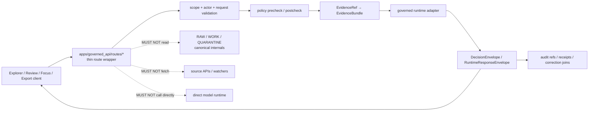

<!-- [KFM_META_BLOCK_V2]
doc_id: TODO-VERIFY(kfm://doc/<uuid>)
title: Governed API Routes
type: standard
version: v1
status: draft
owners: TODO-VERIFY(api-owner, security-steward)
created: TODO-VERIFY(YYYY-MM-DD)
updated: 2026-04-30
policy_label: TODO-VERIFY(public|restricted)
related: [../README.md, ../runtime/README.md, ../openapi/README.md, ../../../schemas/contracts/v1/runtime/runtime_response_envelope.schema.json, ../../../policy/README.md, ../../../tests/e2e/runtime_proof/README.md]
tags: [kfm, governed-api, routes, trust-membrane, runtime, evidence]
notes: [Directory README for route-level governed API boundaries, Current-session repo tree was not mounted; implementation claims remain NEEDS VERIFICATION, Target path is apps/governed_api/routes/README.md]
[/KFM_META_BLOCK_V2] -->

<a id="top"></a>

# Governed API Routes

Route-level guardrails for KFM endpoints that return governed, evidence-resolving, policy-checked outcomes without becoming a second truth system.

> [!IMPORTANT]
> **Impact block**
>
> | Field | Value |
> |---|---|
> | Status | `experimental` until mounted-repo route, contract, app registration, and CI evidence confirms the active implementation |
> | Owners | `TODO-VERIFY(api-owner, security-steward)` |
> | Target path | `apps/governed_api/routes/README.md` |
> | Route posture | Thin wrappers over governed runtime, evidence, policy, release, review, and audit seams |
> | Verification posture | Route filenames, framework conventions, app mounting, middleware, OpenAPI generation, CI gates, and runtime behavior are **NEEDS VERIFICATION** |
> | Badges |      |
> | Quick jumps | [Scope](#scope) · [Repo fit](#repo-fit) · [Inputs](#accepted-inputs) · [Exclusions](#exclusions) · [Directory tree](#directory-tree) · [Quickstart](#quickstart) · [Usage](#usage) · [Route families](#route-families) · [Outcome grammar](#outcome-grammar) · [Diagram](#diagram) · [Task list](#task-list--definition-of-done) · [FAQ](#faq) · [Appendix](#appendix) |

---

## Scope

This directory documents the **route-facing trust membrane** for the KFM governed API.

Routes in this folder should be narrow, inspectable adapters. They may validate request shape, call governed runtime or evidence services, and emit bounded response envelopes. They should not become source ingestion jobs, canonical stores, policy-authoring surfaces, model clients, publication engines, or UI state managers.

### Route responsibilities

A route in this folder is allowed to:

- validate request parameters, actor scope, and route/body identifier agreement;
- call policy precheck and postcheck seams where the active app framework supports them;
- resolve `EvidenceRef → EvidenceBundle` before consequential `ANSWER` responses;
- consume released, review-safe, or governed runtime artifacts;
- preserve source role, rights, sensitivity, freshness, review, correction, and release state;
- emit finite outcomes in a `DecisionEnvelope` or `RuntimeResponseEnvelope`;
- return audit and drawer hooks that downstream clients can inspect.

### Current evidence posture

| Claim | Label | Required proof before upgrade |
|---|---:|---|
| `apps/governed_api/routes/` exists on the active branch | **NEEDS VERIFICATION** | mounted repo tree |
| route modules are registered by `apps/governed_api/app.py` | **NEEDS VERIFICATION** | app source + route registration test |
| `RuntimeResponseEnvelope` is the canonical outward runtime schema | **NEEDS VERIFICATION** | active schema file + contract test |
| route tests execute in CI | **NEEDS VERIFICATION** | workflow YAML + CI logs |
| public clients use this boundary instead of internal stores | **NEEDS VERIFICATION** | UI/API integration tests and no-direct-store checks |

<p align="right"><a href="#top">Back to top ↑</a></p>

---

## Repo fit

### Intended location

```text
apps/governed_api/routes/README.md
```

### Boundary role

This folder should sit below the governed API app surface and beside runtime adapters. It is the place where route handlers and route notes keep request/response behavior aligned with KFM’s evidence, policy, release, review, and audit obligations.

| Direction | Expected neighbor | Why it matters | Status |
|---|---|---|---:|
| Parent boundary | [`../README.md`](../README.md) | Defines the governed API as a trust boundary, not a generic backend | **NEEDS VERIFICATION** |
| App registration | [`../app.py`](../app.py) | Mounts route modules and middleware in the active framework | **NEEDS VERIFICATION** |
| Runtime adapters | [`../runtime/`](../runtime/) | Builds route-safe envelopes from governed artifacts | **NEEDS VERIFICATION** |
| OpenAPI contracts | [`../openapi/`](../openapi/) | Publishes route contracts for client and CI checks | **NEEDS VERIFICATION** |
| Runtime schemas | [`../../../schemas/contracts/v1/runtime/`](../../../schemas/contracts/v1/runtime/) | Names response-envelope shape authority | **NEEDS VERIFICATION** |
| Policy | [`../../../policy/`](../../../policy/) | Owns policy logic; routes consume decisions, not rewrite policy | **NEEDS VERIFICATION** |
| Runtime proof | [`../../../tests/e2e/runtime_proof/`](../../../tests/e2e/runtime_proof/) | Proves request → decision → envelope behavior | **NEEDS VERIFICATION** |

> [!NOTE]
> Some prior KFM materials mention both `apps/governed_api/` and `apps/governed-api/`. This README uses the target path requested for this file. Do not maintain both app homes unless an ADR explicitly resolves compatibility, aliases, or migration.

### Upstream / downstream map

| Layer | Examples | Route expectation |
|---|---|---|
| Upstream governed support | `EvidenceBundle`, `ReleaseManifest`, `PolicyDecision`, `ReviewRecord`, `ValidationReport`, published runtime artifacts | Consume by reference; do not recreate authority |
| Route wrapper | `routes/*.py` or repo-equivalent route modules | Validate request, call governed seams, emit bounded envelope |
| Downstream clients | Explorer map shell, Evidence Drawer, Focus Mode, review console, exports | Read governed responses only; do not reach behind the trust membrane |

<p align="right"><a href="#top">Back to top ↑</a></p>

---

## Accepted inputs

Route handlers and route notes may accept materials that are already shaped for governed request-time use.

| Input class | Examples | Belongs here because | Label |
|---|---|---|---:|
| Request DTOs | query/body payloads with `request_id`, scope, actor, and route parameters | Routes validate and pass them inward | **PROPOSED** |
| Evidence references | `EvidenceRef`, `EvidenceBundle` refs, citation refs | Routes can require resolvability before answering | **PROPOSED** |
| Release-safe artifacts | published layer manifests, runtime envelopes, release/correction sidecars | Routes may expose approved outward state | **PROPOSED** |
| Policy decisions | precheck/postcheck outcomes, obligations, reason codes | Routes preserve decisions and obligations | **PROPOSED** |
| Review action requests | promote, hold, deny, request correction intent payloads | Steward actions belong behind governed route contracts | **PROPOSED** |
| Runtime-proof fixtures | `request.json`, `expected.decision.json`, `expected.envelope.json`, emitted `actual.response.json` | Route tests need small, explicit proof cases | **PROPOSED** |

> [!TIP]
> A route should be boring in the best way: validate, delegate, preserve trust state, and return the envelope. The interesting truth work belongs upstream.

---

## Exclusions

| Does not belong in `routes/` | Goes instead | Why |
|---|---|---|
| Source API fetching | connectors, watchers, ingest jobs, source descriptors | Runtime routes must not become ingestion lanes |
| RAW / WORK / QUARANTINE reads | lifecycle storage + processors | Public and ordinary clients cannot see unpublished state |
| Canonical writes | domain services, promotion/review systems, storage layer | Routes should not silently mutate truth |
| Policy authorship | `policy/` and policy test suites | Routes consume policy decisions; they do not become policy |
| Release proof creation | release/proof/catalog pipeline | Proof objects are generated by promotion and catalog closure |
| Direct model calls | governed model adapter seam | AI remains evidence-subordinate and provider-neutral |
| UI local-state mutation | review-console or explorer client state, behind governed API calls | Browser state is not sovereign truth |
| Uncited prose fallback | Focus/runtime adapter with citation validation | Cite-or-abstain is the default trust posture |

<p align="right"><a href="#top">Back to top ↑</a></p>

---

## Directory tree

The tree below is a **target-oriented route map**, not a current implementation inventory.

```text
apps/
└── governed_api/
    ├── README.md                         # parent governed API boundary README — NEEDS VERIFICATION
    ├── app.py                            # app/router registration surface — NEEDS VERIFICATION
    ├── openapi/                          # route OpenAPI contracts — NEEDS VERIFICATION
    ├── runtime/                          # governed runtime adapters — NEEDS VERIFICATION
    └── routes/
        ├── README.md                     # this directory guide
        ├── soil_moisture.py              # prior thin-slice signal; active branch proof needed
        ├── promotion.py                  # proposed release/correction visibility route
        ├── geospatial_review_payload.py  # proposed review payload retrieval route
        ├── geospatial_review_actions.py  # proposed review action route
        └── <domain_or_surface>.py        # new route modules only after contract + proof fixtures
```

> [!CAUTION]
> Do not create route files simply because a domain exists. A route earns its place only after a contract, admissible support, finite outcomes, tests, and trust-surface behavior are defined.

---

## Quickstart

Run these checks from the repository root after the active KFM checkout is mounted.

```bash
# Confirm the requested route path and current branch state.
git status --short
test -d apps/governed_api/routes && find apps/governed_api/routes -maxdepth 2 -type f | sort
```

```bash
# Inspect neighboring governed API surfaces without claiming they exist.
find apps/governed_api -maxdepth 2 -type f | sort 2>/dev/null || true
find schemas/contracts/v1/runtime -maxdepth 2 -type f | sort 2>/dev/null || true
find tests/e2e/runtime_proof -maxdepth 3 -type f | sort 2>/dev/null || true
```

```bash
# Run route-facing proof tests if the repo uses pytest for this slice.
python -m pytest tests/e2e/runtime_proof -q
```

> [!NOTE]
> Test runner, package manager, and framework commands are **NEEDS VERIFICATION**. Replace the snippets above with repo-native commands after branch inspection.

---

## Usage

### Adding or changing a route

1. **Name the route family.** Identify whether the route is evidence resolution, runtime answer, review payload, review action, promotion visibility, export, or ops/status.
2. **Update or create the contract.** Add OpenAPI, request schema, response schema, and runtime-envelope expectations before coding behavior.
3. **Connect to governed support.** Consume `EvidenceBundle`, `PolicyDecision`, released artifacts, or runtime adapters. Do not fetch source APIs or read internal lifecycle folders.
4. **Emit finite outcomes.** Use `ANSWER`, `ABSTAIN`, `DENY`, or `ERROR`; include reason and obligation codes where applicable.
5. **Add proof fixtures.** Include valid and invalid request/decision/envelope cases.
6. **Register the route.** Wire the handler through the app router only after tests prove request-time behavior.
7. **Update this README.** Add the route family entry, known tests, and unresolved verification items.

### Minimal route note checklist

Each route-level README or route note should include:

- route purpose and intended path;
- accepted request shape;
- consumed contract objects;
- emitted envelope shape;
- finite outcome rules;
- Evidence Drawer / Focus Mode expectations when applicable;
- exclusions and no-direct-store constraints;
- tests and fixtures;
- open verification items.

<p align="right"><a href="#top">Back to top ↑</a></p>

---

## Route families

| Family | Typical route shape | Consumes | Emits | Hard rule |
|---|---|---|---|---|
| Evidence resolution | `GET /v1/evidence/{evidence_ref}` | `EvidenceRef`, release scope, actor scope | `EvidenceBundle` or negative envelope | unresolved evidence cannot become an `ANSWER` |
| Runtime answer | `POST /v1/<domain>/<surface>/runtime` | request DTO, policy checks, release-safe support | `RuntimeResponseEnvelope` | no source fetching at request time |
| Evidence Drawer | `GET /v1/<domain>/drawer/{object_id}` | published object ref, EvidenceBundle, release state | `EvidenceDrawerPayload` or negative envelope | drawer payload must show source role and limitations |
| Focus / governed assistance | `POST /v1/focus/<domain>` | evidence-bounded context, policy state, citation refs | finite runtime envelope | generated language is not authority |
| Review payload | `GET /v1/review/<surface>/{promotion_id}` | review-safe promotion/candidate state | review payload envelope | review is a shell variation, not a second truth regime |
| Review action | `POST /v1/review/<surface>/{promotion_id}/actions` | action intent, actor, expected digests | governed action response | route/body ID agreement must be validated |
| Promotion visibility | `GET /v1/promotion/{run_id}/runtime` | released runtime envelope, release/correction sidecar | envelope + sidecar | do not reimplement policy or correction logic |
| Ops/status | `GET /health`, `GET /status` | service health only | status payload | never expose secrets, source credentials, or unpublished artifacts |

### Route inventory template

| Route module | Family | Contract | Test | Status |
|---|---|---|---|---:|
| `soil_moisture.py` | runtime answer | `TODO-VERIFY(runtime schema)` | `TODO-VERIFY(runtime proof test)` | **NEEDS VERIFICATION** |
| `promotion.py` | promotion visibility | `TODO-VERIFY(release/correction sidecar)` | `TODO-VERIFY(promotion route tests)` | **PROPOSED** |
| `geospatial_review_payload.py` | review payload | `TODO-VERIFY(review payload schema)` | `TODO-VERIFY(review payload route test)` | **PROPOSED** |
| `geospatial_review_actions.py` | review action | `TODO-VERIFY(review action schemas)` | `TODO-VERIFY(review action route test)` | **PROPOSED** |

---

## Outcome grammar

KFM routes should use finite outcomes rather than hiding failure in vague prose.

| Outcome | Meaning | Working HTTP convention | Route obligation |
|---|---|---:|---|
| `ANSWER` | The request can be answered with admissible, policy-safe support | `200` | include evidence/citation refs and release scope |
| `ABSTAIN` | The system cannot answer safely or trustworthily within admissible support | `200` | explain missing, stale, conflicted, weak, or unresolved support |
| `DENY` | Policy, rights, actor role, sensitivity, or publication state blocks the response | `403` | include reason and obligations without leaking restricted details |
| `ERROR` | Request or system failure prevented reliable execution | `400` or framework-specific error route | keep deterministic error shape and auditability |

> [!WARNING]
> The HTTP mapping above is a **working convention**. Do not mark it canonical until the active branch proves the schema, router, tests, and API documentation agree.

### Reason and obligation examples

| Class | Examples |
|---|---|
| Evidence | `evidence.missing`, `evidence.unresolved`, `evidence.stale`, `evidence.conflicted` |
| Policy / rights | `rights.unknown`, `rights.restricted`, `publication.not_public_safe`, `actor.not_authorized` |
| Sensitivity | `sensitivity.exact_location`, `sensitivity.withheld`, `sensitivity.requires_review` |
| Validation | `validation.schema_failed`, `validation.route_body_mismatch`, `validation.digest_mismatch` |
| Obligations | `cite`, `generalize`, `withhold`, `review_required`, `request_correction` |

---

## Diagram



Route rule in one sentence: **validate at the boundary, delegate to governed seams, emit inspectable outcomes, and keep every unsupported shortcut visibly out of bounds.**

<p align="right"><a href="#top">Back to top ↑</a></p>

---

## Task list / definition of done

Before a route is treated as implementation-backed, reviewers should be able to check every applicable item.

- [ ] Route contract exists or is updated before handler behavior changes.
- [ ] Request schema and response envelope are validated by tests.
- [ ] Route does not read `RAW`, `WORK`, `QUARANTINE`, private source mirrors, vector indexes, or canonical restricted stores directly.
- [ ] Route does not fetch source APIs directly at request time.
- [ ] Route does not call model providers directly.
- [ ] `ANSWER` requires resolved admissible support.
- [ ] `ABSTAIN`, `DENY`, and `ERROR` are tested with explicit fixtures.
- [ ] Reason and obligation codes are visible and stable enough for UI handling.
- [ ] Evidence Drawer payload or hooks are available when the route powers a map, detail, dossier, or review surface.
- [ ] Focus Mode routes consume released evidence only and cite-or-abstain.
- [ ] Review action routes validate route/body identifier agreement and expected digests when present.
- [ ] App registration is tested, not assumed.
- [ ] OpenAPI or route docs are refreshed.
- [ ] Parent governed API README and this directory README are updated.
- [ ] Rollback or disable path is documented for route exposure.

---

## FAQ

### Is a route allowed to return a bare JSON object?

Only for low-risk internal diagnostics, and only if the parent app contract allows it. Consequential public, review, Focus, export, or map-facing routes should emit governed response envelopes or typed payloads with finite negative states.

### Can a route call an upstream source API?

No. Source acquisition belongs to connectors, watchers, source descriptors, and normalization pipelines. A route may consume published or governed support produced by those systems.

### Can the review console read receipt or report files directly?

No. Review surfaces should ask the governed API for compact, role-aware review payloads. Optional refs may expose deeper inspection paths when the caller is authorized.

### Should every domain get a route immediately?

No. Domains earn route exposure through source admission, schema validity, evidence closure, policy checks, release state, and runtime-proof fixtures.

### Where should route-level implementation details live?

This directory README should define route-family law and inventory. Individual route notes may live beside route modules or under a route subdirectory. Deep framework mechanics belong in app/router documentation and tests.

<p align="right"><a href="#top">Back to top ↑</a></p>

---

## Appendix

<details>
<summary>Route note starter</summary>

```md
# <Route name>

One-line purpose for the route.

## Status

| Field | Value |
|---|---|
| Route module | `apps/governed_api/routes/<route>.py` |
| Family | `<evidence-resolution | runtime-answer | review-payload | review-action | promotion-visibility | ops-status>` |
| Contract | `TODO-VERIFY(...)` |
| Tests | `TODO-VERIFY(...)` |
| Status | `PROPOSED | NEEDS VERIFICATION | CONFIRMED` |

## Scope

### Includes

- request validation
- governed support resolution
- finite outcome emission

### Excludes

- source fetching
- canonical writes
- direct model calls
- policy authorship
- release proof creation

## Outcome rules

| Outcome | Condition |
|---|---|
| `ANSWER` | admissible evidence and policy-safe support are resolved |
| `ABSTAIN` | support is insufficient, stale, conflicted, ambiguous, or unresolved |
| `DENY` | policy, rights, actor role, sensitivity, or publication state blocks response |
| `ERROR` | validation or technical failure prevents reliable execution |
```

</details>

<details>
<summary>Pre-publish checklist for this README</summary>

- [ ] KFM meta block values are verified or deliberately marked `TODO-VERIFY`.
- [ ] Target path `apps/governed_api/routes/README.md` exists on the active branch.
- [ ] Relative links are valid from `apps/governed_api/routes/`.
- [ ] Route inventory reflects actual mounted files.
- [ ] `apps/governed_api` versus `apps/governed-api` ambiguity is resolved or tracked by ADR.
- [ ] Badges, owner fields, and status match repo convention.
- [ ] Outcome grammar matches active runtime schema.
- [ ] HTTP mapping matches OpenAPI and route tests.
- [ ] No section claims implementation maturity without branch evidence.

</details>
