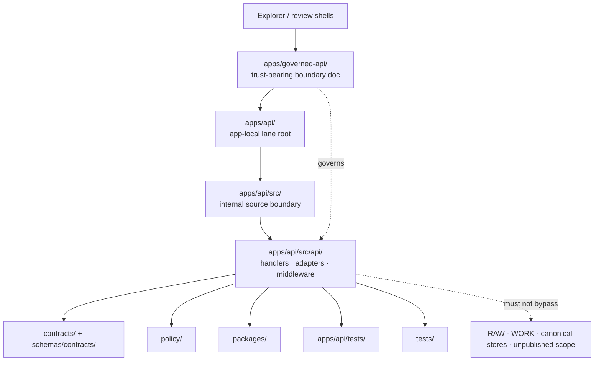

<!-- [KFM_META_BLOCK_V2]
doc_id: kfm://doc/<NEEDS_VERIFICATION_UUID>
title: API Source Tree Boundary
type: standard
version: v1
status: draft
owners: @bartytime4life
created: <NEEDS_VERIFICATION>
updated: 2026-04-09
policy_label: public
related: [apps/README.md, apps/governed-api/README.md, apps/api/README.md, apps/api/src/api/README.md, apps/api/tests/README.md, contracts/README.md, schemas/contracts/README.md, policy/README.md, tests/README.md]
tags: [kfm, api, runtime, trust-membrane, source-tree]
notes: [doc_id and created date need verification; owners currently follow the public-main app-family fallback; current public main shows this file as empty]
[/KFM_META_BLOCK_V2] -->

# API Source Tree Boundary

Internal source-tree README for the app-local KFM API lane, keeping trust-bearing boundary law separate from deeper module detail and external contract / policy authority.

> **Status:** experimental  
> **Doc state:** draft  
> **Owners:** `@bartytime4life` *(public-main app-family fallback; reconfirm in [`../../../.github/CODEOWNERS`](../../../.github/CODEOWNERS) before merge)*  
> **Path:** `apps/api/src/README.md`  
> **Repo fit:** internal source boundary beneath [`../README.md`](../README.md), downstream of [`../../governed-api/README.md`](../../governed-api/README.md), upstream of [`./api/README.md`](./api/README.md), adjacent to [`../tests/README.md`](../tests/README.md), and constrained by [`../../../contracts/README.md`](../../../contracts/README.md), [`../../../schemas/README.md`](../../../schemas/README.md), [`../../../schemas/contracts/README.md`](../../../schemas/contracts/README.md), [`../../../policy/README.md`](../../../policy/README.md), [`../../../packages/README.md`](../../../packages/README.md), and [`../../../tests/README.md`](../../../tests/README.md)  
> **Current public evidence:** public `main` proves that `apps/api/src/README.md` exists but is currently empty; [`../README.md`](../README.md) and [`./api/README.md`](./api/README.md) are still placeholder docs; the strongest public API-boundary prose currently lives in [`../../governed-api/README.md`](../../governed-api/README.md)  
> **Quick jumps:** [Scope](#scope) · [Repo fit](#repo-fit) · [Current public deltas](#current-public-deltas) · [Accepted inputs](#accepted-inputs) · [Exclusions](#exclusions) · [Directory tree](#directory-tree) · [Quickstart](#quickstart) · [Usage](#usage) · [Diagram](#diagram) · [Tables](#tables) · [Task list](#task-list--definition-of-done) · [FAQ](#faq) · [Appendix](#appendix)  
>      

> [!IMPORTANT]
> `apps/api/src/` is an **internal implementation boundary**, not the public trust membrane itself.
> It should consume boundary law, contracts, schemas, and policy; it should not silently become their source of truth.

> [!NOTE]
> This README does two jobs at once:
> 1. record the current public subtree truthfully
> 2. define the directory contract this path should satisfy as implementation hardens

> [!WARNING]
> Current public docs are not fully aligned.
> [`../../governed-api/README.md`](../../governed-api/README.md) describes `apps/api/src/api/` as a deeper route / middleware surface, but direct public-tree inspection in this session did **not** re-prove those child directories under [`./api/`](./api/).
> Treat that inventory as **NEEDS VERIFICATION** until the checked-out branch confirms it.

> [!TIP]
> Keep outward trust-boundary doctrine in [`../../governed-api/README.md`](../../governed-api/README.md).
> Keep route- and handler-level detail in [`./api/README.md`](./api/README.md) once that file stops being placeholder-only.

---

## Scope

`apps/api/src/` is the app-local source boundary for implementation detail that belongs **inside** the API lane but **below** the outward boundary description.

It exists to answer a narrow set of questions cleanly:

1. What belongs in the `src/` subtree instead of in boundary docs, contracts, policy, or tests?
2. What should remain outside this subtree even if it is API-related?
3. How should maintainers read the current `apps/governed-api/` ↔ `apps/api/` split without smoothing unresolved naming or topology questions away?
4. What is actually confirmed on public `main`, and what is only documented pressure for the checked-out branch?

### Evidence posture used in this README

| Signal | Posture | Meaning here |
|---|---|---|
| `apps/api/src/README.md` exists and is empty on current public `main` | **CONFIRMED** | This file is replacing a blank surface, not revising a mature subtree guide |
| `apps/api/README.md` and `apps/api/src/api/README.md` are still placeholder docs | **CONFIRMED** | Do not infer mature lane-local implementation docs from path presence alone |
| [`../../governed-api/README.md`](../../governed-api/README.md) is the strongest current public API-boundary README | **CONFIRMED** | Keep trust-membrane and outward route-law phrasing there |
| `apps/api/src/api/` already contains `middleware/` and `routes/` | **NEEDS VERIFICATION** | A sibling README claims this, but direct public-tree inspection in this session did not re-prove it |
| Route families, `EvidenceBundle` resolution, `RuntimeResponseEnvelope`, and finite runtime outcomes | **CONFIRMED doctrine / PROPOSED local organization** | These shape what may belong here without proving mounted code depth |

### Working rule

If a change is:

- **about outward API trust obligations**, it belongs first in [`../../governed-api/README.md`](../../governed-api/README.md)
- **about app-local lane framing**, it belongs first in [`../README.md`](../README.md)
- **about internal source placement and subtree ownership**, it belongs here
- **about route, middleware, or adapter detail**, it belongs first in [`./api/README.md`](./api/README.md)
- **about policy bundles, contract schemas, or shared reusable logic**, it belongs elsewhere

[Back to top ↑](#api-source-tree-boundary)

---

## Repo fit

This file sits in the middle of an API documentation split that should stay visible until the branch reconciles it deliberately.

### Boundary map

| Layer | Path | What it should own |
|---|---|---|
| App-family boundary | [`../../README.md`](../../README.md) | runtime-family law, shell-facing fit, current public app inventory |
| Public / steward API boundary | [`../../governed-api/README.md`](../../governed-api/README.md) | trust membrane, outward request classes, API-level exclusions, repo-fit at the edge |
| App-local lane root | [`../README.md`](../README.md) | `apps/api/` subtree framing and lane-local routing to `src/` and `tests/` |
| **This file** | `apps/api/src/README.md` | internal source-tree placement, subtree contract, confirmed-vs-unresolved source layout |
| Deeper module surface | [`./api/README.md`](./api/README.md) | route groups, middleware, adapters, handler/module detail |
| App-local test surface | [`../tests/README.md`](../tests/README.md) | API-lane verification specific to this app family |
| Contract authority | [`../../../contracts/README.md`](../../../contracts/README.md), [`../../../schemas/contracts/README.md`](../../../schemas/contracts/README.md) | machine-readable contract law and schema scaffolding |
| Policy authority | [`../../../policy/README.md`](../../../policy/README.md) | executable deny-by-default policy, reasons, obligations, runtime trust rules |
| Shared internal logic | [`../../../packages/README.md`](../../../packages/README.md) | reusable domain, evidence, and policy support logic |
| Broader verification families | [`../../../tests/README.md`](../../../tests/README.md) | contract, policy, reproducibility, integration, e2e, and trust-surface proof |

### Boundary-first consequence

`apps/api/src/` should help the repo keep three seams distinct:

| Seam | Why it matters | Failure to avoid |
|---|---|---|
| Boundary law vs. implementation detail | Prevents `src/` from quietly redefining the trust membrane | outward route law hiding in internal modules only |
| App-local code vs. shared logic | Prevents duplicated business law across API and sibling runtimes | app-local helpers becoming shadow shared packages |
| Implementation detail vs. verification authority | Prevents tests, contracts, and policy from drifting into undocumented assumptions | “it works on this handler” replacing contract or policy truth |

[Back to top ↑](#api-source-tree-boundary)

---

## Current public deltas

The public-main state is small, uneven, and worth documenting plainly.

| Signal | Why it matters | Status |
|---|---|---|
| [`apps/api/README.md`](../README.md) is still placeholder-only | lane-root framing is not yet carrying its expected burden | **CONFIRMED** |
| `apps/api/src/README.md` exists but is empty | this subtree currently lacks a truthful source-boundary guide | **CONFIRMED** |
| [`apps/api/src/api/README.md`](./api/README.md) is still placeholder-only | the deeper module-facing doc surface exists, but it does not yet carry route or middleware detail | **CONFIRMED** |
| [`apps/api/tests/README.md`](../tests/README.md) is still placeholder-only | app-local verification guidance is also thin | **CONFIRMED** |
| [`../../governed-api/README.md`](../../governed-api/README.md) is substantive and boundary-first | this is currently the strongest public README for API trust law | **CONFIRMED** |
| [`../../README.md`](../../README.md) confirms both `apps/governed-api/README.md` and `apps/api/src/api/README.md` as public-main API-family surfaces | the split is already repo-visible and should be reconciled explicitly, not hidden | **CONFIRMED** |
| `apps/api/src/api/` may also contain `middleware/` and `routes/` | sibling docs say yes, direct tree inspection in this session did not re-prove it | **NEEDS VERIFICATION** |
| Final naming authority between `apps/governed-api/` and `apps/api/` | both surfaces are public-main visible today | **NEEDS VERIFICATION** |

> [!CAUTION]
> This README should make current tension more legible, not less.
> If the checked-out branch settles the split, update all affected API READMEs in the same change stream.

[Back to top ↑](#api-source-tree-boundary)

---

## Accepted inputs

`apps/api/src/` should accept only implementation-facing material that naturally belongs inside the app-local source subtree.

| Input kind | Belongs here? | Notes |
|---|---:|---|
| Source-tree placement rules for app-local API code | Yes | This README is the right place to say what belongs under `src/` |
| Framework-agnostic module groupings for handlers, adapters, serializers, or middleware | Yes | Use generic terms unless the checked-out branch proves a concrete stack |
| App-local wiring that consumes shared contracts and policy decisions | Yes | Source modules may *consume* contract and policy law, not author it |
| Runtime outcome mapping for `ANSWER`, `ABSTAIN`, `DENY`, and `ERROR` | Yes | Only as local response-shaping guidance; outcome semantics come from doctrine and shared contracts |
| Internal ops / status handler placement | Yes, cautiously | Only if they remain subordinate to the same trust rules and do not become a second truth surface |
| Local docs, fixtures, or examples that only make sense inside `apps/api/src/` | Yes, cautiously | Keep them app-local; escalate shared examples elsewhere |
| Build-tool, package-manager, or framework-specific commands | Only when verified | Public `main` docs do not yet prove a stable local stack for this subtree |
| Browser-shell behavior | No | Belongs to shell-facing app docs under sibling runtime surfaces |
| Contract schema ownership | No | Keep in `contracts/` and `schemas/contracts/` |
| Policy bundle authorship | No | Keep in `policy/` |
| Shared reusable domain/evidence logic | No | Keep in `packages/` |
| Canonical store ownership or unpublished-scope handling | No | Trust-membrane violation if `src/` becomes a bypass surface |

---

## Exclusions

What does **not** belong in `apps/api/src/` is as important as what does.

| Out of scope | Why blocked | Put it instead |
|---|---|---|
| Public trust-membrane doctrine as the primary API story | `src/` is below the outward boundary | [`../../governed-api/README.md`](../../governed-api/README.md) |
| Placeholder-free route-by-route endpoint law | Avoids drift between boundary docs and module docs | [`./api/README.md`](./api/README.md) |
| Shared contract and schema source of truth | Machine-readable authority should not hide in app source trees | [`../../../contracts/README.md`](../../../contracts/README.md), [`../../../schemas/contracts/README.md`](../../../schemas/contracts/README.md) |
| Policy reason / obligation registry authorship | Enforcement must remain independently governable | [`../../../policy/README.md`](../../../policy/README.md) |
| Shared business or domain logic | Prevents app-local drift and copy-paste authority | [`../../../packages/README.md`](../../../packages/README.md) |
| Direct reads from `RAW`, `WORK`, `QUARANTINE`, canonical stores, or unpublished artifacts | Violates the trust membrane | governed services and lifecycle lanes behind the API |
| Free-form uncited assistant behavior | Prohibited by KFM doctrine | bounded Focus / governed assistance surfaces only |
| Hidden rollback, correction, or review logic | KFM requires visible correction lineage | review, release, and proof lanes |
| App-local tests as the only proof burden | Source-tree docs should not swallow verification structure | [`../tests/README.md`](../tests/README.md), [`../../../tests/README.md`](../../../tests/README.md) |

> [!WARNING]
> A convenient implementation shortcut is still a governance bug if it creates a silent bypass.

[Back to top ↑](#api-source-tree-boundary)

---

## Directory tree

### Current public-main snapshot verified in this session

```text
apps/
├── README.md
├── cli/
│   └── README.md
├── explorer-web/
│   └── README.md
├── governed-api/
│   └── README.md
├── review-console/
│   └── README.md
├── workers/
│   └── README.md
└── api/
    ├── README.md            # placeholder
    ├── src/
    │   ├── README.md        # empty on current public main
    │   └── api/
    │       └── README.md    # placeholder
    └── tests/
        └── README.md        # placeholder
```

### Documented starter-shape from sibling API docs

```text
apps/api/src/api/
├── README.md
├── middleware/   # NEEDS VERIFICATION on direct public-tree inspection
└── routes/       # NEEDS VERIFICATION on direct public-tree inspection
```

### How to collapse this section when the branch hardens

1. Inspect the checked-out branch directly.
2. Keep only entries that the branch proves.
3. Remove stale README-only assumptions.
4. If `middleware/` and `routes/` are real, upgrade their status and link them here.
5. If naming authority settles on either `apps/governed-api/` or `apps/api/`, update every API README in one PR.

[Back to top ↑](#api-source-tree-boundary)

---

## Quickstart

These commands are intentionally read-only and verification-first.

```bash
# 1) Confirm revision and inspect the current API subtree
git rev-parse HEAD
find apps/api -maxdepth 4 -type f | sort
```

```bash
# 2) Read the API doc split from outer boundary to inner source tree
sed -n '1,220p' apps/governed-api/README.md
sed -n '1,220p' apps/api/README.md
sed -n '1,240p' apps/api/src/README.md
sed -n '1,240p' apps/api/src/api/README.md
sed -n '1,220p' apps/api/tests/README.md
```

```bash
# 3) Recheck the shared authority surfaces this subtree depends on
sed -n '1,240p' contracts/README.md
sed -n '1,240p' schemas/contracts/README.md
sed -n '1,220p' policy/README.md
sed -n '1,220p' tests/README.md
```

```bash
# 4) Search for trust-critical vocabulary before upgrading claims
grep -RInE 'EvidenceBundle|EvidenceRef|RuntimeResponseEnvelope|ABSTAIN|DENY|ERROR|DecisionEnvelope|review|export|catalog|policy' \
  apps/api contracts schemas policy tests docs 2>/dev/null | head -n 200
```

> [!NOTE]
> Keep install, build, dev-server, and deploy commands out of this README until the branch proves a stable local runtime stack.

---

## Usage

Use this file as the **placement guide** for the `apps/api/src/` subtree.

### Editing order

| If the change is about… | Start here | Then reconcile with |
|---|---|---|
| outward API trust law, public/steward request classes, or trust-membrane rules | [`../../governed-api/README.md`](../../governed-api/README.md) | [`../README.md`](../README.md), this file, [`./api/README.md`](./api/README.md) |
| app-local API lane framing | [`../README.md`](../README.md) | this file, [`../tests/README.md`](../tests/README.md) |
| internal source-tree placement or subtree boundaries | **this file** | [`../README.md`](../README.md), [`./api/README.md`](./api/README.md) |
| route groups, middleware, handlers, adapters, or serialization detail | [`./api/README.md`](./api/README.md) | this file, contracts / schemas / policy docs |
| app-local API tests | [`../tests/README.md`](../tests/README.md) | [`../../../tests/README.md`](../../../tests/README.md) |
| shared contract objects | [`../../../contracts/README.md`](../../../contracts/README.md), [`../../../schemas/contracts/README.md`](../../../schemas/contracts/README.md) | this file only for source-tree placement notes |
| policy reasons, obligations, or deny-by-default behavior | [`../../../policy/README.md`](../../../policy/README.md) | this file only for consumption / placement notes |

### Editing rule of thumb

1. Verify the branch tree before upgrading a path claim.
2. Keep `CONFIRMED`, `INFERRED`, `PROPOSED`, `UNKNOWN`, and `NEEDS VERIFICATION` explicit.
3. Do not let a module-level convenience become a boundary-level promise.
4. If you add a real subtree under `apps/api/src/`, update the tree here and the deeper module README together.
5. If you settle the `apps/governed-api/` vs `apps/api/` split, update every affected app README in the same governed stream.

[Back to top ↑](#api-source-tree-boundary)

---

## Diagram



---

## Tables

### Responsibility matrix

| Concern | Preferred home | Why |
|---|---|---|
| Trust membrane and outward request law | [`../../governed-api/README.md`](../../governed-api/README.md) | keeps edge-facing doctrine boundary-first |
| `apps/api/` subtree framing | [`../README.md`](../README.md) | keeps lane-root responsibility visible |
| Internal source-tree placement | **this file** | keeps `src/` narrow and honest |
| Route / middleware / adapter detail | [`./api/README.md`](./api/README.md) | avoids duplicating module detail one level too high |
| Shared contract shapes | [`../../../contracts/README.md`](../../../contracts/README.md), [`../../../schemas/contracts/README.md`](../../../schemas/contracts/README.md) | source of truth should stay centralized |
| Policy reasons / obligations | [`../../../policy/README.md`](../../../policy/README.md) | deny-by-default behavior must remain executable |
| App-local API tests | [`../tests/README.md`](../tests/README.md) | keeps verification adjacent but separate |
| Cross-repo verification families | [`../../../tests/README.md`](../../../tests/README.md) | broader proof burdens live outside `src/` |
| Shared reusable internal logic | [`../../../packages/README.md`](../../../packages/README.md) | avoids app-local drift |

### Route-family pressure inherited from doctrine

This table is **doctrine pressure**, not proof of current mounted code.

| Route family | Why `apps/api/src/` eventually cares | Local posture |
|---|---|---|
| Catalog and discovery | source modules may group request classification and outward metadata shaping here | **CONFIRMED doctrine / PROPOSED local organization** |
| Feature or subject read | support/time semantics and release-scoped reads need local orchestration | **CONFIRMED doctrine / PROPOSED local organization** |
| Map / tile / portrayal | response shaping must inherit release, freshness, policy, and correction state | **CONFIRMED doctrine / PROPOSED local organization** |
| Evidence resolution | local adapters may resolve `EvidenceRef -> EvidenceBundle` through governed paths | **CONFIRMED doctrine / PROPOSED local organization** |
| Story / dossier / compare | source modules may preserve geography/time anchors across these classes | **CONFIRMED doctrine / PROPOSED local organization** |
| Export and report | local code may assemble preview-safe outputs but must not outrun release scope | **CONFIRMED doctrine / PROPOSED local organization** |
| Focus / governed assistance | local orchestration may map finite runtime outcomes and audit linkage | **CONFIRMED doctrine / PROPOSED local organization** |
| Review / stewardship | internal-only local code may support these actions without hidden approvals | **CONFIRMED doctrine / PROPOSED local organization** |
| Ops / status | local status handlers must not become a second truth surface | **CONFIRMED doctrine / PROPOSED local organization** |

[Back to top ↑](#api-source-tree-boundary)

---

## Task list & definition of done

Use this as the minimum gate list before treating `apps/api/src/` claims as mature.

- [ ] current checked-out branch tree has been inspected directly
- [ ] `apps/governed-api/README.md`, `apps/api/README.md`, `apps/api/src/README.md`, `apps/api/src/api/README.md`, and `apps/api/tests/README.md` tell one consistent story
- [ ] any claim that `apps/api/src/api/` contains `middleware/` or `routes/` is backed by direct branch evidence
- [ ] contract, schema, policy, and test links resolve to real current paths
- [ ] this file stays framework-agnostic unless the branch proves a stable implementation stack
- [ ] route-family or runtime-outcome claims here do not outrun what the deeper module README or checked-in contracts can support
- [ ] no statement here implies direct browser, client, or model-runtime access to canonical or unpublished scope
- [ ] app-local tests and repo-wide verification docs are cross-linked rather than collapsed into source-tree prose
- [ ] if the API naming authority is reconciled, every affected API README is updated in the same PR
- [ ] this file no longer behaves like a placeholder or silent gap in the API doc chain

---

## FAQ

### Why is this file needed if `apps/governed-api/README.md` already exists?

Because boundary law and source-tree placement are different burdens. The governed API README should stay edge-facing and trust-first. This file keeps the internal subtree honest without forcing every implementation note upward.

### Why not put route details here?

Because this file sits one level too high. Once `apps/api/src/api/README.md` becomes substantive, route groups, middleware, and adapter notes belong there.

### Why keep `apps/governed-api/` and `apps/api/` both visible?

Because the public repo already shows both. Until the checked-out branch settles naming authority, hiding one of them in prose would create a smoother but less truthful document.

### Why avoid framework commands here?

Because the current public docs do not yet prove a stable stack for this subtree. This README should stay true under stack changes.

[Back to top ↑](#api-source-tree-boundary)

---

## Appendix

<details>
<summary>Open verification items before upgrading wording</summary>

| Item | Current reading | What to do next |
|---|---|---|
| `apps/api/src/` owner specificity | public-main app-family fallback points to `@bartytime4life` | recheck `CODEOWNERS` before merge |
| `apps/api/src/api/` child inventory | placeholder README confirmed; `middleware/` and `routes/` still unproven in this session | inspect checked-out branch and update tree here if real |
| Final API naming authority | both `apps/governed-api/` and `apps/api/` remain public-main visible | choose one authoritative story and reconcile all API READMEs together |
| Local runtime stack | not proven from current public API subtree docs | add verified commands only after direct branch inspection |
| Contract and schema entrypoints actually consumed by `apps/api/src/` | neighboring lanes are visible, but subtree-level imports are not proven here | verify against checked-out files before naming concrete modules |
| App-local API tests | placeholder README only | replace with substantive coverage doc when tests are real |

</details>

<details>
<summary>Starter vocabulary preserved from KFM doctrine</summary>

| Term | Meaning here |
|---|---|
| **EvidenceBundle** | request-time support package behind consequential claims |
| **RuntimeResponseEnvelope** | governed outward response shape for bounded runtime behavior |
| **Surface state** | visible trust state such as promoted, partial, generalized, stale-visible, denied, or abstained |
| **Trust membrane** | rule that public and ordinary steward surfaces cross governed APIs instead of touching canonical stores directly |
| **Thin slice** | smallest end-to-end governed implementation that proves the architecture honestly |

</details>

[Back to top ↑](#api-source-tree-boundary)
