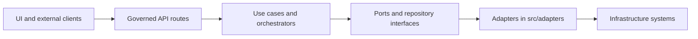

<!-- [KFM_META_BLOCK_V2]
doc_id: kfm://doc/c7a7c10e-2ec0-4b41-bd8b-4c5b5dba3f6b
title: apps/api/src/adapters/README.md
type: standard
version: v1
status: draft
owners: TBD
created: 2026-03-03
updated: 2026-03-03
policy_label: public
related:
  - ../../../../policy/
  - ../api/README.md
  - ../../../../contracts/
tags: [kfm, api, adapters]
notes:
  - Defines the adapter boundary for the governed API. Adapters implement ports/repositories and isolate infrastructure concerns while preserving the trust membrane.
[/KFM_META_BLOCK_V2] -->

# apps/api/src/adapters — API Adapters
Infrastructure integration layer for the **governed API**: adapters translate external systems (DB/search/object store/LLM/policy) into **stable internal ports** without breaking the trust membrane.

**Status:** Draft • **Owners:** TBD • **Layer:** Interfaces / Adapters  
**Posture:** default-deny • fail-closed • cite-or-abstain • reproducible by digest


---

## Quick links
- [Purpose](#purpose)
- [Where this fits](#where-this-fits)
- [Directory contract](#directory-contract)
- [Adapter registry](#adapter-registry)
- [Conventions](#conventions)
- [Add a new adapter](#add-a-new-adapter)
- [Testing and gates](#testing-and-gates)
- [Security and governance](#security-and-governance)
- [Minimum verification steps](#minimum-verification-steps)

---

## Purpose
Adapters are the “last mile” between KFM’s governed API logic and infrastructure systems.

They exist to:
- Keep **domain + use-case logic** independent from PostGIS/Neo4j/search vendors, HTTP clients, SDKs, and connection pooling.
- Enforce the **trust membrane**: callers use governed APIs and internal ports; adapters are the only place that “knows” infrastructure details.
- Return data in **evidence-friendly** shapes (stable IDs, dataset_version_id, digests/refs) so downstream layers can build EvidenceRefs/EvidenceBundles and enforce cite-or-abstain.

> **IMPORTANT**
> If adapters leak infrastructure types upward (raw DB models, driver sessions, untyped blobs), they silently break governance and make policy enforcement inconsistent.

---

## Where this fits
KFM uses clean layering (Domain → Use cases → Interfaces → Infrastructure). Adapters sit in the **Interfaces** layer as concrete implementations of ports/repository interfaces.



---

## Directory contract

### Where it fits in the repo
This directory is part of the **API service** and should contain only adapter implementations and adapter-local wiring.

### Acceptable inputs
- Implementations of **ports / repository interfaces** (e.g., `DatasetRepository`, `EvidenceResolverClient`, `PolicyDecisionClient`, etc.)
- Thin clients/wrappers for infrastructure:
  - Datastores (e.g., PostGIS, Neo4j)
  - Search / vector index
  - Object storage / artifact fetch
  - Policy evaluation (e.g., OPA/PDP)
  - LLM runtime (e.g., Ollama)
- Serialization/deserialization to internal DTOs (not HTTP DTOs)
- Adapter-local config reading (strict, validated) *or* adapter-local `Config` objects passed in from the composition root

### Exclusions (must NOT go here)
- **Domain rules** (belongs in Domain)
- **Use-case orchestration** (belongs in Use cases)
- **HTTP routing / controllers** (belongs in API layer)
- Direct policy decisions in code when policy-as-code is the source of truth
- Anything that makes policy bypass “easy”:
  - exposing raw DB handles to callers
  - querying infra directly from route handlers
  - embedding credentials or secrets in code
- UI-facing formatting (belongs in UI)

---

## Adapter registry
This table is intended to be a **living index** of adapters and their governance expectations.

> **NOTE**
> Rows marked “TBD” are placeholders. Update this registry when you add/modify adapters.

| Adapter | External system | Purpose | Policy posture | Key config | Tests required | Owner |
|---|---|---|---|---|---|---|
| `postgis/*` (TBD) | PostGIS | Geospatial queries (bbox/time/filters) | Enforce policy before returning data; deny by default | `DATABASE_URL` (example) | Unit + integration | TBD |
| `neo4j/*` (TBD) | Neo4j | Graph traversal / entity relationships | Policy-safe projections; no restricted leaks | TBD | Unit + integration | TBD |
| `search/*` (TBD) | Search / vector index | Retrieval for Focus Mode | Returns refs + excerpts; never bypass policy | TBD | Unit + contract | TBD |
| `policy/*` (TBD) | OPA / PDP | Policy decisions + obligations | Fixtures must match CI + runtime | TBD | Policy fixture tests | TBD |
| `llm/*` (TBD) | Ollama | Generate answers from retrieved evidence | Cite-or-abstain; log run receipts | `OLLAMA_API_URL` (example) | Unit + eval harness | TBD |

---

## Conventions

### 1) Ports first, adapters second
Adapters should implement *interfaces defined elsewhere* (ports). If you are tempted to define a “port” inside `adapters/`, pause—ports are part of the Interfaces layer but must be stable and reusable by tests and fakes.

### 2) Fail closed by default
- If an adapter cannot confirm authorization/policy obligations, it must return an error that upstream layers treat as **deny / abstain**.
- Avoid “helpful” fallbacks that expand access.

### 3) Stable error model
Adapters should raise/return **typed errors** that upstream layers can map to safe HTTP responses:
- `NotAuthorized` (403)
- `NotFound` (404) *without leaking restricted existence*
- `Unavailable` (503)
- `InvalidQuery` (400)

### 4) Timeouts, retries, and idempotency
- Every network/DB call must have a timeout.
- Retries must be bounded and idempotent-safe.
- Prefer request-scoped correlation IDs (and include them in logs).

### 5) Evidence-friendly outputs
Where possible, return:
- immutable dataset/version identifiers
- artifact digests and URIs
- EvidenceRefs rather than “mystery blobs”
so Evidence resolution can be performed centrally.

---

## Add a new adapter

### Checklist (Definition of Done)
- [ ] Define or reference the **port interface** (outside `adapters/`)
- [ ] Implement the adapter with:
  - timeouts
  - typed errors
  - structured logs
- [ ] Wire it in the composition root (dependency injection / factory)
- [ ] Add tests:
  - [ ] unit tests (mock external system)
  - [ ] policy fixtures or contract tests (deny-by-default, obligation handling)
  - [ ] integration tests (optional but recommended when feasible)
- [ ] Update the [Adapter registry](#adapter-registry)
- [ ] Verify no trust-membrane bypass (see [Minimum verification steps](#minimum-verification-steps))

### Example skeleton (language-agnostic)
```text
adapters/
  README.md
  <system>/
    client.*            # wraps SDK/driver
    adapter.*           # implements Port interface
    types.*             # adapter-local types only
    __tests__/          # unit tests for adapter
  index.*               # export/wiring surface (optional)
```

---

## Testing and gates
KFM treats governance as something enforced, not merely documented. Adapter changes should be merge-blocking unless tests demonstrate:

- **Policy enforcement behavior** (deny-by-default, obligations honored)
- **No bypass paths** (no routes calling infra directly)
- **Contract stability** (ports don’t drift without coordination)
- **Regression safety** for Focus Mode (if adapter feeds retrieval/generation)

Recommended test tiers:
1. **Unit:** adapter logic with mocked SDK/driver
2. **Contract:** policy decision fixtures and error mapping
3. **Integration:** docker-compose or ephemeral env bringing up Postgres/Neo4j/search/OPA/Ollama as needed
4. **Eval harness:** golden queries for cite-or-abstain Focus Mode (when relevant)

---

## Security and governance
### Trust membrane rules (non-negotiable)
- External clients and UI must **never** access DB/object storage directly.
- Core backend logic must not bypass repository/port interfaces to talk directly to storage.
- All access flows through governed APIs applying policy decisions, redactions/generalizations, and logging.

### Policy-as-code consistency
Adapters that interact with policy must not invent authorization logic. Policy semantics must be consistent between:
- CI gate behavior (tests)
- Runtime API behavior

### Sensitive data defaults
- Default deny for sensitive-location and restricted datasets.
- If public derivatives are allowed, produce generalized outputs as a separate dataset/version.
- Avoid leaking restricted metadata in error responses.

---

## Minimum verification steps
Run these from repo root and attach output to your PR if you touched adapters:

```sh
# What changed (high signal)
git status
git diff --stat

# Inspect adapter surface
tree -L 3 apps/api/src/adapters || find apps/api/src/adapters -maxdepth 3 -print | sort

# Confirm no bypass paths (examples; tailor to your language/tooling)
rg -n "from .*adapters|import .*adapters" apps/api/src || true
rg -n "postgres|neo4j|ollama|OPA|reg[o]?" apps/api/src || true
```

---

Back to top: [↑](#appsapisrcadapters--api-adapters)
