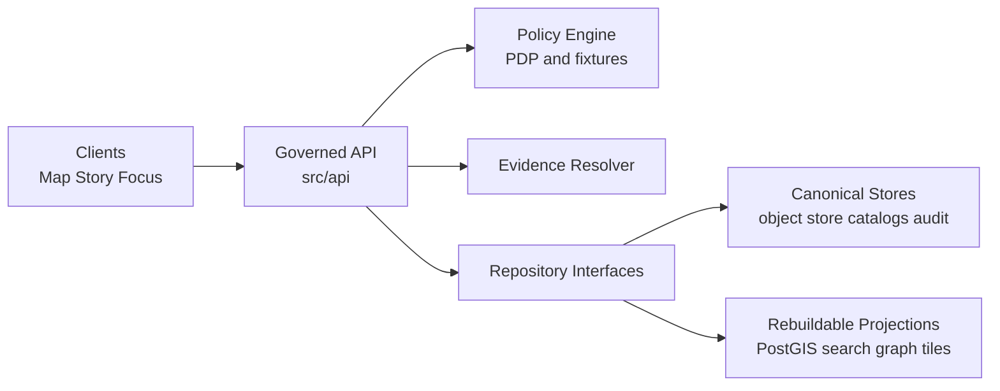
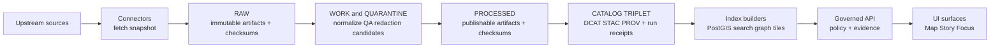

<!-- [KFM_META_BLOCK_V2]
doc_id: kfm://doc/7edbc12a-e243-4b93-84ae-5e09c5f9e501
title: apps/api/src/api — Governed API module
type: standard
version: v1
status: draft
owners: TBD (API maintainers)
created: 2026-02-27
updated: 2026-02-27
policy_label: public
related:
  - kfm://doc/kfm-gdg-vnext (Design & Governance Guide)
tags: [kfm, api, governance, policy, evidence]
notes:
  - This README documents *intent + invariants* for the governed API boundary. Update TODOs after verifying repo conventions.
[/KFM_META_BLOCK_V2] -->

# KFM Governed API — `src/api`

Contract-first **enforcement boundary** for all runtime surfaces (Map / Story / Focus).  
**Status:** draft • **Policy posture:** fail-closed • **Owners:** TBD


> **TODO (repo wiring):** replace CI/coverage badges with real pipeline links once known.

## Navigation

- [Purpose](#purpose)
- [Non-negotiable invariants](#non-negotiable-invariants)
- [Architecture](#architecture)
- [API surface](#api-surface)
- [Contracts](#contracts)
- [Evidence resolver](#evidence-resolver)
- [Focus Mode](#focus-mode)
- [Audit and observability](#audit-and-observability)
- [How to add a new endpoint](#how-to-add-a-new-endpoint)
- [Directory guide](#directory-guide)

---

## Purpose

This directory contains the **governed API boundary** (“PEP” in policy terms): request validation, policy enforcement, evidence resolution orchestration, and a stable contract surface for clients.

It exists to ensure:

- **Policy is enforced consistently** (CI and runtime semantics align).
- **Every user-facing claim can be traced** to versioned evidence (EvidenceRefs → EvidenceBundles).
- **No client bypass exists** (trust membrane).
- **Responses are contract-stable** (`/api/v1` semantics are frozen; breaking changes get `/api/v2`).

### What belongs here

✅ Acceptable inputs (what belongs in `src/api/`):

- Route handlers (dataset discovery, STAC, evidence resolve, story, Focus Mode, lineage/health, tiles)
- Request/response **contract schemas** and validators (JSON Schema/OpenAPI DTOs, etc.)
- Policy context extraction (auth/role context → policy input)
- Error mapping into a stable error model (policy-safe messaging)
- Audit log emitters for governed operations

### What must NOT go here

🚫 Exclusions (do not commit these patterns into `src/api/`):

- Direct, ad-hoc access from clients to storage/DB/search/graph (bypasses policy)
- “Raw text from an index” returned without resolvable evidence links
- Endpoint behavior that differs between CI and runtime policy outcomes
- Error differences that leak restricted existence (e.g., obvious 403 vs 404 signal)
- Un-versioned responses (missing `dataset_version_id` where applicable)

---

## Non-negotiable invariants

These are platform invariants. If an implementation detail conflicts with them, the implementation is wrong.

| Invariant | Meaning in practice | How we enforce it (expected) |
|---|---|---|
| Truth path lifecycle | Only promoted dataset versions appear in runtime surfaces (API/UI) | CI promotion gates + runtime checks |
| Trust membrane | Clients never touch storage/DB directly; backend logic uses repository interfaces; access flows through governed API applying policy/redaction/logging | Network boundaries + code review + tests |
| Evidence-first UX | API supports “trust surfaces”: dataset version, license/rights, policy label, provenance links, digests | Required response fields + evidence resolver |
| Cite-or-abstain (Focus Mode) | If citations cannot be verified as resolvable + allowed for the user, the system **must abstain or reduce scope** | Hard citation verification gate in Focus pipeline |
| Canonical vs rebuildable | Object store + catalogs + audit are canonical; DB/search/graph/tiles are rebuildable projections | No code assumes projections are “source of truth” |

---

## Architecture

### Trust membrane (runtime)



### Truth path (data → catalogs → governed surfaces)



---

## API surface

### Minimal endpoint set (buildable v1)

These endpoints form the minimum credible runtime surface.

- `GET /api/v1/datasets` — list datasets + versions (DCAT-backed; server-side policy filtering)
- `GET /api/v1/stac/collections` — STAC query (policy filtering before returning assets)
- `GET /api/v1/stac/items` — STAC query (policy filtering before returning assets)
- `POST /api/v1/evidence/resolve` — EvidenceRef → EvidenceBundle (fail closed if unresolvable/unauthorized)
- `GET/POST /api/v1/story` and `GET/PUT /api/v1/story/{id}` — Story Nodes with versioning (publish requires citations + review state)
- `POST /api/v1/focus/ask` — Focus Mode Q&A (returns citations or abstain + `audit_ref`)
- `GET /api/v1/lineage/status` and `GET /api/v1/lineage/stream` — pipeline health/freshness feeds badges

If tiles are served dynamically:

- `GET /api/v1/tiles/{layer}/{z}/{x}/{y}.pbf`

If tiles are served as PMTiles bundles:

- `GET /assets/pmtiles/{dataset_version_id}/{layer}.pmtiles` (static hosting with policy gating, or only public layers)

<details>
<summary><strong>Blueprint variant endpoints (illustrative)</strong></summary>

Some blueprint tables also describe the following illustrative endpoints:

- `GET /api/v1/catalog/datasets` — dataset discovery (DCAT + policy labels)
- `GET /api/v1/datasets/{dataset_version_id}/query` — query slice by bbox/time/filters (policy enforced; generalized outputs if required)
- `GET /api/v1/tiles/{layer_id}/{z}/{x}/{y}` — tile delivery (policy-safe tiles; cache varies by policy/auth)
- `GET /api/v1/lineage/{dataset_id}` — lineage graph + run receipts (may redact sensitive fields; include commit SHAs where available)

If your implementation uses these paths, keep them **contract-stable** and consider alias/redirect strategy to converge on a single v1 surface.
</details>

---

## Contracts

### Response contract requirements

Every response **must** include (when applicable):

- `dataset_version_id`
- `artifact` digests/checksums
- `policy` label (public-safe)
- `audit_ref` for governed operations (e.g., focus, story publish)

Errors must follow a stable, policy-safe model:

- `error_code`
- `message` (policy-safe)
- `audit_ref` (for debugging)
- optional remediation hints

> **Important:** Avoid leaking restricted existence through error differences. Align `403`/`404` behavior with policy.

#### Example error payload

```json
{
  "error_code": "POLICY_DENY",
  "message": "This resource is not available for your role.",
  "audit_ref": "kfm://audit/entry/123",
  "remediation": {
    "hint": "Try a public dataset, broaden the time window, or request steward review."
  }
}
```

### Versioning policy

- Freeze `/api/v1` semantics; only add backwards-compatible fields.
- Use `/api/v2` only for breaking changes.
- Schema versioning is explicit (e.g., `KFM-DCAT vN`, `KFM-STAC vN`, `KFM-PROV vN`).

---

## Evidence resolver

Evidence resolution is central: the resolver accepts an **EvidenceRef** (or a structured reference), applies policy, and returns an **EvidenceBundle** (human card + machine metadata + digests + audit references).

Design requirements:

- Accept `EvidenceRef` (`scheme://...`) **or** `{ dataset_version_id, record_id, span }`
- Apply allow/deny + obligations (redactions/generalization)
- Return an EvidenceBundle containing:
  - human view (renderable card)
  - machine metadata (JSON)
  - artifact links **only if allowed**
  - digests + `dataset_version_id`
  - `audit_ref`
- Must be usable from the UI in **≤ 2 calls** (e.g., resolve + fetch, or resolve only)

#### Example EvidenceBundle (shape)

```json
{
  "bundle_id": "sha256:bundle...",
  "dataset_version_id": "2026-02.abcd1234",
  "title": "Example record title",
  "policy": { "decision": "allow", "policy_label": "public", "obligations_applied": [] },
  "license": { "spdx": "CC-BY-4.0", "attribution": "Source org" },
  "provenance": { "run_id": "kfm://run/..." },
  "artifacts": [{ "href": "processed/example.parquet", "digest": "sha256:...", "media_type": "application/x-parquet" }],
  "checks": { "catalog_valid": true, "links_ok": true },
  "audit_ref": "kfm://audit/entry/..."
}
```

---

## Focus Mode

Focus Mode is a governed, evidence-led AI surface: it behaves like a research assistant that **always** cites resolvable evidence (or abstains) and emits an audit receipt for every run.

### Request + response (governed run)

Inputs:

- user query
- optional `view_state` (map bbox, time window, active layers)
- user role / policy context

Outputs:

- answer text
- citations (EvidenceRefs resolving to EvidenceBundles)
- `audit_ref` (run id)

### Control loop (hard gate)

The recommended control loop:

1. Policy pre-check
2. Retrieval plan
3. Retrieve evidence (catalog/search/graph/PostGIS as projections)
4. Build evidence bundles (resolver + obligations)
5. Synthesize answer (reference bundle IDs)
6. **Citation verification (hard gate)** — if any citation can’t be verified as resolvable + allowed, drop/revise or abstain
7. Produce audit receipt (store digests, policy decisions, model version, output hash)

### Expected work package artifacts (if present)

The blueprint identifies (illustratively) the following deliverables for Focus Mode MVP work:

- `src/focus/orchestrator.ts`
- `src/api/routes/focus.ts`
- `tests/eval/focus_harness`
- `contracts/schemas/focus_response_v1.schema.json`

> **If your repo structure differs, keep the roles but update the paths in this README.**

---

## Audit and observability

Every governed operation must emit a log record including:

- who (principal, role)
- what (endpoint, parameters)
- when (time)
- why (purpose, if declared)
- inputs/outputs (by digest)
- policy decisions (allow/deny, obligations, reason codes)

> **Note:** Audit logs are themselves sensitive. Apply redaction + retention policies.

#### Example audit event (shape)

```json
{
  "audit_ref": "kfm://audit/entry/123",
  "at": "2026-02-27T18:04:00Z",
  "principal": { "id": "user:abc", "role": "public" },
  "request": { "method": "POST", "path": "/api/v1/evidence/resolve" },
  "inputs": [{ "evidence_ref": "kfm://evidence/..." }],
  "outputs": [{ "bundle_id": "sha256:..." }],
  "policy": { "decision": "allow", "obligations": [] }
}
```

---

## How to add a new endpoint

### Definition of done (endpoint)

- [ ] Contract schema exists (request + response) and validates in CI
- [ ] Handler enforces policy **before** data access/return
- [ ] Response includes required trust fields (`dataset_version_id`, digests, policy label, audit_ref when governed)
- [ ] Errors use stable, policy-safe model (no existence leaks; align 403/404)
- [ ] Audit event emitted for governed operations
- [ ] Policy fixtures/tests updated (deny-by-default posture maintained)
- [ ] Evidence resolver can resolve at least one EvidenceRef in CI (when endpoint introduces new evidence refs)
- [ ] Contract tests and policy tests pass (merge blocked otherwise)
- [ ] README route registry updated

### Endpoint scaffolding (suggested)

```text
1) Define schema (contracts/schemas/*.schema.json)
2) Add route (src/api/routes/*.ts)
3) Validate input -> policy check -> repo query -> apply obligations -> respond
4) Map errors to stable error model
5) Emit audit record for governed operations
6) Add tests (contract + policy fixtures + e2e where possible)
```

---

## Directory guide

> This is a **directory documentation** section. Update it if/when the repo layout changes.

```text
apps/api/src/api/
  README.md            # this file (intent + invariants)
  routes/              # (expected) HTTP route handlers; PEP implementations
  middleware/          # (expected) auth, policy-context, request IDs, error mapper
  contracts/           # (expected) DTOs, schema registry helpers, validators
  adapters/            # (expected) thin adapters to policy engine / evidence resolver / repos
  telemetry/           # (expected) audit + metrics emitters (policy-safe)
```

### Repo-fit checklist (minimum verification steps)

If anything above is “off”, do these checks and update this README:

1. Locate the API entrypoint (server bootstrap) and router registration
2. Identify the policy engine adapter (OPA or equivalent) and how fixtures/tests are run
3. Find the evidence resolver implementation and its public contract
4. Confirm error model implementation and 403/404 policy behavior
5. Confirm where audit logs are written and how they’re redacted/retained

---

<a id="back-to-top"></a>
**Back to top:** [Navigation](#navigation)
