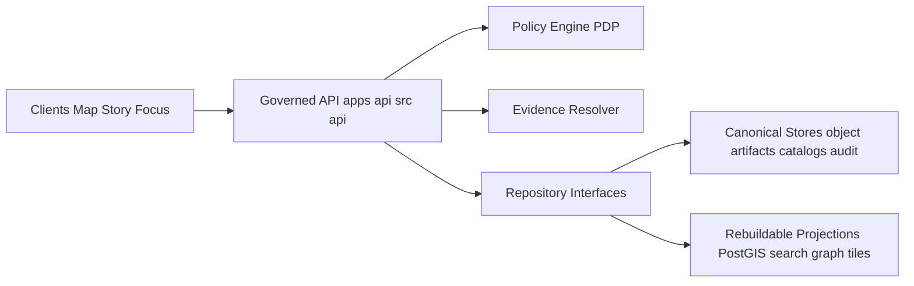

<!-- [KFM_META_BLOCK_V2]
doc_id: kfm://doc/TODO-uuid
title: KFM Governed API — src/api
type: standard
version: v1
status: draft
owners: TBD
created: 2026-03-03
updated: 2026-03-03
policy_label: public
related:
  - ../../../../contracts/openapi/
  - ../../../../policy/
  - ../../../../data/
tags: [kfm, api, governed, pep, evidence, policy]
notes:
  - This README documents the enforcement boundary for runtime surfaces (Map/Story/Focus).
  - Replace TODOs once repo wiring (CI, coverage, owners) is confirmed.
[/KFM_META_BLOCK_V2] -->

# KFM Governed API — `apps/api/src/api`

Contract-first **enforcement boundary** for all runtime surfaces (**Map / Story / Focus**).

**Status:** draft • **Policy posture:** default-deny, fail-closed • **Owners:** TBD  


> [!IMPORTANT]
> **TODO (repo wiring):** Replace CI/coverage badges with real pipeline links once known.

## Quick navigation

- [Purpose](#purpose)
- [Where this fits](#where-this-fits)
- [Non-negotiable invariants](#non-negotiable-invariants)
- [Architecture](#architecture)
- [API surface](#api-surface)
- [Contracts](#contracts)
- [Evidence resolver](#evidence-resolver)
- [Focus Mode](#focus-mode)
- [Audit and observability](#audit-and-observability)
- [How to add a new endpoint](#how-to-add-a-new-endpoint)
- [Directory guide](#directory-guide)

---

## Purpose

This directory implements the **governed API boundary** (a Policy Enforcement Point / “PEP”):

- validates requests against contracts
- evaluates policy and applies obligations (redaction/generalization/denials)
- resolves evidence references into citable bundles
- emits audit records for governed operations
- exposes stable `/api/v1` behavior to all clients

### Acceptable inputs

What belongs in `apps/api/src/api/`:

- Route handlers for the governed surfaces:
  - dataset discovery + queries
  - STAC collections/items
  - evidence resolution
  - story CRUD + publish checks
  - Focus Mode ask/answer
  - lineage/freshness health
  - tiles (if served dynamically)
- Contract binding + validation:
  - DTOs generated from OpenAPI/JSON Schema (or equivalent)
  - request/response validators
- Policy context extraction:
  - principal/role/session → policy input
- Stable error mapping:
  - policy-safe messages; no existence leaks
- Audit/telemetry emitters for governed operations:
  - request IDs, audit refs, digests (policy-safe)

### Exclusions

What must **NOT** go in `apps/api/src/api/`:

- direct client → DB/object-store/search/graph access paths (policy bypass)
- returning “raw index text” or “raw DB rows” without resolvable evidence
- runtime behavior that cannot be reproduced/validated in CI
- error behavior that leaks restricted existence (e.g., obvious 403 vs 404 differences)
- un-versioned public contracts (anything not pinned to `/api/v1` semantics)

---

## Where this fits

KFM’s trust membrane requires:

- **UI and clients** talk only to the governed API.
- The governed API talks to:
  - **policy engine** (PDP) + policy fixtures (CI parity)
  - **evidence resolver**
  - **repository interfaces** that mediate access to canonical stores and rebuildable projections

> [!NOTE]
> Repo layout varies by branch. If links below don’t resolve, treat them as **expected** and update once verified:
> - `../../../../contracts/`
> - `../../../../policy/`
> - `../../../../data/`

---

## Non-negotiable invariants

If an implementation detail conflicts with these invariants, the implementation is wrong.

| Invariant | Meaning in practice | How it’s enforced (expected) |
|---|---|---|
| Truth path lifecycle | Only promoted dataset versions appear in runtime surfaces | promotion gates + runtime checks |
| Trust membrane | clients never touch storage/DB directly; all reads/writes are policy evaluated at the API boundary | network boundaries + code structure + tests |
| Evidence-first UX | every user-facing claim can be traced to a versioned EvidenceBundle | required response fields + resolver availability |
| Cite-or-abstain | if citations can’t be verified as resolvable + allowed, responses **must abstain or narrow scope** | hard citation verification gate |
| Canonical vs rebuildable | catalogs + processed artifacts + receipts are canonical; DB/search/tiles are projections | “source-of-truth” discipline + rebuild pipelines |

---

## Architecture

### Trust membrane


```mermaid
flowchart LR
  C[Clients Map Story Focus] --> A[Governed API apps api src api]
  A --> PDP[Policy Engine PDP]
  A --> ER[Evidence Resolver]
  A --> R[Repository Interfaces]
  R --> CS[Canonical Stores object artifacts catalogs audit]
  R --> RP[Rebuildable Projections PostGIS search graph tiles]
```

### Truth path to governed surfaces


```mermaid
flowchart LR
  U[Upstream sources] --> IN[Connectors ingestion]
  IN --> RAW[RAW immutable + checksums]
  RAW --> WORK[WORK and QUARANTINE normalize QA]
  WORK --> PROC[PROCESSED publishable artifacts]
  PROC --> CAT[Catalog triplet DCAT STAC PROV + receipts]
  CAT --> PROJ[Index builders]
  PROJ --> API[Governed API policy + evidence]
  API --> UI[UI Map Story Focus]
```

---

## API surface

### Minimal endpoint set

This is the minimum credible `/api/v1` surface to support Map/Story/Focus with governance.

| Method | Path | Purpose | Policy posture |
|---|---|---|---|
| GET | `/api/v1/datasets` | list datasets + versions (DCAT-backed) | policy-filter server-side |
| GET | `/api/v1/stac/collections` | STAC discovery/query | policy-filter assets |
| GET | `/api/v1/stac/items` | STAC item query by bbox/time/collection | policy-filter assets |
| POST | `/api/v1/evidence/resolve` | EvidenceRef → EvidenceBundle | fail-closed if unresolvable/unauthorized |
| GET/POST | `/api/v1/story` | list/create story nodes | enforce role + review workflow |
| GET/PUT | `/api/v1/story/{id}` | read/update story node | enforce role + citations constraints |
| POST | `/api/v1/focus/ask` | Focus Mode Q&A | cite-or-abstain + audit_ref |
| GET | `/api/v1/lineage/status` | pipeline freshness/health for badges | redact as needed |
| GET | `/api/v1/lineage/stream` | optional streaming health | redact as needed |

Optional (if serving tiles dynamically):

- `GET /api/v1/tiles/{layer}/{z}/{x}/{y}.pbf`

Optional (if serving PMTiles bundles as static assets):

- `GET /assets/pmtiles/{dataset_version_id}/{layer}.pmtiles`

> [!TIP]
> If your repo already has slightly different paths (e.g., `/api/v1/catalog/datasets` or `/api/v1/datasets/{dataset_version_id}/query`),
> keep them **contract-stable** and consider aliases/redirects to converge over time.

---

## Contracts

### Required response fields

For any response where it applies, include:

- `dataset_version_id`
- artifact digests/checksums (or EvidenceRefs that resolve to bundles that contain digests)
- `policy_label` (public-safe)
- `license`/rights + attribution (public-safe)
- `audit_ref` for governed operations (Focus runs, story publishing actions, evidence resolution)

### Error model

Errors must be stable and **policy-safe**:

- `error_code`
- `message` (non-leaky)
- `audit_ref`
- optional `remediation` hints (policy-safe)

> [!IMPORTANT]
> Avoid “existence leaks.” Align `403`/`404` behavior with policy so public users can’t infer restricted data by response differences.

Example (shape):

```json
{
  "error_code": "POLICY_DENY",
  "message": "This resource is not available for your role.",
  "audit_ref": "kfm://audit/entry/123",
  "remediation": {
    "hint": "Try a public dataset, broaden the time window, or request steward review."
  }
}
```

### Versioning policy

- Freeze `/api/v1` semantics; only add backwards-compatible fields.
- Introduce `/api/v2` only for breaking changes.
- Keep schema/profile versions explicit (e.g., DCAT/STAC/PROV profiles evolve independently).

---

## Evidence resolver

Evidence resolution is central: it takes an **EvidenceRef** (or structured reference), applies policy and obligations, and returns an **EvidenceBundle** that is usable for both:

- **human trust surfaces** (evidence drawer card)
- **machine verification** (digests, dataset_version_id, audit refs)

Design requirements:

- accept `kfm://...`-style EvidenceRefs **or** structured inputs like `{ dataset_version_id, record_id, span }`
- apply allow/deny + obligations
- return:
  - `bundle_id` (digest)
  - `dataset_version_id`
  - license/attribution (if allowed)
  - artifacts + digests (only if allowed)
  - checks/validation flags (policy-safe)
  - `audit_ref`

Example (shape):

```json
{
  "bundle_id": "sha256:bundle...",
  "dataset_version_id": "2026-02.abcd1234",
  "title": "Example record title",
  "policy": { "decision": "allow", "policy_label": "public", "obligations_applied": [] },
  "license": { "spdx": "CC-BY-4.0", "attribution": "Source org" },
  "provenance": { "run_id": "kfm://run/..." },
  "artifacts": [
    { "href": "processed/example.parquet", "digest": "sha256:...", "media_type": "application/x-parquet" }
  ],
  "checks": { "catalog_valid": true, "links_ok": true },
  "audit_ref": "kfm://audit/entry/..."
}
```

---

## Focus Mode

Focus Mode is a governed, evidence-led AI surface:

- it behaves like a research assistant
- it **must** cite resolvable evidence (or abstain)
- it emits an auditable receipt for every run

### Expected input / output

Inputs:

- user query
- optional view state (bbox/time/active layers)
- principal role/policy context

Outputs:

- answer text
- citations (EvidenceRefs that resolve to EvidenceBundles)
- `audit_ref` (run identifier)

### Control loop

1. Policy pre-check
2. Retrieval plan
3. Retrieve candidate evidence (catalogs and projections)
4. Resolve citations to EvidenceBundles (apply obligations)
5. Synthesize answer referencing bundle IDs
6. **Hard citation verification gate**
7. Emit run receipt + audit record

> [!NOTE]
> Abstention is a feature: return a policy-safe explanation and safe alternatives, plus `audit_ref` for steward review.

---

## Audit and observability

Every governed operation must emit an audit event that captures:

- who: principal + role
- what: endpoint + parameters (policy-safe)
- when: timestamp
- why: purpose (if provided)
- inputs/outputs by digest (or EvidenceRefs/bundle IDs)
- policy decision details (allow/deny + obligations + reason codes)

> [!IMPORTANT]
> Audit logs are sensitive. Apply redaction + retention policy.

Example (shape):

```json
{
  "audit_ref": "kfm://audit/entry/123",
  "at": "2026-02-27T18:04:00Z",
  "principal": { "id": "user:abc", "role": "public" },
  "request": { "method": "POST", "path": "/api/v1/evidence/resolve" },
  "inputs": [{ "evidence_ref": "kfm://evidence/..." }],
  "outputs": [{ "bundle_id": "sha256:..." }],
  "policy": { "decision": "allow", "obligations": [] }
}
```

---

## How to add a new endpoint

### Definition of done

- [ ] Request/response schemas exist and validate in CI
- [ ] Handler enforces policy **before** returning data
- [ ] Response includes trust fields (`dataset_version_id`, digests/EvidenceRefs, policy label, audit_ref when governed)
- [ ] Errors are policy-safe (no existence leaks; align 403/404)
- [ ] Audit event emitted for governed operations
- [ ] Policy fixtures/tests updated (deny-by-default maintained)
- [ ] Evidence resolver can resolve new EvidenceRefs end-to-end
- [ ] Contract tests + policy tests pass (merge should be blocked otherwise)
- [ ] README updated (route registry / contracts / notes)

### Endpoint scaffolding

```text
1) Define schema (contracts/*)
2) Add route handler (src/api/*)
3) Validate input -> policy check -> repo query -> apply obligations -> respond
4) Map errors to stable error model
5) Emit audit event for governed operations
6) Add tests (contract + policy fixtures + e2e where feasible)
```

---

## Directory guide

This is **directory documentation**. Update it if the layout changes.

```text
apps/api/src/api/                                       # API surface: HTTP routes + middleware + contract bindings with policy-enforced, evidence-first behavior
├─ README.md                                             # Intent + invariants (default-deny, policy-safe errors, evidence requirements, versioning/compat rules)
├─ routes/                                               # HTTP route handlers (datasets, STAC, evidence, story, focus, lineage, tiles) — thin controllers calling services/usecases
├─ middleware/                                           # Request pipeline middleware (request IDs, auth context, policy context, rate limits, error shaping, telemetry)
├─ contracts/                                            # Contract bindings (DTO validators, schema registry helpers, OpenAPI alignment utilities, error/decision envelopes)
├─ adapters/                                             # API-layer adapters (policy engine client, evidence resolver client, repo/storage adapters; implements ports)
└─ telemetry/                                            # Telemetry emitters (audit + metrics) that are policy-safe (redaction-aware, low-cardinality, reason codes)
```

### Repo-fit checklist

If anything above is “off”, do these minimum checks and update this README:

1. Locate the API entrypoint and router registration
2. Identify the policy engine adapter (and confirm CI vs runtime parity)
3. Find the evidence resolver implementation and its public contract
4. Confirm the error model and 403/404 policy behavior
5. Confirm where audit logs are written and how they’re redacted/retained

---

**Back to top:** [Quick navigation](#quick-navigation)
