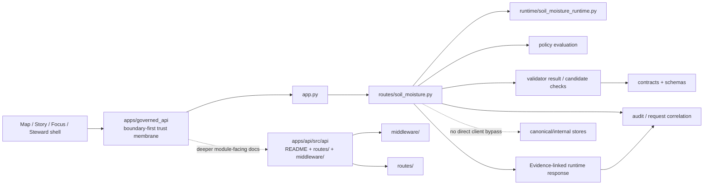

<!-- [KFM_META_BLOCK_V2]
doc_id: kfm://doc/NEEDS-VERIFICATION
title: apps/api/src/api
type: standard
version: v1
status: draft
owners: @bartytime4life
created: NEEDS-VERIFICATION
updated: 2026-04-15
policy_label: NEEDS-VERIFICATION
related: [
  ../../README.md,
  ../README.md,
  ../../../governed_api/README.md,
  ../../../governed_api/app.py,
  ../../../governed_api/routes/soil_moisture.py,
  ../../../governed_api/runtime/soil_moisture_runtime.py,
  ./routes/README.md,
  ./middleware/README.md,
  ../../tests/README.md,
  ../../../../contracts/README.md,
  ../../../../contracts/source/kansas_mesonet_source_descriptor.md,
  ../../../../contracts/soil_moisture/reading.schema.json,
  ../../../../schemas/README.md,
  ../../../../schemas/contracts/README.md,
  ../../../../schemas/contracts/v1/runtime/runtime_response_envelope.schema.json,
  ../../../../schemas/soil_moisture/README.md,
  ../../../../policy/README.md,
  ../../../../tests/README.md,
  ../../../../tests/e2e/runtime_proof/soil_moisture/README.md,
  ../../../../tests/e2e/runtime_proof/soil_moisture/test_runtime_soil_moisture_proof.py,
  ../../../../tests/e2e/runtime_proof/soil_moisture/test_runtime_route_soil_moisture.py,
  ../../../../tests/e2e/runtime_proof/test_governed_api_app.py,
  ../../../../tools/ci/render_runtime_proof_summary.py,
  ../../../../.github/CODEOWNERS,
  ../../../../.github/workflows/README.md
]
tags: [kfm, apps, api, routes, middleware, runtime, trust-membrane, soil-moisture]
notes: [
  This revision preserves the stronger old deeper-API README while reconciling it explicitly with the current thin-slice governed API app, route, and runtime surfaces added in-session.
  The older surfaced draft referenced ../../../governed-api/README.md while the current thin slice uses ../../../governed_api/README.md. That path split remains NEEDS VERIFICATION and is kept visible here.
  Mounted subtree inspection beyond the supplied old README and the in-session thin slice was not available; keep concrete handler, DTO, and middleware inventory claims bounded to what is actually surfaced.
]
[/KFM_META_BLOCK_V2] -->

<a id="top"></a>

# `apps/api/src/api`

Deeper API-module README for KFM route families, middleware seams, evidence-first response shaping, and verification-first maintenance inside the `apps/api/` subtree.

> [!NOTE]
> **Status:** experimental  
> **Owners:** `@bartytime4life` *(fallback via [`../../../../.github/CODEOWNERS`](../../../../.github/CODEOWNERS); subtree-specific ownership still needs verification)*  
> **Path:** `apps/api/src/api/README.md`  
>       
> **Quick jumps:** [Scope](#scope) · [Repo fit](#repo-fit) · [Inputs](#inputs) · [Exclusions](#exclusions) · [Directory tree](#directory-tree) · [Quickstart](#quickstart) · [Usage](#usage) · [Diagram](#diagram) · [Tables](#reference-tables) · [Task list](#task-list--definition-of-done) · [FAQ](#faq) · [Appendix](#appendix)  
> **Repo fit:** `apps/api/src/api/README.md` → app-root [`../../README.md`](../../README.md) · source subtree [`../README.md`](../README.md) · boundary sibling [`../../../governed_api/README.md`](../../../governed_api/README.md) · routes [`./routes/README.md`](./routes/README.md) · middleware [`./middleware/README.md`](./middleware/README.md) · tests [`../../tests/README.md`](../../tests/README.md) · upstream contract/policy/schema/test surfaces [`../../../../contracts/README.md`](../../../../contracts/README.md), [`../../../../schemas/README.md`](../../../../schemas/README.md), [`../../../../schemas/contracts/README.md`](../../../../schemas/contracts/README.md), [`../../../../policy/README.md`](../../../../policy/README.md), [`../../../../tests/README.md`](../../../../tests/README.md)  
> **Accepted here:** deeper API-lane structure, route-family taxonomy, middleware boundary rules, response-envelope expectations, app-local verification-first editing guidance, and subtree navigation.  
> **Not here:** whole-boundary doctrine already owned by [`../../../governed_api/README.md`](../../../governed_api/README.md), direct storage logic, policy authoring, guessed package-manager or port claims, or endpoint inventories not proven on the branch under review.

> [!IMPORTANT]
> This README should stay **implementation-facing** without pretending that doctrine, sibling docs, or historical snapshots are proof of current mounted runtime depth.

> [!WARNING]
> If the checked-out branch only proves scaffolding, describe scaffolding.  
> Do not turn route-family doctrine into a claim that concrete handlers, DTOs, middleware, or tests are already complete.

> [!TIP]
> In KFM, even this deeper API module surface still sits **inside the trust membrane**.  
> Route and middleware notes must preserve policy evaluation, evidence resolution, release linkage, correction visibility, and fail-closed behavior.

---

## Scope

This directory is the deeper API-module lane beneath `apps/api/`. It should explain how local route groups, middleware seams, response shaping, and subtree-facing conventions fit together **after** the governed API boundary has already established the larger trust model.

This file is not the place to restate all of KFM doctrine or to invent runtime facts that the branch does not prove. Its job is narrower and more practical:

1. make the local subtree easier to inspect,
2. keep route and middleware responsibilities clean,
3. preserve evidence-first response behavior, and
4. stop adjacent docs from collapsing into one blurry “API” surface.

### What changed in the current thin slice

The older README already treated this path as the deeper implementation-facing API surface. The current thin slice now makes that split more concrete:

- `apps/governed_api/README.md` is the boundary-first trust membrane README
- `apps/governed_api/app.py` is app assembly
- `apps/governed_api/routes/soil_moisture.py` is a real route surface
- `apps/governed_api/runtime/soil_moisture_runtime.py` is a real runtime envelope builder

That means this README now has a clearer job: explain how a deeper API-module surface should relate to those mounted-style governed API files **without duplicating them** and without pretending the whole `apps/api/src/api/` subtree is already equally complete.

### Truth posture used in this README

| Label | Meaning here |
|---|---|
| **CONFIRMED** | Visible in the supplied subtree docs or directly established by adjacent repo docs and the current thin-slice app/runtime work. |
| **INFERRED** | Strongly implied by adjacent KFM API docs and current subtree shape, but not directly proven by mounted implementation files in this directory. |
| **PROPOSED** | Recommended documentation shape or future-facing structure that should only be adopted if branch evidence supports it. |
| **NEEDS VERIFICATION** | Likely important, but not yet proven on the branch under review. |
| **UNKNOWN** | Not verifiable from the current subtree and surrounding docs alone. |

### Stable local laws carried into this subtree

| Rule | Local consequence |
|---|---|
| **Trust membrane stays intact** | No client-facing shortcut language that implies direct storage access, policy bypass, or evidence bypass. |
| **Truth path still matters** | Route notes may reference released scope and derived delivery, but must not quietly promote browsing assets into canonical truth. |
| **Evidence is operational** | Responses should either carry evidence linkage directly or make the `EvidenceRef → EvidenceBundle` path explicit. |
| **Fail closed** | `ANSWER`, `ABSTAIN`, `DENY`, `ERROR`, stale-visible, and correction-linked outcomes are valid contract behavior. |
| **Branch proof outranks prose confidence** | Startup commands, ports, handlers, DTOs, and route inventories belong here only after they are visible on the target branch. |
| **Boundary vs implementation split stays explicit** | `apps/governed_api/README.md` owns trust-boundary doctrine; this file owns deeper subtree organization and local implementation guidance. |

[Back to top](#top)

---

## Repo fit

This file lives at a seam that is easy to misread, so the repo relationship needs to stay explicit.

| Surface | Role | Why it matters here |
|---|---|---|
| [`../../README.md`](../../README.md) | App-root API README | Owns subtree identity, high-level API fit, and app-level constraints. |
| [`../README.md`](../README.md) | `src/` subtree README | Should explain how the broader source subtree is partitioned once it is populated. |
| [`../../../governed_api/README.md`](../../../governed_api/README.md) | Boundary-first sibling README | Owns the governed API boundary, route-family law, trust membrane framing, and public/internal surface split. |
| [`../../../governed_api/app.py`](../../../governed_api/app.py) | Thin-slice app assembly | Current mounted-style governed app surface for the soil-moisture runtime slice. |
| [`../../../governed_api/routes/soil_moisture.py`](../../../governed_api/routes/soil_moisture.py) | Thin-slice route surface | Current request handler / route wrapper for the governed soil-moisture path. |
| [`../../../governed_api/runtime/soil_moisture_runtime.py`](../../../governed_api/runtime/soil_moisture_runtime.py) | Thin-slice runtime surface | Current outward envelope builder for the governed runtime slice. |
| [`./routes/README.md`](./routes/README.md) | Route-layer child doc | Owns route registration, request parsing, policy invocation, and response-shaping conventions once deeper route docs are present. |
| [`./middleware/README.md`](./middleware/README.md) | Middleware child doc | Owns cross-cutting request/response concerns once there is more than a reserved scaffold. |
| [`../../tests/README.md`](../../tests/README.md) | App-local tests README | Should own app-local test scope once it is no longer a placeholder surface. |
| [`../../../../contracts/README.md`](../../../../contracts/README.md) | Upstream contract lane | Where endpoint and payload contracts belong once explicitly surfaced. |
| [`../../../../schemas/contracts/README.md`](../../../../schemas/contracts/README.md) | Schema lane | Where request/response/example fixtures should eventually become machine-checkable. |
| [`../../../../policy/README.md`](../../../../policy/README.md) | Policy lane | Policy definition lives there, not here. This subtree should invoke policy, not author it. |
| [`../../../../tests/e2e/runtime_proof/soil_moisture/README.md`](../../../../tests/e2e/runtime_proof/soil_moisture/README.md) | Runtime-proof lane | Provides the strongest current proof burden for the thin-slice governed runtime. |

### Current subtree signal

| Path | Current role | Reading note |
|---|---|---|
| `apps/api/src/api/README.md` | Local owner document | This file should explain the subtree without overclaiming runtime depth. |
| `apps/api/src/api/routes/README.md` | Most specific child guidance currently visible | Read this first when documenting route grouping or request flow in this subtree. |
| `apps/api/src/api/middleware/README.md` | Reserved seam | Keep expectations modest until a real middleware inventory exists. |
| `apps/governed_api/**` | Current thin-slice concrete runtime path | These files now absorb some “deeper API” burden the old docs only described abstractly. |
| `apps/api/src/api/**` beyond the three surfaced docs | **NEEDS VERIFICATION** | Do not imply handlers, DTOs, errors, or adapters exist unless the target branch proves them. |

### Reconciliation rule

The current safest reading is:

- `apps/governed_api/README.md` = **boundary-first**
- `apps/api/src/api/README.md` = **deeper module-facing**
- `apps/governed_api/routes/*.py` and `apps/governed_api/runtime/*.py` = **current thin-slice implementation**

That means this README should now explicitly point to the concrete governed runtime files where they exist, while keeping this subtree’s broader future shape visible and branch-bounded.

[Back to top](#top)

---

## Inputs

These inputs belong here because they help maintain or explain the deeper API lane without inflating branch reality.

| Accepted input | What “good” looks like |
|---|---|
| Verified local tree snapshots | Real file/directory inventory for `apps/api/src/api/` on the working branch. |
| Route-family grouping notes | Clear mapping from doctrine-backed route families to local route organization. |
| Middleware responsibilities | Cross-cutting concerns such as auth context, audit correlation, request normalization, or stale/correction headers — but only when branch files exist. |
| Response-shaping guidance | Outcome rules, envelope expectations, evidence-link requirements, and local error/denial/abstention behavior. |
| Adjacent-doc reconciliation | Tight coordination with `apps/api/README.md`, `apps/governed_api/README.md`, and `routes/README.md`. |
| Local inspection commands | Safe, reproducible commands that verify the subtree before making claims. |
| Branch-backed examples | Minimal request/response examples anchored to visible code, contracts, or fixtures. |
| Mounted thin-slice governed API references | Explicit links to `app.py`, route handlers, runtime builders, and tests that now exist in the current slice. |

---

## Exclusions

This README gets weaker, not stronger, if it tries to own everything around it.

| Exclusion | Where it should go instead |
|---|---|
| Whole-system trust doctrine | [`../../../governed_api/README.md`](../../../governed_api/README.md) and higher-order KFM architecture docs |
| App-wide ownership / runtime boot details | [`../../README.md`](../../README.md) once verified on the target branch |
| Policy definitions and reason registries | [`../../../../policy/README.md`](../../../../policy/README.md) |
| Contract and schema source of truth | [`../../../../contracts/README.md`](../../../../contracts/README.md) and [`../../../../schemas/contracts/README.md`](../../../../schemas/contracts/README.md) |
| Direct database or object-store access guidance | Repository/use-case docs, not route or middleware docs |
| ETL, indexing, or catalog build logic | package-level ingest/catalog/indexer surfaces |
| Guessed endpoint inventory | Only after visible route files, OpenAPI, or tests confirm it |
| Ports, env vars, or scripts not proven here | App-root or runtime docs after verification |
| Re-describing the current soil-moisture route in full | [`../../../governed_api/routes/soil_moisture.py`](../../../governed_api/routes/soil_moisture.py) and its tests |

[Back to top](#top)

---

## Directory tree

### Current verified snapshot from the old subtree README

```text
apps/api/src/api/
├── README.md
├── middleware/
│   └── README.md
└── routes/
    └── README.md
```

### Current thin-slice neighboring implementation snapshot

```text
apps/governed_api/
├── README.md
├── app.py
├── routes/
│   ├── __init__.py
│   └── soil_moisture.py
└── runtime/
    └── soil_moisture_runtime.py
```

### How to read these trees together

- `apps/api/src/api/README.md` should explain the **deeper API module surface**.
- `apps/api/src/api/routes/` should explain how route groups are organized and what they are allowed to do.
- `apps/api/src/api/middleware/` should explain request/response cross-cuts once there is more than a reserved scaffold.
- `apps/governed_api/` currently carries the **real thin-slice governed runtime implementation**.
- Anything deeper than those surfaced paths is **NEEDS VERIFICATION** until the branch under review exposes it.

### Reading order

1. [`../../../governed_api/README.md`](../../../governed_api/README.md)
2. [`../../README.md`](../../README.md)
3. [`../../../governed_api/routes/soil_moisture.py`](../../../governed_api/routes/soil_moisture.py)
4. [`../../../governed_api/runtime/soil_moisture_runtime.py`](../../../governed_api/runtime/soil_moisture_runtime.py)
5. [`./routes/README.md`](./routes/README.md)
6. [`./middleware/README.md`](./middleware/README.md)
7. this file
8. upstream contracts, schemas, policy, and tests

[Back to top](#top)

---

## Quickstart

This README is easiest to maintain when branch inspection happens **before** prose changes.

### 1) Verify the local subtree

```bash
find apps/api/src/api -maxdepth 3 -type f | sort
find apps/governed_api -maxdepth 3 -type f | sort
```

### 2) Re-read the adjacent owner docs

```bash
sed -n '1,260p' apps/governed_api/README.md 2>/dev/null || true
sed -n '1,260p' apps/api/README.md 2>/dev/null || true
sed -n '1,260p' apps/api/src/api/routes/README.md 2>/dev/null || true
sed -n '1,160p' apps/api/src/api/middleware/README.md 2>/dev/null || true
sed -n '1,220p' apps/governed_api/app.py 2>/dev/null || true
sed -n '1,260p' apps/governed_api/routes/soil_moisture.py 2>/dev/null || true
sed -n '1,260p' apps/governed_api/runtime/soil_moisture_runtime.py 2>/dev/null || true
```

### 3) Re-check the upstream contract and policy lanes

```bash
find contracts schemas policy tests -maxdepth 3 -type f | sort | sed -n '1,220p'
```

### 4) Only then add branch-specific runtime notes

```bash
# Example verification loop once concrete files exist
find apps/api/src/api -maxdepth 4 \( -name '*.ts' -o -name '*.tsx' -o -name '*.js' -o -name '*.mjs' -o -name '*.py' \) | sort
```

> [!TIP]
> Keep local inspection commands here.  
> Put guessed boot commands, ports, and framework assumptions somewhere else — or nowhere yet.

[Back to top](#top)

---

## Usage

### Responsibility split across the two API doc surfaces

| Surface | Owns | Must not quietly become |
|---|---|---|
| `apps/governed_api/README.md` | trust membrane, public/internal boundary posture, finite runtime doctrine, app-level governed fit | low-level route inventory or subtree-local organization doc |
| `apps/api/src/api/README.md` | local subtree navigation, route-family framing, middleware seams, response-shaping expectations | whole-system doctrine or unverified endpoint inventory |
| `apps/governed_api/routes/*.py` | current thin-slice request handling | policy authoring, storage logic, or release-proof lane |
| `apps/governed_api/runtime/*.py` | current thin-slice runtime envelope assembly | promotion logic, source fetching, or schema ownership |
| `apps/api/src/api/routes/README.md` | route registration, request parsing/validation, policy invocation, response-return rules | business logic, direct storage access, policy authoring |
| `apps/api/src/api/middleware/README.md` | cross-cutting request/response concerns | a grab-bag for business logic or route-local hacks |
| `apps/api/README.md` | app-root fit and subtree boundary | low-level route or middleware detail |

### Request handling sequence

A good local API request path should read in this order:

1. **accept and normalize request context**  
   parse input, role context, scope, and versioning expectations.

2. **validate shape before work begins**  
   reject malformed input early and visibly.

3. **evaluate policy before serving data**  
   route logic should invoke policy, not postpone it to a downstream afterthought.

4. **call use-case or service code**  
   route code should orchestrate, not become the business layer.

5. **attach evidence linkage**  
   either return evidence-bearing data directly or keep the `EvidenceRef` path explicit.

6. **shape a bounded runtime outcome**  
   `ANSWER`, `ABSTAIN`, `DENY`, `ERROR`, stale-visible, generalized, or correction-linked behavior must remain visible.

7. **emit audit / correction / freshness cues**  
   release scope, stale state, correction linkage, and audit correlation are not optional decoration.

### Thin-slice current reading

For the current soil-moisture slice, the practical route is:

- boundary and app fit in `apps/governed_api/README.md`
- app assembly in `apps/governed_api/app.py`
- request handling in `apps/governed_api/routes/soil_moisture.py`
- runtime envelope assembly in `apps/governed_api/runtime/soil_moisture_runtime.py`
- route-level and app-level proof in runtime-proof tests

This subtree README should acknowledge that reality without pretending `apps/api/src/api/` already has a deeper mounted handler inventory matching that same depth.

### Local writing rule

When this subtree gains more files, update this README **after** confirming:

- what actually exists,
- what is child-owned by `routes/` or `middleware/`,
- which payload examples are backed by visible contracts, and
- which endpoint names are proven by code or tests.

[Back to top](#top)

---

## Diagram


```mermaid
flowchart LR
    Client["Map / Story / Focus / Steward shell"] --> Boundary["apps/governed_api<br/>boundary-first trust membrane"]
    Boundary --> App["app.py"]
    App --> RuntimeRoute["routes/soil_moisture.py"]
    RuntimeRoute --> Runtime["runtime/soil_moisture_runtime.py"]

    Boundary -. deeper module-facing docs .-> API["apps/api/src/api<br/>README + routes/ + middleware/"]
    API --> MW["middleware/"]
    API --> RTDocs["routes/"]

    RuntimeRoute --> Policy["policy evaluation"]
    RuntimeRoute --> Validator["validator result / candidate checks"]
    RuntimeRoute --> Evidence["Evidence-linked runtime response"]
    RuntimeRoute --> Audit["audit / request correlation"]

    Validator --> Contracts["contracts + schemas"]
    Evidence --> Audit
    RuntimeRoute -. no direct client bypass .-> Canon["canonical/internal stores"]
```

**Reading note:** this diagram is intentionally reconciliation-first. It shows where this subtree sits relative to the now-concrete `apps/governed_api/` thin slice, not a claim that every box is already populated by visible files under `apps/api/src/api/`.

[Back to top](#top)

---

## Reference tables

### Local surface matrix

| Surface | Current confidence | What can be said safely |
|---|---|---|
| `README.md` | **CONFIRMED** | This is the correct location for the deeper API-module README. |
| `routes/README.md` | **CONFIRMED** | Route responsibilities, exclusions, `/api/v1` versioning, and evidence-first response expectations are already documented there. |
| `middleware/README.md` | **CONFIRMED** | The middleware lane currently reads as reserved/empty, so inventory claims should stay modest. |
| `apps/governed_api/app.py` | **CONFIRMED in-session thin slice** | There is now a concrete thin-slice app assembly surface. |
| `apps/governed_api/routes/soil_moisture.py` | **CONFIRMED in-session thin slice** | There is now a concrete thin-slice route surface. |
| `apps/governed_api/runtime/soil_moisture_runtime.py` | **CONFIRMED in-session thin slice** | There is now a concrete thin-slice runtime surface. |
| concrete handler modules under `apps/api/src/api/` | **UNKNOWN** | Do not name them without branch proof. |
| concrete middleware implementations under `apps/api/src/api/` | **UNKNOWN** | Do not imply they exist because the folder exists. |
| broader OpenAPI or versioned router surface from this subtree | **NEEDS VERIFICATION** | Contract ownership is upstream; local wiring must be proven branch-by-branch. |

### Doctrine-backed route families for this subtree

These families are worth documenting here because they affect local route grouping and response behavior, but their **concrete implementation depth still needs verification** beyond the current soil-moisture thin slice.

| Route family | Primary local concern | Boundary profile to honor | Local status |
|---|---|---|---|
| Catalog and discovery | discovery endpoints, collection/item lookup, release metadata shaping | DCAT, STAC, OGC API Records, OpenAPI | doctrine-backed; concrete handler inventory **NEEDS VERIFICATION** |
| Feature or subject read | place/feature/detail reads | OGC API Features where fit; KFM-specific OpenAPI where needed | doctrine-backed; concrete implementation **NEEDS VERIFICATION** |
| Map / tile / portrayal | released maps, tiles, legends, style-linked outputs | OGC API Maps/Tiles plus internal portrayal contracts | doctrine-backed; concrete implementation **NEEDS VERIFICATION** |
| Evidence resolution | `EvidenceRef → EvidenceBundle` and sibling trust objects | KFM-specific governed API described in OpenAPI | doctrine-backed and central |
| Story / dossier / compare | narrative or comparison calls that remain inside the same shell | KFM-specific governed API | doctrine-backed |
| Export and report | policy-safe previews and packaged outward objects | governed API plus release-manifest references | doctrine-backed |
| Focus / governed assistance | bounded natural-language investigation over released scope | governed API plus runtime response envelope | doctrine-backed |
| Soil-moisture runtime | thin-slice governed runtime route | finite runtime envelope + validator + audit linkage | **CONFIRMED in-session thin slice** |
| Review / stewardship | moderation, quarantine, promotion, denial, rollback, rights handling | internal governed API, not a public route family | doctrine-backed |
| Ops / status | health, metrics, traces, audit joins | internal ops endpoints only | doctrine-backed; exact exposure **NEEDS VERIFICATION** |

### Runtime outcome cues

Exact contract files belong upstream, but the local subtree should still preserve these outcome classes visibly.

| Outcome | When it is valid | Minimum local burden |
|---|---|---|
| `ANSWER` | admissible released evidence supports the result | evidence linkage, release scope, audit/reference hooks |
| `ABSTAIN` | support is partial, missing, or not admissible enough | explicit limit, no bluffing prose, visible reason or scope note |
| `DENY` | policy, rights, sensitivity, or scope rules block the request | visible decision state without leaking protected details |
| `ERROR` | bounded runtime or dependency failure | request/audit correlation, non-deceptive failure shape |
| `stale-visible` | data may still be shown, but freshness burden must remain visible | stale cue, freshness basis, correction/rebuild linkage |
| `correction-linked` | a prior release or answer was superseded, narrowed, or withdrawn | correction notice or replacement linkage |

### Reconciliation cues that must stay visible

| Question | Current safest answer |
|---|---|
| Where is the trust membrane README? | `apps/governed_api/README.md` |
| Where is current thin-slice runtime implementation? | `apps/governed_api/app.py`, `routes/soil_moisture.py`, `runtime/soil_moisture_runtime.py` |
| Where should deeper route-family and middleware taxonomy live? | `apps/api/src/api/README.md`, `routes/README.md`, `middleware/README.md` |
| Should this file claim broad mounted endpoint depth? | No, not without branch proof |
| Should this file ignore the concrete governed runtime slice? | No, that would now be stale and misleading |

[Back to top](#top)

---

## Task list — definition of done

Use this checklist before treating this README as “finished” for a branch:

- [ ] top-of-file impact block matches the actual branch state
- [ ] subtree tree snapshot reflects the real checked-in paths
- [ ] `routes/` and `middleware/` descriptions match their current child docs
- [ ] relationship to `apps/governed_api/README.md` is explicitly documented
- [ ] any `/api/v1` naming here is backed by visible route docs, contracts, or tests
- [ ] endpoint or payload examples are linked to visible schemas/contracts where available
- [ ] no guessed ports, package-manager commands, or runtime flags slipped in
- [ ] no direct-storage or policy-authoring guidance is presented as route responsibility
- [ ] evidence linkage, stale/correction cues, and fail-closed outcomes remain visible
- [ ] current thin-slice governed runtime files are either linked correctly or intentionally omitted with explanation
- [ ] relative links resolve in GitHub
- [ ] adjacent docs that describe this subtree have been checked for drift

> [!CAUTION]
> A prettier README is **not** a completed README if it causes trust drift.  
> In this subtree, visual polish is subordinate to scope discipline and branch-backed truth.

[Back to top](#top)

---

## FAQ

### Why do both `apps/governed_api/README.md` and this file exist?

Because they solve different documentation problems. The governed-api README is boundary-first and system-facing. This file is subtree-facing and implementation-oriented.

### Does this file prove live endpoints exist?

No. It documents how this subtree should be read and maintained. Concrete endpoint claims need visible route files, contracts, or tests on the branch under review.

### If `apps/governed_api/routes/soil_moisture.py` exists, why not move everything there and delete this file?

Because a real thin-slice route does not eliminate the need for a deeper module-facing API subtree doc. It just makes the split clearer: boundary + mounted thin slice on one side, broader route/middleware taxonomy on the other.

### Should policy rules be written here?

No. This subtree should explain **where policy is invoked**. Policy definitions and registries belong in upstream policy lanes.

### Should startup commands, ports, or package-manager details live here?

Only when the target branch proves them and when this subtree is the right owner. Otherwise keep them out or move them to app-root/runtime docs.

### What if the branch already contains a deeper handler layout than this README describes?

Update the tree, responsibility split, and examples to match the branch. Do **not** force code to mimic placeholder documentation or stale neighboring snapshots.

### What if neighboring docs still describe this lane as thinner than it is?

Treat that as documentation drift to fix next. This file should stay internally honest, and adjacent owner docs should be aligned in the same series when possible.

[Back to top](#top)

---

## Appendix

<details>
<summary><strong>Illustrative response-envelope sketch (PROPOSED)</strong></summary>

This is an illustrative shape only.  
It belongs here as a reading aid, not as a substitute for upstream schemas or OpenAPI.

```jsonc
{
  "object_type": "RuntimeResponseEnvelope",
  "schema_version": "TBD",
  "request_id": "req_...",
  "audit_ref": "audit_...",
  "evaluated_at": "2026-04-08T00:00:00Z",
  "surface_class": "focus", // or catalog | feature_read | export | review
  "result": "ANSWER",       // or ABSTAIN | DENY | ERROR
  "surface_state": "current",
  "decision_ref": "decision_...",
  "data": {},
  "evidence_refs": ["evidence://..."],
  "policy": {
    "label": "public",
    "obligations": []
  },
  "freshness": {
    "state": "current"
  },
  "correction": null
}
```

### Helpful local reading rule

If this subtree eventually gains concrete envelope builders, serializers, or DTOs, document them here only after:

1. the files exist,
2. their owner surface is clear,
3. their schema authority is linked, and
4. a test or fixture proves the behavior.

</details>

<details>
<summary><strong>Illustrative local growth pattern (PROPOSED, not current tree proof)</strong></summary>

Only add these families if the branch actually surfaces them.

```text
apps/api/src/api/
├── README.md
├── middleware/
├── routes/
├── errors/          # API-facing error mappers
├── envelopes/       # runtime response shaping
├── versioning/      # /api/v1 helpers if needed
└── observability/   # request/audit correlation helpers
```

The point is not these exact names.  
The point is to keep local API responsibilities legible and to avoid hiding route, middleware, response, and observability logic inside arbitrary utility folders.

</details>

[Back to top](#top)
