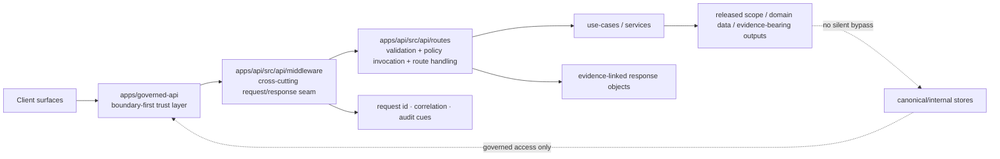

<!-- [KFM_META_BLOCK_V2]
doc_id: kfm://doc/<uuid-TBD>
title: API Middleware README
type: standard
version: v1
status: draft
owners: @bartytime4life
created: YYYY-MM-DD
updated: 2026-04-11
policy_label: public
related: ["../../../../governed-api/README.md", "../../../README.md", "../../README.md", "../README.md", "../routes/README.md"]
tags: [kfm, api, middleware, trust-membrane, evidence-first]
notes: ["Current public-main evidence confirms a reserved middleware seam with README-only scaffold.", "doc_id and created date need verification from the target branch before commit."]
[/KFM_META_BLOCK_V2] -->

# API Middleware

Cross-cutting request/response seam for the deeper governed API module.

> [!IMPORTANT]
> **Current public-main status:** this directory is presently a **reserved seam**, not a proven middleware inventory. Keep this README conservative until the target branch visibly adds real middleware files, tests, and contract-backed behavior.

---

## Impact

**Status:** experimental  
**Doc state:** draft  
**Owners:** `@bartytime4life` *(subtree-specific ownership beyond current public-main docs needs verification)*  
**Path:** `apps/api/src/api/middleware/README.md`


**Quick jump:** [Scope](#scope) · [Repo fit](#repo-fit) · [Inputs](#inputs) · [Exclusions](#exclusions) · [Directory tree](#directory-tree) · [Quickstart](#quickstart) · [Usage](#usage) · [Diagram](#diagram) · [Reference tables](#reference-tables) · [Task list](#task-list) · [FAQ](#faq) · [Appendix](#appendix)

**Repo fit:** lives under the deeper API module at [`../README.md`](../README.md), upstream of route handling at [`../routes/README.md`](../routes/README.md), and downstream of the boundary-first API posture documented in [`../../../../governed-api/README.md`](../../../../governed-api/README.md).

**Accepted here:** branch-backed documentation and files for cross-cutting request/response concerns that apply across multiple route families.

**Exclusions:** business logic, direct storage access, policy authorship, ETL/indexing work, and guessed framework/runtime claims.

---

## Scope

This directory exists for **API middleware-level concerns** inside the deeper `apps/api/src/api/` module surface.

In the current public-main tree, the seam is intentionally modest: a reserved directory with a README, not a confirmed implementation inventory. That means this document should do two things well:

1. preserve the current “reserved scaffold” truth, and  
2. describe **how to grow the seam without overclaiming** what already exists.

Middleware here should stay focused on **cross-cutting mechanics** that sit between the governed boundary posture and route-local handling. It should not become a grab bag for domain logic or a hidden path around policy, evidence resolution, or release-state cues.

[Back to top](#api-middleware)

---

## Repo fit

### Where this README sits

| Layer | Path | Role here |
|---|---|---|
| Boundary-first API doctrine | [`../../../../governed-api/README.md`](../../../../governed-api/README.md) | Owns trust membrane, governed-public-surface posture, and route-family consequences. |
| App lane | [`../../../README.md`](../../../README.md) | Sets scaffold-heavy / verification-first expectations for `apps/api/`. |
| Source subtree | [`../../README.md`](../../README.md) | Explains that API-module detail belongs first in `./api/README.md`. |
| Deeper API module | [`../README.md`](../README.md) | Owns route families, middleware seam expectations, and local module boundaries. |
| Sibling route seam | [`../routes/README.md`](../routes/README.md) | Owns route-local parsing, validation, policy invocation, and response entry points. |

### Upstream / downstream links

| Direction | Relative link | Why it matters |
|---|---|---|
| Upstream | [`../README.md`](../README.md) | This README should stay aligned with the deeper API module’s local rules and subtree map. |
| Upstream | [`../../../../governed-api/README.md`](../../../../governed-api/README.md) | Prevents middleware documentation from drifting into boundary-law or public-route overclaim. |
| Downstream | [`../routes/README.md`](../routes/README.md) | Routes are where request parsing, validation, and policy invocation are currently described. |
| Adjacent verification surfaces | [`../../../../../contracts/`](../../../../../contracts/) · [`../../../../../policy/`](../../../../../policy/) · [`../../../../../tests/`](../../../../../tests/) | Use these only when the branch visibly proves concrete middleware contracts, policy hooks, or tests. |

### Local interpretation rule

If a behavior can only be proved by a concrete middleware file, test, fixture, or branch-backed contract, this README should label it **NEEDS VERIFICATION**, **INFERRED**, or **PROPOSED** until that proof exists.

[Back to top](#api-middleware)

---

## Inputs

The following kinds of material belong here once the branch proves them:

- Cross-cutting request context handling shared by multiple routes.
- Shared response-shaping helpers for evidence, freshness, correction, or audit cues.
- Branch-backed error normalization utilities used by more than one route family.
- Request correlation or observability glue that is truly API-wide rather than route-local.
- Thin middleware tests that prove behavior without re-implementing policy or business logic.

### Input acceptance rule

A file belongs here when it is:

1. **cross-cutting**,  
2. **request/response oriented**,  
3. **used by multiple route paths**, and  
4. **not a hidden substitute** for explicit route, policy, or use-case logic.

---

## Exclusions

The following do **not** belong in this directory:

- **Business logic** or domain use cases.
- **Direct database, object-store, or canonical-store access**.
- **Policy definitions** or reason/obligation registries.
- **Route-local validation/parsing** that belongs in route handlers or contract adapters.
- **ETL, indexing, catalog, or projection build code**.
- **Framework-specific claims** that are not proven on the target branch.
- **“Magic” middleware** that silently changes release scope, rights posture, or evidence state.
- **Any documentation that implies a concrete inventory** when the tree still shows only a reserved seam.

> [!WARNING]
> Middleware must not become a bypass around the trust membrane. If a proposed file would let request handling skip governed policy evaluation, evidence linkage, or release-state shaping, it belongs elsewhere—or not at all.

[Back to top](#api-middleware)

---

## Directory tree

### Current verified public-main snapshot

```text
apps/api/src/api/
├── README.md
├── middleware/
│   └── README.md
└── routes/
    └── README.md
```

### Current local status at this path

```text
apps/api/src/api/middleware/
└── README.md
```

This means the **only confirmed artifact at this path on current public `main`** is this README itself.

---

## Quickstart

Use these read-only checks before upgrading any claim in this document:

```bash
find apps/api/src/api/middleware -maxdepth 3 -type f | sort

sed -n '1,240p' apps/governed-api/README.md
sed -n '1,240p' apps/api/README.md
sed -n '1,240p' apps/api/src/README.md
sed -n '1,280p' apps/api/src/api/README.md
sed -n '1,240p' apps/api/src/api/routes/README.md
sed -n '1,220p' apps/api/src/api/middleware/README.md
```

If the target branch introduces real middleware files, extend inspection before editing:

```bash
find apps/api/src/api -maxdepth 5 \
  \( -name '*.ts' -o -name '*.tsx' -o -name '*.js' -o -name '*.mjs' \) \
  | sort

find contracts policy tests -maxdepth 4 -type f | sort | sed -n '1,240p'
```

> [!TIP]
> Update this README **after** verifying the target branch tree, not before. The doc should follow the branch reality, not lead it by assumption.

[Back to top](#api-middleware)

---

## Usage

### What this seam is for

The public-main docs suggest a practical split:

- **Routes** own request parsing, validation, policy invocation, and use-case handoff.
- **Middleware** is the shared seam for request/response concerns that repeat across route families.
- **Use-cases/services** own domain behavior.
- **Governed API / boundary docs** own trust law and public-surface consequences.

### Truth posture for this directory

| Label | How to use it here |
|---|---|
| **CONFIRMED** | Visible in current branch files or directly stated in adjacent repo docs. |
| **INFERRED** | Strongly implied by parent/sibling docs, but not yet proven by a checked-in middleware file. |
| **PROPOSED** | Recommended shape for future implementation once the branch adds real files. |
| **NEEDS VERIFICATION** | Likely seam, but still lacking branch-backed proof of file shape, naming, or enforcement depth. |
| **UNKNOWN** | Not surfaced strongly enough to document as a real behavior or artifact. |

### Ownership split: routes vs middleware

| Concern | Preferred home | Local posture |
|---|---|---|
| Request parsing and contract validation | `routes/` | **CONFIRMED** by sibling route doc. |
| Policy invocation / decision call | `routes/` or shared explicit helper | **CONFIRMED** that routes own this today; middleware should not hide it. |
| Use-case / domain orchestration | use-cases / services | **CONFIRMED** exclusion from this seam. |
| Request ID / correlation ID attachment | `middleware/` | **INFERRED** cross-cutting fit. |
| Actor / auth context hydration | `middleware/` or boundary adapter | **INFERRED**; exact branch shape needs verification. |
| Error normalization | `middleware/` or shared response helper | **INFERRED**; likely seam, not yet proven here. |
| Response freshness / correction / stale-visible cues | `middleware/` or shared response helper | **PROPOSED** KFM-aligned seam. |
| Audit correlation hooks | `middleware/` | **INFERRED** from adjacent observability language. |
| Direct canonical-store access | nowhere in this seam | **CONFIRMED** exclusion by trust posture. |

### Practical sequence

A branch-backed middleware layer should normally help with this order:

1. establish request identity or correlation context,  
2. attach actor or request metadata if proven in branch code,  
3. hand off to routes for explicit validation and policy invocation,  
4. let routes call use-cases/services,  
5. normalize shared response cues on the way out,  
6. emit audit/trace linkage without becoming a second truth surface.

### Reserved-scaffold rule

Until concrete middleware files appear, this README should prefer statements like:

- “**reserved seam**”
- “**cross-cutting request/response concerns once proven in branch code**”
- “**likely ownership point**”
- “**needs verification before naming concrete files or hooks**”

…instead of naming specific modules as if they already exist.

[Back to top](#api-middleware)

---

## Diagram



> [!NOTE]
> This diagram shows the **intended seam relationship** implied by current docs. It is **not** proof that each box already has a checked-in implementation at this exact path.

[Back to top](#api-middleware)

---

## Reference tables

### Current evidence snapshot

| Question | Current answer |
|---|---|
| Is this directory present on current public `main`? | Yes. |
| Are concrete middleware files visible there on current public `main`? | No; only `README.md` is confirmed. |
| Does the parent API README explicitly mention middleware? | Yes. |
| Does the sibling routes README imply shared middleware as a seam? | Yes. |
| Does public-main evidence prove framework, runtime wiring, or middleware enforcement depth? | No. |

### Candidate middleware concern matrix

| Concern family | Why it fits here | Posture |
|---|---|---|
| Request correlation | Shared across route families; route doc already points to request/correlation observability glue. | **INFERRED** |
| Actor/request context | Often cross-cutting before route handling, but exact auth/session stack is unproven here. | **NEEDS VERIFICATION** |
| Error mapping | Shared response concern; keeps routes thinner when branch code proves reuse. | **INFERRED** |
| Freshness and correction cues | KFM favors visible stale/correction state; middleware may be a good response seam once proven. | **PROPOSED** |
| Audit linkage | Cross-cutting and non-domain; belongs here if branch code proves it. | **INFERRED** |
| Response-envelope normalization | Plausible KFM seam, but do not claim concrete runtime envelopes at this path without proof. | **PROPOSED** |

### Naming discipline

| Do | Avoid |
|---|---|
| Use stable KFM terms already present in adjacent docs. | Renaming the seam to generic framework jargon without evidence. |
| Say “reserved seam” when inventory is unproven. | Pretending the directory already contains a mature middleware stack. |
| Link upstream/downstream docs explicitly. | Making this README a floating, context-free module note. |
| Separate confirmed behavior from future build direction. | Flattening **CONFIRMED** and **PROPOSED** into one voice. |

[Back to top](#api-middleware)

---

## Task list

### Definition of done for the next real revision

- [ ] The directory tree in this README matches the target branch exactly.
- [ ] Every concrete middleware file named here is visible in the branch.
- [ ] Any claimed behavior is backed by code, tests, fixtures, or adjacent contract docs.
- [ ] Route-vs-middleware ownership remains explicit and non-overlapping.
- [ ] No direct-storage or business-logic bypass is implied.
- [ ] Framework/package-manager/runtime details appear only when branch evidence proves them.
- [ ] Upstream links to governed API, app, source, parent API, and sibling routes docs remain valid.
- [ ] This README is updated whenever middleware structure changes.

### Review gates worth applying

- [ ] Tree check passes.
- [ ] Relative links resolve.
- [ ] Mermaid diagram still matches documented ownership.
- [ ] Any new middleware claims are labeled **CONFIRMED**, **INFERRED**, **PROPOSED**, **UNKNOWN**, or **NEEDS VERIFICATION**.
- [ ] Adjacent README wording still aligns with this file.

[Back to top](#api-middleware)

---

## FAQ

### Why is this README more detailed than the current directory contents?

Because the seam is real in the architecture, but the current public-main inventory is still thin. This README makes the seam reviewable **without pretending it is already implemented**.

### Why not list specific middleware filenames?

Because current public-main evidence does not prove them. Listing them now would turn documentation into speculation.

### Does middleware own policy decisions?

No. Adjacent route docs place validation and policy invocation with route handling or explicit shared helpers. Middleware may support context or response shaping, but it should not hide policy law.

### Does this README prove a runnable API stack?

No. Public-main app docs explicitly keep commands, ports, endpoint depth, and runtime guarantees at **NEEDS VERIFICATION** unless the target branch proves them.

### When should this README become more concrete?

As soon as the target branch adds real middleware files, tests, fixtures, or contracts—and not earlier.

[Back to top](#api-middleware)

---

## Appendix

<details>
<summary><strong>Read-only verification checklist</strong></summary>

### Branch inspection

```bash
git rev-parse --abbrev-ref HEAD
git status --short
find apps/api/src/api/middleware -maxdepth 5 -type f | sort
find apps/api/src/api/routes -maxdepth 5 -type f | sort
```

### Adjacent docs

```bash
sed -n '1,260p' apps/governed-api/README.md
sed -n '1,260p' apps/api/README.md
sed -n '1,260p' apps/api/src/README.md
sed -n '1,320p' apps/api/src/api/README.md
sed -n '1,260p' apps/api/src/api/routes/README.md
```

### Contracts / policy / tests

```bash
find contracts policy tests -maxdepth 4 -type f | sort | sed -n '1,260p'
```

</details>

<details>
<summary><strong>PROPOSED starter inventory once the seam becomes real</strong></summary>

```text
apps/api/src/api/middleware/
├── request-id.*
├── actor-context.*
├── error-normalization.*
├── response-cues.*
└── audit-correlation.*
```

These names are illustrative only. Keep or replace them based on the actual branch tree.

</details>

<details>
<summary><strong>Editing note for future maintainers</strong></summary>

Preserve this baseline idea from the original placeholder:

- this directory is a reserved scope,
- structure claims should stay modest until real files exist,
- parent-directory contracts and test expectations still govern additions,
- and this README should change whenever the directory structure changes.

</details>
