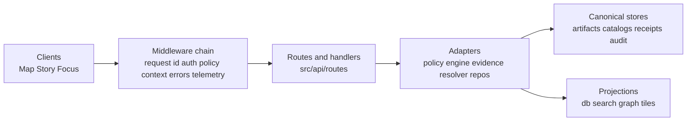

<!-- [KFM_META_BLOCK_V2]
doc_id: kfm://doc/588c304c-d8f1-4564-92fc-d823d7a8d409
title: KFM Governed API Middleware — src/api/middleware
type: standard
version: v1
status: draft
owners: TBD
created: 2026-03-03
updated: 2026-03-03
policy_label: public
related:
  - apps/api/src/api/README.md
  - README.md
tags: [kfm, api, middleware, policy, audit, trust-membrane]
notes:
  - Cross-cutting enforcement layer for the governed API boundary (PEP).
  - Treat changes here as governance-critical.
[/KFM_META_BLOCK_V2] -->

# KFM Governed API Middleware — `src/api/middleware`
Cross-cutting **enforcement + context plumbing** for the governed API boundary (“PEP”): request IDs, auth/policy context, policy-safe errors, and audit-ready telemetry.

**Status:** draft • **Policy posture:** fail-closed / default-deny • **Owners:** TBD  


> **TODO (repo wiring):** Replace CI/coverage badges with real pipeline links once known.

## Navigation
- [Purpose](#purpose)
- [Where this fits](#where-this-fits)
- [Non-negotiable invariants](#non-negotiable-invariants)
- [Middleware responsibilities](#middleware-responsibilities)
- [Recommended ordering](#recommended-ordering)
- [Context contract](#context-contract)
- [Error shaping](#error-shaping)
- [Audit and telemetry](#audit-and-telemetry)
- [How to add a middleware](#how-to-add-a-middleware)
- [Directory guide](#directory-guide)

---

## Purpose
This directory contains the **middleware layer** used by the governed API (`apps/api/src/api/`). Middleware exists to:

- enforce **consistent request handling** across all routes
- attach **policy-relevant context** (principal, role, purpose, request id)
- apply **fail-closed defaults** (reject ambiguous/unsafe inputs early)
- emit **audit-ready telemetry** (correlation IDs, policy-safe logs)
- provide **stable, policy-safe errors** (avoid existence leaks)

> [!IMPORTANT]
> Middleware is part of the **enforcement boundary**. Changes here can change platform behavior and must be reviewed like production configuration.

---

## Where this fits
`src/api/` is the **governed API boundary** (PEP) for Map / Story / Focus surfaces. This `middleware/` folder is the “cross-cutting layer” that runs **before** route handlers.  
See: [`../README.md`](../README.md) for the overarching contract and invariants.



---

## Non-negotiable invariants
If a middleware implementation conflicts with any of these, the implementation is wrong.

| Invariant | Meaning in practice | How we enforce it (expected) |
|---|---|---|
| **Default-deny / fail-closed** | Unknown/ambiguous inputs → reject or reduce scope | Tests + safe defaults + strict validation |
| **Policy-first** | Policy context exists before returning any governed data | Middleware extracts principal/role/purpose early |
| **No bypass** | Routes and downstream code must not “skip” policy context | Single entrypoint chain + lint/test conventions |
| **Policy-safe errors** | Public users must not infer restricted existence via error differences | Central error mapper + fixtures/tests |
| **Audit-ready** | Every governed operation can be correlated and investigated | `request_id` + `audit_ref` + structured logs |

---

## Middleware responsibilities
This is the intended “registry” for middleware in this directory.

> [!NOTE]
> Items below are **PROPOSED defaults**. If your branch already has middleware with different names/structures, keep the roles but update the registry + ordering.

| Middleware | Responsibility | Runs | Fail-closed behavior | Notes |
|---|---|---:|---|---|
| `requestId` | Create/propagate `request_id` (correlation) | all requests | If missing, generate; never accept invalid formats | Also attach to response headers |
| `requestLimits` | Limit body size / headers / timeouts (where supported) | all requests | Reject oversized requests | Prevent DoS / memory abuse |
| `normalize` | Canonicalize headers, query, path params | all requests | Reject invalid encodings | Keep deterministic parsing |
| `authContext` | Extract principal (JWT/session/API key) into request context | most requests | Missing/invalid token → anonymous or deny (route-dependent) | Do not do authorization here; only identity |
| `policyContext` | Build policy input (role, purpose, labels, requested resource) | governed routes | Missing context → deny | This is the PEP “input builder” |
| `rateLimit` | Rate limiting keyed by principal/ip/route | selected routes | Throttle/deny | Must be policy-aware if roles differ |
| `cors` | CORS headers (if browser clients exist) | all routes | Deny disallowed origins | Prefer allow-list; avoid `*` for non-public |
| `errorMapper` | Convert thrown errors to stable API error model | all requests | Always return policy-safe errors | Align 403/404 strategy with policy |
| `telemetry` | Structured logs + spans/metrics (policy-safe) | all requests | Redact sensitive fields | Prefer allow-list of log fields |

---

## Recommended ordering
Order matters. Prefer a single, explicit bootstrap list in the API entrypoint (so audit + errors are consistent).

**Recommended chain (outer → inner):**
1. `requestId`
2. `requestLimits`
3. `normalize`
4. `telemetry` (start span, attach `request_id`)
5. `cors` (if applicable)
6. `authContext`
7. `policyContext` (**before** route handlers)
8. `rateLimit` (after identity, before expensive work)
9. routes
10. `errorMapper` (wraps/terminates)

> [!WARNING]
> Do not register middleware “ad hoc” inside route modules. Enforcement must be centralized to avoid accidental bypass and to preserve a reproducible trust membrane.

---

## Context contract
Middleware should attach a **single, stable context object** to the request. The exact shape depends on your runtime, but the *roles* are stable.

### Minimal context shape (PROPOSED)
```ts
export type KfmRequestContext = {
  request_id: string;

  // Identity (who)
  principal?: {
    id: string;
    role: string;
    authn_method: "jwt" | "api_key" | "session" | "anonymous" | "service";
  };

  // Policy input (why/what)
  policy?: {
    purpose?: string;          // optional declared purpose
    policy_label?: string;     // if applicable for requested resource
    obligations?: string[];    // filled after decision, if used here
  };

  // For debugging + traceability
  route?: { method: string; path: string };
};
```

### Rules
- `request_id` MUST exist for every request and must be safe to log.
- `principal` MUST NOT include secrets (raw JWTs, API keys).
- `policy` MUST be sufficient to build a PDP input without reaching into route internals.
- Context MUST be attach-only; avoid mutating/overwriting in arbitrary places.

---

## Error shaping
All errors that reach clients must follow a **stable, policy-safe error model** (avoid existence leaks).

### Error payload (shape)
```json
{
  "error_code": "POLICY_DENY",
  "message": "This resource is not available for your role.",
  "request_id": "req_01H...",
  "audit_ref": "kfm://audit/entry/...",
  "remediation": {
    "hint": "Try a public dataset, broaden the time window, or request steward review."
  }
}
```

### Rules
- Errors MUST include `request_id`.
- Governed operations SHOULD include `audit_ref` (if the operation is audited).
- Align `403` / `404` behavior with policy rules to prevent restricted existence inference.
- Never serialize internal stack traces to clients by default.

---

## Audit and telemetry
Middleware is the best place to enforce **structured, redacted logging**.

### Allowed telemetry fields (PROPOSED allow-list)
- `request_id`
- `method`, `path_template` (avoid raw path if it can include sensitive IDs)
- `status_code`
- `duration_ms`
- `principal.role` (and optionally a hashed principal id)
- `policy.decision` (allow/deny) if available at this stage

> [!IMPORTANT]
> Logs and audit artifacts are themselves sensitive. Prefer “log less, but log deterministically.”

### Example log event (shape)
```json
{
  "at": "2026-03-03T12:00:00Z",
  "request_id": "req_01H...",
  "http": { "method": "GET", "path": "/api/v1/stac/items", "status": 200 },
  "principal": { "role": "public" },
  "timing_ms": 14
}
```

---

## How to add a middleware
### Definition of done (middleware)
- [ ] Has a single responsibility (auth context OR policy context OR error mapping, not “everything”)
- [ ] Documented in the [Middleware responsibilities](#middleware-responsibilities) table
- [ ] Registered in the central bootstrap in the correct [ordering](#recommended-ordering)
- [ ] Fail-closed default behavior defined (what happens when input is missing/invalid)
- [ ] Unit tests for parsing/normalization (pure functions, table-driven)
- [ ] Integration test proving it cannot be bypassed (route-level or server bootstrap test)
- [ ] Logging is policy-safe (redaction/allow-list)
- [ ] No new secrets introduced (no tokens stored in logs/context)

### Minimum verification steps (repo reality)
If anything in this README doesn’t match your branch:
1. Find the server bootstrap / router registration point.
2. Confirm where middleware is registered and in what order.
3. Confirm the error handling strategy (who catches thrown errors).
4. Confirm how policy input is constructed (what fields the PDP expects).
5. Update this README to match actual code paths (fail closed until reconciled).

---

## Directory guide
> This is a **directory documentation** section. Update it if/when the repo layout changes.

**This directory should contain only:**
- middleware implementations
- middleware factories and shared types
- tests for middleware
- this README

**It must NOT contain:**
- business/domain logic
- direct DB/storage access
- policy rules (policy belongs in `policy/` and is tested separately)
- route handlers

### Expected structure (PROPOSED)
```text
apps/api/src/api/middleware/                             # API middleware stack: request hygiene, identity/context, policy enforcement inputs, and policy-safe telemetry/errors
├─ README.md                                             # Middleware overview: ordering, responsibilities, invariants (default-deny), and testing notes
├─ index.ts                                              # Optional barrel export: re-exports middleware in a single import surface
├─ requestId.ts                                          # Request correlation ID: generate/propagate request_id for logs, spans, and audit linkage
├─ requestLimits.ts                                      # Request limits: body/header size caps + early rejection (DoS hardening; policy-safe errors)
├─ normalize.ts                                          # Normalization: parsing + canonicalization helpers (stable inputs for hashing/receipts/policy decisions)
├─ authContext.ts                                        # Auth context: extract principal/claims (who) from headers/session; attach to request context
├─ policyContext.ts                                      # Policy context: build PDP input (subject/action/resource/context) for downstream enforcement
├─ rateLimit.ts                                          # Rate limiting: throttling by principal/route/tier (policy-aware where applicable)
├─ cors.ts                                               # CORS: configured allowed origins/methods/headers (only if needed; keep restrictive defaults)
├─ errorMapper.ts                                        # Error shaping: stable, policy-safe errors (no restricted inference; consistent reason codes)
├─ telemetry.ts                                          # Telemetry: structured logs + spans (redaction-aware fields; low-cardinality; request_id propagation)
└─ __tests__/                                            # Middleware tests: ordering, defaults, deny-by-default behavior, and error-shape regression coverage
   └─ *.test.ts                                          # Unit tests for each middleware (synthetic inputs; deterministic assertions)
```

---

**Back to top:** [Navigation](#navigation)
