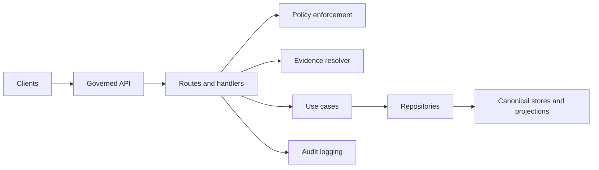

<!-- [KFM_META_BLOCK_V2]
doc_id: kfm://doc/640156a4-dc2e-4cf4-8cb2-fe36ad9051ec
title: API Routes (Governed API Boundary)
type: standard
version: v1
status: draft
owners: TODO(kfm): add owning team / oncall
created: 2026-02-27
updated: 2026-02-27
policy_label: public
related:
  - TODO(kfm): ../../README.md
  - TODO(kfm): ../../contracts/README.md
  - TODO(kfm): ../../../policy/README.md
tags: [kfm, api, routes, trust-membrane]
notes:
  - This README is intentionally “governance-first”: routes are part of the trust membrane.
  - Replace TODOs once repo conventions (router framework, contract tooling) are confirmed.
[/KFM_META_BLOCK_V2] -->

# `apps/api/src/api/routes/` — API Routes (Governed Boundary)

> **Purpose:** Define and register HTTP routes that form the **governed API boundary** for KFM.


---

## Navigation

- [What lives here](#what-lives-here)
- [Where this fits in the architecture](#where-this-fits-in-the-architecture)
- [Non-negotiable invariants](#non-negotiable-invariants)
- [Conventions](#conventions)
- [Adding a new route](#adding-a-new-route)
- [Response shape](#response-shape)
- [Error handling](#error-handling)
- [Testing and gates](#testing-and-gates)
- [Directory tree](#directory-tree)
- [Glossary](#glossary)

---

## What lives here

**This folder contains route modules** (and only route modules) that:

- Register paths + HTTP methods
- Perform **request parsing + validation** (shape, types, limits)
- Invoke **policy enforcement** (directly or via a shared middleware)
- Call into **use-cases / services** (business logic)
- Return **evidence-first responses** (or references to evidence resolution)

### Acceptable inputs

✅ Good fits:

- Route registration (e.g., `router.get('/…', handler)`)
- Pure request validation + normalization (no business logic)
- Calling a policy check / attaching policy decision metadata to the response
- Response mapping (DTO shaping) and HTTP status decisions
- Minimal per-route observability glue (request ID, timing, structured log fields)

### Exclusions

🚫 Do **not** put these here:

- Business logic (belongs in use-cases/services)
- Direct database / object-store access (must go through repositories)
- Policy logic definitions (belongs in policy bundle repo; routes only *invoke* policy)
- Data transforms / ETL / indexing
- “Convenient” bypasses (no hidden admin shortcuts in route handlers)

> **WARNING:** If a route talks directly to storage, policy can’t be enforced consistently and provenance becomes untrustworthy.

[Back to top](#appsapisrcapiroutes--api-routes-governed-boundary)

---

## Where this fits in the architecture

Routes are part of the **trust membrane**: the point where untrusted inputs (clients) become governed, policy-checked, evidence-bound outputs.



### Layering intent

- **Routes**: HTTP boundary + validation + policy checks + DTO mapping  
- **Use-cases/services**: domain logic and orchestration  
- **Repositories**: storage abstraction + query shaping + caching boundaries  
- **Stores**: canonical object store + catalogs/provenance; rebuildable projections (DB/search/tiles)

[Back to top](#appsapisrcapiroutes--api-routes-governed-boundary)

---

## Non-negotiable invariants

These are **hard rules** (encode as tests / lint where possible):

1. **Clients never access DB/object storage directly.** All access flows through governed APIs.
2. **Core logic never bypasses repository interfaces** to talk directly to storage.
3. **Policy is evaluated before serving data or resolving evidence.**
4. **Fail closed:** if policy denies, evidence is unresolvable, or licensing/sensitivity is unclear → deny or reduce scope.
5. **No metadata leakage** for restricted resources (avoid “confirming existence” in 403/404 messaging).
6. **Auditability:** every route that returns governed content must emit enough telemetry to reconstruct “who asked what” and “under which policy”.

[Back to top](#appsapisrcapiroutes--api-routes-governed-boundary)

---

## Conventions

> **NOTE:** Repo-specific details (router framework, folder naming, OpenAPI tooling) are **TODO** until confirmed.

### Route module naming

- Prefer **one route module per bounded API surface**, not per tiny endpoint.
- Name modules by **resource**, not implementation:
  - `catalog.*`
  - `datasets.*`
  - `tiles.*`
  - `evidence.*`
  - `lineage.*`
  - `focus.*`

### Versioning

- Prefer URL versioning: `/api/v1/...`
- Breaking changes require new major: `/api/v2/...`
- Additive fields are OK (backward compatible).

### Policy labels

KFM uses **policy labels + obligations** to control outputs. At the route layer:

- Always request a **policy decision** for the request context + target resource.
- Apply obligations consistently (redaction/generalization, field suppression, etc.).
- Attach policy metadata (at least `policy_label` and `decision`) to the response envelope where appropriate.

[Back to top](#appsapisrcapiroutes--api-routes-governed-boundary)

---

## Adding a new route

### Checklist (Definition of Done)

- [ ] Define the endpoint purpose + audience (public vs internal vs steward tools).
- [ ] Define **inputs** (params/body) and **output DTO** (what fields are allowed).
- [ ] Add or update **API contract** (OpenAPI/GraphQL/JSON Schema) — *if used in this repo*.
- [ ] Add route handler with:
  - [ ] request validation
  - [ ] policy check (deny-by-default on uncertainty)
  - [ ] call to use-case/service
  - [ ] evidence-first response mapping
- [ ] Ensure **no direct storage access** (must go through repositories).
- [ ] Add tests:
  - [ ] handler unit tests
  - [ ] contract tests (if applicable)
  - [ ] policy fixture tests for allow/deny + obligations (CI must match runtime)
- [ ] Add observability:
  - [ ] request id / correlation id
  - [ ] structured logs
  - [ ] latency + status metrics
  - [ ] audit log hook (where required)
- [ ] Update docs:
  - [ ] add module to the routes registry table (below)
  - [ ] add examples to this README (or module README if large)

### Minimal handler skeleton (pseudo)

```ts
// PSEUDO-CODE — adapt to your router framework
export async function handler(req, res) {
  // 1) Parse & validate
  const input = validate(req);

  // 2) Policy check (fail closed)
  const decision = await policy.check({
    actor: req.auth,
    action: "read",
    resource: input.resourceRef,
    context: { ip: req.ip, route: req.path }
  });
  if (decision.decision !== "allow") {
    return res.status(404).json({ error: "Not found" }); // avoid leakage
  }

  // 3) Run use-case
  const result = await useCase.execute(input, { policy: decision });

  // 4) Shape response (evidence-first)
  return res.status(200).json({
    data: result.data,
    evidence: result.evidenceRefs, // or include a resolved bundle if allowed
    policy: { label: decision.policy_label, obligations: decision.obligations_applied }
  });
}
```

[Back to top](#appsapisrcapiroutes--api-routes-governed-boundary)

---

## Response shape

Routes should aim for **evidence-first UX compatibility**:

- Return stable identifiers (`dataset_id`, `dataset_version_id`, etc.) when relevant.
- Provide **EvidenceRef** values when the UI needs “one-click evidence”.
- When returning downloadable artifacts, include **license + attribution** metadata (or a link to it).
- Prefer responses that can be verified: digests, version IDs, policy label.

### Evidence resolution (recommended pattern)

Instead of embedding large evidence blobs everywhere:

1. Return **EvidenceRef(s)** in the primary response
2. UI calls `evidence/resolve` to render a bundle card (policy-checked)

This keeps response bodies smaller and makes the evidence drawer consistent.

[Back to top](#appsapisrcapiroutes--api-routes-governed-boundary)

---

## Error handling

### General rules

- **Fail closed** on uncertainty.
- Avoid “helpful” errors that leak restricted data (existence, titles, IDs).
- Prefer consistent error shapes.

### Recommended HTTP codes (guidance)

| Scenario | Preferred status | Notes |
|---|---:|---|
| Invalid input | 400 | Provide validation details; do not echo sensitive fields |
| Unauthenticated | 401 | Do not reveal resource existence |
| Unauthorized / restricted | 404 (or 403) | Use patterns that minimize existence leakage |
| Not found (public) | 404 | Normal |
| Policy obligation requires reduction | 200 | Return generalized output + policy notice |
| Internal error | 500 | Include request id; log details server-side |

> **TIP:** Use a shared error helper so routes don’t drift in behavior.

[Back to top](#appsapisrcapiroutes--api-routes-governed-boundary)

---

## Testing and gates

Routes are a high-risk surface. Prefer “guardrails by CI”:

### Required (baseline)

- Unit tests for handlers (validation + status codes + DTO mapping)
- Policy fixture tests (allow/deny + obligations)
- Contract tests (if the repo uses an API contract artifact)
- Lint rules to prevent direct imports of low-level storage clients in routes

### Recommended (production posture)

- Integration tests that run against a real policy engine configuration
- Snapshot tests for error payload shapes
- Link-checker tests for evidence/cross-links when applicable

[Back to top](#appsapisrcapiroutes--api-routes-governed-boundary)

---

## Directory tree

> **UNKNOWN:** The exact contents of this folder are not enumerated here (not yet generated from the repo).

### Generate the current tree

Run from repo root:

```bash
tree apps/api/src/api/routes -a -I "node_modules|dist|build"
```

### Example layout (PROPOSED)

<details>
<summary>Click to expand proposed structure</summary>

```text
apps/api/src/api/routes/
  README.md
  index.ts                # route registry (mounts all route modules)
  health.ts               # liveness/readiness endpoints (no sensitive info)
  v1/
    catalog.ts            # dataset discovery
    datasets.ts           # dataset query endpoints
    tiles.ts              # tile delivery
    evidence.ts           # evidence resolution
    lineage.ts            # provenance/lineage APIs
    focus.ts              # cite-or-abstain Q&A
```

</details>

[Back to top](#appsapisrcapiroutes--api-routes-governed-boundary)

---

## Route registry

> Update this table whenever you add/remove a route module.

| Module | Audience | Policy posture | Notes |
|---|---|---|---|
| `health` | public | no data access | Must not leak config/secrets |
| `catalog` | public+internal | filter/hide restricted | Drives discovery |
| `datasets` | public+internal | enforce obligations | Query slicing by bbox/time/filters |
| `tiles` | public+internal | policy-safe tiles only | Cache varies by auth/policy |
| `evidence` | public+internal | fail closed | Resolve EvidenceRef → EvidenceBundle |
| `lineage` | internal+steward | redact sensitive | Show run receipts, policy versions |
| `focus` | public+internal | must cite or abstain | Always produces an audit record |

---

## Glossary

- **Trust membrane:** the boundary that ensures all access flows through governed APIs and repository interfaces.
- **PDP (Policy Decision Point):** component that evaluates policy (e.g., OPA).
- **PEP (Policy Enforcement Point):** component that calls PDP and enforces allow/deny + obligations.
- **EvidenceRef:** stable reference to evidence (scheme-based).
- **EvidenceBundle:** resolved evidence card + machine metadata + digests + audit refs.
- **Obligations:** required transforms or restrictions applied to outputs (redaction/generalization, field suppression, etc.).

[Back to top](#appsapisrcapiroutes--api-routes-governed-boundary)
