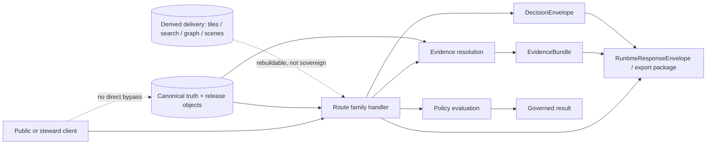

<!-- [KFM_META_BLOCK_V2]
doc_id: kfm://doc/NEEDS-UUID
title: API Routes
type: standard
version: v1
status: draft
owners: NEEDS VERIFICATION
created: YYYY-MM-DD
updated: YYYY-MM-DD
policy_label: NEEDS VERIFICATION
related: [NEEDS VERIFICATION]
tags: [kfm, api, routes, governed-api]
notes: [Current-session workspace evidence was PDF-only; route-tree, file-level, and implementation claims under this path remain UNKNOWN until repo verification.]
[/KFM_META_BLOCK_V2] -->

# API Routes

_This directory explains how KFM route families should expose governed API behavior without bypassing evidence, policy, release state, or correction lineage._

> [!IMPORTANT]
> **Evidence boundary for this README**
>
> KFM doctrine for route families is **CONFIRMED** from the attached architecture corpus.  
> The **mounted repository tree for `apps/api/src/api/routes/` was not directly visible** in this session.
>
> Read any folder names, adjacency paths, and local file suggestions below as:
>
> - **CONFIRMED** when they describe doctrine, trust obligations, or contract expectations
> - **PROPOSED** when they describe a likely repo-local structure
> - **UNKNOWN / NEEDS VERIFICATION** when they would require direct repo inspection

> **Status:** Draft  
> **Owners:** NEEDS VERIFICATION  
> 
> 
> 
> 
>
> **Quick jump:** [Scope](#scope) · [Repo fit](#repo-fit) · [Accepted inputs](#accepted-inputs) · [Exclusions](#exclusions) · [Directory tree](#directory-tree-proposed-until-repo-verification) · [Quickstart](#quickstart) · [Route families](#route-families-and-trust-obligations) · [Definition of done](#definition-of-done) · [FAQ](#faq)

---

## Scope

This README is the maintainer-facing guide for KFM API route families.

Its job is to keep one thing crisp:

**a route is not just an HTTP entrypoint; it is a governed surface with evidence, policy, release, and correction consequences.**

That means this directory should help reviewers answer:

- Which route family is this behavior part of?
- What may this route expose?
- What must this route never bypass?
- Which proof objects and contracts must travel with it?
- Which negative outcomes are valid and expected?
- Which docs, tests, and rollback/correction materials must be updated with it?

[Back to top](#api-routes)

## Repo fit

**Path:** `apps/api/src/api/routes/`

**Role in repo:** documentation and organizational spine for governed API handler families.

**Upstream dependencies:**  
`contracts/`, `policy/`, public/internal API descriptions, release/correction doctrine, and route-family trust rules are all **CONFIRMED as architectural dependencies** but **UNVERIFIED as mounted repo paths** in this session.

**Likely adjacent materials (PROPOSED / NEEDS VERIFICATION):**

- `apis/public/openapi.yaml`
- `apis/internal/README.md`
- `contracts/`
- `policy/`
- `tests/e2e/runtime_proof/`
- `tests/e2e/correction/`
- `observability/`
- `ui/evidence_drawer_payloads.json`
- `ui/focus_envelope_examples/`

**Downstream consumers (CONFIRMED doctrinal surfaces):**

- Map Explorer
- Timeline
- Dossier
- Story surface
- Evidence Drawer
- Focus Mode
- Review / Stewardship
- Compare
- Export

Those surfaces are doctrinally downstream of governed API behavior even where their exact component imports or route wiring remain unverified.

## Accepted inputs

This directory should contain or reference material such as:

- family-level route folders and their local `README.md` files
- handler notes for public vs internal route behavior
- family-level contract references
- route-specific trust obligations
- reason/obligation code usage notes
- pointers to runtime-proof and correction tests
- notes on release linkage, policy posture, and correction behavior

### What belongs here

| Item | Belongs here? | Why |
|---|---:|---|
| Route family docs | Yes | This is the route-family navigation surface |
| Handler organization notes | Yes | Helps keep public/internal boundaries visible |
| Family-level contract pointers | Yes | Routes should advertise their trust dependencies |
| Route-level trust rules | Yes | Prevents handler logic from drifting from doctrine |
| OpenAPI references | Yes, as pointers | API descriptions should be linked from here |
| Example negative outcomes | Yes | `ABSTAIN`, `DENY`, `ERROR`, and fail-closed behavior are first-class |

## Exclusions

This directory should **not** become a dumping ground for unrelated artifacts.

### What does **not** belong here

| Item | Belongs here? | Put it somewhere else |
|---|---:|---|
| Canonical data or release payloads | No | Canonical truth and release objects live outside route handlers |
| Schema-of-record files | No | `contracts/` or other schema directories |
| Policy bundle source | No | `policy/` |
| UI payload specs as source-of-record | No | UI or surface-specific docs/contracts |
| Proof packs and release receipts | No | release/correction/proof-pack locations |
| Runtime manifests or deploy overlays | No | runtime/deployment directories |
| Generic app architecture prose | No | central manuals / app architecture docs |

> [!NOTE]
> **Documentation is production surface in KFM.**  
> This README should point to the authoritative artifacts; it should not silently replace them.

---

## Directory tree *(PROPOSED until repo verification)*

The route-family names below are grounded in KFM doctrine. The exact folder names are **illustrative** until the repo is inspected.

```text
apps/api/src/api/routes/
├── README.md
├── catalog/                  # Catalog and discovery
├── feature-read/             # Feature or subject read
├── portrayal/                # Map / tile / portrayal
├── evidence/                 # Evidence resolution
├── story/                    # Story / dossier / compare
├── export/                   # Export and report
├── focus/                    # Focus / governed assistance
├── review/                   # Review / stewardship (internal)
├── ops/                      # Ops / status (internal)
└── overlays/                 # PROPOSED exploratory family seen in working notes
```

### Tree-reading rule

- The **family model** is **CONFIRMED**
- The **exact directory names** are **PROPOSED**
- The presence of `overlays/` is a **PROPOSED exploratory cue**, not mounted repo proof

---

## Quickstart

When adding or revising a route, start here before touching implementation:

1. Classify the route into a **route family**.
2. Declare whether it is **public**, **internal**, or **mixed with explicit boundary split**.
3. Name the **contracts and trust objects** it depends on.
4. Make negative outcomes visible and testable.
5. Update docs, proof objects, and rollback/correction materials in the same review stream.

### Minimal authoring checklist

```yaml
route_change:
  family: NEEDS_CLASSIFICATION
  surface: public|internal
  contracts:
    - DatasetVersion
    - CatalogClosure
    - DecisionEnvelope
    - EvidenceBundle
    - RuntimeResponseEnvelope
  policy:
    reason_codes_reviewed: true
    obligation_codes_reviewed: true
  tests:
    runtime_proof: REQUIRED
    correction_or_negative_path: REQUIRED
  docs:
    route_readme_updated: true
    rollback_or_correction_note_updated: true
```

### Fast review questions

- Does this route bypass policy evaluation, evidence resolution, or release state?
- Does it expose raw canonical state where a governed interface should stand in front?
- Does it clearly say what happens on `DENY`, `ABSTAIN`, `ERROR`, or stale/partial inputs?
- Does it preserve correction and rollback visibility?

[Back to top](#api-routes)

## Why route families matter in KFM

KFM does **not** treat the API as an undifferentiated set of handlers.

The architecture distinguishes route families because different outward and inward actions carry different trust burdens. A map portrayal route, an evidence-resolution route, a Focus route, and a steward review route are not interchangeable just because they all speak HTTP.

That separation is load-bearing for:

- the **trust membrane**
- public-safe failure behavior
- release linkage
- evidence drill-through
- rights and sensitivity handling
- correction visibility
- audit reconstruction

---

## Route families and trust obligations

### Family matrix

| Route family | Primary objects | Boundary profile | Must prove before it is trustworthy |
|---|---|---|---|
| Catalog and discovery | Release metadata, dataset/distribution discovery, catalog closures | STAC / DCAT / OGC API Records / OpenAPI | Catalog closure and identifier consistency |
| Feature or subject read | Released authoritative features, place dossiers, claims, detail views | OGC API Features where fit; KFM-specific OpenAPI where needed | Stable subject identity, support/time semantics, rights posture, release scope |
| Map / tile / portrayal | Released maps, tiles, legends, styles, portrayals | OGC API Maps / Tiles plus internal portrayal contracts | Inherited release linkage, policy posture, freshness, correction state |
| Evidence resolution | `EvidenceRef -> EvidenceBundle` and related trust objects | KFM-specific governed API | Bundle resolves to admissible published scope with visible rights/sensitivity state and audit linkage |
| Story / dossier / compare | Narrative and comparison inputs anchored in the same shell | KFM-specific governed API | Shared spatial/temporal anchor and drill-through to evidence |
| Export and report | Public-safe exports, previews, packaged reports | KFM-specific governed API plus release-manifest references | Export never outruns release state, policy posture, or correction linkage |
| Focus / governed assistance | Bounded natural-language investigation over released scope | KFM-specific governed API plus `RuntimeResponseEnvelope` | Scope, citations, policy, and audit linkage visible in the same pane |
| Review / stewardship | Moderation, quarantine inspection, approval, denial, rollback, rights handling | Internal governed API only | No hidden approvals; every action emits review and decision artifacts |
| Ops / status | Health, status, metrics, traces, audit joins | Internal ops endpoints | Must not expose raw canonical data or become a second truth surface |

### Family split by audience

| Audience | Families that may face outward | Families that stay inward |
|---|---|---|
| Public / normal product surfaces | Catalog, feature read, portrayal, evidence, story, export, Focus | Never direct steward/review routes |
| Steward / reviewer roles | May see public families plus internal review detail as authorized | Review / stewardship, selected ops/status |
| Operators | Usually consume ops/status and internal review/correction routes | Must still respect trust membrane and audit linkage |

---

## Trust membrane in practice


```mermaid
flowchart LR
  C[Public or steward client] --> R[Route family handler]
  R --> P[Policy evaluation]
  R --> E[Evidence resolution]
  E --> B[EvidenceBundle]
  R --> D[DecisionEnvelope]
  R --> O[RuntimeResponseEnvelope / export package]

  P --> G[Governed result]
  B --> O
  D --> O

  Canon[(Canonical truth + release objects)]
  Der[(Derived delivery: tiles / search / graph / scenes)]

  Canon --> E
  Canon --> R
  Der -. rebuildable, not sovereign .-> R

  C -. no direct bypass .-> Canon
```

### Non-negotiables for any route under this directory

- No direct client bypass of governed APIs
- No route may silently promote a derived layer into canonical truth
- No outward success without release, rights, sensitivity, and evidence checks
- No hidden denial, hidden review, or hidden rollback/correction state

---

## Contract dependencies by route family

These are the contract objects a route family should make visible or depend on. Exact file paths remain **PROPOSED**; the object family is **CONFIRMED**.

| Route family | Minimum contract dependencies |
|---|---|
| Catalog and discovery | `CatalogClosure`, `DatasetVersion`, release identifiers |
| Feature or subject read | `DatasetVersion`, `DecisionEnvelope` where policy applies, stable subject IDs |
| Map / tile / portrayal | `ProjectionBuildReceipt`, release linkage, freshness basis |
| Evidence resolution | `EvidenceBundle`, `DecisionEnvelope`, audit reference |
| Story / dossier / compare | `EvidenceBundle`, `DatasetVersion`, correction linkage |
| Export and report | `ReleaseManifest / ReleaseProofPack`, `DecisionEnvelope`, export-specific policy basis |
| Focus / governed assistance | `RuntimeResponseEnvelope`, `EvidenceBundle`, `DecisionEnvelope`, citation checks |
| Review / stewardship | `ReviewRecord`, `DecisionEnvelope`, release/correction artifacts |
| Ops / status | audit/join keys, explicit non-truth-surface boundaries |

### Starter contract family quick-reference

| Contract family | Why route authors should care |
|---|---|
| `SourceDescriptor` | Intake contract for source/endpoints upstream of route-visible outputs |
| `IngestReceipt` | Fetch/landing proof for data that later appears outward |
| `ValidationReport` | Check results, quarantine decisions, severity, reason codes |
| `DatasetVersion` | Stable promoted or candidate subject set |
| `CatalogClosure` | Outward metadata closure and lineage linkage |
| `DecisionEnvelope` | Machine-readable policy outcome |
| `ReviewRecord` | Human approval/denial/escalation trail |
| `ReleaseManifest / ReleaseProofPack` | Public-safe release assembly and proof |
| `ProjectionBuildReceipt` | Proof for derived portrayal/search/tile outputs |
| `EvidenceBundle` | Support package for claims, features, exports, and answers |
| `RuntimeResponseEnvelope` | Accountable runtime outcome for Focus-like surfaces |
| `CorrectionNotice` | Visible lineage under replacement, withdrawal, narrowing, or supersession |

---

## Runtime outcomes and visible failure behavior

Public confidence is not the success metric. **Inspectable behavior is.**

### Allowed primary runtime outcomes

| Outcome | Meaning |
|---|---|
| `ANSWER` | A bounded response with inspectable evidence and policy-safe scope |
| `ABSTAIN` | The system cannot answer within admissible support |
| `DENY` | Policy blocks the requested action or surface |
| `ERROR` | A system/runtime failure prevented completion |

### Surface states that should stay visible

- promoted
- generalized
- partial
- stale-visible
- source-dependent
- conflicted
- withdrawn
- denied
- abstained

### Example reason and obligation codes

| Type | Code | Expected meaning |
|---|---|---|
| Reason | `rights.unknown` | Rights or redistribution posture unresolved |
| Reason | `sensitivity.exact_location` | Exact location too sensitive for requested audience |
| Reason | `validation.schema_failed` | Required schema or semantic validation failed |
| Reason | `corroboration.conflicted` | Independent admissible sources disagree materially |
| Reason | `runtime.evidence_missing` | No reconstructible evidence path exists |
| Reason | `runtime.citation_failed` | Evidence retrieved but user-visible claims failed citation verification |
| Reason | `policy.denied` | Policy explicitly blocks the action/surface |
| Obligation | `generalize` | Serve generalized representation only |
| Obligation | `withhold` | Do not publish/render on requested surface |
| Obligation | `review_required` | Escalate to steward/reviewer lane |
| Obligation | `correction_notice` | Publish visible correction state |
| Obligation | `rebuild_projection` | Rebuild downstream derived outputs |
| Obligation | `cite` | Attach inspectable evidence or fail closed |
| Obligation | `disclose_partial` | Label partial coverage in-place |
| Obligation | `disclose_modeled` | Label modeled / assimilated / forecast status |
| Obligation | `log_audit` | Emit audit linkage and decision trace |

---

## Public vs internal authoring rules

### Public-facing families

Public-facing families must:

- serve only released or otherwise admissible outward scope
- expose policy posture, freshness, and correction state where meaning changes
- keep evidence one hop away from consequential claims
- fail closed on unresolved rights, sensitivity, or citation issues

### Internal families

Internal families may be more operationally detailed, but they still must not:

- become a hidden second truth surface
- bypass review artifacts
- erase denial, quarantine, or rollback lineage
- quietly mutate policy-significant state without emitted review/decision records

### Focus-specific rule

Any Focus-adjacent route should be treated as evidence-bounded and citation-bearing, not as free-form assistant plumbing.

---

## Proposed family-local README pattern

If this directory contains per-family subfolders, each family should ideally ship a short local README with:

- family purpose
- public/internal status
- primary objects
- required contracts
- failure behavior
- tests and proof hooks
- rollback/correction notes
- any specific policy bundle references

### Tiny template

```md
## Family: <name>

**Surface:** public|internal  
**Primary objects:** ...  
**Required contracts:** ...  
**Negative outcomes:** `ABSTAIN`, `DENY`, `ERROR`  
**Tests:** ...  
**Runbooks / rollback:** ...
```

---

## Definition of done

A route-family change is not done when the handler compiles. It is done when the behavior is inspectable.

- [ ] Family classification is explicit
- [ ] Public/internal boundary is explicit
- [ ] No trust-membrane bypass is introduced
- [ ] Contract dependencies are named
- [ ] Reason/obligation handling is visible
- [ ] Negative outcomes are documented and testable
- [ ] Runtime proof and correction/rollback hooks are updated
- [ ] Behavior-significant docs are updated in the same review stream
- [ ] Path-level claims were reverified against the live repo before merge
- [ ] Any illustrative tree/path in this README that became wrong was corrected or downgraded to `UNKNOWN`

---

## Review gates for behavior-significant changes

| Gate | Why it exists |
|---|---|
| Contract/schema validation | Prevents prose-only route semantics |
| Policy/decision grammar checks | Prevents free-text drift in denial/review logic |
| Runtime proof / negative-path tests | Proves `ABSTAIN`, `DENY`, `ERROR`, stale, and citation failures behave correctly |
| Correction / rollback tests | Preserves visible lineage under change |
| Documentation sync | KFM treats docs as production surface |
| Accessibility / trust-visible checks | Prevents the shell from bluffing about policy, evidence, or freshness |

---

## FAQ

### Is this README proof that these folders already exist?

No. The **family model is confirmed**, but the **mounted route tree was not directly verified** in this session.

### Where should literal endpoints be documented?

In API descriptions and contract surfaces, not only here. This README is the family-level guide, not the sole API inventory.

### Can a route read directly from canonical/internal stores?

Not as a normal public path. KFM’s trust membrane requires governed interfaces, policy evaluation, and evidence resolution.

### What if a route serves both public and steward users?

Do not blur the boundary. Either split the surface or document the boundary and emitted review/decision artifacts explicitly.

### Why is there an `overlays/` example if the repo tree is unknown?

Because project notes include a **PROPOSED** example under `apps/api/src/api/routes/overlays/`. It is useful as design pressure, not as mounted repo fact.

---

## Appendix

<details>
<summary><strong>Appendix A — verification status for this README</strong></summary>

| Area | Status | Note |
|---|---|---|
| Route-family doctrine | CONFIRMED | Strongly supported by KFM manuals |
| Trust membrane / canonical path / fail-closed posture | CONFIRMED | Core KFM invariants |
| Contract families and proof objects | CONFIRMED | Explicitly named in doctrine |
| Exact route tree under this path | UNKNOWN | Repo tree not directly surfaced |
| Exact handler names / DTOs / imports | UNKNOWN | Would require repo inspection |
| Family folder names shown above | PROPOSED | Illustrative, doctrine-aligned |
| `overlays/` under this path | PROPOSED | Seen in exploratory notes only |

</details>

<details>
<summary><strong>Appendix B — first-wave artifacts route maintainers should expect nearby</strong></summary>

These are **PROPOSED** starter artifacts repeatedly suggested by the project corpus.

```text
contracts/source/source_descriptor.schema.json
contracts/core/dataset_version.schema.json
contracts/policy/decision_envelope.schema.json
contracts/release/release_manifest.schema.json
contracts/runtime/evidence_bundle.schema.json
contracts/runtime/runtime_response_envelope.schema.json
contracts/correction/correction_notice.schema.json

policy/reason_codes.json
policy/obligation_codes.json
policy/reviewer_roles.json
fixtures/valid/*
fixtures/invalid/*
tests/contracts/*
tests/policy/*

tests/e2e/runtime_proof/*
tests/e2e/correction/*
docs/runbooks/publication.md
docs/runbooks/correction.md
docs/runbooks/rollback.md
ui/evidence_drawer_payloads.json
ui/focus_envelope_examples/*
```

</details>

<details>
<summary><strong>Appendix C — illustrative exploratory family adjacent to this path</strong></summary>

Working notes include a **PROPOSED** route example for gated overlay access:

- preview masked by default
- request clear view with JWT + reason + footprint
- evaluate in PDP / OPA
- grant time-limited access if policy allows
- re-check revocation and expire access

Treat this as **design pressure**, not as proof that `apps/api/src/api/routes/overlays/` already exists.

</details>

---

[Back to top](#api-routes)
