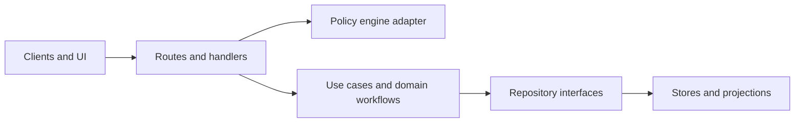

<!-- [KFM_META_BLOCK_V2]
doc_id: kfm://doc/2c1f7397-2c5f-4e20-9a75-9de83b2dc66c
title: KFM API Routes — apps/api/src/api/routes
type: standard
version: v1
status: draft
owners: KFM API Team (TBD)
created: 2026-03-03
updated: 2026-03-03
policy_label: restricted
related:
  - ../README.md
  - ../../../../../contracts/openapi/        # verify path from this directory
  - ../../../../../policy/                  # verify path from this directory
  - ../../../../../packages/policy/         # verify path from this directory
  - ../../../../../packages/evidence/       # verify path from this directory
tags: [kfm, api, routes, pep, governance]
notes:
  - Directory-level contract for HTTP route handlers (PEP implementations).
  - Update the route registry + directory tree when the actual layout changes.
[/KFM_META_BLOCK_V2] -->

# KFM API Routes — `src/api/routes`
HTTP route handlers that implement the **governed API boundary** (PEP) for runtime surfaces (Map / Story / Focus).

**Status:** draft • **Policy posture:** fail-closed • **Owners:** TBD  


> **TODO (repo wiring):** Replace CI/coverage badges with real pipeline links once known.

---

## Navigation
- [Purpose](#purpose)
- [Where this directory fits](#where-this-directory-fits)
- [Non-negotiable invariants](#non-negotiable-invariants)
- [Route handler contract](#route-handler-contract)
- [Route registry](#route-registry)
- [Templates](#templates)
- [Testing and gates](#testing-and-gates)
- [Directory guide](#directory-guide)
- [Minimum verification steps](#minimum-verification-steps)

---

## Purpose
This directory contains the **HTTP routes** for the governed API. Each route is part of the platform’s **trust membrane**: it must enforce policy, produce auditability, and return contract-stable responses for clients.

A route handler’s job is to orchestrate (not “invent”):
- request validation (schema + types)
- policy evaluation (allow/deny + obligations)
- retrieval via repositories/use-cases (never direct infrastructure calls from this layer)
- evidence linking / evidence resolution (EvidenceRef → EvidenceBundle)
- error shaping into a policy-safe model (avoid existence leaks)
- audit emission (where required)

> **NOTE:** If your repo uses a different routing framework (Express / Fastify / Hono / FastAPI, etc.), keep these *roles* the same and adjust the wiring.

---

## Where this directory fits
Routes are an **interface-layer surface**: they expose stable HTTP contracts and enforce governance.


```mermaid
flowchart LR
  UI[Clients and UI] --> R[Routes and handlers]
  R --> P[Policy engine adapter]
  R --> U[Use cases and domain workflows]
  U --> I[Repository interfaces]
  I --> S[Stores and projections]
```

**Practical implications:**
- Route handlers should be thin. “If it’s business logic, it probably belongs in a use case.”
- Do not embed direct PostGIS / Neo4j / search / object-store clients here unless they are behind a repository interface or adapter with testable boundaries.

---

## Non-negotiable invariants
If an implementation detail conflicts with these, the implementation is wrong.

| Invariant | Meaning in practice | How we enforce it (expected) |
|---|---|---|
| Truth path lifecycle | Only promoted dataset versions appear in runtime surfaces | CI promotion gates + runtime checks |
| Trust membrane | Clients never touch storage/DB directly; routes enforce policy/redaction/logging | Network boundaries + tests + review |
| Evidence-first UX | Responses include dataset version, rights/license, and evidence links | Required fields + evidence resolver |
| Cite-or-abstain | If citations cannot be verified as resolvable + allowed, **abstain or reduce scope** | Hard citation verification gate |
| Canonical vs rebuildable | Catalogs/object store/audit are canonical; DB/search/graph/tiles are projections | No “projection-as-truth” shortcuts |

---

## Route handler contract
### 1) Inputs
Each route must define (or reference) a **request contract**:
- query/path/body schema
- auth context shape (principal + role + claims)
- request metadata (request id / trace id)
- optional view state (bbox/time/layers) when relevant to Map/Focus

### 2) Policy check timing
**Policy must be evaluated before returning any data** and (where feasible) before expensive retrieval.

Policy outcomes should include:
- `allow: boolean`
- `reason_code`
- `obligations[]` (e.g., generalize geometry, drop fields, show notice)

> **WARNING:** Do not leak restricted existence. Align `403` vs `404` behavior to your policy posture.

### 3) Retrieval
Routes must retrieve data via:
- **use cases** (preferred for workflows like focus/story publish), or
- **repositories** (preferred for read surfaces like datasets/stac)

No direct DB/search/object-store calls from routes *unless* they are behind a governed adapter with:
- policy-safe error mapping
- tests
- stable contracts

### 4) Evidence linking
If a response makes a claim a user can act on (feature geometry, story claim, Focus Mode assertion), it must:
- carry `dataset_version_id` (when applicable)
- provide EvidenceRefs and/or allow the UI to resolve evidence in ≤ 2 calls
- include digests/checksums where applicable

### 5) Errors
Errors must follow a stable model:
- `error_code`
- `message` (policy-safe)
- `audit_ref` or `request_id` (for debugging)
- optional remediation hints

Example:
```json
{
  "error_code": "POLICY_DENY",
  "message": "This resource is not available for your role.",
  "audit_ref": "kfm://audit/entry/123",
  "remediation": { "hint": "Try a public dataset or request steward review." }
}
```

### 6) Audit
Any **governed operation** (Focus Mode runs, Story publishing, Evidence resolution) must emit an audit record with enough information to reproduce and justify the action:
- principal + role
- endpoint + parameters (policy-safe)
- input/output digests
- policy decision + obligations applied
- timestamps

---

## Route registry
This table is the **living index** of route modules in this directory.

> Keep it up to date as you add or rename routes.

| Route group | Base path | Purpose | Contract source | Policy pack inputs | Notes |
|---|---|---|---|---|---|
| datasets | `/api/v1/datasets` | Dataset discovery + versions | `contracts/openapi/*` (verify) | user.role + dataset.policy_label | Must include license/rights + dataset_version_id |
| stac | `/api/v1/stac/*` | STAC collections/items query | `contracts/openapi/*` (verify) | user.role + asset.policy_label | Must not return disallowed assets |
| evidence | `/api/v1/evidence/resolve` | EvidenceRef → EvidenceBundle | `contracts/openapi/*` (verify) | user.role + resource.policy_label | Fail closed if unresolvable/unauthorized |
| story | `/api/v1/story*` | Read/publish Story Nodes | `contracts/openapi/*` (verify) | user.role + story.policy_label | Publish gate requires resolvable citations + review state |
| focus | `/api/v1/focus/ask` | Focus Mode Q&A | `contracts/openapi/*` (verify) | user.role + evidence.allow | Must cite or abstain; emits run receipt/audit_ref |
| tiles | `/api/v1/tiles/*` | Vector tile delivery (optional) | `contracts/openapi/*` (verify) | user.role + layer.policy_label | Cache must vary by policy/auth |

---

## Templates
### Route module skeleton (framework-agnostic pseudocode)
```text
handle(request):
  ctx = build_context(request)                  # auth + request_id + trace_id
  input = validate(request)                     # schema validation
  decision = policy.check(ctx, action, resource, input)

  if not decision.allow:
    return policy_safe_not_found_or_deny(ctx)   # avoid existence leaks

  data = usecase_or_repo.fetch(input)           # no direct infra here
  data2 = apply_obligations(data, decision)     # redact/generalize/drop fields
  body = shape_response_contract(data2)         # include trust fields + digests
  maybe_emit_audit(ctx, input, body, decision)

  return 200 body
```

### “What file should I add?”
**Proposed** convention (update if repo differs):
- one route module per route group
- one `index` file that registers all routers under `/api/v1`

```text
routes/
  README.md
  index.*                # register route modules into the app/router
  datasets.*             # /api/v1/datasets
  stac.*                 # /api/v1/stac/collections + /items
  evidence.*             # /api/v1/evidence/resolve
  story.*                # /api/v1/story...
  focus.*                # /api/v1/focus/ask
  tiles.*                # /api/v1/tiles...
  health.*               # /healthz, /readyz (if used)
```

---

## Testing and gates
A new or modified route is not “done” until it passes these gates.

### Definition of Done
- [ ] Request/response schema exists and validates (contract tests)
- [ ] Policy check is performed before returning data
- [ ] Obligations are applied (redaction/generalization) when required
- [ ] Response includes required trust fields (e.g., `dataset_version_id` when applicable)
- [ ] Errors follow policy-safe model (no restricted existence leaks)
- [ ] Audit emitted for governed operations
- [ ] Policy fixtures updated (deny-by-default posture remains)
- [ ] Linkcheck/citation resolution tests pass when EvidenceRefs are introduced
- [ ] Route registry table updated

### Suggested test types
- **Contract tests:** validate request/response shapes against OpenAPI/JSON Schema
- **Policy tests:** fixture-driven allow/deny and obligation coverage
- **Integration tests:** end-to-end call to route + evidence resolution (for at least one golden fixture)
- **Negative tests:** ensure restricted data is not returned under public role

---

## Directory guide
**One-line purpose:** Route handlers only. No domain logic, no direct infrastructure bypass.

### What belongs here ✅
- Router/handler modules for versioned API endpoints
- Thin request validation and response shaping
- Calls into policy engine adapters, evidence resolver adapter, and use-cases/repositories
- Route-level error mapping and request-id propagation

### What must NOT go here ❌
- Domain rules and core workflows (belongs in domain/use-cases)
- Direct DB/search/object-store access that bypasses policy
- Returning raw document text without resolvable evidence links
- Unversioned contracts (breaking changes must bump API version)

### Expected surrounding directories (verify in repo)
```text
apps/api/src/api/                                       # API boundary layer: routes + middleware + contract bindings with policy-enforced, evidence-first semantics
├─ README.md                                            # Boundary intent + invariants (default-deny, policy-safe errors, obligation surfacing, versioning expectations)
├─ routes/                                              # Route handlers (HTTP controllers): map requests → usecases/services; keep thin; no direct I/O beyond adapters
├─ middleware/                                          # Request middleware: auth, request_id, normalization, policy-context extraction, rate limits, CORS, error mapping
├─ adapters/                                            # Boundary adapters: policy/evidence/repo integrations (clients + port implementations + error mapping)
├─ telemetry/                                           # Audit + metrics/tracing emitters (redaction-aware, low-cardinality, request_id propagation, reason codes)
└─ contracts/                                           # DTOs + validators (optionally generated from OpenAPI) ensuring request/response shapes match governed contracts
```

---

## Minimum verification steps
If anything in this README doesn’t match the current codebase, do these checks and update the doc (fail closed, don’t guess):

1. Find the API entrypoint and confirm how routers are registered.
2. Locate the policy adapter (OPA/Rego or equivalent) and confirm fixture tests run in CI.
3. Locate evidence resolution wiring (route + service + bundle schema).
4. Confirm error model + 403/404 posture and ensure it doesn’t leak restricted existence.
5. Confirm audit storage, redaction, and retention rules for governed operations.

---

**Back to top:** [Navigation](#navigation)
