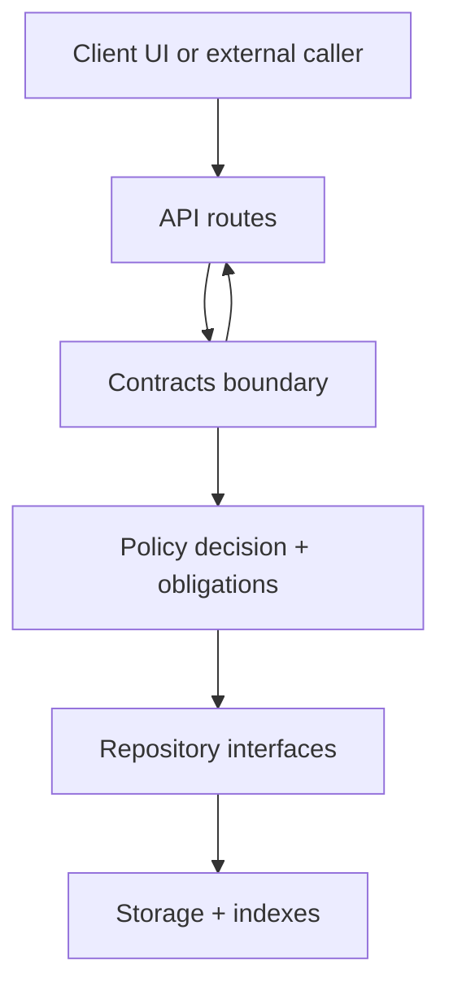

<!-- [KFM_META_BLOCK_V2]
doc_id: kfm://doc/8b2b3d5c-4a41-4dc8-a31e-2c1a08a8d51b
title: API Contracts (apps/api/src/contracts)
type: standard
version: v1
status: draft
owners: API team
created: 2026-02-27
updated: 2026-02-27
policy_label: public
related:
  - docs/MASTER_GUIDE_v13.md
  - docs/templates/TEMPLATE__API_CONTRACT_EXTENSION.md
  - contracts/README.md
tags: [kfm, api, contracts]
notes:
  - Contract-first: schemas and API contracts are first-class artifacts.
  - This directory is the API runtime “contract boundary” (validators + DTO types + contract tests).
[/KFM_META_BLOCK_V2] -->

# apps/api/src/contracts — API Contracts

**One-line purpose:** Runtime contract boundary for the API (schemas, validators, DTO types, and contract tests) so every request/response is **governable, testable, and fail-closed**.


 <!-- TODO: wire to real workflow badge -->


---

## Quick navigation

- [Purpose](#purpose)
- [Where this fits](#where-this-fits)
- [What belongs here](#what-belongs-here)
- [What must NOT go here](#what-must-not-go-here)
- [Recommended layout](#recommended-layout)
- [Contract registry](#contract-registry)
- [Versioning rules](#versioning-rules)
- [How to add or change a contract](#how-to-add-or-change-a-contract)
- [Testing and gates](#testing-and-gates)
- [Governance and safety](#governance-and-safety)
- [Glossary](#glossary)
- [Minimum verification steps](#minimum-verification-steps)

---

## Purpose

This directory exists to make “contract-first” real at runtime:

- **Validate** inbound payloads before business logic runs.
- **Validate** outbound payloads before they leave the trust boundary.
- **Make breaking changes explicit** (version bumps + compatibility strategy).
- **Enable CI gates** (contract tests) so merges fail when contracts drift.

> **NOTE**
> This README is written to be safe as a starting point. If your repo already has a canonical contracts home (for example, a top-level `contracts/`), treat that as source-of-truth and make this folder an *adapter* (loaders + validators + generated TS) rather than duplicating schemas.

[Back to top](#quick-navigation)

---

## Where this fits

Contracts are part of the **trust membrane**: they help ensure clients can’t bypass governance by sending unexpected shapes or receiving unvalidated outputs.

At a high level:



Key idea: **all governed behavior starts with a stable, testable contract.**

[Back to top](#quick-navigation)

---

## What belongs here

✅ **Acceptable inputs** (place these here or wire them through this folder as adapters):

- **OpenAPI / GraphQL** contract artifacts *or* generated DTOs derived from them.
- **JSON Schemas** for payloads that must be validated (examples: run receipts, evidence bundles, story node sidecars, Focus Mode responses).
- **Runtime validators** (compiled schemas, type guards, or validator adapters).
- **Generated types** (clearly marked `DO NOT EDIT`).
- **Contract test fixtures** (“golden” JSON examples that must validate).
- **Contract test helpers** (snapshot/round-trip tests, schema compilation tests, etc.).
- **Docs for contract changes** (if your governance process requires a contract extension doc per change).

[Back to top](#quick-navigation)

---

## What must NOT go here

🚫 **Exclusions (keep this folder pure):**

- Business logic, domain rules, data fetching, persistence logic
- Route handlers/controllers (those should *use* contracts, not live inside them)
- Policy rules (OPA/Rego belongs in policy packs, not API contract code)
- Secrets, credentials, tokens, private keys
- “Convenience” unversioned DTOs that bypass the contract-first pipeline

> **WARNING**
> If a payload shape matters for governance (policy, provenance, redaction, citations), it **must** be versioned and validated. “Just add a field” is not safe.

[Back to top](#quick-navigation)

---

## Recommended layout

> **STATUS:** This is a recommended starter layout. Update it once the directory structure is finalized.

```text
apps/api/src/contracts/
  README.md

  index.ts                 # public exports (validators + types)
  registry.ts              # optional: central registry of known contracts + versions

  openapi/                 # optional: OpenAPI specs/fragments or local mirrors
  graphql/                 # optional: GraphQL schema(s)
  schemas/                 # optional: JSON Schema sources (if not stored elsewhere)
  generated/               # generated TS types (DO NOT EDIT)
  validators/              # compiled validators + adapters
  fixtures/                # golden fixtures used in tests
  __tests__/               # contract test suite
```

**Naming conventions (recommended):**
- Schema files: `snake_case_name_v1.schema.json`
- Validator exports: `validate<Name>V1(...)`
- Generated types: `*.generated.ts` (and add a “DO NOT EDIT” header)

[Back to top](#quick-navigation)

---

## Contract registry

Keep a single registry so changes are reviewable and searchable.

| Contract | Type | Version | Source artifact (canonical) | API usage | Gate |
|---|---:|---:|---|---|---|
| `EvidenceBundle` | JSON Schema | v1 | `contracts/schemas/evidence_bundle_v1.schema.json` (if present) | `/api/v1/evidence/resolve` response | schema + integration test |
| `StoryNode` | JSON Schema | v3 | `contracts/schemas/story_node_v3.schema.json` (if present) | story publish/read | citation resolve gate |
| `FocusResponse` | JSON Schema | v1 | `contracts/schemas/focus_response_v1.schema.json` (if present) | `/api/v1/focus` response | cite-or-abstain gate |
| `RunReceipt` | JSON Schema | v1 | `contracts/schemas/run_receipt_v1.schema.json` (if present) | audit receipts | receipt gate |

> **NOTE**
> If your repo stores schemas somewhere else, update “Source artifact (canonical)” to the correct path and keep this table accurate.

[Back to top](#quick-navigation)

---

## Versioning rules

**Hard rule:** contract changes must be explicit.

### HTTP APIs (OpenAPI)
- OpenAPI is the API contract.
- Breaking changes require:
  - A version bump (new versioned endpoint/path), **or**
  - A clear negotiation strategy with a deprecation plan.

### JSON Schema payloads
- Treat every schema as immutable once published.
- If semantics change → **create a new schema version** (`*_v2.schema.json`) and keep v1 available while clients migrate.

### Deterministic identity (when applicable)
If a contract participates in **hashing, signing, promotion, or caching**, version bumps must be paired with:
- stable canonicalization strategy
- golden test vectors (known hashes / known-valid examples)

[Back to top](#quick-navigation)

---

## How to add or change a contract

### Add a new contract (checklist)
- [ ] Create a versioned contract artifact (OpenAPI/GraphQL/JSON Schema).
- [ ] Add/extend validators in `validators/`.
- [ ] Add fixtures in `fixtures/`:
  - [ ] at least 1 known-good
  - [ ] at least 1 known-bad (must fail closed)
- [ ] Add tests in `__tests__/` that:
  - [ ] compile/load the contract
  - [ ] validate fixtures
  - [ ] (if API-facing) validate route request/response shape
- [ ] Update the [Contract registry](#contract-registry) table.
- [ ] If endpoints changed, produce a contract extension doc (per governance).

### Change an existing contract (checklist)
- [ ] Determine if change is breaking.
- [ ] If breaking:
  - [ ] create `v(N+1)` contract
  - [ ] keep old version supported until migration complete
  - [ ] add compatibility tests for both versions
- [ ] If non-breaking:
  - [ ] confirm existing fixtures still pass
  - [ ] add fixtures for new fields/paths
- [ ] Update CI gates (if needed) so drift cannot merge.

[Back to top](#quick-navigation)

---

## Testing and gates

Minimum expectations:

1. **Schema validation tests**  
   - Compile/parse each contract artifact
   - Validate fixtures

2. **Route-level contract tests**  
   - Ensure request/response matches the contract
   - Ensure error shapes are stable and documented

3. **Fail-closed behavior tests**  
   - Missing fields / unknown enums / invalid citations → must reject or abstain

> **TODO (wire to real commands)**
> - `pnpm test --filter api-contracts`
> - `pnpm lint`
> - `pnpm typecheck`

[Back to top](#quick-navigation)

---

## Governance and safety

This folder helps enforce KFM’s core behaviors:

- **Trust membrane:** clients do not talk to storage directly; everything flows through governed APIs.
- **Evidence-first UX:** API responses must support evidence resolution and provenance display.
- **Cite-or-abstain:** Focus Mode responses must cite resolvable evidence or abstain.

**Practical implications for contracts:**
- Responses that support Story/Focus must carry **resolvable references** (e.g., `dcat://`, `stac://`, `prov://`, `doc://`).
- Publishing gates must verify citations resolve through the evidence resolver endpoint.
- If policy denies or citations cannot be verified, the system must fail closed.

[Back to top](#quick-navigation)

---

## Glossary

- **Contract-first:** Schemas and API contracts are first-class artifacts; work starts from them.
- **EvidenceRef:** Stable reference (`dcat://`, `stac://`, `prov://`, `doc://`, …) that can be resolved.
- **EvidenceBundle:** Resolved evidence view returned by the evidence resolver; immutable by digest.
- **Run receipt:** Per-run audit artifact including inputs/outputs/checks/timestamps; used for reproducibility.
- **Policy obligations:** Additional required behaviors (e.g., “show notice: geometry generalized”).

[Back to top](#quick-navigation)

---

## Minimum verification steps

Use these to convert “unknown repo specifics” into confirmed behavior:

1. **Find canonical contracts**
   - Search repo for `openapi`, `*.schema.json`, `TEMPLATE__API_CONTRACT_EXTENSION`
2. **Run contract tests**
   - Ensure known-good fixtures pass and known-bad fixtures fail
3. **Validate the evidence resolver path**
   - Confirm the evidence bundle response validates against its schema
4. **Check fail-closed semantics**
   - Remove a required field in a fixture and confirm CI blocks merge

---

_Last updated: 2026-02-27_
