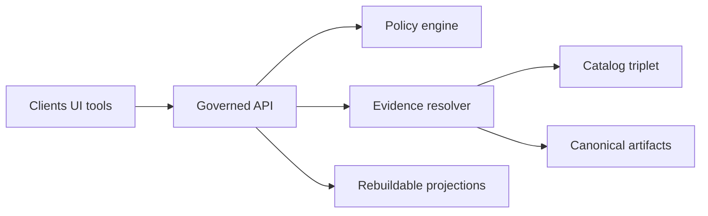

<!-- [KFM_META_BLOCK_V2]
doc_id: kfm://doc/3e48254f-ff00-48e0-8cad-35b8f61edfa1
title: OpenAPI Contracts
type: standard
version: v1
status: draft
owners: TODO: api team
created: 2026-02-27
updated: 2026-02-27
policy_label: public
related:
  - apps/api/src/contracts/openapi/
tags: [kfm, api, openapi, contracts]
notes:
  - Contract-first docs for the governed API surface.
  - Update owners + status when wired into CI gates.
[/KFM_META_BLOCK_V2] -->

# OpenAPI Contracts

Contract-first OpenAPI specs for the governed API surface. These files are **interfaces**, not implementation.


---

## Quick links

- [Purpose](#purpose)
- [Where this fits](#where-this-fits)
- [What lives here](#what-lives-here)
- [What must not live here](#what-must-not-live-here)
- [Directory layout](#directory-layout)
- [Change workflow](#change-workflow)
- [Contract invariants](#contract-invariants)
- [Core schemas](#core-schemas)
- [Quality gates](#quality-gates)
- [Definition of done](#definition-of-done)

---

## Purpose

This directory contains the OpenAPI contract artifacts used to:

- Define **public, machine-validated** request/response shapes for the governed API
- Drive **contract tests** and compatibility checks
- Provide stable DTO shapes for clients (UI, tools, automation) and internal adapters
- Encode governance-critical semantics in a testable way (policy decisions, audit refs, evidence resolution)

> NOTE  
> KFM treats API schemas as **first-class contracts**. Implementation must follow the contract, not the other way around.

---

## Where this fits

In KFM’s layering model, OpenAPI is part of the **Interfaces layer**: it defines the stable boundary between use cases and infrastructure. This supports the **trust membrane**: clients only interact through governed interfaces; they do not bypass policy enforcement.



---

## What lives here

Acceptable inputs in this directory:

- OpenAPI specs: `*.yaml` / `*.yml` / `*.json`
- Reusable components:
  - `components/schemas/*`
  - `components/parameters/*`
  - `components/responses/*`
  - `components/examples/*`
- Contract fixtures and examples that are safe to ship (no secrets, no sensitive coordinates)
- A small, explicit compatibility history:
  - `CHANGELOG.md` for contract changes (recommended)
  - `compat/` snapshots (recommended if you run diff-based gates)

---

## What must not live here

Exclusions (keep the trust boundary clean):

- Server implementation code (routers, handlers, business logic)
- Database queries, SQL files, ORMs
- Secrets, tokens, API keys
- Raw or sensitive data payloads (especially anything that would enable targeting)
- “Hidden” endpoints that exist in code but are not specified

> WARNING  
> If an endpoint exists in runtime but is missing from OpenAPI, it is **unguverned behavior**. Treat as a defect.

---

## Directory layout

This is a **recommended** structure (adapt to match the repo’s existing conventions):

```text
apps/api/src/contracts/openapi/
  README.md
  kfm-api-v1.yaml                 # root spec (bundled or references components)
  components/
    schemas/
      common.yaml                 # ErrorResponse, paging, etc.
      evidence.yaml               # EvidenceResolveRequest, EvidenceBundle, etc.
      policy.yaml                 # PolicyDecision, obligations, labels
    responses/
    parameters/
    examples/
  compat/
    v1/
      baseline.yaml               # last released contract snapshot (optional)
  CHANGELOG.md                    # contract change log (optional but recommended)
```

---

## Change workflow

### 1) Add an endpoint

1. Add/extend `paths` + `operationId` in the OpenAPI root spec.
2. Reference shared schemas from `components/`.
3. Provide:
   - request/response examples
   - error responses with `audit_ref`
4. Add or update contract tests that exercise:
   - success case
   - policy denied case
   - validation failure case

### 2) Change a schema

- Prefer additive changes:
  - add optional fields
  - widen enums only if safe
- Avoid breaking changes:
  - removing fields
  - changing meaning/type of existing fields
  - narrowing enums or constraints

### 3) Introduce a breaking change

Breaking changes require **versioning**:
- Add a new versioned path (e.g., `/api/v2/...`) or an explicit negotiation strategy.
- Keep v1 until it is sunset with notice.

---

## Contract invariants

These are non-negotiable behaviors enforced by CI and review.

| Invariant | Why it exists | How we enforce |
|---|---|---|
| OpenAPI is the API contract | Prevents hidden behavior | Lint + contract tests |
| Backwards compatibility by default | Prevents client breakage | Diff gate + version bump rule |
| Default deny policy | Prevents leakage | Policy tests + fixtures |
| Evidence resolution required for claims | Prevents unsourced output | Evidence resolver endpoint + publishing gates |
| Every error includes `audit_ref` | Ensures auditability | Schema requirement + tests |

---

## Core schemas

Below are **minimum** DTO shapes KFM expects to exist in the contract.

### ErrorResponse

All error responses must include a stable error code, a message, and an audit reference.

```yaml
ErrorResponse:
  type: object
  required: [error_code, message, audit_ref]
  properties:
    error_code: { type: string }
    message: { type: string }
    audit_ref: { type: string }
```

### Evidence resolution

Publishing and narrative workflows depend on a single rule:

> All citations must resolve through the evidence resolver endpoint.

Recommended request shape:

```yaml
EvidenceResolveRequest:
  type: object
  required: [refs]
  properties:
    refs:
      type: array
      items: { type: string }
```

Recommended bundle shape:

```yaml
EvidenceBundle:
  type: object
  required: [bundle_id, digest, policy, cards]
  properties:
    bundle_id: { type: string }
    digest: { type: string }
    policy:
      type: object
      required: [decision, policy_label, obligations]
      properties:
        decision: { type: string, enum: [allow, deny] }
        policy_label: { type: string }
        obligations:
          type: array
          items: { type: object }
    cards:
      type: array
      items:
        type: object
        properties:
          title: { type: string }
          description: { type: string }
          dataset_version_id: { type: string }
          license: { type: string }
          artifacts:
            type: array
            items:
              type: object
              properties:
                href: { type: string }
                digest: { type: string }
```

### Policy labels

Contracts that return data derived from datasets must surface the dataset’s policy label, and any obligations required for safe use.

<details>
  <summary><strong>Starter controlled vocabulary</strong></summary>

- `public`
- `public_generalized`
- `restricted`
- `restricted_sensitive_location`
- `internal`
- `embargoed`
- `quarantine`

</details>

---

## Quality gates

### Contract validation

At minimum, CI should block merges if:

- The OpenAPI document is invalid
- A breaking change is introduced without versioning
- Contract tests fail for known inputs/outputs

Recommended checks (adapt to the repo’s tooling):

```bash
# Validate OpenAPI structure
# Example tools: redocly, spectral, openapi-cli, swagger-cli
redocly lint apps/api/src/contracts/openapi/kfm-api-v1.yaml

# Bundle / dereference for publishing
redocly bundle apps/api/src/contracts/openapi/kfm-api-v1.yaml -o /tmp/kfm-api-v1.bundle.yaml

# Diff against last released snapshot (if you keep one)
openapi-diff /tmp/kfm-api-v1.bundle.yaml apps/api/src/contracts/openapi/compat/v1/baseline.yaml
```

### Governance review triggers

Escalate for explicit governance review when changes involve:

- New endpoints that return sensitive locations or high-resolution geometry
- Export endpoints that could bypass obligations
- Any new AI-generated narrative behavior presented as factual

---

## Definition of done

Use this checklist before merging contract changes:

- [ ] OpenAPI validates and is bundled successfully
- [ ] Change is backwards-compatible **or** a new version is introduced
- [ ] Examples updated or added for new/changed operations
- [ ] Contract tests updated for known inputs/outputs
- [ ] Error paths return `ErrorResponse` with `audit_ref`
- [ ] Policy labels + obligations are surfaced where relevant
- [ ] Evidence resolution semantics remain intact
- [ ] Changelog updated (if present)
- [ ] Security scans pass (no secrets, no sensitive payloads embedded)

---

## Back to top

[Back to top](#openapi-contracts)
