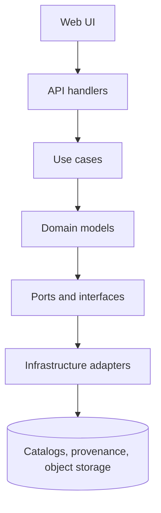

<!-- [KFM_META_BLOCK_V2]
doc_id: kfm://doc/2976d901-009b-4d28-a011-0cb59ac2cc7d
title: Domain Models
type: standard
version: v1
status: draft
owners: TODO: API Platform
created: 2026-02-27
updated: 2026-02-27
policy_label: internal
related:
  - TODO: docs/architecture/KFM_GDG_vNext.pdf
  - TODO: apps/api/src/domain/README.md
tags: [kfm, api, domain, models]
notes:
  - Pure domain entities + value objects only; no I/O, no persistence, no transport DTOs.
[/KFM_META_BLOCK_V2] -->

<a id="top"></a>

# Domain models
**Purpose:** canonical domain entities/value objects for the KFM API (evidence-first, policy-aware, time-aware).


---

## Quick navigation
- [Directory scope](#directory-scope)
- [Architecture placement](#architecture-placement)
- [Domain model catalog](#domain-model-catalog)
- [Identifiers and controlled vocabularies](#identifiers-and-controlled-vocabularies)
- [Evidence resolution contract](#evidence-resolution-contract)
- [Policy decisions and obligations](#policy-decisions-and-obligations)
- [Adding or changing a model](#adding-or-changing-a-model)
- [Suggested folder shape](#suggested-folder-shape)
- [Appendix: reference TypeScript sketches](#appendix-reference-typescript-sketches)

---

## Directory scope

### What lives here ✅
- **Domain entities** and **value objects** (IDs, slugs, timestamps, digests, policy labels).
- **Invariants** enforced at construction time (or via pure validation helpers).
- **Domain errors** (typed, serializable, _not_ HTTP-specific).
- **Controlled vocabularies** as enums/unions (policy labels, artifact zones, evidence kinds, etc.).

### What must NOT live here ❌
> **WARNING:** Don’t break the trust membrane by importing infrastructure or transport concerns into the domain layer.

- Database clients, ORMs, SQL/Neo4j/PostGIS queries, object storage SDKs.
- HTTP request/response DTOs, OpenAPI “wire” shapes, controller logic.
- Serialization frameworks with side effects, DI containers, loggers.
- Mappers/adapters (belongs in **interfaces/adapters** layer).

[Back to top](#top)

---

## Architecture placement

KFM uses clean layering:

**Domain → Use cases → Interfaces → Infrastructure**

Domain models are the _center_. They should not depend on anything that “touches the world” (storage, network, clocks, etc.). Use cases orchestrate domain behavior; interfaces define ports; infrastructure provides adapters.



[Back to top](#top)

---

## Domain model catalog

KFM’s minimal domain model set includes:

| Model | Why it exists | Typical identifiers / key fields |
|---|---|---|
| **Dataset** | Stable logical dataset identity (“NOAA Storm Events”, “USGS NWIS Kansas”) | `kfm://dataset/<slug>` (recommended) |
| **DatasetVersion** | Immutable promoted output set for a dataset (many over time) | `dataset_version_id`, `spec_hash` |
| **Artifact** | Concrete produced object/file referenced by STAC/DCAT/PROV | `kfm://artifact/sha256:<digest>`, `zone`, `media_type` |
| **EvidenceRef** | Stable reference to evidence using explicit schemes | `dcat://…`, `stac://…`, `prov://…`, `doc://…`, `graph://…` |
| **EvidenceBundle** | Resolved evidence view returned by the evidence resolver | `bundle_id`, `digest`, `dataset_version_id`, `policy` |
| **PolicyDecision** | Allow/deny result + obligations + reason codes | `decision_id`, `policy_label`, `obligations[]` |
| **RunReceipt** | Audit record emitted for every pipeline run and Focus Mode query | `run_id`, `inputs[]`, `outputs[]`, `environment`, `validation`, `policy` |
| **StoryNodeVersion** | Versioned narrative bound to map state + citations | `kfm://story/<uuid>@vN`, citations: `EvidenceRef[]` |
| **MapState** | Reproducible view state captured by stories / Focus Mode | camera, layers, time window, filters |

> **NOTE:** If you add a new entity here, it should either (a) be required to express an invariant of the governed system, or (b) be a value object that prevents ambiguity (IDs, digests, time).

[Back to top](#top)

---

## Identifiers and controlled vocabularies

### Identifier families (recommended)
Use explicit URI-like identifiers with stable prefixes (avoid environment-specific hostnames inside canonical IDs).

- `kfm://dataset/…`
- `kfm://dataset/@…`
- `kfm://artifact/sha256:…`
- `kfm://run/…`
- `kfm://evidence/…`
- `kfm://story/@…`

### Controlled vocabularies (starter sets)

**policy_label (access + sensitivity)**  
- `public`
- `public_generalized`
- `restricted`
- `restricted_sensitive_location`
- `internal`
- `embargoed`
- `quarantine`

**artifact.zone (data lifecycle)**  
- `raw`
- `work`
- `processed`
- `catalog`
- `published`

**citation.kind / evidence kind**  
- `dcat`
- `stac`
- `prov`
- `doc`
- `graph`
- `oci` (optional future)
- `url` (discouraged; prefer resolvable schemes)

**geometry.generalization_method (starter)**  
- `centroid_only`
- `grid_aggregation_*`
- `random_offset_*`
- `dissolve_to_admin_unit`
- `bounding_box_only`
- `none`

> **TIP:** Put these vocabularies in one place (single module) and import them everywhere. It’s a cheap way to prevent drift.

[Back to top](#top)

---

## Evidence resolution contract

Evidence resolution is central to KFM’s “evidence-first” UX.

### EvidenceRef schemes
Evidence references should be explicit, resolvable schemes:

- `dcat://…` dataset + distribution metadata  
- `stac://…` collection/item/asset metadata  
- `prov://…` run lineage (activity/entity/agent)  
- `doc://…` governed docs + story citations  
- `graph://…` entity relations (if enabled)  

### Evidence resolver behavior (domain expectations)
The evidence resolver must:
- accept an `EvidenceRef` (scheme://...) **or** a structured reference (e.g., dataset_version + record id + span)
- apply policy and return **allow/deny** plus **obligations**
- return an `EvidenceBundle` that includes:
  - human-readable view (renderable card)
  - machine metadata (JSON)
  - artifact links (**only if allowed**)
  - digests and dataset_version ids
  - audit references

### UI trust surface requirements (why the models matter)
The UI evidence drawer needs (at minimum):
- evidence bundle ID + digest
- DatasetVersion ID + dataset name
- license and rights holder
- freshness + validation status
- provenance chain (run receipt link)
- artifact links (only if policy allows)
- redactions applied (obligations)

> **WARNING:** If an EvidenceRef cannot be resolved deterministically, KFM cannot “cite-or-abstain.” Treat resolution failures as **hard errors**.

[Back to top](#top)

---

## Policy decisions and obligations

A **policy label** is the primary classification input. Evaluation yields:
- allow/deny
- obligations (redaction/generalization steps)
- reason codes (for audit + UX)

Typical obligations include:
- generalize geometry to a minimum cell size
- remove sensitive attributes/fields

In domain terms: **policy is data**, not a comment. Models should carry policy outcomes in a structured way so every layer can enforce them consistently.

[Back to top](#top)

---

## Adding or changing a model

### Checklist (Definition of Done)
- [ ] The model is **pure** (no I/O, no DB, no network, no clocks).
- [ ] Invariants are encoded (constructor/factory validation or schema validator).
- [ ] IDs/digests use stable formats (URI families, digest prefixes).
- [ ] Controlled vocabulary changes include:
  - [ ] migration notes (if externally visible)
  - [ ] fixtures for policy tests (deny/allow + obligations)
- [ ] Evidence surfaces remain resolvable:
  - [ ] EvidenceRef scheme is explicit
  - [ ] cross-links are testable (DCAT ↔ STAC ↔ PROV)
- [ ] Unit tests cover:
  - [ ] parsing/validation edge cases
  - [ ] “fail closed” behavior for unknown policy/rights
- [ ] Any externally returned shape has a clear boundary mapping (domain ↔ DTO).

### Minimal verification steps (recommended)
1. `typecheck` / compile passes.
2. Unit tests for invariants pass.
3. Policy contract tests pass.
4. Cross-link validation (catalog link checker) passes for at least one fixture dataset version.

[Back to top](#top)

---

## Suggested folder shape

> **NOTE:** This is a **template**. Replace with the actual tree once the directory contents stabilize.

```text
apps/api/src/domain/models/
  README.md                       # This document
  ids/                            # KFM URI types, slugs, digests
  vocab/                          # controlled vocabularies (policy_label, zone, kind)
  dataset.*                       # Dataset + DatasetVersion
  artifact.*                      # Artifact
  evidence.*                      # EvidenceRef + EvidenceBundle
  policy.*                        # PolicyDecision + obligations
  run-receipt.*                   # RunReceipt (run_record)
  story-node.*                    # StoryNodeVersion + citations + map state
  index.*                         # barrel exports (optional)
```

[Back to top](#top)

---

## Appendix: reference TypeScript sketches

> **NOTE:** These are **reference sketches**, not a required implementation. Use them to keep shapes consistent across adapters.

```ts
export type KfmUri = `kfm://${string}`;
export type Sha256Digest = `sha256:${string}`;

export type PolicyLabel =
  | "public"
  | "public_generalized"
  | "restricted"
  | "restricted_sensitive_location"
  | "internal"
  | "embargoed"
  | "quarantine";

export type ArtifactZone = "raw" | "work" | "processed" | "catalog" | "published";

export type EvidenceKind = "dcat" | "stac" | "prov" | "doc" | "graph" | "oci" | "url";

export type EvidenceRef =
  | `dcat://${string}`
  | `stac://${string}`
  | `prov://${string}`
  | `doc://${string}`
  | `graph://${string}`;

export interface Dataset {
  dataset_id: KfmUri;      // kfm://dataset/<slug>
  slug: string;            // stable, lowercase, underscore
  title: string;
  description?: string;
}

export interface DatasetVersion {
  dataset_version_id: string; // immutable version identifier
  spec_hash: Sha256Digest;    // stable across platforms (canonical JSON)
  policy_label: PolicyLabel;
}

export interface ArtifactRef {
  artifact_id: KfmUri;     // kfm://artifact/sha256:<digest>
  zone: ArtifactZone;
  uri?: string;            // canonical location (may be redacted)
  digest: Sha256Digest;
  media_type?: string;
}

export interface PolicyObligation {
  type: string;
  // e.g. generalize_geometry, remove_attributes
  [k: string]: unknown;
}

export interface PolicyDecision {
  decision_id: KfmUri;     // kfm://policy_decision/<id>
  policy_label: PolicyLabel;
  decision: "allow" | "deny";
  reason_codes: string[];
  obligations: PolicyObligation[];
  evaluated_at: string;    // ISO-8601
  rule_id?: string;
}

export interface RunReceipt {
  run_id: KfmUri;          // kfm://run/<...>
  run_type: "pipeline" | "focus_mode";
  dataset_slug?: string;
  dataset_version_id?: string;
  inputs: ArtifactRef[];
  outputs: ArtifactRef[];
  validation: { status: "pass" | "fail"; reports?: unknown[] };
  policy: { policy_label: PolicyLabel; decision_id: KfmUri; obligations: PolicyObligation[] };
  environment: { git_commit: string; container_image?: string; runtime?: string; parameters?: unknown };
  timestamps?: { started_at: string; ended_at?: string };
}

export interface EvidenceBundle {
  bundle_id: KfmUri;       // kfm://evidence/<digest or id>
  digest: Sha256Digest;
  dataset_version_id: string;
  refs: EvidenceRef[];
  policy: PolicyDecision;
  human: { title: string; summary: string; links?: { label: string; href: string }[] };
  machine: Record<string, unknown>;
}

export interface MapState {
  // camera position (bbox/zoom), active layers + style parameters, time window, filters
  [k: string]: unknown;
}
```

[Back to top](#top)
