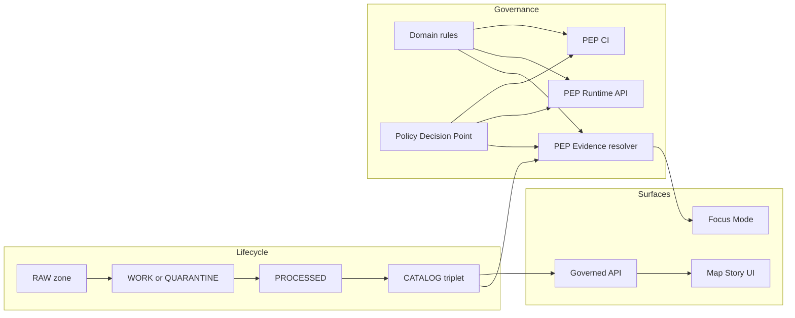

<!-- Path: apps/api/src/domain/rules/README.md -->
<!-- [KFM_META_BLOCK_V2]
doc_id: kfm://doc/9b3f4d3e-0f2f-4b11-8c1d-01c8e0d8c29f
title: Domain Rules (API)
type: standard
version: v1
status: draft
owners: TBD
created: 2026-02-27
updated: 2026-02-27
policy_label: public
related:
  - kfm://doc/kfm-gdg-vnext@2026-02-20 # TODO: confirm canonical doc id in repo registry
tags: [kfm, api, domain, rules]
notes:
  - Pure, testable, fail-closed domain rules that power promotion gates, evidence resolution constraints, and policy checks.
[/KFM_META_BLOCK_V2] -->

# Domain Rules (`apps/api/src/domain/rules/`)

**One-line purpose:** Pure, testable rules that turn KFM governance intent into enforceable, **fail-closed** behavior (promotion gates, policy checks, evidence constraints).


> **Truth labels used here**
> - ✅ Confirmed (documented in KFM vNext)
> - 🧪 Proposed (recommended implementation pattern for this repo)
> - ❓ Unknown (needs repo verification)

## Quick navigation
- [What belongs here](#what-belongs-here)
- [Where it fits in the architecture](#where-it-fits-in-the-architecture)
- [Rule contract](#rule-contract)
- [Rule families registry](#rule-families-registry)
- [Testing and CI gates](#testing-and-ci-gates)
- [Directory layout](#directory-layout)
- [How to add or change a rule](#how-to-add-or-change-a-rule)
- [Glossary](#glossary)

---

## What belongs here

### ✅ Belongs in `domain/rules/`
Rules in this directory should be:

- **Deterministic and side-effect free** (no database, network, filesystem, clock, env reads).
- **Composable** (small rules combine into “gate” evaluators).
- **Auditable** (return structured violations + obligations; never hide “why”).
- **Fail-closed** (when uncertain: deny, quarantine, abstain, or require review).

Typical rule outputs:
- `allow/deny` decisions (or `pass/fail` for validation gates)
- a list of `violations` (machine-parsable)
- a list of `obligations` to apply (e.g., redaction/generalization required)
- optional `audit_fields` (safe-to-log, non-sensitive)

### ❌ Must NOT go in `domain/rules/`
- DB queries / repositories / PostGIS calls
- HTTP clients, filesystem reads, cloud SDK usage
- policy engine adapters (OPA client, conftest wiring, etc.) 🧪 (place in `policy/` or `infra/`)
- UI formatting or view models
- anything that could leak restricted info via error text

> **WARNING**
> If a rule needs external data to decide (e.g., “does this EvidenceRef exist?”), that lookup belongs outside the domain layer. The domain rule should instead validate *the shape of inputs and invariants* and return “needs resolution” / “insufficient evidence” in a structured way.

[Back to top](#domain-rules-appsapischdomainrules)

---

## Where it fits in the architecture

### ✅ KFM view: rules as “governance intent → enforceable behavior”
KFM’s platform relies on:
- **promotion gates** (block promotion unless required artifacts exist + validate),
- **policy-as-code** semantics shared between CI and runtime,
- **evidence resolution** as the only acceptable route for citations and UI trust.

These rules are the **domain-level** pieces used by:
- CI policy gates (block merges / promotions)
- runtime governed APIs (block/shape responses)
- evidence resolver (apply obligations before the model/UI sees content)
- Focus Mode citation verification (cite-or-abstain)



[Back to top](#domain-rules-appsapischdomainrules)

---

## Rule contract

> 🧪 The concrete types/interfaces below are *recommended*. Adjust to match the actual language/runtime (TypeScript vs. other).

### Minimal interfaces (recommended)

```ts
// 🧪 pseudo-TypeScript: adjust to match actual repo conventions

export type RuleDecision = "allow" | "deny";

export type RuleViolation = {
  code: string;           // stable, machine-readable (e.g., "PROMOTION.GATE_C.MISSING_REDACTION_PLAN")
  message: string;        // human-readable summary (policy-safe)
  path?: string;          // JSONPointer-ish location (e.g., "/catalog/dcat/dct:license")
  severity?: "error" | "warn";
  evidenceRefs?: string[]; // optional: references (not raw data) for debugging
};

export type RuleObligation = {
  kind: string;           // e.g., "redact", "generalize", "require_review", "add_attribution"
  params?: Record<string, unknown>;
};

export type RuleResult = {
  decision: RuleDecision;
  violations: RuleViolation[];
  obligations: RuleObligation[];
  // optional: safe fields for receipts (no sensitive values)
  audit?: Record<string, string | number | boolean>;
};

export type Rule<TInput> = (input: TInput) => RuleResult;
```

### Fail-closed defaults
- If a rule cannot confidently validate an invariant → return `decision: "deny"` and a violation that is *policy-safe*.
- If a rule detects “unknown due to missing info” → return `deny` + `obligation: require_review` (or “quarantine”).

[Back to top](#domain-rules-appsapischdomainrules)

---

## Rule families registry

> ✅ These families align to KFM’s promotion contract, policy-as-code posture, evidence resolver, and Focus Mode gates.  
> 🧪 Your repo might name these differently; use this table as a **catalog of responsibilities**.

| Family | Goal | Example rules (illustrative) | Used by |
|---|---|---|---|
| **Promotion Contract gates** ✅ | Block promotion unless required artifacts exist + validate | `gateA_identity_versioning`, `gateB_license_rights`, `gateC_sensitivity_redaction`, `gateD_catalog_triplet_valid`, `gateE_run_receipt_checksums`, `gateF_policy_contract_tests` | ingest/promotion pipeline, CI |
| **Catalog triplet validation** ✅ | Validate DCAT/STAC/PROV profiles and internal linkage | `dcat_required_fields`, `stac_extent_valid`, `prov_links_present`, `triplet_crosslinks_ok` | catalog builder, CI |
| **Policy label + obligations** ✅ | Compute/validate policy label and required obligations | `default_deny_sensitive`, `no_precise_coords_unless_allowed`, `metadata_only_if_rights_unclear` | runtime API, evidence resolver, UI badges |
| **Evidence resolver constraints** ✅ | Ensure EvidenceRefs resolve to policy-safe bundles | `evidence_ref_scheme_valid`, `bundle_has_license_and_prov`, `deny_if_unresolvable` | evidence resolver, Focus Mode |
| **Focus Mode citation verification** ✅ | Hard-gate: citations must resolve & be allowed | `all_citations_resolve`, `drop_or_abstain_on_failure`, `no_raw_index_without_evidence_link` | Focus Mode pipeline |

[Back to top](#domain-rules-appsapischdomainrules)

---

## Testing and CI gates

### ✅ Required tests (minimum)
Each rule change should ship with:
- **unit tests** for valid + invalid cases (fixtures)
- **regression tests** for previously approved edge cases
- **contract tests** ensuring consistent behavior between CI and runtime enforcement points

### 🧪 Recommended test structure
- `fixtures/valid/*.json` and `fixtures/invalid/*.json`
- golden tests for:
  - “deny-by-default” behavior
  - “never leak restricted metadata” error shaping
  - “citation resolvability 100% for allowed users” checks (Focus Mode)

> **TIP**
> Treat rules like schemas: you want lots of tiny fixtures, and CI should fail loudly on invalid examples.

[Back to top](#domain-rules-appsapischdomainrules)

---

## Directory layout

> ❓ Actual files may differ. Update this section after confirming the repo tree.

```text
apps/api/src/domain/rules/
  README.md

  # 🧪 Proposed submodules:
  promotion/        # Promotion Contract gates (Gate A–F)
  catalog/          # DCAT/STAC/PROV profile validations
  policy/           # policy_label validation + obligation calculation
  evidence/         # EvidenceRef/EvidenceBundle validation constraints
  focus/            # citation verification hard-gates (cite-or-abstain)

  __tests__/        # rule unit tests + fixtures
  fixtures/         # valid/invalid JSON examples used by tests
```

[Back to top](#domain-rules-appsapischdomainrules)

---

## How to add or change a rule

### Checklist (Definition of Done)
- [ ] Rule is deterministic (no IO, no env/clock reads)
- [ ] Rule fails closed on unknowns
- [ ] Violations are **policy-safe** (no restricted IDs/coordinates in error messages)
- [ ] Unit tests added (valid + invalid fixtures)
- [ ] If rule affects promotion or Focus Mode: add/extend a **contract test** used in CI
- [ ] Update [Rule families registry](#rule-families-registry) if a new family is introduced
- [ ] If rule changes user-visible behavior: update any public-facing docs and add a short ADR 🧪

### Template: new rule file
```ts
export const MY_RULE: Rule<MyInput> = (input) => {
  const violations: RuleViolation[] = [];
  const obligations: RuleObligation[] = [];

  // ... evaluate invariants

  const decision: RuleDecision = violations.some(v => v.severity !== "warn")
    ? "deny"
    : "allow";

  return { decision, violations, obligations };
};
```

[Back to top](#domain-rules-appsapischdomainrules)

---

## Glossary

- **Gate** ✅: A required validation step that blocks promotion if it fails.
- **Policy label** ✅: Access posture (public/restricted/etc.) attached to datasets and evidence bundles.
- **Obligation** ✅: Required action (redact/generalize/require_review) applied before data/evidence is served.
- **EvidenceRef / EvidenceBundle** ✅: Reference and resolved bundle used for citations and trust surfaces.
- **Fail-closed** ✅: If uncertain, deny/quarantine/abstain rather than “best guess.”
