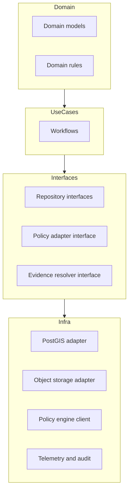
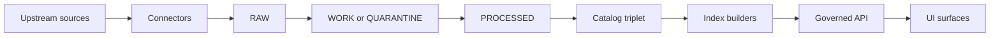

<!-- [KFM_META_BLOCK_V2]
doc_id: kfm://doc/4a3e3e36-f670-4c7c-af92-4ecc79e6885a
title: apps/api/src/infra — Infrastructure Layer
type: standard
version: v1
status: draft
owners: TBD (KFM Platform)
created: 2026-02-27
updated: 2026-02-27
policy_label: restricted
related:
  - TODO: link to apps/api/README.md
  - TODO: link to policy + evidence + catalog module docs
tags: [kfm, api, infra, trust-membrane]
notes:
  - Update placeholders (owners/links/tree/badges) once repository conventions are confirmed.
[/KFM_META_BLOCK_V2] -->

<a name="top"></a>

# `apps/api/src/infra` — Infrastructure layer

Concrete adapters + runtime wiring for external systems (databases, object storage, queues, policy engines, telemetry) **behind** governed interfaces.


**Owners:** TBD (KFM Platform) • **Last updated:** 2026-02-27

---

## Quick navigation

- [Purpose](#purpose)
- [What belongs here](#what-belongs-here)
- [What must NOT go here](#what-must-not-go-here)
- [Architecture context](#architecture-context)
- [Governance touchpoints](#governance-touchpoints)
- [Directory layout](#directory-layout)
- [Adapter registry](#adapter-registry)
- [How to add a new infra adapter](#how-to-add-a-new-infra-adapter)
- [Configuration + secrets](#configuration--secrets)
- [Testing + CI gates](#testing--ci-gates)
- [Operational concerns](#operational-concerns)
- [Appendix](#appendix)

---

## Purpose

This directory exists to **isolate infrastructure concerns** so that:

- domain/use‑case code stays testable and portable (no direct DB/network calls),
- governance can be enforced consistently at the API boundary (policy, redaction, audit),
- storage/indexes remain rebuildable projections of promoted artifacts.

See: **KFM layering + trust membrane** reference `[KFM-GDG-2026-02-20]`.

[Back to top](#top)

---

## What belongs here

> Think: “how we talk to the outside world” (and how we do it safely + reproducibly).

Typical contents:

- **Database clients/adapters** (e.g., PostGIS, graph DB, search index)
- **Object storage adapters** (RAW/WORK/PROCESSED artifacts, catalogs, receipts)
- **HTTP clients for upstream APIs** (connectors used by ingestion / indexer jobs)
- **Messaging/queues** (if used) and background job dispatch
- **Policy engine adapters** (e.g., OPA client + policy bundle loader)
- **Telemetry plumbing** (structured logging, tracing, metrics, audit IDs)
- **Runtime composition** (dependency injection / module wiring) — *only the wiring, not business logic*

✅ Rule of thumb: if it can be swapped for a different vendor implementation without changing domain logic, it belongs here.

[Back to top](#top)

---

## What must NOT go here

### Hard exclusions (default‑deny)

- **Domain rules / business logic** (belongs in domain + use cases)
- **Direct storage access from domain/use‑case code**
- **UI concerns** (rendering, map/story state, UX strings)
- **Ad‑hoc scripts** that bypass the promotion contract, catalogs, or policy enforcement
- **Secrets checked into repo** (keys, passwords, tokens)

> **WARNING:** Infra code is the easiest place to “accidentally” break the trust membrane. Treat any infra change as potentially governance‑breaking unless proven otherwise.

[Back to top](#top)

---

## Architecture context

### Layering contract

KFM uses a clean layering model:

**Domain → Use cases → Interfaces → Infrastructure**

This folder is the **Infrastructure** layer: concrete implementations for “ports” defined by Interfaces. `[KFM-GDG-2026-02-20]`



### Trust membrane invariants

Infra is where the trust membrane is easiest to violate. The core invariants:

- external clients never access DB/object storage directly
- core backend logic never bypasses repository interfaces to reach storage
- all access flows through governed APIs applying policy, redaction, and consistent logging

Reference: `[KFM-GDG-2026-02-20]`

---

## Governance touchpoints

Even though the *Promotion Contract* is enforced across pipelines, catalogs, CI, and runtime, infra code is a common enforcement point (storage, validation, policy adapters, receipts, link-checkers).

### Truth path (conceptual data flow)



### Promotion Contract v1 — how infra typically participates

> This table is a “where infra shows up” mapping, not a claim about exact module ownership.

| Gate | Requirement (system level) | Typical infra touchpoints |
|---|---|---|
| A | Identity and versioning | hashing utils, digest addressing, ID parsing/validation |
| B | Licensing and rights metadata | license snapshot storage, metadata stores, validation |
| C | Sensitivity classification and redaction plan | policy adapter, redaction helpers, tile/query enforcement hooks |
| D | Catalog triplet validation | schema validators, link checkers, catalog storage adapters |
| E | Run receipt and checksums | receipt writer/reader, audit ledger append, checksumming tools |
| F | Policy + contract tests | OPA adapter fixtures, evidence resolver contract test harness |
| G | Optional production posture | SBOM/signing verification hooks, perf + security smoke tests |

Reference: `[KFM-GDG-2026-02-20]`

[Back to top](#top)

---

## Directory layout

> **TODO:** replace this with the *actual* `tree apps/api/src/infra` output once the repo layout is confirmed.

```text
apps/api/src/infra/
  README.md                  # you are here
  config/                    # typed config, env parsing, validation
  db/                        # database clients, migrations helpers, query runners
  storage/                   # object storage (artifacts, catalogs, receipts)
  search/                    # search/index clients (if applicable)
  graph/                     # graph DB client (if applicable)
  http/                      # outbound HTTP clients + retry/backoff
  policy/                    # policy engine adapter (OPA client, bundle loader)
  telemetry/                 # logging, metrics, tracing, audit IDs
  wiring/                    # composition root (DI container / factories)
  __tests__/                 # infra unit + contract tests (if colocated)
```

**Directory documentation standard (minimum):**

Each subdirectory must have a small README (or inline doc) covering:

- purpose
- acceptable inputs
- exclusions
- how to test locally

[Back to top](#top)

---

## Adapter registry

Track infra adapters as “replaceable modules” with explicit contracts.

| Adapter name | Port / interface owned by | Implementation here | Config keys | Tests / gates |
|---|---|---|---|---|
| (example) PostGISRepository | `src/interfaces/...` | `infra/db/...` | `DB_URL` | unit + contract |
| (example) EvidenceCatalogStore | `src/interfaces/...` | `infra/storage/...` | `ARTIFACT_BUCKET` | link-check + schema |
| (example) PolicyDecisionClient | `src/interfaces/...` | `infra/policy/...` | `OPA_URL` | fixtures-driven policy |

> **TIP:** keep this table accurate; it is the quickest “where do I change X?” index.

[Back to top](#top)

---

## How to add a new infra adapter

### Checklist (smallest safe increment)

- [ ] **Define/confirm the port** (interface) in the Interfaces layer
- [ ] Add infra implementation in this directory
- [ ] Wire it in the composition root (factory/DI) with *no* behavior in wiring
- [ ] Add unit tests (pure logic) and contract tests (integration surface)
- [ ] Add observability: logs, metrics, trace spans, and audit IDs where relevant
- [ ] Update the [Adapter registry](#adapter-registry)
- [ ] Add/extend CI gates as needed (fail closed)

### Minimal adapter template (pseudo)

```ts
// interfaces/WeatherClient.ts
export interface WeatherClient {
  getForecast(location: string): Promise<Forecast>;
}
```

```ts
// infra/http/OpenWeatherClient.ts
export class OpenWeatherClient implements WeatherClient {
  constructor(private readonly http: HttpClient, private readonly apiKey: string) {}
  async getForecast(location: string): Promise<Forecast> {
    // validate inputs, apply retries/timeouts, never log secrets
    // emit trace span + audit metadata
    return this.http.get<Forecast>(`/forecast?loc=${encodeURIComponent(location)}`);
  }
}
```

> **NOTE:** the domain/use‑case layer must only “see” `WeatherClient`, never `OpenWeatherClient`.

[Back to top](#top)

---

## Configuration + secrets

### Configuration principles

- Config is **validated at startup** (fail fast, fail closed).
- Config is **typed** (no “stringly typed” access sprinkled across the codebase).
- Secrets never appear in logs, traces, or run receipts unless policy explicitly allows redaction.

### Secrets handling

- Use a secrets manager / runtime secret injection.
- Never commit `.env` with real secrets.
- Provide `.env.example` with **non-secret** placeholders only.

[Back to top](#top)

---

## Testing + CI gates

Infra changes must preserve:

1) **Trust membrane** (no bypass paths)  
2) **Reproducibility** (deterministic outputs + stable IDs where applicable)  
3) **Governance posture** (policy-aware behavior; fail closed)

### Minimum gates to expect in CI (infra relevant)

These gates are defined at the system level, but infra is often the enforcement point:

- Catalog profiles validate + cross-links resolve (link checker)
- Evidence resolver contract tests (public resolves; restricted fails closed without leakage)
- Policy tests (fixtures-driven)
- Spec hash / deterministic identity stability tests

Reference: `[KFM-GDG-2026-02-20]`

### Infra PR checklist

- [ ] No new direct DB/object-store access from domain/use-case modules
- [ ] All outbound calls have timeouts + bounded retries
- [ ] Sensitive fields are redacted in logs/telemetry
- [ ] Contract tests added for any new external dependency
- [ ] Rollback plan: feature flag or safe fallback path

[Back to top](#top)

---

## Operational concerns

### Canonical vs rebuildable stores

Treat object storage + catalogs + provenance as canonical; DB/search/graph/tiles are rebuildable projections. Infra implementations should assume they may be rebuilt at any time.

Reference: `[KFM-GDG-2026-02-20]`

### Evidence resolution ergonomics

Evidence resolution must be fast enough that users actually use it. Design for “<= 2 calls” from UI for evidence resolve.

Reference: `[KFM-GDG-2026-02-20]`

### Failure modes (default-deny)

- If policy is unclear → deny / quarantine, do not guess.
- If licensing is unclear → deny / quarantine, do not publish.
- If evidence cannot be resolved → fail closed (no partial sensitive leakage).

[Back to top](#top)

---

## Appendix

<details>
<summary><strong>A. Suggested naming conventions</strong></summary>

- `*Client` for outbound network clients
- `*Store` for object storage backed implementations
- `*Repository` for DB-backed implementations
- `*Adapter` when bridging two models (e.g., STAC → domain)

</details>

<details>
<summary><strong>B. When to split infra vs interfaces</strong></summary>

Keep *interfaces* near use cases; keep *implementations* here.

If you find yourself importing `infra/...` from domain/use-case code, that’s a red flag.

</details>
