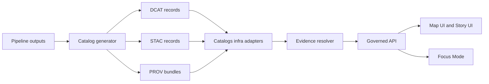

<!-- [KFM_META_BLOCK_V2]
doc_id: kfm://doc/1b2c7b9f-0c8f-4a3a-9fd4-2358a5b3e4a1
title: Catalogs Infrastructure (apps/api/src/infra/catalogs)
type: standard
version: v1
status: draft
owners: TODO(@kfm-platform)
created: 2026-02-27
updated: 2026-02-27
policy_label: restricted
related:
  - kfm://doc/vnext-design-guide
  - docs/MASTER_GUIDE_v13.md
  - docs/architecture/
  - docs/policies/
tags: [kfm, api, infra, catalogs, dcat, stac, prov]
notes:
  - "This README documents the intended responsibilities + invariants for the catalogs infrastructure module."
  - "Some filesystem layout and exact interface names are TODO until verified against the repo tree."
[/KFM_META_BLOCK_V2] -->

[](#)
[](#)
[](#)
[](#)
[](#)

# Catalogs Infrastructure

Infrastructure adapters for the **KFM catalog triplet** (**DCAT + STAC + PROV**) — responsible for **storage I/O**, **schema/profile validation**, and **deterministic cross-link resolution** used by the governed API and Evidence Resolver.

> **Why this exists:** In KFM, catalogs are part of the **canonical store** (source-of-truth), not a “nice-to-have” index. They bridge pipeline outputs to runtime services.

---

## Quick nav

- [Purpose](#purpose)
- [Where this fits in KFM](#where-this-fits-in-kfm)
- [Contracts and invariants](#contracts-and-invariants)
- [Directory layout](#directory-layout)
- [How it works](#how-it-works)
- [CI and promotion gates](#ci-and-promotion-gates)
- [Change checklist](#change-checklist)
- [Troubleshooting](#troubleshooting)
- [Appendix](#appendix)

---

## Purpose

This directory hosts the **infrastructure layer** implementation behind catalog-related interfaces:

- Read/write **DCAT dataset/distribution** metadata (dataset discovery + governance metadata).
- Read/write **STAC collections/items** (spatial asset inventory + preview/tiling hooks).
- Read/write **PROV bundles** (lineage: entities, activities, agents, and run receipts).
- Enforce **profile validation** (KFM-specific profiles) and **cross-link rules** among the triplet.
- Provide primitives used by the **Evidence Resolver** to resolve `EvidenceRef → EvidenceBundle`.

---

## Where this fits in KFM

KFM uses clean/layered architecture:

- **Domain** (pure models + rules)
- **Use cases** (workflows like “ingest”, “promote”, “publish story node”)
- **Interfaces** (contracts + repository interfaces)
- **Infrastructure** (datastores, object storage, indexes, CI, deployment)

This module is **Infrastructure**. Domain logic **must not** talk directly to storage/indexes; it talks through **interfaces**.

### Upstream and downstream

| Direction | Component | What crosses the boundary |
|---|---|---|
| Upstream → | pipeline runner + catalog generator | validated catalog records, run receipts, checksums/attestations |
| This module | catalogs infra adapters | parse, validate, store, resolve links deterministically |
| → Downstream | Evidence Resolver + governed API | EvidenceRef resolution, catalog-backed discovery responses |

---

## Contracts and invariants

### 1) The catalog triplet is one logical contract

The catalogs act as a *joined surface*:

- **DCAT** = dataset-level discovery + distributions
- **STAC** = spatial assets (collections/items) + spatial/temporal extents
- **PROV** = lineage (what produced what, when, with what parameters)

**Invariant:** Triplet records must be **cross-linked** so a client (or resolver) can traverse dataset → asset → lineage without heuristics.

### 2) EvidenceRef schemes (minimum)

Evidence is referenced by stable “scheme” identifiers (examples):

- `dcat://…` for DCAT records
- `stac://…` for STAC assets
- `prov://…` for PROV bundles
- `doc://…` for documents (story nodes, reports, etc.)
- `graph://…` for graph entities (if used)

**Invariant:** Resolution is **deterministic** and **fails closed** (missing record, broken link, or policy mismatch is an error, not a best-effort partial response).

### 3) Minimum required fields (profiled)

This module should validate (at minimum):

- **DCAT dataset**: `id`, `title`, `description`, `license`, `spatial`, `temporal`, `version`, `distributions[]`
- **STAC collection**: `id`, `extent`, `license`, `links[]`
- **STAC item**: `id`, `collection`, `assets`, `bbox`, `geometry`, `properties.datetime`
- **PROV**: Entities + Activities + Agents with pointers that connect to catalog items and produced artifacts

> **NOTE:** Profile schemas should be pinned and versioned (prefer `schemas/` with explicit versions).

### 4) Cross-linking rules (minimum)

Required cross-links (non-exhaustive):

- STAC collection links back to DCAT dataset (`rel="describedby"` or equivalent).
- DCAT distribution links to STAC items/collection and/or the artifact location.
- PROV entities reference the artifacts and the catalog identifiers they describe.
- All cross-links must be resolvable by the CI link-checker and by the Evidence Resolver at runtime.

### 5) Canonical vs rebuildable

Catalogs are **canonical** along with object storage and the audit ledger. Indexes derived from them (PostGIS/search/graph edges/tiles) are **rebuildable projections**.

**Invariant:** You can re-index without losing the source truth because catalogs remain the stable contract surface.

---

## Directory layout

> ⚠️ **Repo verification TODO:** the exact folder names/files in this directory are not confirmed here.  
> Run the commands below and update this section with the real tree.

```bash
# From repo root:
ls -la apps/api/src/infra/catalogs
# Or:
find apps/api/src/infra/catalogs -maxdepth 3 -type f
```

### Expected structure (PROPOSED)

```text
apps/api/src/infra/catalogs/
  README.md

  # Entry point / wiring
  index.ts                      (or index.js)

  # Record type adapters
  dcat/                          DCAT read/write + validation adapter
  stac/                          STAC read/write + validation adapter
  prov/                          PROV read/write + validation adapter

  # Cross-link validation / resolution
  linkcheck/                     "triplet integrity" checks
  resolver/                      helpers for EvidenceRef → record → bundle

  # Storage backends (implementation-specific)
  storage/                       fs, s3, db, etc (adapters only)

  # Tests
  __tests__/                     fixtures-driven contract tests
```

---

## How it works



Key behaviors:

1. **Catalog generator** emits DCAT/STAC/PROV + receipts from pipeline runs.
2. This infra module persists + validates those records against KFM profiles.
3. **Cross-link checker** ensures the triplet is navigable and resolvable.
4. The **Evidence Resolver** consumes these primitives to fetch + assemble an EvidenceBundle with policy/redaction applied upstream of the UI.

---

## CI and promotion gates

Catalog integrity is a **promotion gate** (promotion is what moves artifacts from Raw/Work → Processed + Catalog/Lineage and then into runtime surfaces).

### Gate expectations (minimum)

- [ ] DCAT record exists and validates (KFM profile)
- [ ] STAC collections/items exist and validate (KFM profile)
- [ ] PROV bundle exists and validates (KFM profile)
- [ ] Cross-links exist and are resolvable (CI link-checker)
- [ ] Evidence resolver can resolve representative EvidenceRefs for the dataset class
- [ ] License metadata is present (catalog license fields are treated as required compliance signals)

### Attestations and hashing (recommended)

If the system stores attestations and digests:

- Canonicalize configs (stable key ordering, minified JSON/YAML) before hashing to avoid false changes.
- Store attestation bundle URIs in DCAT/STAC/PROV so downstream users can discover them reliably.
- Promotion/publish gates should verify attestations.

---

## Change checklist

When modifying anything under `apps/api/src/infra/catalogs/`:

- [ ] **No domain leakage:** keep this directory infrastructure-only (no business rules).
- [ ] **Schema/profile pinned:** update schema versions intentionally; never “accept unknown fields silently”.
- [ ] **Fail closed:** broken links, invalid schema, or missing required fields must raise errors.
- [ ] **Fixtures updated:** add/update fixtures for new catalog fields and new link patterns.
- [ ] **Link integrity:** update link-checker expectations if you modify relationships.
- [ ] **Reproducibility:** if you change hashing/normalization rules, document + test them explicitly.

---

## Troubleshooting

**“Cross-link check failed”**
- Verify the DCAT ↔ STAC ↔ PROV pointers are present and resolvable.
- Confirm STAC items reference the correct `collection` and assets exist.

**“EvidenceRef not resolvable”**
- Confirm the scheme matches an implemented resolver (`dcat://`, `stac://`, `prov://`, etc.).
- Confirm the referenced record exists in the catalog store and passes validation.

**“Promotion gate D failed”**
- The system considers catalog integrity part of promotion; fix catalogs before attempting to publish.

---

## Appendix

<details>
<summary><strong>Glossary</strong></summary>

- **DCAT**: W3C Data Catalog Vocabulary (dataset + distributions).
- **STAC**: SpatioTemporal Asset Catalog (collections + items + assets).
- **PROV**: W3C Provenance model (entity/activity/agent).
- **EvidenceRef**: A stable identifier for evidence, resolved into an **EvidenceBundle** for UI and Focus Mode.
- **EvidenceBundle**: The structured response payload containing the evidence, its metadata, and policy notices (assembled by the Evidence Resolver).

</details>

<details>
<summary><strong>Repo-specific TODOs</strong></summary>

- Replace `owners: TODO(@kfm-platform)` with real code owners.
- Replace “Expected structure” with the **actual** `find`/`tree` output.
- Link to the actual schema registry location (likely `schemas/`).
- Link to the Evidence Resolver module path in this repo (if present).
- Wire real CI badges (build/test/lint/typecheck).

</details>

---

<p align="right"><a href="#catalogs-infrastructure">Back to top</a></p>
