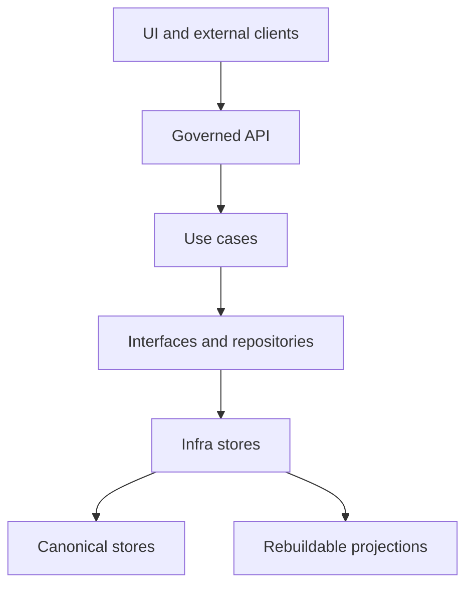
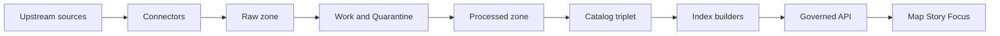

<!-- [KFM_META_BLOCK_V2]
doc_id: kfm://doc/74605939-e42e-40dc-842a-723c7de4aa9b
title: KFM API Infra Stores
type: standard
version: v1
status: draft
owners: TODO: set owning team
created: 2026-02-27
updated: 2026-02-27
policy_label: internal
related:
  - TODO: link to KFM Definitive Design & Governance Guide (vNext, 2026-02-20)
tags: [kfm, api, infra, stores, trust-membrane]
notes:
  - This README is a governed directory contract. Treat store changes as production changes.
[/KFM_META_BLOCK_V2] -->

# KFM API — Infra Stores
Concrete storage/index adapters (canonical + rebuildable projections) used by the governed API layer.

<!-- TODO: replace placeholder badges with real ones once paths/CI names are confirmed -->


**Status:** draft • **Owners:** _TODO_ • **Scope:** `apps/api/src/infra/stores/*`

---

## Quick navigation
- [Purpose](#purpose)
- [Trust membrane and boundaries](#trust-membrane-and-boundaries)
- [Store taxonomy](#store-taxonomy)
- [Data flow](#data-flow)
- [Directory layout](#directory-layout)
- [Adding a store adapter](#adding-a-store-adapter)
- [Testing and gates](#testing-and-gates)
- [Security notes](#security-notes)
- [Appendix](#appendix)

---

## Purpose
This directory contains **infrastructure “store” implementations**: concrete adapters to databases, object storage, search indexes, graph stores, tile stores, and the audit ledger.

These adapters exist to support the KFM posture:

- **Policy + provenance are enforceable only if storage access is governed.**
- **Canonical truth lives in object storage + catalogs + provenance;** database/search/graph/tiles are **rebuildable projections**.
- **Domain/use-case code must not talk to infrastructure directly.**

> **WARNING**
> If you import infra store implementations directly into domain logic (or allow external clients to access stores directly), you break the trust membrane.

[Back to top](#kfm-api--infra-stores)

---

## Trust membrane and boundaries

### What the trust membrane means here
- **External clients never hit DB/object storage directly.**
- **Core backend logic only talks to storage via repository interfaces/contracts.**
- **All access is mediated by governed APIs that apply policy, redaction obligations, and logging consistently.**

### Layering map (where this folder fits)


**Rule of thumb:** if a module contains business meaning (“what a dataset is”), it does **not** belong here.

[Back to top](#kfm-api--infra-stores)

---

## Store taxonomy

### Canonical stores (source of truth)
Canonical stores must be **append-only or versioned**, and support **reproducible reads** (by immutable IDs and/or digests).

| Store | Canonical? | What it contains | Mutability | Notes |
|---|---:|---|---|---|
| Artifact store | ✅ | Raw/Work/Processed artifacts (files/objects) | Append-only/versioned | Prefer digest-addressed artifacts |
| Catalog store | ✅ | DCAT/STAC/PROV records + profiles | Versioned | Must validate; part of promotion |
| Audit ledger | ✅ | Run receipts, promotion decisions, checksums | Append-only | Must be immutable enough for reproduction |

### Rebuildable projections (derived indexes)
Rebuildable stores are allowed to be dropped and regenerated from canonical stores.

| Store | Rebuildable? | Typical content | Rebuild inputs |
|---|---:|---|---|
| Spatial query DB (e.g., PostGIS) | ✅ | Feature tables, spatial indexes | Processed GeoParquet + catalogs |
| Search index | ✅ | Full-text + metadata index | Processed text + catalogs |
| Lineage/entity graph | ✅ | Entity edges, provenance links | Catalogs + ER outputs |
| Tile outputs/caches | ✅ | PMTiles, cached tiles | Processed features |

> **NOTE**
> If a store cannot be safely rebuilt without losing truth, it is probably canonical (or it’s missing canonical artifacts).

[Back to top](#kfm-api--infra-stores)

---

## Data flow
Conceptually, KFM flows from acquisition to governed runtime:



This `stores/` directory supports the **IDX** + **API** parts of the flow (and may provide canonical store adapters depending on deployment).

[Back to top](#kfm-api--infra-stores)

---

## Directory layout
This README documents the intent of the directory. The *actual* subfolders may differ.

```text
apps/api/src/infra/stores/
  README.md
  _shared/                # shared infra helpers (retry, timeouts, metrics)
  artifact/               # object storage adapter(s)
  catalog/                # catalog persistence + validators (if stored here)
  audit/                  # audit ledger adapter(s)
  postgis/                # spatial DB adapter(s)
  search/                 # search index adapter(s)
  graph/                  # graph store adapter(s)
  tiles/                  # tile bundle access/caching
  index-builders/         # rebuild logic or orchestration hooks (if owned here)
```

**Acceptable inputs (what belongs here):**
- Concrete clients/adapters to storage systems (DB/object store/search/graph).
- Connection management, migrations (if applicable), retry/backoff, pooling.
- Store-specific observability (metrics/tracing/logging) **without** business logic.
- Contract-test fixtures for infra adapters (not policy logic).

**Exclusions (what must not go here):**
- Domain models and business rules (Dataset/Event semantics, redaction logic).
- Policy decisions (OPA rules/fixtures live elsewhere; stores only accept decisions/obligations as inputs).
- UI contracts and DTO definitions (belong in interface layer).
- “Hidden shortcuts” that bypass repositories/governed API.

[Back to top](#kfm-api--infra-stores)

---

## Adding a store adapter
When introducing a new store adapter (or a new backend for an existing store):

### 1) Decide canonical vs rebuildable
- If it is a **truth source**, it must be canonical (versioned/append-only).
- If it is a **projection**, it must be rebuildable from promoted artifacts.

### 2) Implement the smallest safe contract
Minimum expectations for any adapter:
- **Health signal** (used by readiness checks)
- **Bounded timeouts** + retry policy (no infinite hangs)
- **Structured logging** (include correlation IDs and dataset/version identifiers where applicable)
- **Fail-closed** behavior when authorization/policy context is missing

### 3) Wire through interfaces (do not leak infra types)
- Expose infra adapters through **repository interfaces** (interface layer).
- Keep dependency injection in one place (composition root).

### 4) Add contract tests
- Prove that the adapter respects invariants (see [Testing and gates](#testing-and-gates)).

### Definition of Done (DoD)
- [ ] No domain module imports `infra/stores/*` directly
- [ ] Adapter has health/readiness signal
- [ ] Adapter never serves un-promoted artifacts unless explicitly authorized by a governance workflow
- [ ] Adapter emits sufficient logs for audit correlation (run id, dataset version id, request id)
- [ ] Contract tests exist and run in CI
- [ ] Secrets are only loaded via runtime config/secret manager (no literals)

[Back to top](#kfm-api--infra-stores)

---

## Testing and gates

### Required invariants (merge-blocking)
These are contract-level checks you should enforce with tests:

- **Trust membrane:** no direct client access to stores; no domain-to-infra shortcuts.
- **Canonical vs rebuildable:** projections must be rebuildable from promoted artifacts.
- **Promotion posture:** runtime reads should only use promoted + cataloged artifacts by default.

### Suggested test types
- **Contract tests** per adapter (CRUD, pagination, idempotency, timeout behavior)
- **Policy boundary tests** (ensure “missing policy” => deny)
- **Index rebuild tests** (projection can be rebuilt from canonical artifacts/cat)

[Back to top](#kfm-api--infra-stores)

---

## Security notes
- Treat every store as **sensitive**: lock down credentials, scopes, and network access.
- Prefer **least privilege**:
  - artifact read-only roles for runtime
  - separate write roles for pipeline/indexers
- Encrypt in transit; prefer encryption at rest.
- Avoid “side doors”: do not expose direct bucket/database URLs to UI clients.

[Back to top](#kfm-api--infra-stores)

---

## Appendix

<details>
<summary><strong>Illustrative interface sketch (pseudocode)</strong></summary>

```ts
// PSEUDOCODE — adjust to your codebase conventions

export type StoreHealth = { ok: boolean; details?: Record<string, unknown> };

export interface ArtifactStore {
  health(): Promise<StoreHealth>;

  // Prefer digest-addressed reads/writes.
  getByDigest(digest: string): Promise<Buffer>;
  putByDigest(digest: string, bytes: Buffer, meta?: Record<string, string>): Promise<void>;
}

export interface ProjectionStore {
  health(): Promise<StoreHealth>;

  // Rebuildable from promoted artifacts + catalogs
  rebuildFromPromoted(datasetVersionId: string): Promise<void>;
}
```
</details>

<details>
<summary><strong>Operator runbook checklist (starter)</strong></summary>

- [ ] Can we rebuild projections end-to-end from canonical stores?
- [ ] Do we have a “cold start” path (empty DB/index) that converges?
- [ ] Are timeouts tuned to fail fast rather than stall requests?
- [ ] Do logs include request-id + dataset-version-id when available?
- [ ] Are store credentials scoped and rotated?
</details>
