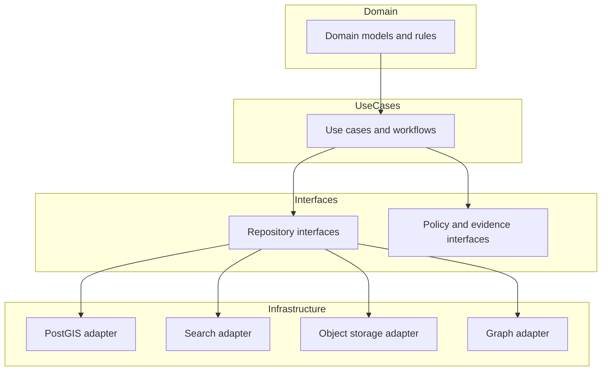

<!-- [KFM_META_BLOCK_V2]
doc_id: kfm://doc/b4c1f07b-4f5e-4b4c-a8f6-8c52f0b0f3e8
title: Repository Interfaces (API)
type: standard
version: v1
status: draft
owners: TODO
created: 2026-02-27
updated: 2026-02-27
policy_label: public
related:
  - TODO
tags: [kfm, api, interfaces, repositories]
notes:
  - "Interfaces layer: repository contracts only; no infrastructure code."
[/KFM_META_BLOCK_V2] -->

# Repository Interfaces (`apps/api/src/interfaces/repos`)

Repository **contracts (ports)** for the API. These interfaces define *what* the application needs from storage/indexes—**not** *how* it is implemented.


> **Status**
> - This README defines the *intended* contract boundaries for `repos/`.
> - TODO: align examples + directory tree with the current codebase (not confirmed in repo yet).

---

## Navigation

- [Purpose](#purpose)
- [Where this fits](#where-this-fits)
- [Directory contract](#directory-contract)
- [Interface design rules](#interface-design-rules)
- [Example interface shapes](#example-interface-shapes)
- [Adding a new repo interface](#adding-a-new-repo-interface)
- [Implementing an adapter](#implementing-an-adapter)
- [Testing requirements](#testing-requirements)
- [Glossary](#glossary)

---

## Purpose

This folder contains **repository interfaces** used by the *use-case layer* to access:

- catalogs / metadata (DCAT / STAC / PROV surfaces)
- rebuildable projections (e.g., spatial DB, search index, graph)
- append-only audit/event ledgers (read/write via governed service, if applicable)

The repository interfaces are **stable contracts** designed to keep domain/use-case logic independent from infrastructure choices.

---

## Where this fits

KFM’s architecture separates concerns so domain + use-cases depend only on contracts (interfaces), never on infrastructure details.



---

## Directory contract

### ✅ What belongs here

| Allowed | Examples |
|---|---|
| Type-only contracts | `interface`, `type`, error shapes |
| Pure mapping helpers (if they are **infrastructure-free**) | DTO ↔ domain mapping that doesn’t import DB/HTTP libs |
| Contract tests (if your test layout keeps them next to contracts) | `*.contract.test.*` |
| Small README/docs for the interfaces | this file |

### ❌ What must NOT be added here

| Not allowed | Why |
|---|---|
| DB clients, ORM models, query builders, SQL | infrastructure detail; breaks trust membrane |
| HTTP clients / SDK calls to external services | belongs in adapters |
| Policy decisions (allow/deny logic) | policy is evaluated by the policy engine (PDP) and enforced by PEPs |
| “Convenience” functions that reach into infra | makes mocking/testing harder; erodes contracts |

> **Rule of thumb:** If a file imports a database driver, cloud SDK, network client, or filesystem adapter, it **does not** belong in `interfaces/repos`.

---

## Interface design rules

### 1) Contracts use domain-friendly types

Repository interfaces should return **domain types** (or explicit API-facing read models), not raw DB rows.

✅ Good: `DatasetVersion`, `EvidenceBundle`, `StoryNode`, `FeatureSummary`  
❌ Bad: `PgRow`, `MongoDocument`, `ElasticHit`, `PrismaModel`

### 2) Make policy context explicit (don’t “hide” it)

If a method’s result depends on role, sensitivity label, or license constraints, the caller must provide an explicit context parameter.

Recommended: an `AccessContext` / `RequestContext` with at least:

- principal / role info
- declared purpose (optional)
- correlation id / audit ref (optional)

### 3) Fail closed for ambiguous access

If a repo cannot distinguish “not found” vs “not allowed” safely, prefer returning a **policy-safe** error that doesn’t leak restricted existence.

> TIP: Keep “policy-safe errors” and “developer errors” separate. The API layer can map them to a stable error model.

### 4) Time-aware query shapes are first-class

Prefer query objects that make time semantics explicit (e.g., `asOf`, `validAt`, `eventRange`) instead of ad-hoc optional params.

### 5) Avoid N+1 patterns by design

Prefer “bulk” methods (batch gets, search with filters) over repeated `getById()` loops in higher layers.

---

## Example interface shapes

> These are **examples**. Adjust names/types to match the actual domain model in this repo.

### TypeScript-style example

```ts
// interfaces/repos/types.ts (example)
export type PolicyLabel = "public" | "public_generalized" | "restricted";

export interface AccessContext {
  principalId: string;
  roles: string[];          // e.g. ["public"], ["steward"]
  purpose?: string;         // optional declared purpose
  auditRef?: string;        // correlation id / audit reference
}

export type RepoErrorCode =
  | "NOT_FOUND"
  | "NOT_ALLOWED"
  | "INVALID_QUERY"
  | "DEPENDENCY_FAILED";

export class RepoError extends Error {
  constructor(
    public code: RepoErrorCode,
    message: string,
    public meta?: Record<string, unknown>,
  ) {
    super(message);
  }
}
```

```ts
// interfaces/repos/DatasetCatalogRepo.ts (example)
export interface DatasetQuery {
  text?: string;
  theme?: string[];
  bbox?: [number, number, number, number];
  time?: { start: string; end: string };
  limit?: number;
  cursor?: string;
}

export interface DatasetSummary {
  datasetId: string;
  title: string;
  policyLabel: PolicyLabel;
  latestVersionId?: string;
}

export interface DatasetCatalogRepo {
  listDatasets(ctx: AccessContext, q: DatasetQuery): Promise<DatasetSummary[]>;
  getDatasetVersion(ctx: AccessContext, datasetVersionId: string): Promise<unknown | null>;
}
```

### Minimal “contract test” pattern (example)

```ts
/**
 * Goal: every adapter must pass the same behavioral tests.
 * Run these tests against:
 *  - in-memory fake
 *  - PostGIS adapter (integration)
 *  - any future adapter
 */
describe("DatasetCatalogRepo contract", () => {
  it("does not leak restricted datasets to public roles", async () => {
    // arrange: adapter seeded with restricted + public
    // act: listDatasets with ctx.roles=["public"]
    // assert: restricted not present (or safely redacted)
  });
});
```

---

## Adding a new repo interface

1. Define the interface in this folder using **domain-friendly types**.
2. Document:
   - what the methods return (including nullability)
   - which filters are supported
   - what “policy-safe” behavior is required
3. Add/extend contract tests so all adapters stay aligned.

**Definition of Done**

- [ ] Interface is small and cohesive (single responsibility)
- [ ] Inputs use query objects (not long param lists)
- [ ] Access context is explicit where needed
- [ ] Error behavior is policy-safe and documented
- [ ] Contract tests exist (happy path + deny path + edge cases)

---

## Implementing an adapter

Adapters live in the **infrastructure** layer (e.g., `src/infra/...`, `src/adapters/...`).

**Adapter checklist**

- [ ] Does not export infra types through the interface boundary
- [ ] Handles policy label propagation (or ensures caller can retrieve it)
- [ ] Uses prepared statements / parameterized queries (if SQL)
- [ ] Adds basic observability (timings, counts, correlation id)
- [ ] Includes integration tests (dockerized dependency if needed)
- [ ] Passes the contract test suite

> WARNING: If an adapter’s behavior differs across stores (e.g., search index vs DB), encode that difference as a *separate interface*, not a hidden footnote.

---

## Testing requirements

At minimum:

- **Unit tests** for interface-level helpers (if any)
- **Contract tests** to guarantee consistent semantics across adapters
- **Integration tests** for adapters that touch real dependencies
- **Policy fixture tests** (in the policy module) to confirm allow/deny/obligations

---

## Glossary

<details>
<summary>Ports, adapters, and why we care</summary>

- **Port**: an interface the application depends on (e.g., `DatasetCatalogRepo`).
- **Adapter**: a concrete implementation of a port (e.g., PostGIS-backed repo).
- **Trust membrane**: a hard boundary—clients and domain logic never reach directly into infrastructure.
- **Fail closed**: if rights/sensitivity/citations are unclear, deny or reduce scope rather than guessing.

</details>

<details>
<summary>Canonical vs rebuildable stores (quick mental model)</summary>

- **Canonical**: artifacts and catalogs that define truth (object storage + DCAT/STAC/PROV + audit ledger).
- **Rebuildable**: projections derived from canonical sources (spatial DB tables, search index, graph edges, tile caches).

Interfaces should make it obvious which “truth source” they represent.

</details>

---

<a id="back-to-top"></a>
**Back to top:** [Navigation](#navigation)
