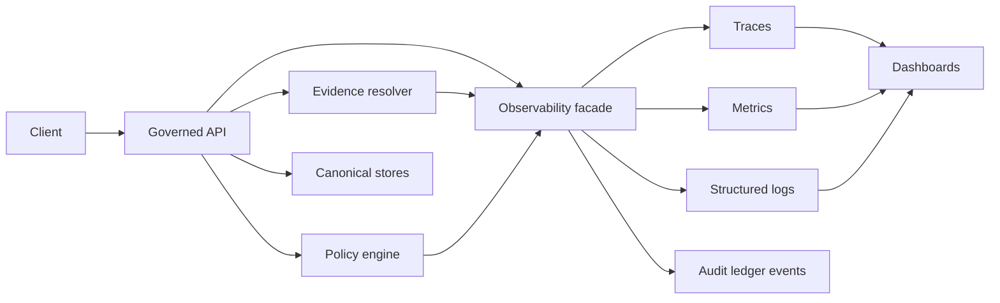

<!-- [KFM_META_BLOCK_V2]
doc_id: kfm://doc/91c0c7af-2abf-4f0e-bb8b-c521d81c0c29
title: API Observability
type: standard
version: v1
status: draft
owners: TBD
created: 2026-02-27
updated: 2026-02-27
policy_label: public
related:
  - apps/api/src/observability/README.md
tags: [kfm, api, observability]
notes:
  - Vendor-neutral observability facade for the governed API (logs, metrics, traces, audit).
[/KFM_META_BLOCK_V2] -->

# Observability (apps/api/src/observability)

Telemetry + **audit logging** primitives for the **Governed API**.


<!-- TODO: Replace/extend with repo CI, coverage, and release badges. -->

> **NOTE**
> This README documents *what belongs in this directory* and the **minimum KFM observability + audit requirements** that API code must satisfy.
> Implementation details (framework, vendors, exporters) are intentionally kept **pluggable**.

---

## Quick navigation

- [Purpose](#purpose)
- [Where this fits](#where-this-fits)
- [Responsibilities](#responsibilities)
- [Non-goals](#non-goals)
- [Architecture](#architecture)
- [Audit logging requirements](#audit-logging-requirements)
- [Telemetry conventions](#telemetry-conventions)
- [How to instrument an endpoint](#how-to-instrument-an-endpoint)
- [Dashboards and audiences](#dashboards-and-audiences)
- [Testing](#testing)
- [Definition of Done](#definition-of-done)
- [Directory layout](#directory-layout)

---

## Purpose

Provide a single place for API developers to:

- Emit **structured logs** with consistent correlation fields.
- Emit **metrics** for latency, errors, and health signals.
- Emit **traces** (optional early; required once you need cross-service debugging).
- Emit **audit records** for *governed operations* (policy + evidence + provenance).

Observability is not just “ops telemetry” in KFM. It is part of the **trust membrane**:
it makes policy decisions, provenance linkages, and “why did the system do that?” *auditable*.

[Back to top](#quick-navigation)

---

## Where this fits

This directory is the API-side **cross‑cutting boundary** for observability.

- ✅ Endpoint handlers call helpers from here.
- ✅ Policy enforcement code can attach policy decision IDs / reason codes here.
- ✅ Evidence-resolver calls should propagate correlation IDs from here.
- ✅ Pipelines / background jobs can reuse the same correlation fields.

[Back to top](#quick-navigation)

---

## Responsibilities

### 1) Correlation everywhere

Every request / job should carry (at minimum):

- `audit_ref` (KFM run id / audit-ledger reference)
- `request_id` (edge request correlation)
- `trace_id` + `span_id` (if tracing enabled)

These must appear in logs and (when applicable) in API responses.

### 2) Governed-operation audit logging

For endpoints that are **governed operations** (e.g., Focus Mode ask, story publish, evidence resolution, promotion actions), emit an audit log record that is policy-safe (see [Audit logging requirements](#audit-logging-requirements)).

### 3) Redaction by default

Audit logs and some operational logs are **sensitive**. This directory must provide utilities to:

- strip secrets (tokens, auth headers)
- remove direct identifiers (names, exact coordinates) when not allowed
- avoid “ghost metadata” leaks (do not reveal existence through error/log differences)

### 4) Vendor neutrality

This directory should **not** hardcode a specific vendor backend. It should expose a small internal contract (interfaces/adapters) so infra can swap exporters without rewriting app code.

[Back to top](#quick-navigation)

---

## Non-goals

This directory must **not** contain:

- business/domain logic (datasets, stories, Focus Mode reasoning)
- direct calls to databases/object storage/search indexes (keep layers clean)
- long-lived background worker orchestration (put that in a job module; reuse observability helpers here)
- dashboards-as-code that depends on a specific vendor (keep in infra/ops if needed)

[Back to top](#quick-navigation)

---

## Architecture



Key idea: **the API is the enforcement boundary**, so it is also the natural place to stamp:
policy decisions, dataset version IDs, artifact digests, and audit references.

[Back to top](#quick-navigation)

---

## Audit logging requirements

A **governed operation** must emit an audit record that captures, at minimum:

- **who**: principal + role (policy-safe identifiers)
- **what**: endpoint name + key parameters (redacted/sanitized)
- **when**: timestamp(s)
- **why**: purpose (if the client declares one)
- **inputs/outputs**: references *by digest* (when applicable)
- **policy decision**: allow/deny + obligations + reason codes

> **WARNING**
> Audit logs are themselves sensitive. Treat them as governed data:
> apply redaction, access controls, and retention policies.

### Required API surface tie-in

If an endpoint is governed, its response (success or error) should include an `audit_ref`
so operators/stewards can find the exact audit record for review.

[Back to top](#quick-navigation)

---

## Telemetry conventions

### Minimum observability baseline

Implement (at least):

- **Structured logs** with correlation IDs and `audit_ref`.
- **Metrics**:
  - request latency (P95) per endpoint
  - evidence resolver latency
  - tile response latency
  - pipeline/job durations and failures
- **Traces**: optional early, but strongly recommended once multiple services are involved.

### Canonical telemetry keys (KFM)

Use the same identifiers across **logs, metrics, traces, and catalogs**.

| Concept | OTel attribute (preferred) | Metrics label (example) | Notes |
|---|---|---|---|
| Run ID | `kfm.job.run_id` | `job_run_id` | UUID/ULID (stable per run) |
| Commit SHA | `kfm.git.commit_sha` | `commit_sha` | 7–40 hex |
| Status | `kfm.job.status` | `status` | scheduled, running, succeeded, failed, canceled |
| Started | `kfm.job.started_at` | `started_at` | RFC3339 string + also emit unix seconds |
| Ended | `kfm.job.ended_at` | `ended_at` | RFC3339 string + also emit unix seconds |
| Dataset ID | `kfm.dataset.id` | `dataset_id` | Align with STAC/DCAT identifiers |
| Pipeline name | `kfm.pipeline.name` | `pipeline` | Stable slug |
| Environment | `kfm.env` | `env` | dev, staging, prod |

### Catalog linkage (don’t skip this)

When telemetry is about a pipeline/job that produces artifacts:

- Stamp run identifiers into catalog metadata (e.g., STAC Item properties).
- Model the run as a `prov:Activity` in PROV JSON‑LD.
- Use `dataset_id` + `dataset_version_id` to join dashboards ↔ catalog pages (and Focus Mode evidence).

### Examples (KFM patterns)

These are concrete examples of *what we mean* by “metrics + traces + governance”, taken from KFM implementation patterns:

- **Rollup jobs / summary nodes** (if/when your API serves precomputed summaries):
  - Metrics: rollup duration, nodes written, stale node count
  - Traces: spans around Focus Mode “summary fetch” to compare vs fallback behavior
  - Governance: if summaries overlap protected areas/territories, redact or aggregate before publishing; also log license inheritance and (optionally) energy/carbon telemetry

> **TIP**
> Keep the metric/tracing *names* stable and the *labels* low-cardinality (use IDs like dataset_version_id, not free-text).

[Back to top](#quick-navigation)

---

## How to instrument an endpoint

> **Assumption (not confirmed in repo):** `apps/api` is a TypeScript/Node service.
> If your framework differs, keep the *shape* of the pattern but adapt the implementation.

### 1) Middleware: create correlation + root span

```ts
// pseudo-code: adapt to your HTTP framework
import { withRequestContext } from "./requestContext";

export function observabilityMiddleware(req, res, next) {
  withRequestContext(req, res, () => {
    // 1) ensure request_id
    // 2) ensure audit_ref (new for governed ops, or propagated)
    // 3) start root span (optional early)
    next();
  });
}
```

### 2) Handler wrapper: emit governed-operation audit record

```ts
import { auditLogGovernedOperation } from "./audit";
import { logger } from "./logger";

export async function withGovernedAudit(ctx, operationName, fn) {
  const started = Date.now();
  try {
    const result = await fn();
    auditLogGovernedOperation(ctx, {
      outcome: "success",
      operationName,
      durationMs: Date.now() - started,
    });
    return result;
  } catch (err) {
    auditLogGovernedOperation(ctx, {
      outcome: "error",
      operationName,
      durationMs: Date.now() - started,
      errorCode: err?.code ?? "UNKNOWN",
    });
    logger.error({ err }, "governed operation failed");
    throw err;
  }
}
```

### 3) Response shape: always return `audit_ref` for governed ops

```json
{
  "data": { "...": "..." },
  "policy": { "label": "public" },
  "audit_ref": "kfm://run/2026-02-27T12:34:56Z.focus.ask.abcd1234"
}
```

[Back to top](#quick-navigation)

---

## Dashboards and audiences

Dashboards should support (at minimum):

- **Steward view**: policy denials, rights issues, quarantines
- **Operator view**: pipeline/job health, storage usage, deployment status
- **Product view**: UI performance (API contributes latency + error + availability), plus a11y regression indicators (from UI tests)

[Back to top](#quick-navigation)

---

## Testing

Minimum tests we expect around observability code:

- Unit: **redaction** rules (ensure secrets/PII do not leak)
- Unit: correlation propagation (request_id / audit_ref attached)
- Contract: governed endpoints **always** include `audit_ref` in success + error responses
- Integration (as available): spans/metrics emitted (or at least stubbed) and do not crash the API

[Back to top](#quick-navigation)

---

## Definition of Done

When adding/changing instrumentation or introducing a new governed operation:

- [ ] Structured logs include `request_id` and (when governed) `audit_ref`
- [ ] Audit log includes who/what/when/why and policy decision fields (redacted)
- [ ] Errors return `audit_ref` and do not leak restricted existence
- [ ] Metrics include latency + error counts for the new surface
- [ ] Any new telemetry keys are added to the registry table above
- [ ] Redaction tests updated/added
- [ ] Local dev still works with “no exporter” (fail open on telemetry export; **fail closed** only on policy gates)

[Back to top](#quick-navigation)

---

## Directory layout

<details>
<summary>Suggested layout (adjust to actual repo)</summary>

```text
apps/api/src/observability/
  README.md                # this file
  index.ts                 # public exports (facade)
  requestContext.ts        # request/job context + correlation IDs
  logger.ts                # structured logger wrapper (JSON)
  metrics.ts               # metrics facade (counters/histograms)
  tracing.ts               # tracing facade (spans, propagators)
  audit.ts                 # governed-operation audit events
  redaction.ts             # redaction/sanitization utilities
  middleware/
    http.ts                # HTTP middleware hooks
    errors.ts              # stable error model + audit_ref injection
  __tests__/
    redaction.test.ts
    correlation.test.ts
```

</details>

[Back to top](#quick-navigation)
