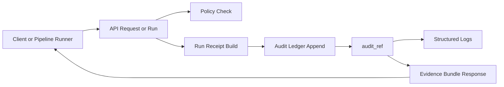

<!-- [KFM_META_BLOCK_V2]
doc_id: kfm://doc/211a789a-c58f-4097-ad5b-6e162829a617
title: Observability Audit
type: standard
version: v1
status: draft
owners: TBD
created: 2026-02-27
updated: 2026-02-27
policy_label: restricted
related:
  - ../../README.md
  - ../README.md
tags: [kfm, observability, audit, run-receipt]
notes:
  - Contract-first scaffold for the API audit subsystem. Replace TODOs once implementation is confirmed in-repo.
[/KFM_META_BLOCK_V2] -->

# Observability Audit
> Append-only audit ledger + run receipts for governed API, pipelines, and Focus Mode.


**TL;DR:** This module is where we **emit** and **correlate** audit events (`audit_ref`) and **run receipts** so every user-facing claim is traceable to evidence + policy decisions.

---

## Quick links
- [Purpose](#purpose)
- [Where this fits in the repo](#where-this-fits-in-the-repo)
- [Scope](#scope)
- [Core concepts](#core-concepts)
- [Contracts and schemas](#contracts-and-schemas)
- [Architecture](#architecture)
- [Directory layout](#directory-layout)
- [How to use](#how-to-use)
- [Operational guidance](#operational-guidance)
- [Security and privacy](#security-and-privacy)
- [Testing and gates](#testing-and-gates)
- [Open TODOs](#open-todos)

---

## Purpose
KFM’s governance model requires that:

- **Every pipeline run** emits a **run receipt** that captures inputs/outputs/environment/validation and any policy decisions.
- **Every Focus Mode query** emits a run receipt for “cite-or-abstain” traceability.
- The **audit ledger is append-only** and treated as a **governed, canonical dataset** (backups apply).

This directory documents (and should eventually implement) the API-side pieces of that system.

## Where this fits in the repo
- **Path:** `apps/api/src/observability/audit/`
- **Layering:** infrastructure/adapter code used by the governed API boundary to record governance-relevant actions (audit entries + receipts).
- **Primary consumers:** request middleware, use-cases that promote/quarantine/retract, and Focus Mode query execution.

---

## Scope
### In scope
- Creating an **audit context** per request / workflow:
  - `correlation_id` (log / trace correlation)
  - `audit_ref` (stable audit entry identifier returned from the ledger)
- Emitting **run receipts** (v1) for:
  - pipeline runs
  - promotion / quarantine / retraction actions
  - Focus Mode queries
- Writing to an **append-only audit ledger** via a storage-agnostic adapter (repository interface).
- Ensuring **structured logs** include `correlation_id` and `audit_ref`.

### Out of scope
- Business/domain decisions (policy evaluation, promotion decisions, evidence scoring)
- Direct database access from route handlers (should go through repositories)
- Storing raw payloads that contain secrets/PII/restricted coordinates

---

## Core concepts

| Term | Meaning | Why it matters |
|---|---|---|
| `correlation_id` | ID that ties together logs/metrics/traces for a single request/workflow | Minimum observability requirement |
| `audit_ref` | Reference to the append-only audit ledger entry | Allows evidence bundles and UI to point to “what happened” |
| Run receipt | Typed, hashable record of a pipeline run or Focus Mode query | Enables verification, policy gating, reproducibility |
| Audit ledger | Canonical append-only store of audit events & receipts | Incident response, governance audits, rebuild support |

> **NOTE**  
> Keep `correlation_id` and `audit_ref` in **every** log line emitted within a request/workflow.

---

## Contracts and schemas

### Run Receipt v1 (KFM)
A minimal Run Receipt v1 shape (contract-first) includes:

- `spec_hash` computed from **canonicalized inputs** (deterministic hashing)
- `subject` as a **digest** (avoid mutable tags)
- `checks` present and interpreted **fail-closed**
- `timestamps` in **RFC3339**, bounding the run (`start <= end`)

**Example (illustrative):**
```json
{
  "$schema": "https://kfm.dev/schemas/run_receipt_v1.json",
  "kfm_run_id": "kfm://run/2026-02-20T12:00:00Z.abcd",
  "dataset": "example_dataset",
  "subject": "sha256:…",
  "spec_hash": "sha256:…",
  "pipeline": "raw→processed→catalog→prov",
  "runner": "gha://workflows/provenance-guard@v3",
  "inputs": ["uri://raw/source.csv"],
  "outputs": ["stac items", "prov bundle"],
  "checks": {
    "stac": "ok",
    "prov": "ok",
    "policy": "ok"
  },
  "timestamps": {
    "start": "2026-02-20T12:00:00Z",
    "end": "2026-02-20T12:05:00Z"
  }
}
```

### Run receipt template fields (governance-ready)
For governance auditability, include (or derive) environment capture fields such as:

- `container_digest`
- `git_commit`
- `params_digest`
- `validation` status + report digest
- policy decision reference (`decision_id`)

**Example (illustrative):**
```json
{
  "run_id": "kfm://run/…",
  "actor": { "principal": "svc:pipeline", "role": "pipeline" },
  "operation": "ingest+publish",
  "dataset_version_id": "2026-02.…",
  "inputs": [{ "uri": "raw/source.csv", "digest": "sha256:…" }],
  "outputs": [{ "uri": "processed/events.parquet", "digest": "sha256:…" }],
  "environment": {
    "container_digest": "sha256:…",
    "git_commit": "…",
    "params_digest": "sha256:…"
  },
  "validation": { "status": "pass", "report_digest": "sha256:…" },
  "policy": { "decision_id": "kfm://policy_decision/…" },
  "created_at": "2026-02-20T12:05:00Z"
}
```

### Evidence bundles must carry `audit_ref`
When the API returns an EvidenceBundle (or similar), it should include an `audit_ref` so the UI can trace what the system did, with what evidence, under what policy decision.

---

## Architecture



### Design constraints
- **Append-only:** audit ledger is write-once; no in-place mutation.
- **Deterministic IDs/hashes:** receipts must be reproducible and verifiable.
- **Fail-closed where governance depends on it:** if receipts/checks are missing or invalid, promotion/enablement must not proceed.
- **Storage-agnostic:** keep a clean repository interface so we can swap storage backends without changing domain/use-case code.

---

## Directory layout

> **TODO:** Replace this “suggested tree” with the *actual* files present in this directory once implemented.

```text
apps/api/src/observability/audit/
  README.md                 # This document
  audit.types.ts            # AuditEntry, AuditRef, RunReceipt types
  audit.context.ts          # correlation_id + audit_ref plumbing
  audit.ledger.repo.ts      # interface + adapter(s)
  runReceipt.builder.ts     # helpers to construct receipts
  runReceipt.schema.ts      # schema loader + validator
  __tests__/
    audit.context.test.ts
    runReceipt.builder.test.ts
```

### Acceptable inputs (what belongs here)
- Audit events describing **what happened**:
  - actor/principal
  - operation (read/query/promote/publish/focus_query, etc.)
  - resource refs (dataset_version_id, story_node_id, etc.)
  - policy decision refs (`decision_id`)
  - outcome (allow/deny + error codes)
- Run receipts and promotion manifests (as governed artifacts)

### Exclusions (what must not go here)
- Secrets (API keys, tokens), raw request bodies, raw evidence payloads
- Exact coordinates or restricted identifiers unless explicitly policy-reviewed and redacted
- Business logic for policy decisions (this module only records the decision reference and obligations applied)

---

## How to use

> **IMPORTANT**  
> The code examples below are **pseudocode**. Align names and wiring to the framework used by `apps/api`.

### 1) Attach correlation + audit context to every request
```ts
// pseudo: auditMiddleware.ts
export function auditMiddleware(req, res, next) {
  const correlationId =
    req.header("x-correlation-id") ?? crypto.randomUUID();

  // Build a minimal audit entry (don’t write secrets)
  const entry = {
    actor: { principal: req.user?.id ?? "anonymous" },
    operation: `${req.method} ${req.path}`,
    correlation_id: correlationId,
    created_at: new Date().toISOString()
  };

  // Append to ledger -> returns audit_ref
  // const auditRef = await auditLedger.append(entry);

  // Attach to request context
  // req.audit = { correlationId, auditRef };
  // res.setHeader("x-kfm-audit-ref", auditRef);

  next();
}
```

### 2) Emit a run receipt for a governed workflow
```ts
// pseudo: inside a promoteDatasetVersion use-case
const receipt = buildRunReceiptV1({
  operation: "promote",
  dataset_version_id,
  inputs,
  outputs,
  environment: captureEnvironment(),
  validation,
  policy: { decision_id }
});

// validate schema + compute spec_hash deterministically (fail closed)
validateRunReceipt(receipt);

// persist receipt + get audit_ref
// const auditRef = await auditLedger.appendReceipt(receipt);
```

### 3) Ensure logs always include `correlation_id` + `audit_ref`
- Use a structured logger (JSON) and set these fields in the log context at request start.
- Never log raw secrets or raw evidence payloads.

---

## Operational guidance

### Minimum observability expectations
At minimum:
- structured logs with `correlation_id` and `audit_ref`
- endpoint latency metrics (P95) and key dependency latency
- pipeline run duration + failure metrics

### Backup and restore
The audit ledger is a canonical store. Ensure it is included in backup/restore drills and treated as required for governance audits.

---

## Security and privacy

### Redaction + minimization (default-deny posture)
- Prefer **references** (digests, IDs, URIs) over embedding raw data.
- Never store raw request bodies unless:
  1) policy explicitly allows it, and  
  2) it is demonstrably needed for an investigation, and  
  3) it is stored in a restricted store with retention controls.

### Safe linking
If audit entries include links (e.g., to an evidence bundle or artifact), only emit safe, verified, sanitized links.

---

## Testing and gates

### Unit and contract tests (minimum)
- Schema validation for Run Receipt v1 (fail on unknown fields, missing required fields)
- spec_hash deterministic across equivalent receipts (canonicalization test)
- “fail closed” behavior:
  - a missing/invalid receipt blocks promotion hooks
  - a `checks.* == fail` blocks promotion hooks

### CI policy gates (recommended)
Use deny-by-default policy-as-code (OPA/Rego via Conftest) to assert required fields like `spec_hash` and allowed providers.

---

## Open TODOs
- [ ] Replace suggested directory tree with actual files.
- [ ] Confirm storage backend for the audit ledger (object store JSONL, DB table, OCI referrers, etc.).
- [ ] Define retention policy + purge process (if any) consistent with append-only governance.
- [ ] Confirm standard header names (`x-correlation-id`, `x-kfm-audit-ref`) used across API + UI.
- [ ] Add end-to-end tests that verify:
  - every governed endpoint emits `audit_ref`
  - every Focus Mode query emits a run receipt
  - evidence bundle responses contain `audit_ref`

---

<details>
<summary>Appendix: Example audit entry (proposed)</summary>

```json
{
  "audit_ref": "kfm://audit/entry/123",
  "correlation_id": "uuid",
  "actor": { "principal": "user:abc", "role": "researcher" },
  "operation": "GET /api/v1/focus/query",
  "policy": {
    "decision_id": "kfm://policy_decision/xyz",
    "decision": "allow",
    "obligations_applied": []
  },
  "result": {
    "status": "ok",
    "http_status": 200
  },
  "created_at": "2026-02-27T12:34:56Z"
}
```

</details>

---

<a id="back-to-top"></a>
**Back to top:** [Quick links](#quick-links)
