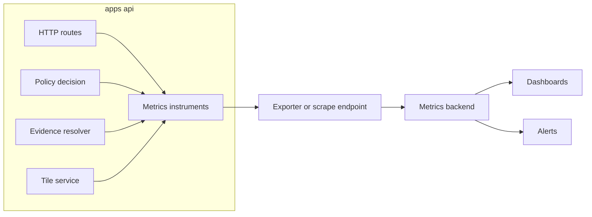

<!-- [KFM_META_BLOCK_V2]
doc_id: kfm://doc/f2dc6a0a-9946-4b47-87ee-4f5048c04056
title: API Observability Metrics
type: standard
version: v1
status: draft
owners: TODO
created: 2026-02-27
updated: 2026-02-27
policy_label: internal
related:
  - apps/api/src/observability/README.md
tags: [kfm, api, observability, metrics]
notes:
  - This README is deliberately stack-agnostic (Prometheus vs OpenTelemetry). Wire it to the actual metrics backend in this repo.
  - Review for public exposure before publishing.
[/KFM_META_BLOCK_V2] -->

# API Observability Metrics
Thin, governed metric definitions and instrumentation helpers for the KFM API service.


> [!NOTE]
> This directory documents **what** we measure and **how** we measure it safely.  
> It intentionally avoids hardcoding a vendor stack. If this repo already chose a metrics stack, update the “Wiring” section and replace TODOs.

## Navigation
- [Purpose](#purpose)
- [Where this fits](#where-this-fits)
- [Minimum required metrics](#minimum-required-metrics)
- [Metric catalog](#metric-catalog)
- [Conventions](#conventions)
- [How to add a metric](#how-to-add-a-metric)
- [Dashboards and alerting](#dashboards-and-alerting)
- [Testing and gates](#testing-and-gates)
- [Security and privacy](#security-and-privacy)
- [Directory layout](#directory-layout)
- [Appendix](#appendix)

---

## Purpose
KFM’s API is a **governed surface**: every response is constrained by policy, provenance, and evidence resolution. Observability is part of that trust membrane.

This module exists to:
- Provide **stable metric names**, units, and label sets
- Enforce **low-cardinality / non-sensitive** labeling rules
- Make it easy for API features (policy decisions, evidence resolution, tiles) to emit metrics consistently
- Keep metric additions **reviewable and testable** (fail closed when uncertain)

---

## Where this fits
`apps/api/src/observability/metrics/` is the API-layer instrumentation boundary.



### In scope ✅
- Metric definitions, naming, units, label constraints
- Helper functions/wrappers that standardize instrumentation
- Metric registry / catalog data structure
- Tests that prevent label explosions, naming drift, and “PII in labels”

### Out of scope 🚫
- Dashboard JSON, alert rules, infra manifests
- Log/tracing implementation details (kept in sibling observability modules)
- Long-term analytics and BI

---

## Minimum required metrics
KFM defines a minimum observability baseline. For the API, the MVP is:

- **Structured logs** with correlation IDs and `audit_ref`
- **Metrics**
  - request latency (P95) per endpoint
  - evidence resolver latency
  - tile response latency
  - pipeline run durations and failures (if the API triggers or reports pipeline runs)
- **Traces** (optional early)

> [!TIP]
> “P95 per endpoint” usually implies a histogram metric + queries that compute P95 from buckets. Don’t ship “P95 gauges” unless you know exactly what you’re doing.

---

## Metric catalog
This table is the source of truth for API-exposed metrics. Keep it small, explicit, and stable.

> [!WARNING]
> Changing a metric name or label set is an **observability breaking change**. Treat it like an API contract change.

### Required metrics (MVP)
| Metric key (stable) | Type | Unit | Labels (MUST be low-cardinality) | What it tells us |
|---|---:|---:|---|---|
| `api_http_request_duration` | histogram | seconds | `method`, `route`, `status_class` | P95 latency per endpoint route template |
| `api_http_requests_total` | counter | requests | `method`, `route`, `status_class` | Traffic volume + error rate (coarse) |
| `api_evidence_resolve_duration` | histogram | seconds | `result` | Evidence resolver latency and failures |
| `api_tile_response_duration` | histogram | seconds | `tile_kind`, `result` | Tile latency by kind and success/failure |
| `api_pipeline_run_duration` | histogram | seconds | `pipeline_kind`, `result` | Pipeline duration if the API orchestrates/observes it |
| `api_pipeline_runs_total` | counter | runs | `pipeline_kind`, `result` | Pipeline failures and success rate |

### Governance-facing metrics (strongly recommended)
These support steward/operator views without leaking sensitive detail.

| Metric key (stable) | Type | Unit | Labels (MUST be low-cardinality) | What it tells us |
|---|---:|---:|---|---|
| `api_policy_denials_total` | counter | decisions | `action`, `reason_code` | Deny volume and reasons (controlled vocabulary) |
| `api_quarantine_events_total` | counter | events | `reason_code` | Quarantines by reason (controlled vocabulary) |

> [!NOTE]
> The `reason_code` label must come from a **versioned enum** (not free text), or it will explode cardinality.

### Template for new metrics
Copy/paste a new row and fill it in **before** writing code.

| Metric key (stable) | Type | Unit | Labels | What it tells us |
|---|---:|---:|---|---|
| `TODO_metric_key` | TODO | TODO | TODO | TODO |

---

## Conventions

### Naming
Pick one naming style and keep it consistent:

- **Prometheus style (recommended if using Prometheus):**
  - snake_case names
  - suffixes: `_total` for counters, `_seconds` for durations, `_bytes` for sizes
- **OpenTelemetry style (recommended if using OTel end-to-end):**
  - dot-separated instrument names
  - explicit unit metadata instead of suffixes

> [!NOTE]
> This README uses neutral “metric keys” like `api_http_request_duration`. Map to your backend’s naming rules in implementation.

### Units
- Durations: **seconds**
- Sizes: **bytes**
- Counts: unitless (requests, runs, decisions)
- Avoid “ms” unless your backend forces it.

### Labels and cardinality guardrails
**MUST**
- Use route templates (e.g., `/datasets/{id}`) not raw paths
- Use `status_class` (`2xx`, `4xx`, `5xx`) rather than raw status codes unless you truly need it
- Use fixed enums for `result` (e.g., `ok`, `error`, `timeout`, `deny`)
- Keep label sets small (typically ≤ 5 labels)

**MUST NOT**
- Put user identifiers, dataset identifiers, raw coordinates, or free-text strings into labels
- Put `audit_ref` or correlation IDs into labels (those belong in logs/traces)
- Create labels from unbounded inputs (query params, headers, filenames)

---

## How to add a metric
### Definition of Done checklist
- [ ] Added/updated row in the [Metric catalog](#metric-catalog)
- [ ] Metric name + labels are stable and low-cardinality
- [ ] Units are explicit and correct
- [ ] No PII/sensitive identifiers in labels (see [Security and privacy](#security-and-privacy))
- [ ] Added tests that:
  - [ ] fail if labels are not from an enum where required
  - [ ] fail if metric name changes unexpectedly
- [ ] Updated dashboards/alerts (or filed a ticket + linked it)
- [ ] Added an entry to release notes if this affects SLOs/alerts

### Implementation sketch (pseudo TypeScript)
> Replace with your actual metrics library (Prometheus client, OTel Metrics, etc.)

```ts
// PSEUDO-CODE ONLY — adapt to actual instrumentation library in this repo.

type Result = "ok" | "error" | "timeout" | "deny";

export function observeEvidenceResolve(durationSeconds: number, result: Result) {
  evidenceResolveDuration.observe({ result }, durationSeconds);
}

export function incPolicyDeny(action: string, reasonCode: string) {
  // reasonCode MUST be from a controlled enum
  policyDenials.inc({ action, reason_code: reasonCode }, 1);
}
```

---

## Dashboards and alerting
Dashboards should explicitly support different operational roles:

- **Steward view**
  - policy denials (by reason)
  - rights issues
  - quarantines
- **Operator view**
  - pipeline health
  - storage usage
  - deployment status
- **Product view**
  - UI/API performance indicators
  - accessibility regression indicators (where applicable)

> [!TIP]
> Don’t build one “god dashboard.” Build 3 role-aligned dashboards with clear ownership.

---

## Testing and gates
KFM’s posture is “tests encode invariants and fail closed.” For metrics, that means:

- Unit tests: validate metric registry, label enums, helper behavior
- Contract-ish tests: ensure exported metric names/labels don’t drift
- Policy-aware tests: ensure we do not emit metrics that leak restricted info via labels

### Suggested tests (additive)
- **Metric registry snapshot test**: metric keys, types, units, and allowed labels
- **Label cardinality tests**: reject unknown `reason_code` values
- **Route template enforcement**: reject raw paths

> [!WARNING]
> If a metric label’s value set can’t be enumerated (or strongly bounded), it probably shouldn’t be a label.

---

## Security and privacy
Observability data can expose sensitive operational detail.

**Rules of thumb**
- Treat metrics as **internal** unless explicitly approved for public exposure
- Never include PII, restricted dataset identifiers, or precise locations in labels
- If you are uncertain, default to **aggregate/coarse** and request governance review

> [!NOTE]
> Logs and audit data are explicitly called out as sensitive operational details in KFM guidance; metrics often carry similar risk.

---

## Directory layout
### Actual contents (UNKNOWN in this doc context)
Run `tree apps/api/src/observability/metrics` and replace this section with the real tree.

### Expected contents (PROPOSED)
```text
apps/api/src/observability/metrics/
  README.md                     # This file
  registry.ts                   # Metric registry: keys, types, units, label schema
  http.ts                       # HTTP/server request metrics
  evidence.ts                   # Evidence resolver metrics
  tiles.ts                      # Tile latency and result metrics
  policy.ts                     # Policy decision metrics (deny reasons, obligations)
  pipeline.ts                   # Pipeline duration/failure metrics (if applicable)
  __tests__/
    metrics.registry.test.ts    # Snapshot + schema tests for registry
    metrics.labels.test.ts      # Enum/label validation + guardrails
```

---

## Appendix

<details>
<summary><strong>Repo verification checklist</strong> (convert UNKNOWN → CONFIRMED)</summary>

- [ ] What metrics library is used? (search `package.json` and `apps/api/src/observability/*`)
- [ ] Where is the exporter/scrape endpoint configured?
- [ ] Are metrics protected behind auth/network policy?
- [ ] Do we already have a label vocabulary module (enums/constants) we should reuse?
- [ ] Are there existing SLOs/alerts that require specific metric names?

</details>

<p align="right"><a href="#api-observability-metrics">Back to top</a></p>
