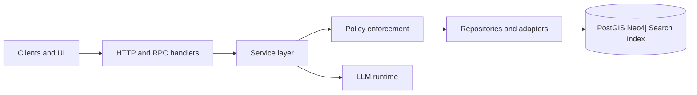

<!-- [KFM_META_BLOCK_V2]
doc_id: kfm://doc/8870be13-aeba-4627-8072-19e2845433e8
title: apps/api/src/services
type: standard
version: v1
status: draft
owners: kfm-api-team
created: 2026-03-03
updated: 2026-03-03
policy_label: public
related:
  - ../api/README.md
  - ../../../../contracts/openapi/
  - ../../../../policy/
  - ../../../../packages/
tags: [kfm, api, services, trust-membrane]
notes:
  - Defines the service-layer boundary for the governed API ("PEP") and its invariants.
[/KFM_META_BLOCK_V2] -->

# 🧩 API Services (`apps/api/src/services`)

> **Purpose:** Business/use-case orchestration for the governed API. Services turn *requests* into *policy-checked, evidence-backed results*—without doing HTTP, DB, or UI work directly.

   

> **TODO (repo wiring):** Replace placeholder badges with real CI workflow, coverage, and policy-gate shields once paths are confirmed.

---

## Quick navigation

- [What belongs here](#what-belongs-here)
- [What must not belong here](#what-must-not-belong-here)
- [Request flow](#request-flow)
- [Service contracts](#service-contracts)
- [Directory layout](#directory-layout)
- [How to add a new service](#how-to-add-a-new-service)
- [Testing and gates](#testing-and-gates)
- [Definition of done](#definition-of-done)
- [Glossary](#glossary)

---

## What belongs here

Services are the **application layer** for the API:

- **Use-case orchestration**
  - Example: “search datasets,” “resolve evidence bundles,” “fetch STAC items,” “answer a Focus Mode question,” “compute timeline slices.”
- **Policy-aware decision-making**
  - Services decide *what* data is admissible for a request (default-deny), and attach obligations/redactions to results.
- **Evidence-first outputs**
  - Services return results that include (or can be expanded into) citations / evidence references appropriate for the caller.
- **Time-aware behavior**
  - Services accept explicit temporal parameters (e.g., `asOf`, `eventTime`, `validTime`) and make them part of query planning and cache keys.
- **Deterministic planning**
  - The same inputs + same dataset versions should produce the same query plan and the same result shape (modulo data changes).

### “Service” in one sentence

A **service** is a pure-ish orchestrator: **inputs → policy check → retrieval plan → data access via adapters → output DTO + evidence/metadata**.

---

## What must not belong here

**Services MUST NOT**:

- implement HTTP routing/controllers (belongs in `apps/api/src/api` or equivalent router layer)
- read directly from environment variables for core logic (configuration should be injected)
- query databases/search/graph stores directly (use repositories/adapters so policy + audit hooks stay centralized)
- call external networks without an explicit adapter boundary + timeout/retry policy
- return “free-form” untraceable strings when the UI expects evidence-backed claims

> ⚠️ **Trust membrane rule:** anything that could bypass policy enforcement is a bug. If you’re unsure, fail closed.

---

## Request flow

Services sit between route handlers and storage adapters.



### Notes

- **Routes** translate HTTP → typed inputs and map errors → HTTP responses.
- **Services** implement **business meaning** and **governance** (policy + evidence + time semantics).
- **Adapters/Repositories** implement access patterns to stores and external APIs and are the single choke-point for observability/audit hooks.

---

## Service contracts

### Input contract

Every service entrypoint should take:

- a typed **request DTO**
- a typed **actor context** (authn/authz, role, policy labels)
- an explicit **time context** (at minimum `asOf` or a comparable representation)
- an explicit **trace/audit context** (`requestId`, `correlationId`, etc.)

**No hidden globals**.

### Output contract

Every service should return either:

- **Success**: payload + evidence references + redaction/obligation metadata (when relevant), or
- **Failure**: a typed error with:
  - stable error code
  - safe message
  - optional remediation hints (non-sensitive)
  - audit metadata

> ✅ Prefer “return structured data” over “return formatted prose.” Prose belongs at the very edge (UI) or inside a governed “synthesis” operation that emits citations.

---

## Directory layout

This is a **directory documentation standard** section (purpose, fit, allowed inputs, exclusions).

### Where this fits in the repo

At a high level, KFM is designed so clients access data through a governed API layer (“PEP”), not directly from storage. This folder is part of that API layer: it’s where we implement the *service/use-case boundary* that routes call into.  
(If you’re looking for routes/controllers, check the sibling `../api` folder.)

### Recommended (proposed) layout

> **NOTE:** This is a recommended layout. Actual folder names may differ—update this README to match reality as the code evolves.

```text
apps/api/src/services/
├─ README.md                 # this file
├─ _shared/                  # cross-service helpers (no business rules)
│  ├─ errors.*               # service error types + mapping helpers
│  ├─ types.*                # DTOs shared across services
│  └─ guards.*               # invariant checks (time/policy/evidence)
├─ datasets/                 # dataset discovery + metadata services
├─ catalog/                  # STAC/DCAT “read” services
├─ evidence/                 # EvidenceRef -> EvidenceBundle resolution
├─ focus/                    # Focus Mode orchestration (retrieve + synthesize)
└─ telemetry/                # service-level events/metrics emitters
```

### What belongs in `_shared/`

✅ utilities that are:

- deterministic
- testable
- not domain-specific
- not policy-bypassing

❌ domain logic, per-dataset rules, “just for this endpoint” hacks

---

## Service registry

> Keep this table current. It’s the “map” for new contributors.

| Service area | Responsibilities | Inputs | Outputs | Governance hotspots | Tests to require |
|---|---|---|---|---|---|
| `datasets/*` | Dataset search, filter, summaries | query + actor + time | dataset DTOs + evidence refs | licensing, sensitivity labels | unit + contract |
| `catalog/*` | STAC/DCAT lookups and shaping | ids + actor + time | STAC/DCAT DTOs | extension validation, link integrity | schema + contract |
| `evidence/*` | Evidence resolution and redaction | EvidenceRefs + actor | EvidenceBundle | redaction, policy obligations | unit + policy |
| `focus/*` | Retrieval plan + synthesis | question + scope + actor + time | answer + citations | cite-or-abstain, default-deny | integration + policy |
| `telemetry/*` | audit + trace emit | context + event | events | PII avoidance | unit |

---

## How to add a new service

1. **Create a domain folder**
   - Example: `apps/api/src/services/hydrology/`
2. **Define DTOs**
   - request/response shapes (keep them boring and explicit)
3. **Wire policy and time context**
   - services should accept a `ctx` object; do not fetch auth/time implicitly
4. **Call repositories/adapters**
   - keep query planning in the service, IO in adapters
5. **Attach evidence**
   - return evidence references alongside the payload
6. **Add tests + gates**
   - minimum: unit tests for invariants; contract tests for output shape

### Minimal service template (illustrative)

```ts
// PSEUDO / TEMPLATE — adapt to your stack
type ServiceCtx = {
  actor: { id: string; roles: string[] };
  time: { asOf: string }; // ISO8601
  trace: { requestId: string };
};

type Result<T> =
  | { ok: true; data: T; evidence: EvidenceRef[]; obligations?: Obligation[] }
  | { ok: false; error: ServiceError };

export async function getSomething(
  input: GetSomethingRequest,
  ctx: ServiceCtx,
): Promise<Result<GetSomethingResponse>> {
  // 1) Guard: fail closed if context is incomplete
  guardTime(ctx.time);
  guardActor(ctx.actor);

  // 2) Policy pre-check (default deny)
  const decision = await policy.canRead("something", ctx.actor, input);
  if (!decision.allow) return { ok: false, error: ServiceError.forbidden(decision.reason) };

  // 3) Retrieval plan (deterministic)
  const plan = buildPlan(input, ctx.time);

  // 4) Fetch via adapter/repo (auditable)
  const rows = await somethingRepo.query(plan);

  // 5) Shape + evidence
  const { data, evidence } = shape(rows);

  // 6) Apply obligations/redactions (if any)
  const { redacted, obligations } = applyObligations(data, decision.obligations);

  return { ok: true, data: redacted, evidence, obligations };
}
```

---

## Testing and gates

### Unit tests

- invariants (time context required, policy pre-check required)
- deterministic plan building
- redaction/obligation application
- error mapping stability

### Contract tests

- output DTO shape (avoid breaking UI accidentally)
- pagination + sorting determinism
- evidence presence when required (e.g., Focus Mode outputs)

### Policy tests

- deny-by-default behavior for missing/unknown policy labels
- required redaction rules enforced for sensitive layers
- “cite-or-abstain” enforcement for synthesis results

> TIP: Treat “policy checks passing” as a **hard gate** for any PR that changes service behavior.

---

## Definition of done

A service (or service change) is “done” when:

- [ ] **No policy bypass**: policy check exists and is fail-closed
- [ ] **Time-aware**: accepts time context and uses it consistently
- [ ] **Evidence-first**: returns evidence refs where required
- [ ] **Deterministic**: no hidden randomness; stable sorting; stable paging
- [ ] **No direct storage access**: uses adapters/repositories
- [ ] **Errors are typed** and mapped consistently
- [ ] **Tests exist**: unit + (when needed) integration
- [ ] **Telemetry is safe**: no secrets, no PII in logs/events

---

## Glossary

- **PEP**: Policy Enforcement Point (the governed API boundary).
- **EvidenceRef / EvidenceBundle**: a lightweight reference to evidence, and its resolved bundle (with redactions applied).
- **Obligation**: a required action imposed by policy (masking, aggregation, attribution).
- **asOf**: the point-in-time context used to interpret “current” answers.
- **Cite-or-abstain**: if required evidence is missing or disallowed, return a denial or a reduced-scope answer.

---

<details>
<summary>Appendix: When to put code in services vs repositories</summary>

**Put it in services when it:**
- decides *what* to do (business meaning)
- builds a retrieval plan
- applies policy obligations and redactions
- composes multiple repositories/adapters

**Put it in repositories/adapters when it:**
- performs IO
- translates plan → query
- handles pagination primitives
- implements retries/timeouts (external calls)

</details>

---

_Back to top:_ [Quick navigation](#quick-navigation)
