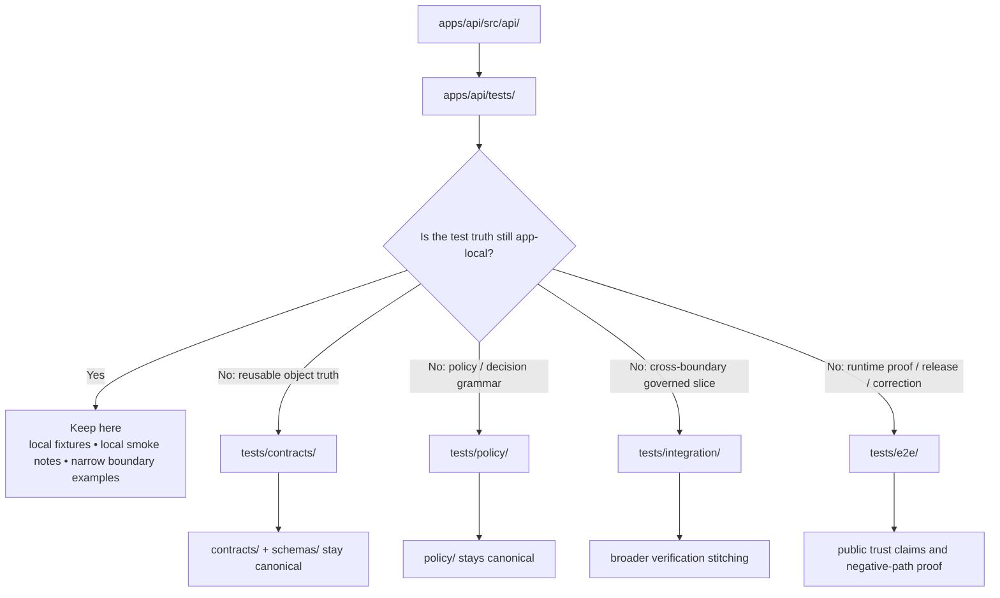

<!-- [KFM_META_BLOCK_V2]
doc_id: kfm://doc/<uuid-NEEDS-VERIFICATION>
title: apps/api/tests/README.md
type: standard
version: v1
status: draft
owners: @bartytime4life
created: YYYY-MM-DD
updated: YYYY-MM-DD
policy_label: public
related: [../README.md, ../src/api/README.md, ../../../tests/README.md, ../../../tests/contracts/README.md, ../../../tests/integration/README.md, ../../../tests/policy/README.md, ../../../tests/e2e/README.md]
tags: [kfm, api, tests, verification]
notes: [doc_id and dates need git-history verification, owner is grounded from current CODEOWNERS fallback, current public-main path is placeholder-only and this file is intended to replace that placeholder with a repo-fit boundary README]
[/KFM_META_BLOCK_V2] -->

# API test surface

App-local verification lane for `apps/api/`, kept narrow enough to stay honest and useful.

> [!IMPORTANT]
> Treat this directory as the **closest app-local test seam** around `apps/api/`, not as a second owner of repository-wide contract, policy, integration, or end-to-end proof.

> [!WARNING]
> Current visible public-main evidence shows `apps/api/tests/` as a README-only placeholder surface. Any broader suite depth, runner wiring, or file inventory beyond that is **NEEDS VERIFICATION** until the mounted branch or local workspace proves it directly.

## Impact

**Status:** experimental  
**Owners:** `@bartytime4life`  
**Badges:**    

**Quick jump:** [Scope](#scope) · [Repo fit](#repo-fit) · [Inputs](#inputs) · [Exclusions](#exclusions) · [Directory tree](#directory-tree) · [Quickstart](#quickstart) · [Usage](#usage) · [Diagram](#diagram) · [Placement matrix](#placement-matrix) · [Task list](#task-list) · [FAQ](#faq) · [Appendix](#appendix)

---

## Scope

This directory owns **app-local test intent** for `apps/api/`.

In KFM terms, that usually means the thinnest verification work that is still meaningfully tied to the app path itself: request/response examples, envelope-shape checks that are not yet generalized upward, small harness notes for local inspection, and local guardrails that help a maintainer decide whether a case belongs here or should be promoted into the shared verification families.

This directory should stay especially careful about two things:

1. not pretending current placeholder structure is already a populated executable suite
2. not duplicating shared truth already better owned by `tests/`, `contracts/`, `schemas/`, or `policy/`

[Back to top](#api-test-surface)

## Repo fit

**Path:** `apps/api/tests/README.md`

| Relationship | Path | Why it matters here |
| --- | --- | --- |
| Parent app lane | [`../README.md`](../README.md) | app-level README for `apps/api/`; currently still a placeholder and should not be silently over-read |
| Deeper API lane | [`../src/api/README.md`](../src/api/README.md) | closest deeper API doc surface; current public-main snapshot is also placeholder-heavy |
| App family hub | [`../../README.md`](../../README.md) | shows current visible `apps/` subtree and explicitly names this path as the app-local test surface |
| Shared verification hub | [`../../../tests/README.md`](../../../tests/README.md) | repository-wide verification family map and burden boundaries |
| Shared contract checks | [`../../../tests/contracts/README.md`](../../../tests/contracts/README.md) | contract truth belongs there once it becomes reusable, typed, or cross-lane |
| Shared integration checks | [`../../../tests/integration/README.md`](../../../tests/integration/README.md) | broader governed slices across boundaries belong there |
| Shared policy checks | [`../../../tests/policy/README.md`](../../../tests/policy/README.md) | deny/allow/reason/obligation semantics belong there |
| Shared runtime proof | [`../../../tests/e2e/README.md`](../../../tests/e2e/README.md) | release assembly, correction lineage, and runtime proof do **not** belong here by default |
| Workflow visibility | [`../../../.github/workflows/README.md`](../../../.github/workflows/README.md) | current public-main workflow lane is README-only, so workflow claims must stay restrained |

### Current public-main role

`apps/README.md` already labels this path as the **app-local test surface** under `apps/api/`, while the broader repository test structure lives under top-level `tests/`. This README therefore exists to make that split navigable and non-duplicative.

[Back to top](#api-test-surface)

## Inputs

Place material here when it is primarily about **`apps/api/` as a local app seam** and is **not yet better owned elsewhere**.

### Accepted inputs

- small request/response examples tightly coupled to `apps/api/`
- app-local smoke notes for API behavior that are still path-specific
- thin fixtures or sample payloads used to explain the app boundary
- local test harness notes that help a maintainer inspect `apps/api/` without claiming cross-repo proof
- route-adjacent examples that have not yet stabilized into reusable contract fixtures
- narrow negative-path examples that belong to the app path before promotion into shared policy or e2e suites
- README-level guidance explaining **when to escalate out** of this directory

### Good fit signals

A file probably belongs here when most of the following are true:

- it is easiest to understand from the perspective of `apps/api/`
- it does not define shared contract truth for multiple lanes
- it does not need repository-wide policy-runtime context to make sense
- it is not the canonical place to prove release, correction, or publication behavior
- moving it into top-level `tests/` today would create more duplication than clarity

[Back to top](#api-test-surface)

## Exclusions

Do **not** put the following here.

| Exclusion | Put it here instead | Why |
| --- | --- | --- |
| reusable valid/invalid contract fixtures | [`../../../tests/contracts/README.md`](../../../tests/contracts/README.md) | contract-facing truth should converge upward once it becomes shared |
| policy reason/obligation outcome tests | [`../../../tests/policy/README.md`](../../../tests/policy/README.md) | allow/deny/abstain/error semantics are not app-local by default |
| cross-boundary flows spanning API + evidence + policy + catalogs | [`../../../tests/integration/README.md`](../../../tests/integration/README.md) | these are broader governed slices |
| release assembly, correction lineage, runtime proof | [`../../../tests/e2e/README.md`](../../../tests/e2e/README.md) | these are end-to-end trust claims |
| schema ownership or canonical object definitions | `../../../contracts/` and `../../../schemas/` | the app path should consume, not silently redefine, shared machine truth |
| workflow guarantees or runner claims | [`../../../.github/workflows/README.md`](../../../.github/workflows/README.md) | current public-main workflow lane is README-only and needs direct verification before stronger claims |
| generic API architecture doctrine | [`../src/api/README.md`](../src/api/README.md) and [`../../governed-api/README.md`](../../governed-api/README.md) | keep this path focused on tests, not on re-owning the API architecture |

> [!NOTE]
> When in doubt, start here only if the file genuinely helps a maintainer work on `apps/api/` **without** inventing broader repo reality. Promote upward once the object becomes reusable, normative, or cross-lane.

[Back to top](#api-test-surface)

## Directory tree

### Current verified snapshot

```text
apps/
├── README.md
├── api/
│   ├── README.md
│   ├── src/
│   │   ├── README.md
│   │   └── api/
│   │       └── README.md
│   └── tests/
│       └── README.md
├── cli/
├── explorer-web/
├── governed-api/
├── review-console/
└── workers/
```

### What that means right now

The currently visible public-main snapshot proves the path exists, but does **not** by itself prove a populated `apps/api/tests/` suite. Treat this README as a boundary-setting file first.

<details>
<summary><strong>PROPOSED future subtree (starter shape only; not asserted repo fact)</strong></summary>

```text
apps/api/tests/
├── README.md
├── fixtures/
│   ├── requests/
│   └── responses/
├── boundary/
│   ├── envelope-shape.spec.ts
│   └── route-scope.spec.ts
├── runtime_outcomes/
│   └── negative-path.samples.json
├── helpers/
│   └── localHarness.ts
└── snapshots/
    └── *.snap
```

Use a shape like this only when the mounted branch actually introduces those files.

</details>

[Back to top](#api-test-surface)

## Quickstart

### 1) Inspect the current visible surface

```bash
git rev-parse --short HEAD
find apps/api -maxdepth 4 -print | sort
```

### 2) Read the adjacent owning docs before adding files

```bash
sed -n '1,220p' apps/README.md
sed -n '1,220p' apps/governed-api/README.md
sed -n '1,220p' tests/README.md
sed -n '1,220p' tests/contracts/README.md
sed -n '1,220p' tests/integration/README.md
sed -n '1,220p' tests/policy/README.md
sed -n '1,220p' tests/e2e/README.md
```

### 3) Verify the immediate `apps/api/` files instead of assuming depth

```bash
sed -n '1,120p' apps/api/README.md
sed -n '1,120p' apps/api/src/README.md
sed -n '1,120p' apps/api/src/api/README.md
sed -n '1,120p' apps/api/tests/README.md
```

### 4) Check whether this path actually contains executable material on your branch

```bash
find apps/api/tests -maxdepth 5 \
  \( -name '*.test.*' -o -name '*.spec.*' -o -name '*.json' -o -name '*.yaml' -o -name '*.snap' \) \
  -print | sort
```

### 5) Escalate shared object families instead of duplicating them here

```bash
grep -RInE 'RuntimeResponseEnvelope|EvidenceBundle|DecisionEnvelope|CorrectionNotice|ABSTAIN|DENY|ERROR' \
  apps/api tests contracts schemas policy 2>/dev/null
```

> [!TIP]
> A good first habit is to prove the file inventory on **your current branch** before writing prose about suites, runners, middleware, routes, or fixtures.

[Back to top](#api-test-surface)

## Usage

### Working rule

Use this directory to answer one practical question:

**What is the smallest useful verification surface that should stay attached to `apps/api/` instead of being promoted into the shared trust-bearing test families?**

### Recommended operating pattern

1. Inspect `apps/api/` as it exists on the current branch.
2. Keep truly local examples or smoke checks here.
3. Move reusable contract truth upward into `tests/contracts/`.
4. Move policy semantics into `tests/policy/`.
5. Move broader governed slices into `tests/integration/`.
6. Move runtime-proof, correction, and release claims into `tests/e2e/`.
7. Update this README whenever the directory’s burden changes materially.

### Local authoring heuristics

- Prefer **small, inspectable fixtures** over opaque helper sprawl.
- Name files by **behavior or boundary**, not by temporary implementation detail.
- Keep any sample payloads obviously synthetic or safely scrubbed.
- If a case teaches more about KFM trust behavior than about `apps/api/` specifically, it likely belongs elsewhere.

[Back to top](#api-test-surface)

## Diagram



[Back to top](#api-test-surface)

## Placement matrix

| Candidate test material | Best home | Why |
| --- | --- | --- |
| app-specific request/response examples | `apps/api/tests/` | closest local seam around the app path |
| reusable valid/invalid object fixtures | `tests/contracts/` | shared machine-truth burden |
| reason codes, obligation codes, deny/allow semantics | `tests/policy/` | policy-runtime burden, not app-local burden |
| evidence-resolution + API + policy slice | `tests/integration/` | crosses multiple boundaries |
| answer / abstain / deny / error runtime proof | `tests/e2e/runtime_proof/` | explicit trust-bearing runtime outcome |
| correction or rollback behavior proof | `tests/e2e/correction/` | correction lineage is not a local app-only claim |
| release assembly or publication proof | `tests/e2e/release_assembly/` | release truth must be broader than this lane |
| reproducibility or rerun-stability checks | `tests/reproducibility/` | repo-wide trust concern |
| accessibility-critical trust-state rendering | `tests/accessibility/` | user-visible trust burden crosses app-local seam |

### Current visible adjacent families

| Path | Current visible state | Reading |
| --- | --- | --- |
| `apps/api/tests/` | `README.md` only | local lane exists; suite depth is unproven here |
| `tests/` | parent README + multiple visible child families | root verification structure is real and richer than this local lane |
| `tests/contracts/` | README present | canonical destination for shared contract fixtures |
| `tests/integration/` | README-only visible on public main | lane exists; current executable depth needs branch verification |
| `tests/policy/` | README + visible `genealogy/` child | policy family has at least some checked-in child structure |
| `tests/e2e/` | README + visible `correction/`, `release_assembly/`, `runtime_proof/` | runtime-proof families are explicitly recognized elsewhere |
| `.github/workflows/` | README-only visible on public main | do not invent workflow implementation details here |

[Back to top](#api-test-surface)

## Task list

### Definition of done for changes in this lane

- [ ] The file or fixture has a clear reason to live under `apps/api/tests/` instead of a shared root test family.
- [ ] No contract, schema, or policy truth is silently duplicated here when a canonical owner already exists.
- [ ] Any new subtree added under this path is reflected in the **Directory tree** section.
- [ ] Negative-path terminology stays aligned with KFM trust language where applicable.
- [ ] Workflow, runner, and enforcement claims remain **NEEDS VERIFICATION** unless the current branch proves them directly.
- [ ] Synthetic or scrubbed fixtures are clearly identifiable.
- [ ] Upstream and downstream links remain correct after the change.
- [ ] If the burden of this path materially expands, adjacent READMEs are updated in the same review stream.

### Review checks

- [ ] Does this file teach a maintainer something path-local and true?
- [ ] Does it avoid overclaiming route, middleware, suite, or CI depth?
- [ ] Does it route shared concerns upward instead of hoarding them here?
- [ ] Does it stay readable enough that a future maintainer will actually keep it current?

[Back to top](#api-test-surface)

## FAQ

### Why not put all API tests here?

Because KFM’s visible test structure is already split by **burden**, not by convenience. Contract truth, policy semantics, broader integration, and runtime proof all have clearer shared homes under top-level `tests/`.

### Can this README document route inventories or middleware today?

Only if the current branch directly proves them. The public-main snapshot currently shows placeholder-heavy `apps/api/` docs, so stronger implementation claims belong behind direct verification first.

### What if `apps/governed-api/` becomes the clearer public-facing API home?

Then this file should be revised, not stretched. Keep the path-specific role honest, and update the **Repo fit** section to reflect the authoritative boundary once the mounted repo proves it.

### Should examples here be normative?

No. Keep app-local examples useful, but push anything normative, reusable, or machine-governing into the shared contract, schema, or policy surfaces.

[Back to top](#api-test-surface)

## Appendix

<details>
<summary><strong>Status vocabulary used in this file</strong></summary>

| Label | Meaning here |
| --- | --- |
| **CONFIRMED** | directly verified from the visible repo or cited project docs |
| **INFERRED** | a small structural completion strongly implied by adjacent repo evidence |
| **PROPOSED** | recommended next shape or practice, not asserted as present |
| **UNKNOWN** | not verified strongly enough in the current session |
| **NEEDS VERIFICATION** | specifically flagged for branch, runtime, workflow, or inventory follow-up |

</details>

<details>
<summary><strong>Maintainer note for future expansion</strong></summary>

If this directory grows beyond README-only state, prefer one of these patterns:

- **few files, very local burden** → keep the subtree small and document it inline
- **reusable fixtures emerging** → move or duplicate upward only with clear canonical ownership
- **suite becomes substantial** → add a short subtree table plus one concrete local run command
- **boundary ownership changes** → revise this README together with `apps/README.md`, `tests/README.md`, and the nearer API lane docs

</details>

---

**One-line commit intent:** replace a placeholder with a truth-boundary README that explains what `apps/api/tests/` should own, what it should route elsewhere, and what remains unverified on the currently visible repo snapshot.
