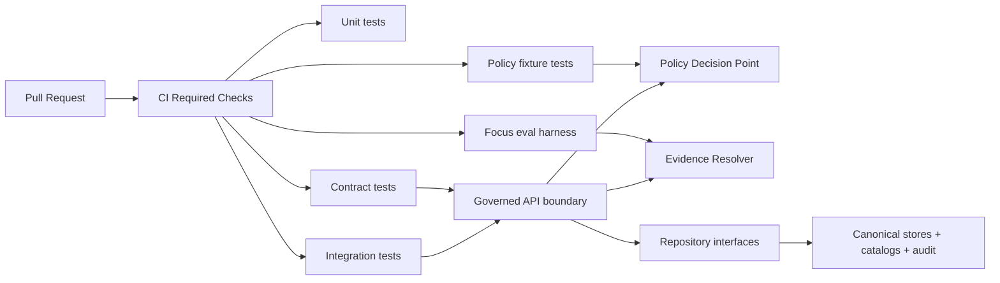

<!-- [KFM_META_BLOCK_V2]
doc_id: kfm://doc/3a7b4f64-7f5f-4d9d-9f0d-8d1e76c7e6f6
title: apps/api/tests — Governed API Test Suite
type: standard
version: v1
status: draft
owners: TBD
created: 2026-03-03
updated: 2026-03-03
policy_label: public
related:
  - apps/api/README.md
  - apps/api/src/api/README.md
tags: [kfm, api, tests, governance, policy, contracts]
notes:
  - Governance-first test README. Replace TODO runner/commands once verified on your branch.
[/KFM_META_BLOCK_V2] -->

# apps/api/tests — Governed API Test Suite
**Purpose:** encode KFM’s **trust membrane** and **cite-or-abstain** posture as tests that **fail closed** (locally + CI).

**Status:** draft • **Policy posture:** default-deny • **Owners:** TBD  


> [!WARNING]
> This directory is **governance-critical**.
> Tests here define whether the platform can safely claim it is “governed.”
> If you weaken or bypass these gates, you are changing enforcement behavior.

## Navigation
- [What lives here](#what-lives-here)
- [Non-negotiable invariants](#non-negotiable-invariants)
- [Test taxonomy](#test-taxonomy)
- [How tests fit the trust membrane](#how-tests-fit-the-trust-membrane)
- [Running tests](#running-tests)
- [Fixtures and test data rules](#fixtures-and-test-data-rules)
- [Contract tests](#contract-tests)
- [Policy tests](#policy-tests)
- [Evidence resolver tests](#evidence-resolver-tests)
- [Focus Mode evaluation harness](#focus-mode-evaluation-harness)
- [CI gates and required checks](#ci-gates-and-required-checks)
- [Directory layout](#directory-layout)
- [Definition of Done](#definition-of-done)
- [Repo-fit checklist](#repo-fit-checklist)

---

## What lives here

This directory exists to ensure the **apps/api governed boundary** stays enforceable and auditable.

### ✅ Acceptable inputs (what belongs in `apps/api/tests/`)
- Unit tests for API-layer logic (routing glue, request validation, error mapping, policy-context extraction)
- Contract tests against the OpenAPI surface (schema validity, response shape invariants)
- Policy tests (fixture-driven allow/deny/obligation outcomes) when API-specific policy inputs exist
- Integration tests proving “end-to-end within the API boundary”:
  - Evidence resolver resolves representative references
  - Restricted resources remain restricted (no inference/leakage)
  - Required trust fields are present (`dataset_version_id`, digests, `audit_ref` when governed)
- Focus Mode **evaluation harness** tests (golden queries + regression blocking)

### 🚫 Exclusions (what must NOT go here)
- Secrets, API keys, access tokens, private credentials
- Large raw datasets or sensitive location coordinates (use synthetic/generalized fixtures)
- “Happy path only” tests that ignore policy deny cases
- Tests that call out to the public internet (flaky, non-deterministic, policy-hostile)

---

## Non-negotiable invariants

These must be **provable by tests**, not “assumed.”

| Invariant | Meaning in practice | Evidence in tests |
|---|---|---|
| Trust membrane | Clients and test clients must not bypass API → policy → repos | Integration tests that only call public API surfaces; no direct DB/object-store access |
| Policy semantics parity | CI and runtime must share the same policy outcomes | Policy fixtures tested in CI; runtime integration asserts same allow/deny behavior |
| Cite-or-abstain | If citations/evidence cannot be verified as resolvable + allowed, the system abstains or reduces scope | Focus eval harness + evidence resolver tests |
| Policy-safe errors | No restricted existence leakage via 403/404/timing differences | Contract tests for error model + deny-case integration tests |
| Contract-first API | OpenAPI is treated like a build artifact; breaking changes are gated | Schema validation + contract diffs + response-shape assertions |
| Determinism | Tests are reliable and reproducible | No network; pinned fixtures; seeded randomness; frozen clocks |

> [!TIP]
> Use RFC-style language in tests and docs:
> **MUST / MUST NOT / SHOULD / MAY**.

---

## Test taxonomy

> [!NOTE]
> The exact runner (pytest/jest/vitest/etc.) is **TODO** until verified on your branch.
> This README provides runner-agnostic structure plus examples.

| Suite | Goal | Runs when | Typical runtime | Merge blocking |
|---|---|---:|---:|---:|
| `unit` | Fast feedback; pure logic | PR + local | seconds | ✅ |
| `contract` | Freeze `/api/v1` semantics; validate OpenAPI + shapes | PR + local | seconds–minutes | ✅ |
| `policy` | Fixture-driven allow/deny/obligations | PR + local | seconds–minutes | ✅ |
| `integration` | Evidence resolver + API boundary end-to-end | PR (optional) + nightly | minutes | ✅ (recommended) |
| `eval` | Focus Mode “golden queries”; cite-or-abstain regressions | nightly + release gates | minutes–tens of minutes | ✅ |
| `perf` (optional) | Prevent performance cliffs | scheduled | varies | ⛳ |

✅ = strongly recommended as required checks  
⛳ = optional early, recommended before broader release

---

## How tests fit the trust membrane



Key idea: if a user-facing capability is “governed,” then its behavior is **defined** by:
- policy fixtures + outcomes
- contracts (schemas) that the API must satisfy
- end-to-end proofs that evidence resolves and denies correctly

---

## Running tests

> [!IMPORTANT]
> Replace the commands below with the **real commands for your branch** and update badges once CI is wired.

### Fast path (local): unit + contract + policy
```bash
cd apps/api

# TODO: choose the correct runner for this branch (examples only):

# Example A — Node/TS-style
npm test
npm run test:unit
npm run test:contract
npm run test:policy

# Example B — Python-style
pytest -q
pytest -m "unit or contract or policy"
```

### Full stack (local): integration + eval
```bash
cd apps/api

# TODO: bring up dependencies (examples only)
# docker compose up -d

# Integration
# npm run test:integration
# pytest -m integration

# Focus Mode evaluation harness
# npm run test:eval
# pytest -m eval
```

> [!TIP]
> Prefer a single “developer-friendly” entrypoint:
> - `make test` / `make test-fast` / `make test-full`, **or**
> - `scripts/test/*`
>
> Keep CI and local paths identical when possible.

---

## Fixtures and test data rules

### Fixture principles
- **Small**: keep fixtures tiny and human-reviewable.
- **Policy-labeled**: every fixture has an explicit `policy_label` and (if relevant) `redaction_profile`.
- **Deterministic**: no clock drift, seeded randomness, stable ordering.
- **No sensitive locations**: do not commit precise restricted coordinates unless explicitly permitted and reviewed.
- **No secrets**: fixtures must be safe to publish.

### Recommended fixture buckets
- `fixtures/public/*` — always safe, used in “happy path” contract tests
- `fixtures/restricted/*` — deny cases, redaction/generalization expectations
- `fixtures/catalogs/*` — tiny DCAT/STAC/PROV snippets for validation
- `fixtures/requests/*` and `fixtures/responses/*` — request/response examples that match OpenAPI

---

## Contract tests

Contract tests protect:
- **OpenAPI validity**
- **Stable error model**
- **Required trust fields** on responses (where applicable)
- **403/404 behavior parity** (avoid “restricted existence” leaks)

### Contract invariants (minimum)
- `/api/v1/*` endpoints conform to OpenAPI
- responses include required trust fields where applicable:
  - `dataset_version_id`
  - artifact digests/checksums
  - policy label (public-safe)
  - `audit_ref` for governed operations
- errors conform to stable model:
  - `error_code`
  - policy-safe `message`
  - `audit_ref`

> [!NOTE]
> If OpenAPI is generated, the “source of truth” SHOULD still be reviewable in PRs:
> committed spec, or committed diffs, or generated spec pinned by digest.

---

## Policy tests

Policy tests enforce deny-by-default semantics and validate obligations.

### What we test
- allow/deny decisions for representative inputs
- obligations applied (e.g., generalize geometry, suppress exports, require notice)
- “emergency deny” / kill-switch behavior (optional but high leverage)
- CI/runtime parity: fixtures used in tests match runtime PDP input shape

### Typical flow
1. Define fixture inputs (JSON)
2. Run policy tests on fixtures
3. Ensure failure blocks merge

> [!TIP]
> Keep policy fixtures **coarse** and **fast**.
> Geometry can be simplified bounding boxes for intersection tests.

---

## Evidence resolver tests

Evidence resolver tests should prove:
- EvidenceRef → EvidenceBundle resolution works for representative schemes (e.g., dcat/stac/prov/doc)
- deny cases do not leak (no restricted metadata for public users)
- obligations are applied before returning artifacts/links

### Minimum set (recommended)
- ✅ resolves at least one **public** EvidenceRef in CI
- ✅ denies at least one **restricted** EvidenceRef (public role) without inference leakage
- ✅ bundle includes digests + stable IDs + policy decision + audit_ref (when governed)

---

## Focus Mode evaluation harness

This is the “anti-hallucination” gate for the API’s AI surface.

### What the eval harness MUST verify
- Answers include citations that resolve via the evidence resolver **OR** the system abstains
- Regressions block merges (golden query diffs)
- Sensitive/restricted info does not leak (policy pre-check + citation gate)
- Outputs include `audit_ref` (receipt linkage)

### Recommended structure
- `eval/golden_queries/` — query set (versioned)
- `eval/expected/` — expected outcomes or constraints (e.g., MUST abstain)
- `eval/reports/` — CI artifacts (diffs, pass/fail summaries)

> [!IMPORTANT]
> The evaluation harness should be treated as a **contract surface**.
> If you change it, you are changing what the system claims it can safely answer.

---

## CI gates and required checks

> [!NOTE]
> Replace these with the real gates from `.github/workflows/*` once verified.

### Suggested required checks on PRs
- Unit tests ✅
- Contract tests ✅
- Policy fixture tests ✅
- (Recommended) Integration tests ✅

### Suggested scheduled checks (nightly)
- Focus evaluation harness ✅
- Performance/regression (optional) ⛳

---

## Directory layout

> [!NOTE]
> Replace this section with the actual `tree -a -L 3 apps/api/tests` output once verified.

```text
apps/api/tests/
  README.md                  # (this file) test intent + governance + how to run
  unit/                      # fast tests; no network; no containers
  contract/                  # OpenAPI + response shape + error model tests
  policy/                    # fixtures for allow/deny/obligations (if API-specific)
  integration/               # API boundary end-to-end tests (evidence resolver, etc.)
  eval/                      # Focus Mode harness: golden queries + regressions
  fixtures/                  # tiny, policy-safe test inputs (catalog snippets, evidence refs)
  helpers/                   # test utilities (clients, clock freeze, builders)
  snapshots/                 # optional snapshot outputs (keep small; reviewable diffs)
```

---

## Definition of Done

### DoD for adding/changing an API behavior
- [ ] Contract tests updated (or confirmed unchanged)
- [ ] Policy fixtures updated (if behavior changed) and deny cases included
- [ ] No restricted existence leakage via status codes, messages, or timing
- [ ] Evidence resolver tests cover new evidence schemes/paths (if introduced)
- [ ] Focus eval harness updated if behavior impacts citations/abstention
- [ ] CI required checks remain blocking and pass

### DoD for adding a new test suite folder
- [ ] Folder has a README (or section here) explaining scope + why it exists
- [ ] Tests are deterministic and runnable locally
- [ ] Fixtures are policy-safe and minimal
- [ ] CI wiring is documented and merge-blocking where required

---

## Repo-fit checklist

If any TODOs remain, do these minimum checks and update this README:

1. Identify the test runner + command entrypoints (package scripts / make targets / CI job steps).
2. Confirm where the OpenAPI contract lives and how it’s validated in CI.
3. Confirm where policy lives (OPA/Rego or equivalent) and how fixtures are executed in CI.
4. Locate the evidence resolver route and ensure CI can resolve at least one public EvidenceRef.
5. Locate (or create) the Focus Mode evaluation harness and confirm “golden query” diffs block merges.
6. Replace the Directory layout with real `tree` output.
7. Replace CI/Coverage badges with real pipeline links.

---

**Back to top:** [Navigation](#navigation)
