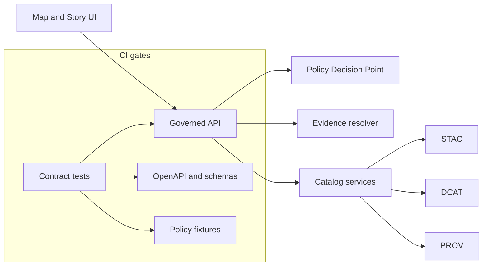

<!-- [KFM_META_BLOCK_V2]
doc_id: kfm://doc/1b1085e6-69f5-49c8-a558-5b0f04bbde54
title: API contract tests
type: standard
version: v1
status: draft
owners: TBD
created: 2026-03-03
updated: 2026-03-03
policy_label: public
related:
  - ../../src/api/README.md
  - ../../../../contracts/
  - ../../../../policy/
tags: [kfm, api, tests, contract]
notes:
  - Fail-closed contract tests for governed API boundary: OpenAPI, policy behavior, evidence resolution.
[/KFM_META_BLOCK_V2] -->

# API contract tests
Contract suite that keeps the governed API boundary stable: **OpenAPI + policy + evidence behavior**.


**Status:** draft • **Owners:** TBD • **Scope:** API boundary / trust membrane

---

## Navigation
- [Purpose](#purpose)
- [What counts as a contract test](#what-counts-as-a-contract-test)
- [Contracts enforced](#contracts-enforced)
- [How to run](#how-to-run)
- [Adding or changing a contract](#adding-or-changing-a-contract)
- [Fixtures and safety rules](#fixtures-and-safety-rules)
- [Directory rules](#directory-rules)
- [Definition of Done](#definition-of-done)
- [Troubleshooting](#troubleshooting)

---

## Purpose
Contract tests exist to prevent “quiet breakage” at the most important boundary in KFM:

- The API is the **policy enforcement point** for user-facing data access.
- The API must produce **evidence-backed** responses that can be inspected and reproduced.
- CI must **fail closed** if the API surface drifts, if policy guarantees regress, or if evidence cannot be verified.

> **NOTE**
> In KFM, a “citation” is an **EvidenceRef** that must resolve into an **EvidenceBundle**, and this is a hard gate for Story publishing and Focus Mode: if a citation cannot be resolved and policy-approved, the system must narrow scope or abstain.

[Back to top](#navigation)

---

## What counts as a contract test
A contract test validates behavior at a boundary that **other components rely on**.

In this repo, that boundary is primarily:
- **HTTP request → governed decision → response schema**
- **EvidenceRef → evidence resolver → EvidenceBundle**
- **Policy input → policy decision → obligations applied**
- **Catalog surfaces → discoverability without leakage**

Contract tests should be:
- **Deterministic** (same inputs → same outputs)
- **Policy-safe** (fixtures are safe to store in-repo)
- **Fail-closed** (any uncertainty becomes a test failure, not a “best effort” pass)

Non-goals for this folder:
- Unit tests for pure functions
- Heavy integration tests that require real external services
- Load/performance tests
- End-to-end UI tests

[Back to top](#navigation)

---

## Contracts enforced

### Contract surfaces
| Surface | What must stay true | Typical assertions |
|---|---|---|
| OpenAPI | Declared endpoints, request/response schemas, status codes, error shapes are stable | “Spec matches implementation”, schema validation of responses |
| Policy behavior | Default-deny posture for restricted/sensitive, obligations applied, no metadata leakage via errors | 403/404 behavior is policy-safe; restricted existence not inferable; obligations reflected in response |
| Evidence resolver | EvidenceRef resolves to EvidenceBundle with policy + digests + provenance | Resolve returns bundle with decision, license/attribution, artifact digests; deny path is sanitized |
| Catalog surfaces | STAC/DCAT/PROV cross-links and digests are present where promised | Response includes dataset_version_id, digests/checksums, links resolve under allowed policy |
| Story publishing gates | Publishing requires resolvable citations and captured review state | Attempt publish without resolvable citations fails closed |
| Focus Mode gates | Governed request produces receipt; citations are verified; abstains if unsupported | Missing/invalid evidence → abstain or reduced scope (never “invented” answers) |

> **WARNING**
> Do not weaken the contract to “keep tests green.” If a contract is too strict, update the contract deliberately and document the rationale.

[Back to top](#navigation)

---

## System map


[Back to top](#navigation)

---

## How to run

### Preconditions
- You can run the API in a local or test configuration.
- You can run the contract test runner used by `apps/api`.

### Recommended workflow
1. Start the API in a local/test mode.
2. Run the contract test target for this folder.
3. Confirm failures are actionable and deterministic.

> **TIP**
> The exact command depends on your API test runner (Node, Python, etc.). Prefer whatever is already wired into the repo (package scripts, Makefile targets, or CI workflow).

### Example invocations
Use the one that matches how `apps/api` is built in your repo:

```bash
# Option A: Node-style
# (Confirm script names in apps/api/package.json)
pnpm -C apps/api test:contract
# or
npm --prefix apps/api run test:contract
```

```bash
# Option B: Python-style
# (Confirm your test runner and dependencies)
pytest -q apps/api/tests/contract
```

[Back to top](#navigation)

---

## Adding or changing a contract
When you add a new endpoint or change behavior at the boundary:

1. **Update the contract definition**
   - OpenAPI (and any JSON Schemas used for strict validation)
2. **Add contract tests**
   - Happy path
   - Deny path
   - Obligation path (redaction/generalization)
   - Error behavior is policy-safe
3. **Add or update fixtures**
   - Policy fixtures for allow/deny + obligations
   - Evidence/citation fixtures (refs only; no restricted content)
4. **Wire into CI**
   - Ensure the contract suite runs on PRs and blocks merge on failure

> **NOTE**
> KFM requires the same policy semantics in CI and runtime, otherwise CI guarantees are meaningless. If policy evaluation differs, fix that mismatch before relaxing tests.

[Back to top](#navigation)

---

## Fixtures and safety rules
Fixtures in this directory must be safe to commit.

Allowed:
- Synthetic IDs (stable URNs)
- Redacted/generalized geometry
- Policy reason codes (normalized)
- Hashes/digests and schema-valid metadata
- Minimal catalog stubs that do not expose restricted content

Not allowed:
- Raw protected coordinates
- Restricted site identifiers that enable re-identification
- Secrets, tokens, signed URLs
- “How to locate” instructions

If you need restricted examples:
- Store them in an access-controlled system
- Reference only **non-sensitive hashes/ids** in-repo

[Back to top](#navigation)

---

## Directory rules

### Where this fits
`apps/api/tests/contract/` is the **API’s boundary test suite**.
It complements, but does not replace:
- policy unit tests under the policy bundle
- validators/linkcheckers for catalogs and provenance

### Acceptable inputs
- Contract test files and helpers scoped to API boundary behavior
- Policy-safe fixtures and golden responses
- Schema snapshots (if your tooling uses them)

### Exclusions
- Large external datasets
- Real credentials, keys, or tokens
- Tests that require internet access
- Long-running or flaky tests

### Suggested layout
This is a suggested structure; align with existing repo conventions:

```text
apps/api/tests/contract/
├── README.md
├── openapi/
│   └── *.test.*
├── evidence/
│   └── *.test.*
├── policy/
│   └── *.test.*
└── fixtures/
    ├── policy/
    ├── evidence/
    └── catalogs/
```

[Back to top](#navigation)

---

## Definition of Done
Use this checklist when you touch governed API endpoints:

- [ ] OpenAPI and schemas updated intentionally
- [ ] Contract tests cover allow + deny + obligation paths
- [ ] Error behavior is policy-safe and does not leak restricted existence
- [ ] EvidenceRefs resolve to EvidenceBundles on happy paths
- [ ] License/rights metadata is present where required
- [ ] Contract suite runs in CI and fails closed on regressions

[Back to top](#navigation)

---

## Troubleshooting
- **Schema mismatch failures**
  - Confirm OpenAPI and JSON Schemas are being validated against the same spec version and serialization.
- **Policy behavior regressions**
  - Re-run policy fixtures locally, then confirm the API applies the same decisions at runtime.
- **Evidence resolve failures**
  - Verify you are using policy-safe fixtures and the resolver can reach the required catalog/provenance references in test mode.
- **Flaky tests**
  - Remove time dependence and network dependence. Use pinned fixtures and deterministic clocks if needed.

[Back to top](#navigation)
