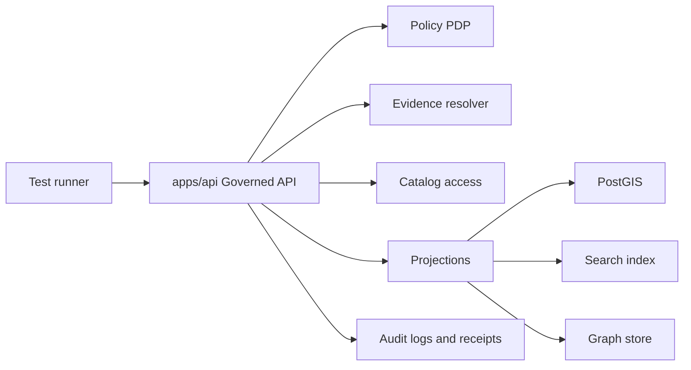

<!-- [KFM_META_BLOCK_V2]
doc_id: kfm://doc/5f1412e5-a798-4218-af54-932f2179b22d
title: apps/api/tests/integration — Integration Tests
type: standard
version: v1
status: draft
owners: KFM Engineering (TBD)
created: 2026-03-03
updated: 2026-03-03
policy_label: public
related:
  - apps/api/README.md
  - apps/api/tests/README.md
  - policy/
  - contracts/
tags: [kfm, tests, integration, governed-api]
notes:
  - Governance-first: these tests exist to prove the trust membrane holds end-to-end across real dependencies.
  - Commands and directory tree are intentionally TODO until verified against your current branch.
[/KFM_META_BLOCK_V2] -->

# apps/api/tests/integration — Integration tests (governed API)

End-to-end (API-scoped) tests that prove **policy + evidence + audit** invariants hold when the API is wired to real services.


> [!WARNING]
> This README is **governance-first**. If a test conflicts with policy or evidence invariants, **the test must be fixed** (not weakened).

> [!NOTE]
> This directory was initially a placeholder (“currently empty”). This README upgrades it into a **contract** for what integration tests must prove and how to run them.

---

## Quick navigation

- [Purpose](#purpose)
- [Where this fits](#where-this-fits)
- [Status legend](#status-legend)
- [What belongs here](#what-belongs-here)
- [Non-negotiable invariants under test](#non-negotiable-invariants-under-test)
- [Architecture under test](#architecture-under-test)
- [How to run](#how-to-run)
- [Test catalog](#test-catalog)
- [How to add a new test](#how-to-add-a-new-test)
- [Test data rules](#test-data-rules)
- [CI expectations](#ci-expectations)
- [Troubleshooting](#troubleshooting)
- [Directory layout](#directory-layout)
- [References](#references)

---

## Purpose

`apps/api/tests/integration/` exists to catch “it works on my machine” failures that unit/contract tests miss, especially failures that break the KFM **trust membrane**:

- Policy enforcement must remain **default-deny** and consistent across CI + runtime.
- Evidence resolution must be **citable** and **role-aware**.
- Errors must be **policy-safe** (no restricted existence leakage).
- Governed operations must emit `audit_ref` (or equivalent) for steward/operator review.

---

## Where this fits

`apps/api` is the **governed API boundary** for KFM. These integration tests are the “wiring harness” proving that boundary holds when connected to real dependencies.

- Parent module: [`apps/api/README.md`](../../README.md)
- Tests umbrella: [`apps/api/tests/README.md`](../README.md)
- Policies: `policy/`
- Contracts/schemas: `contracts/`

---

## Status legend

KFM docs use three truth tags (use them here too):

- **CONFIRMED** — backed by in-repo artifacts on your branch.
- **PROPOSED** — recommended defaults / target design.
- **UNKNOWN / DECISION NEEDED** — unverified; treat as **fail-closed** until verified.

> [!TIP]
> If a command or path is unknown, **document the minimum verification step** (e.g., `tree -L 4 apps/api/tests`).

---

## What belongs here

✅ **Acceptable inputs (what belongs in `integration/`)**

- Tests that exercise the API **as a process** (HTTP-level) or at least across multiple real components:
  - API ↔ policy PDP/OPA
  - API ↔ evidence resolver
  - API ↔ projections (PostGIS / search / graph) *through governed routes*
  - API ↔ audit logging / receipts
- Deterministic fixtures, seed data, and test helpers needed to run these scenarios locally and in CI.
- “Golden path” smoke tests for Focus Mode / evidence resolution when the stack is running.

🚫 **Exclusions (what must NOT go here)**

- Pure unit tests (belongs in a unit test folder or adjacent module tests).
- Pure contract/schema tests (belongs under `apps/api/tests/contract/`).
- Load/perf tests (belongs in performance tooling).
- Any “backdoor” logic that bypasses policy enforcement to make tests pass.

---

## Non-negotiable invariants under test

These are API invariants (see `apps/api/README.md`) that integration tests SHOULD prove end-to-end:

| Invariant | What it means in integration | Typical assertion |
|---|---|---|
| Trust membrane | Clients do not touch DB/storage directly | Test uses HTTP; no direct DB calls from client |
| Default-deny | Unknown/unauthorized access is denied | Restricted dataset → deny / redacted response |
| Policy semantics parity | CI and runtime behave the same | Same fixture → same allow/deny outcome |
| Cite-or-abstain | Focus Mode answers include citations or abstain | Response contains citations or explicit abstain |
| Policy-safe errors | No restricted existence leakage | Same error shape for forbidden vs non-existent |
| Auditability | Governed ops emit `audit_ref` | Responses include audit pointer consistently |

> [!IMPORTANT]
> A flaky test is a governance risk: it trains people to ignore gates. Prefer deterministic fixtures and explicit timeouts.

---

## Architecture under test

This is the shape these tests care about (conceptual):



---

## How to run

> [!NOTE]
> Repo-specific commands are intentionally **TODO** until you verify them against your current branch.

### Minimum verification steps

Run these once and update this README with CONFIRMED commands:

1. `tree -a -L 4 apps/api/tests`
2. Locate the test runner entrypoint:
   - `scripts/`, `tools/`, CI workflow, or `apps/api` build scripts
3. Identify how dependencies are started (compose/k8s/dev services).

### Recommended run patterns (PROPOSED)

Pick the path that matches your branch reality:

#### Option A — One front-door command (preferred)

```bash
# TODO: replace with real command once verified (make / scripts / task runner)
# e.g. ./scripts/dev/test-api-integration
# e.g. make test-api-integration
```

#### Option B — Container-first (common for integration)

```bash
# TODO: replace compose file/service names with real ones on your branch
docker compose up -d

# Run integration tests from inside the API container
docker compose exec api <test-runner> <args>
```

#### Option C — Host-runner against a running stack

```bash
# Start services first (compose/k8s)
# Then point the test runner at BASE_URL=http://localhost:<port>

# TODO: replace with actual runner (pytest / node test / etc.)
<test-runner> apps/api/tests/integration
```

### Environment variables (PROPOSED)

Integration tests typically need a base URL and (optionally) service endpoints:

| Variable | Meaning | Notes |
|---|---|---|
| `BASE_URL` | API base URL under test | e.g. `http://localhost:8000` |
| `OPA_URL` | Policy PDP endpoint | If policy runs as sidecar/service |
| `EVIDENCE_RESOLVER_URL` | Evidence resolution endpoint | If separated |
| `DATASET_SEED` | Seed selector | Allows multiple fixture profiles |

> [!WARNING]
> Never point integration tests at shared/prod services. Always use isolated local/CI stacks.

---

## Test catalog

This table is a starter registry. Add rows as you add tests.

| Scenario | Why it matters | Suggested test file | Expected outcome |
|---|---|---|---|
| Health / readiness | Fast failure when wiring breaks | `test_health_smoke.*` | `200` + stable error model |
| Evidence resolve (public) | Proves “evidence drawer” works | `test_evidence_resolve_public.*` | Bundle resolves + policy allow |
| Evidence resolve (restricted) | Proves default-deny | `test_evidence_resolve_restricted.*` | Deny or redacted bundle |
| Policy-safe errors | Prevent inference via error diffs | `test_policy_safe_errors.*` | Same error shape guarantees |
| Focus cite-or-abstain | Core trust promise | `test_focus_cite_or_abstain.*` | Citations OR explicit abstain |
| Audit ref presence | Enables review/debug | `test_audit_ref_present.*` | `audit_ref` always present |

---

## How to add a new test

1. **Name the invariant** in a docstring at the top of the test.
2. Choose the smallest end-to-end slice that proves it.
3. Prefer **HTTP-level** calls into the API over internal imports.
4. Use deterministic fixtures:
   - fixed timestamps
   - fixed dataset IDs/versions
   - fixed policy labels/roles
5. Make assertions on:
   - response status + error shape
   - `audit_ref` presence
   - citations / evidence bundle digests when applicable
6. Update:
   - [Test catalog](#test-catalog)
   - [Directory layout](#directory-layout) (if you add folders)

---

## Test data rules

- ✅ Use **synthetic** or **cleared public** fixtures.
- ✅ If you must include coordinates, use **coarse/generalized** geometry unless explicitly allowed.
- ✅ Keep fixtures small; integration tests should be fast enough to be merge-blocking.
- 🚫 Never commit secrets, access tokens, private keys, or restricted coordinates.
- 🚫 Never rely on the public internet during tests (CI must be reproducible).

---

## CI expectations

(PROPOSED) Integration tests should be **merge-blocking** for the governed API because they protect the trust membrane.

Minimum expectations:

- Always runs (anti-skip posture).
- Fails closed on missing dependencies.
- Stores logs/artifacts needed to debug governance failures (policy decision traces, sanitized request IDs, etc.).

---

## Troubleshooting

- **Port already in use**: verify local services aren’t already running.
- **Policy denials everywhere**: confirm policy PDP is reachable and seeded with fixtures.
- **Flaky timeouts**: increase explicit timeouts and ensure fixture datasets are minimal.
- **Missing citations**: treat as regression unless test is explicitly “abstain expected.”

> [!TIP]
> Add a `--verbose` / debug mode to print:
> - resolved config (sanitized)
> - dependency health checks
> - request IDs / audit refs

---

## Directory layout

> [!NOTE]
> Replace this with real output after you run: `tree -a -L 3 apps/api/tests/integration`

```text
apps/api/tests/integration/
  README.md
  fixtures/                # seed data + minimal public fixtures (recommended)
  helpers/                 # shared helpers for integration suite (recommended)
  test_health_smoke.*      # smoke tests (recommended)
  test_evidence_*.*
  test_focus_*.*
```

---

## References

- `apps/api/README.md` (governed API invariants): ../../README.md
- `apps/api/tests/README.md` (test scope index): ../README.md
- Policy source: ../../../policy/ *(verify path on your branch)*
- Contracts/schemas: ../../../contracts/ *(verify path on your branch)*

[Back to top](#appsapitestsintegration--integration-tests-governed-api)
