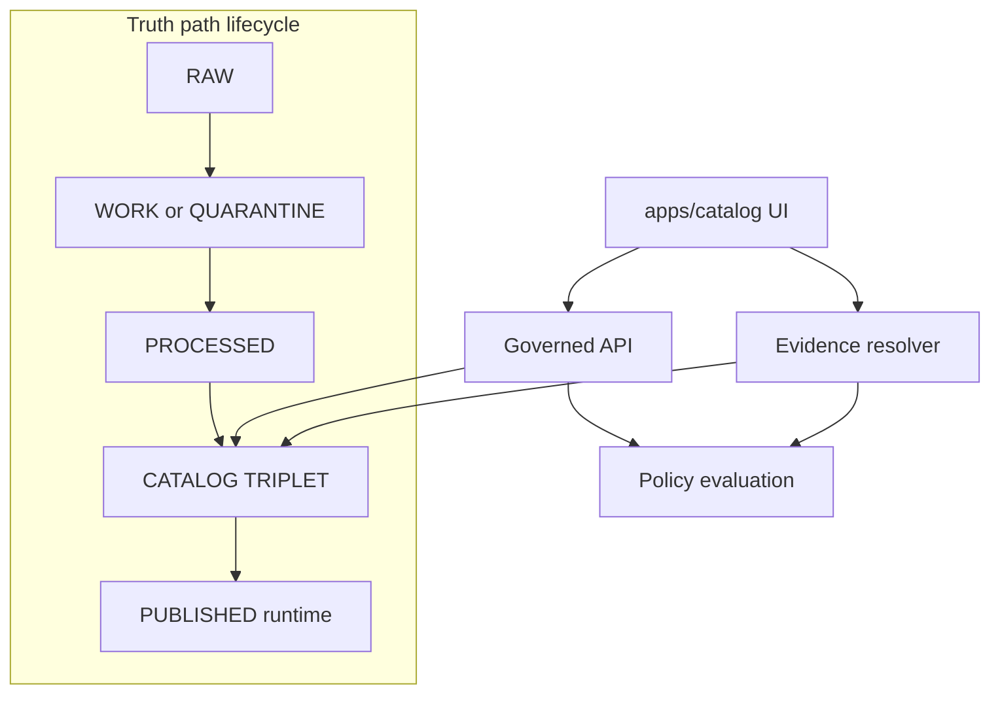

<!-- [KFM_META_BLOCK_V2]
doc_id: kfm://doc/7b8c0b0a-3f66-4c5e-9d73-6d5c1bd0b4de
title: apps/catalog — Dataset Catalog UI (DCAT + STAC + PROV)
type: standard
version: v1
status: draft
owners: TODO: assign owners (UI + Data Steward)
created: 2026-02-26
updated: 2026-02-26
policy_label: public
related:
  - kfm://doc/kfm-gdg-2026-02-20  # KFM Definitive Design & Governance Guide (vNext)
tags: [kfm, catalog, ui, provenance, governance]
notes:
  - This README documents the Catalog UI surface as a governed client that exposes dataset discovery and evidence/provenance inspection.
  - Treat all “PROPOSED” details here as placeholders until verified against repo reality.
[/KFM_META_BLOCK_V2] -->

<a id="top"></a>

# apps/catalog — KFM Catalog UI
**Dataset discovery + evidence/provenance inspection UI** for Kansas Frontier Matrix (KFM), built as a **governed client**.

> **Status:** draft (structure + contracts first)  
> **Owners:** TODO (UI team + Steward)  
> **Policy label:** public (this README)


---

## Quick links
- [Purpose](#purpose)
- [Where this fits](#where-this-fits)
- [Responsibilities](#responsibilities)
- [Inputs and exclusions](#inputs-and-exclusions)
- [Architecture](#architecture)
- [Contracts](#contracts)
- [UI trust surfaces](#ui-trust-surfaces)
- [Security posture](#security-posture)
- [Development](#development)
- [Quality gates](#quality-gates)
- [Directory layout](#directory-layout)
- [Assumptions to verify](#assumptions-to-verify)
- [Glossary](#glossary)

---

## Purpose
The Catalog UI is the “dataset discovery” surface:
- Find datasets and dataset versions (by theme, time, geography, publisher, license, and policy label)
- Inspect **catalog metadata** (DCAT), **asset metadata** (STAC), and **lineage** (PROV/run receipts)
- Open the **Evidence Drawer** to see “what is this claim/layer based on?” in a single, consistent UI

This is not “nice metadata.” In KFM, catalogs are treated as **contract surfaces** between pipelines and runtime UI/API.  

---

## Where this fits
KFM’s top-level IA includes:
- Map Explorer
- Stories (Story Mode)
- **Catalog (dataset discovery) ← this**
- Focus Mode (evidence-led Q&A)
- Admin/Steward (restricted)

The Catalog UI should integrate with shared trust components (especially the Evidence Drawer), and should never bypass the governed API boundary.

[↑ Back to top](#top)

---

## Responsibilities

| Area | What this app must do | What it must NOT do |
|---|---|---|
| Dataset discovery | List/search/filter datasets and versions | Don’t “invent” dataset details or show unpromoted/quarantined versions |
| Transparency | Show license, rights holder, policy label, freshness/validation status | Don’t hide governance; no “silent” restriction |
| Evidence-first UX | Provide one-click access to Evidence Drawer and provenance links | Don’t display claims without resolvable EvidenceRefs |
| Policy-aware UX | Enforce policy-safe views (redactions/generalizations + notices) | Don’t leak restricted existence via errors/timing |
| Export | Exports must include attribution + license text automatically | Don’t allow export when rights/policy disallow |

---

## Inputs and exclusions

### Acceptable inputs (what belongs here)
- Catalog UI code (pages/components/hooks/state)
- Contract-driven DTOs for:
  - DCAT dataset summaries + details
  - STAC collection/item asset views
  - PROV lineage/run receipt views
  - EvidenceDrawer rendering (EvidenceBundle)
- UI tests for trust surfaces:
  - Evidence resolver integration
  - Policy notice rendering
  - Accessibility smoke tests (keyboard navigation for drawer)

### Exclusions (what must NOT go here)
- Pipeline ingestion code (connectors, normalization, promotion logic)
- Database/storage direct access libraries that bypass the governed API
- Secrets/credentials (ever)
- “Hidden” policy logic in UI (UI displays policy decisions; policy is enforced by the policy boundary)

[↑ Back to top](#top)

---

## Architecture

### High-level flow (conceptual)


### Design rule (non-negotiable)
The Catalog UI is a **governed client**:
- It renders what the API returns.
- It never embeds privileged credentials.
- It never fetches from object storage / DB directly.

---

## Contracts

### Catalog triplet (DCAT + STAC + PROV)
KFM uses a “triplet” to make evidence and interoperability deterministic:

- **DCAT**: dataset-level metadata (publisher, license, distributions, spatial/temporal coverage, themes)
- **STAC**: asset-level metadata (collections/items/assets + spatiotemporal extents + hrefs)
- **PROV**: lineage (how outputs were created, inputs/tools/parameters, run receipts)

> NOTE: Profiles/required fields and endpoint names may be **PROPOSED** until verified in-repo.

### EvidenceRef schemes (minimum posture)
Catalog UI should expect references like:
- `dcat://...` → dataset/distribution metadata
- `stac://...` → collection/item/asset metadata
- `prov://...` → run lineage
- `doc://...` → governed docs and story citations

### Evidence resolver usage
The Evidence Drawer is powered by an evidence resolver that:
- Accepts an `EvidenceRef` (or structured ref)
- Applies policy
- Returns an **EvidenceBundle** (human card + machine metadata + digests + audit references)

The UI should be able to use it in **≤ 2 calls** (contract goal).

[↑ Back to top](#top)

---

## UI trust surfaces

### Required trust surfaces
These are not “polish,” they are the user-visible governance contract:

- Evidence drawer reachable from every dataset version and claim
- Data version labels (DatasetVersion IDs) linked to catalogs
- Policy notices (“geometry generalized due to policy”)
- Freshness/validation status surfaced (last run timestamp, catalog validation)
- “What changed?” between dataset versions (diffs, counts, checksums, QA metrics)

### Evidence Drawer minimum fields (UI contract)
The drawer should display at minimum:
- Evidence bundle ID + digest
- DatasetVersion ID + dataset name
- License + rights holder + attribution text
- Freshness + validation status
- Provenance chain (run receipt link)
- Artifact links **only if allowed**
- Redactions/obligations applied + user-facing explanation

---

## Security posture

### Trust membrane checklist (UI-facing)
- [ ] UI never fetches directly from object storage or databases
- [ ] Public users cannot infer restricted dataset existence via error behavior
- [ ] Downloads/exports are checked against policy labels + rights
- [ ] Evidence resolution fails closed if unresolvable/unauthorized
- [ ] UI does not embed credentials; uses session/role-aware API only

---

## Development

> TODO: Update once repo build tooling is confirmed (npm/pnpm/yarn, workspace layout, dev server ports).

### Typical local workflow (placeholder)
```bash
# from repo root (TBD)
cd apps/catalog

# install dependencies (choose your repo's standard)
npm install

# run dev server
npm run dev

# run tests
npm test
```

### Environment variables (placeholder)
- `KFM_API_BASE_URL` — base URL for governed API (dev/staging/prod)
- `KFM_ENABLE_STEWARD_UI` — gates admin/steward features (must also be enforced server-side)
- `KFM_BUILD_SHA` — surfaced in “About / What changed?” panels (optional)

---

## Quality gates

### Must-pass checks for Catalog UI changes
- [ ] Contract tests pass (API DTOs / schema validation)
- [ ] Link-checking passes (DCAT ↔ STAC ↔ PROV cross-links resolve for promoted versions)
- [ ] Evidence resolver integration test passes (resolve representative EvidenceRef to bundle)
- [ ] Accessibility smoke: Evidence Drawer keyboard navigation works
- [ ] Policy-safe errors: restricted resources fail closed with safe messages
- [ ] Export includes license + attribution automatically (if export exists)

---

## Directory layout

> UNKNOWN until verified in this repo. Replace the tree below with the actual one.

```text
apps/catalog/
  README.md               # this file
  src/                    # Catalog UI source
    pages/                # routes (dataset list, dataset details)
    components/           # Catalog cards, filters, tables
    evidence/             # Evidence Drawer integration
    api/                  # typed API client + DTOs
    styles/               # styling
  tests/                  # unit/integration tests
  package.json            # build + scripts
```

---

## Assumptions to verify
This README is designed to be safe-by-default. Before implementing “hard” behavior, verify:

- [ ] Actual monorepo structure and build tooling (workspace manager, scripts)
- [ ] Actual governed API contract paths + auth model
- [ ] Where DCAT/STAC/PROV artifacts live and how they’re fetched
- [ ] Policy label vocabulary + obligation types in this deployment
- [ ] Existing shared UI components (Evidence Drawer, PolicyNotice, VersionBadge)

---

## Glossary
<details>
<summary>Key terms used in this README</summary>

- **DatasetVersion**: an immutable version of a dataset release; should be what the UI binds to.
- **Triplet**: KFM’s catalog surface: DCAT + STAC + PROV, cross-linked.
- **EvidenceRef**: a resolvable reference to evidence (dcat://, stac://, prov://, doc://).
- **EvidenceBundle**: the resolver output; the UI renders it in the Evidence Drawer.
- **Policy label**: classification input that controls allow/deny and obligations (redaction/generalization).
</details>

---

[↑ Back to top](#top)
