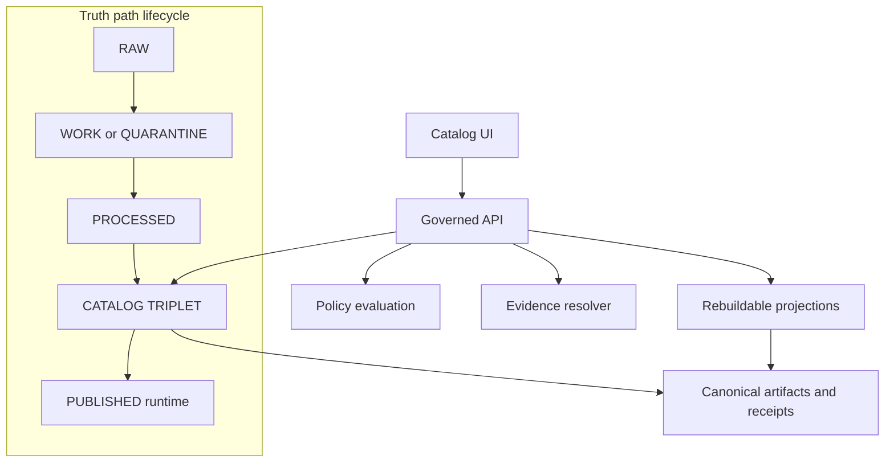
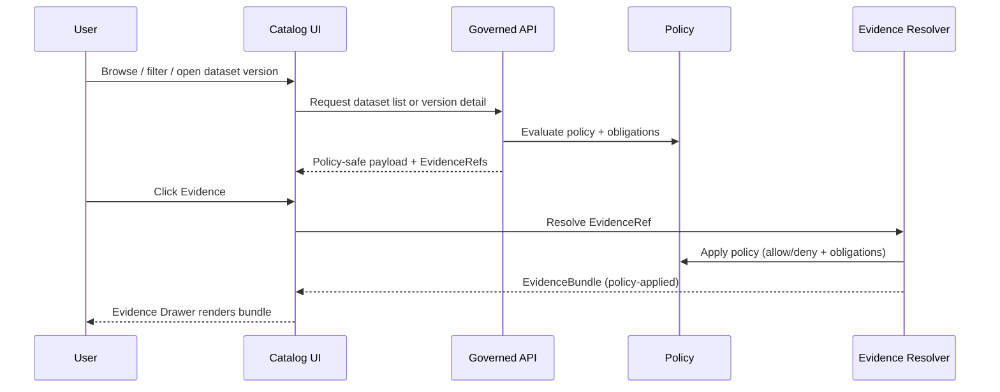

<!-- [KFM_META_BLOCK_V2]
doc_id: kfm://doc/2f7e24e8-5f1a-4b93-9b1b-0b0e20ffcb4e
title: apps/catalog — Catalog UI
type: standard
version: v1
status: draft
owners: TBD (Catalog UI + Steward)
created: 2026-03-03
updated: 2026-03-03
policy_label: public
related:
  - ../../README.md
  - ../README.md
  - ../../contracts/
  - ../../policy/
tags: [kfm, catalog, ui, evidence-first]
notes:
  - This README is intentionally fail-closed: repo-specific facts stay UNKNOWN until verified in-repo.
[/KFM_META_BLOCK_V2] -->

<a id="top"></a>

# apps/catalog — Catalog UI
**Dataset discovery + evidence/provenance inspection** for Kansas Frontier Matrix (KFM) — a **governed client** that surfaces **DCAT/STAC/PROV** metadata and opens every claim into the **Evidence Drawer**.

**Status:** draft • **Owners:** _TBD_ • **Policy label:** public (this README)

[](#status)
[](#purpose)
[](#trust-membrane-non-negotiable)
[](#evidence-first-ux)
[](#catalog-triplet-contract)
[](../../LICENSE)
[](#quality-gates)

> [!IMPORTANT]
> **Fail-closed posture:** anything **repo-specific** (build tooling, scripts, ports, endpoint names, owners) is **UNKNOWN** until verified on your branch. Do not “fill in the blanks.”  
> This app must honor KFM’s trust membrane: **no direct storage/DB/index access from the client**—only governed APIs.

---

## Quick navigation
- [Status legend](#status-legend)
- [Purpose](#purpose)
- [Where this fits](#where-this-fits)
- [Directory contract](#directory-contract)
- [Core user journeys](#core-user-journeys)
- [Architecture](#architecture)
- [Contracts](#contracts)
- [Evidence-first UX](#evidence-first-ux)
- [Security posture](#security-posture)
- [Development](#development)
- [Quality gates](#quality-gates)
- [Directory layout](#directory-layout)
- [Assumptions, risks, tradeoffs](#assumptions-risks-tradeoffs)
- [Glossary](#glossary)
- [PR checklist](#pr-checklist)

---

## Status legend
KFM docs use explicit truth labels:

- **CONFIRMED (design):** required KFM invariants / target posture.
- **UNKNOWN (repo):** not verified in this repository; treat as TODO.
- **PROPOSED:** a recommended default/pattern; verify before enforcing.

---

## Purpose
The **Catalog UI** is the dataset discovery surface. It must enable:

- **Find datasets and versions** (by theme, geography, time, publisher, license, and policy label).
- **Inspect the catalog triplet**:
  - **DCAT**: dataset/distribution metadata (publisher, license, rights, distributions).
  - **STAC**: asset inventory + spatiotemporal extents.
  - **PROV**: lineage + run receipts (how outputs were created, with what inputs/tools).
- **Open evidence**: every dataset version, asset, or claim links to a resolvable **EvidenceRef** and renders as an **EvidenceBundle** in the Evidence Drawer.

> [!NOTE]
> In KFM, catalogs are not “nice metadata.” They are **contract surfaces** between pipelines and runtime.

[↑ Back to top](#top)

---

## Where this fits
Catalog is one of KFM’s primary user experiences, alongside Map Explorer, Stories, and Focus Mode.

This app:
- lives under **`apps/`** (runnable surface layer)
- **consumes** governed APIs and contracts
- **does not** implement policy enforcement (it displays policy decisions + obligations returned by the policy boundary)

Recommended related reading:
- Repo operating model: `../../README.md`
- Apps directory contract: `../README.md`

[↑ Back to top](#top)

---

## Directory contract

### Acceptable inputs
This folder is for the **Catalog UI app** only:

- UI routes/pages for dataset discovery + dataset version detail
- typed API client for governed endpoints (DTOs generated from contracts, if applicable)
- Evidence Drawer integration and trust components (or imports of shared components)
- UI tests that cover:
  - Evidence resolution (allow/deny/abstain)
  - Policy notices (obligations/redactions/generalizations)
  - Accessibility smoke tests

### Exclusions
The following **must not** live here:

- ingestion/pipeline/promotion code
- direct DB / object storage / index clients used by the browser (bypass of trust membrane)
- secrets/credentials
- “hidden policy logic” in the UI (policy enforcement belongs in API + CI)

> [!WARNING]
> UI may *display* provenance and verification results, but **verification must happen behind the trust membrane**.

[↑ Back to top](#top)

---

## Core user journeys

| Journey | What the user does | What the UI must show | What must happen behind the membrane |
|---|---|---|---|
| Browse datasets | open Catalog landing page | dataset list with policy-safe summaries | API returns only admissible (policy-filtered) entries |
| Filter/search | filter by theme/time/coverage/license | filters + result counts (policy-safe) | API enforces policy-safe errors + redactions |
| Open dataset | click dataset card | dataset detail + distributions | DCAT is the authoritative dataset record |
| Inspect versions | choose DatasetVersion | version badge + “what changed?” (if supported) | version is pinned; no “floating latest” in share links |
| Inspect assets | open assets tab | STAC collection/item + assets list | STAC metadata is authoritative for assets/extents |
| Inspect lineage | open provenance | PROV/run receipt view | PROV bundle/run receipt served by governed API |
| Open evidence | click “Evidence” anywhere | Evidence Drawer (bundle) | Evidence resolver resolves EvidenceRef → EvidenceBundle with policy applied |
| Export (optional) | export citation/metadata | auto-includes license + attribution | server-side checks enforce rights/policy; UI never bypasses |

[↑ Back to top](#top)

---

## Architecture

### High-level flow (conceptual)

```mermaid
flowchart TB
  subgraph TruthPath[Truth path lifecycle]
    Raw[RAW] --> Work[WORK or QUARANTINE] --> Processed[PROCESSED] --> Triplet[CATALOG TRIPLET] --> Published[PUBLISHED runtime]
  end

  CatalogUI[Catalog UI] --> API[Governed API]
  API --> Policy[Policy evaluation]
  API --> Evidence[Evidence resolver]
  API --> Triplet
  API --> Projections[Rebuildable projections]

  Triplet --> Canonical[Canonical artifacts and receipts]
  Projections --> Canonical
```

### Evidence-first interaction sketch

```mermaid
sequenceDiagram
  participant U as User
  participant C as Catalog UI
  participant A as Governed API
  participant P as Policy
  participant E as Evidence Resolver

  U->>C: Browse / filter / open dataset version
  C->>A: Request dataset list or version detail
  A->>P: Evaluate policy + obligations
  A-->>C: Policy-safe payload + EvidenceRefs

  U->>C: Click Evidence
  C->>E: Resolve EvidenceRef
  E->>P: Apply policy (allow/deny + obligations)
  E-->>C: EvidenceBundle (policy-applied)
  C-->>U: Evidence Drawer renders bundle
```

[↑ Back to top](#top)

---

## Contracts

### Catalog triplet contract
The Catalog UI treats these as **authoritative** and **link-checkable**:

- **DCAT** — dataset record + distributions (license/rights/publisher)
- **STAC** — collections/items/assets + (policy-safe) extents
- **PROV** — lineage, run receipts, tool versions, parameters, outputs

> [!IMPORTANT]
> The UI must never “rebuild provenance” by inference. If cross-links are broken, the UI degrades to **untrusted** and routes to steward remediation.

### EvidenceRef and EvidenceBundle
**CONFIRMED (design expectation):** citations/evidence are scheme-based and resolve deterministically.

**Starter schemes (verify and update):**
- `dcat://…`
- `stac://…`
- `prov://…`
- `doc://…`
- `tile://…`
- `graph://…`

**EvidenceBundle minimum fields (UI contract):**
- bundle id + digest (when policy allows)
- dataset_version_id + dataset name
- license + rights holder + copyable attribution
- policy label + obligations/redactions/generalizations applied
- provenance link (run receipt / prov bundle)
- artifact links only when policy allows
- audit reference / run id when applicable

### Governed API endpoints
**UNKNOWN (repo):** exact endpoints and auth model.

**PROPOSED (shape only):**
- `GET /datasets` (policy-filtered discovery)
- `GET /datasets/{dataset_id}` (DCAT detail)
- `GET /datasets/{dataset_id}/versions` (version list)
- `GET /stac` + `GET /stac/collections/{id}` + `GET /stac/items/{id}`
- `GET /prov/{run_or_bundle_id}`
- `POST /evidence/resolve` (EvidenceRef → EvidenceBundle)

> Minimum verification step: locate the repo’s OpenAPI/GraphQL contract under `../../contracts/` and replace this list with the real routes.

[↑ Back to top](#top)

---

## Evidence-first UX

### Required trust surfaces
These are not optional polish; they are the user-visible governance contract:

- **Evidence Drawer** reachable from every dataset version and asset.
- **DatasetVersion badge** always visible when viewing a versioned object.
- **Policy label + obligations** visible and explained in policy-safe language.
- **Freshness/validation** shown when available (last run timestamp, QA summary, catalog validation).
- **ReceiptViewer / provenance panel** (if exposed for this surface).
- **Policy-safe errors**: public users cannot infer restricted dataset existence by error differences.

### Fail-closed behavior (must)
- evidence unresolvable → show **untrusted** UI state (no “best effort” claims)
- policy denies → deny with **policy-safe** messaging
- catalogs invalid/missing → degrade safely, route to steward remediation

[↑ Back to top](#top)

---

## Security posture

### Trust membrane (non-negotiable)
- UI must not fetch from object storage, DBs, or internal indexes directly.
- UI must not embed privileged credentials.
- UI must treat the governed API + evidence resolver as authoritative.

### Policy-safe error checklist
- [ ] restricted existence is not inferable via 404 vs 403 vs timing differences
- [ ] cached errors don’t create inference channels
- [ ] export/download paths are gated by policy + rights server-side
- [ ] evidence drawer does not become an exfiltration path

[↑ Back to top](#top)

---

## Development

> [!NOTE]
> **UNKNOWN (repo):** tooling (pnpm/npm/yarn), app framework, scripts, ports.

### Minimum “reality check” steps (do this first)
```bash
# From repo root
ls -la apps/catalog
tree -L 3 apps/catalog || find apps/catalog -maxdepth 3 -print | sort

# Identify tooling
ls -la package.json pnpm-workspace.yaml yarn.lock turbo.json nx.json 2>/dev/null || true
ls -la apps/catalog/package.json apps/catalog/pyproject.toml apps/catalog/requirements.txt 2>/dev/null || true
```

### Typical local workflow (placeholder)
```bash
# Replace <pm> with your repo standard (npm|pnpm|yarn)
cd apps/catalog
<pm> install
<pm> run dev
<pm> test
```

### Environment variables (placeholder)
- `KFM_API_BASE_URL` — base URL for governed API
- `KFM_BUILD_SHA` — surfaced in About panels (optional)
- `KFM_FEATURE_STEWARD` — UI gating for steward-only affordances (MUST be enforced server-side too)

[↑ Back to top](#top)

---

## Quality gates

### Must-pass checks for Catalog UI changes
- [ ] **Contract validity:** DTOs match API contract (OpenAPI/GraphQL schema checks)
- [ ] **Cross-link integrity:** DCAT ↔ STAC ↔ PROV navigation works for promoted versions
- [ ] **Evidence resolver integration:** at least one representative EvidenceRef resolves to a bundle
- [ ] **Policy-safe deny paths:** deny/abstain UX covered by tests
- [ ] **Accessibility smoke:** Evidence Drawer keyboard navigation works (tab order, focus trap, escape)
- [ ] **Export posture (if present):** exports include license + attribution automatically; blocked when rights/policy disallow

> [!TIP]
> If CI has a single “anti-skip” gate summary check, Catalog UI changes should plug into it.

[↑ Back to top](#top)

---

## Directory layout

**UNKNOWN (repo):** actual file tree. Replace the placeholder below with the real one.

```text
apps/catalog/
  README.md                 # This file
  # (expected but NOT confirmed)
  # package.json / pyproject.toml
  # src/
  # tests/
  # public/
```

**PROPOSED layout (if this is a web app):**
```text
apps/catalog/
  src/
    routes/                 # dataset list, dataset detail, version detail
    components/
    api/                    # typed API client (governed endpoints only)
    evidence/               # Evidence Drawer integration
    policy/                 # UI policy notices (display-only)
  tests/
    e2e/
    unit/
```

[↑ Back to top](#top)

---

## Assumptions, risks, tradeoffs

### Assumptions (must verify)
- the governed API exposes policy-filtered discovery for DCAT/STAC/PROV
- EvidenceRefs resolve deterministically via an evidence resolver
- Catalog triplet cross-links are validated in CI for promoted versions

### Risks
- **Silent drift** if the UI shows “best effort” metadata when catalogs/evidence are broken
- **Inference leakage** if deny vs not-found differs across roles
- **Governance bypass** if the UI ever accesses storage/indexes directly

### Tradeoffs
- Strict fail-closed behavior may reduce “time to demo,” but protects the trust membrane.
- Showing more provenance detail improves transparency but increases risk of leaking restricted metadata; always defer to policy obligations/redactions.

### Minimum verification steps (convert UNKNOWN → CONFIRMED)
- [ ] locate contract sources under `../../contracts/` and document the real endpoints/types
- [ ] locate policy vocabulary registry (policy_label + obligation types)
- [ ] identify shared trust components (Evidence Drawer, PolicyNotice, VersionBadge) and import rather than duplicate
- [ ] run link-checks for DCAT↔STAC↔PROV on one promoted DatasetVersion and record results

[↑ Back to top](#top)

---

## Glossary
- **DatasetVersion**: immutable release identity the UI must pin to (no “floating latest”).
- **Catalog triplet**: DCAT + STAC + PROV, cross-linked and validated.
- **EvidenceRef**: resolvable reference to evidence (`dcat://`, `stac://`, `prov://`, `doc://`, …).
- **EvidenceBundle**: resolver output rendered in the Evidence Drawer (policy-applied).
- **Policy label**: sensitivity/access input used by the policy engine to allow/deny and apply obligations.

[↑ Back to top](#top)

---

## PR checklist
Use this when changing Catalog UI behavior:

- [ ] Does the change keep the **trust membrane** intact (no direct storage/DB/index calls)?
- [ ] Do all new user-visible claims link to an **EvidenceRef** and open the Evidence Drawer?
- [ ] Are deny/abstain states **policy-safe** (no restricted existence inference)?
- [ ] If exports are touched: do exports auto-include license + attribution and block when disallowed?
- [ ] Are a11y smoke tests updated (Evidence Drawer focus/keyboard behavior)?
- [ ] Is anything repo-specific newly asserted in docs? If yes, attach evidence and remove UNKNOWNs.

[↑ Back to top](#top)
