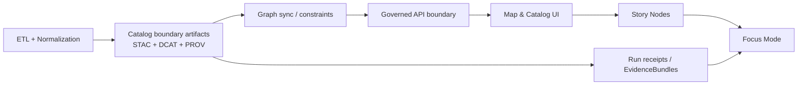

<!-- [KFM_META_BLOCK_V2]
doc_id: kfm://doc/6736c4b1-162d-48fc-a4e1-778b75e6e1b9
title: Catalog subsystem source
type: standard
version: v1
status: draft
owners: TBD
created: 2026-02-26
updated: 2026-02-26
policy_label: restricted
related:
  - ../../../docs/MASTER_GUIDE_v13.md
  - ../../../docs/standards/KFM_STAC_PROFILE.md
  - ../../../docs/standards/KFM_DCAT_PROFILE.md
  - ../../../docs/standards/KFM_PROV_PROFILE.md
  - ../../../docs/governance/ROOT_GOVERNANCE.md
tags: [kfm, catalog, stac, dcat, prov, evidence, governance]
notes:
  - Directory-level runbook for the Catalog subsystem’s source code.
  - Keep governed narrative/architecture docs in /docs; this file links out.
[/KFM_META_BLOCK_V2] -->

<a id="top"></a>

# Catalog · `apps/catalog/src`

**Purpose:** Source code for producing and validating KFM’s *catalog boundary artifacts* (STAC + DCAT + PROV) and the run receipts / evidence bundles that downstream systems (Graph → API → UI → Story → Focus Mode) must rely on.

    

> [!IMPORTANT]
> This directory should contain **executable source code only**. Keep design docs, governance policies, Story Nodes, and dataset runbooks in `docs/` (and link to them from here).

## Quick links

- [How this fits in the pipeline](#how-this-fits-in-the-pipeline)
- [What belongs here (and what must not)](#what-belongs-here-and-what-must-not)
- [Artifacts & contracts](#artifacts--contracts)
- [Promotion gates (Definition of Done)](#promotion-gates-definition-of-done)
- [Local dev](#local-dev)
- [Testing & CI](#testing--ci)
- [Troubleshooting](#troubleshooting)
- [Verification steps](#verification-steps)

---

## How this fits in the pipeline

KFM’s ordering is non‑negotiable: **ETL → Catalogs (STAC/DCAT/PROV) → Graph → API → UI → Story Nodes → Focus Mode**.



**What this directory is responsible for (conceptually):**

- Generating the **catalog triplet** (STAC, DCAT, PROV) as the *interface* between processed data and everything downstream.
- Validating that metadata conforms to KFM profiles and that cross-links are intact (e.g., DCAT distributions point to STAC and/or stable assets; PROV links input→activity→output chains).
- Emitting **run receipts** that bind outputs to inputs, tool versions, configs, checksums, and governance decisions.

<a href="#top">Back to top</a>

---

## What belongs here and what must not

| Category | ✅ OK in `apps/catalog/src` | ❌ Not OK in `apps/catalog/src` |
|---|---|---|
| Source code | Catalog generation, validation, resolvers/adapters, CLI/service entrypoints, domain-neutral utilities | Copy-pasted docs, long design narratives, Story Node content |
| Data | **None** (only references, fixtures for tests) | Raw/work/processed datasets; large binaries; “sample data” without license/sensitivity metadata |
| Access patterns | Read/write through governed storage abstractions; calls through *contracts* | UI reaching into DB/graph directly; “just read the file from data/processed” shortcuts |
| Safety/governance | Redaction hooks, policy checks, classification labels | Hard-coded sensitive coordinates; bypassing policy boundary; leaking secrets in configs |

> [!WARNING]
> If you’re tempted to add a convenience shortcut that bypasses profile validation, cross-link checks, or redaction — **don’t**. Those are the trust membrane.

<a href="#top">Back to top</a>

---

## Artifacts & contracts

### The “catalog triplet” (required)

Every published dataset/evidence artifact should have **all three**:

1. **STAC Collection + Item(s)** — spatial/temporal metadata and asset links  
2. **DCAT dataset entry** — discovery metadata, license, distributions  
3. **PROV bundle** — lineage: inputs → processing activity → outputs (agents, timestamps, parameters)

> [!NOTE]
> If you need custom metadata beyond the base profiles, extend the profiles — don’t invent ad‑hoc fields.

### Canonical output locations (expected)

> These locations are part of the v13 layout contract. If this monorepo differs, you must document the mapping from *this app* to the canonical home.

- `data/stac/collections/` — STAC Collections  
- `data/stac/items/` — STAC Items  
- `data/catalog/dcat/` — DCAT JSON‑LD outputs  
- `data/prov/` — PROV bundles / lineage files  
- (Optional) `releases/` — versioned bundles + manifests

### Contracts this code must respect

- **Schema/profile contracts:** KFM STAC/DCAT/PROV profiles (see `docs/standards/`)
- **Promotion contract:** “no publish” unless required artifacts + validations are present
- **API boundary rule:** anything consumed by UI must be exposed via governed API (not direct graph/db reads)

<a href="#top">Back to top</a>

---

## Suggested internal architecture

> This is a **recommended** layout aligned with the KFM layering model (Domain → Use cases → Interfaces → Infrastructure). Update to match the actual directory tree.

```text
apps/catalog/src/                                     # Catalog app core (clean architecture boundaries inside UI/service)
├── index.ts                                          # Package entry (exports wiring, app bootstrap, or public API)
├── domain/                                           # Pure rules (profile semantics, linkage invariants, no IO)
├── usecases/                                         # Orchestrations (buildTriplet(), validateTriplet(), publish(), receipts)
├── interfaces/                                       # Ports (CatalogStore, EvidenceResolver, PolicyDecider, Logger)
├── infra/                                            # Adapters (fs/S3/GCS stores, jsonschema, observability, policy client)
├── cli/                                              # CLI entrypoints (only if app exposes commands)
├── server/                                           # HTTP/service entrypoints (only if app is a service)
└── __tests__/                                        # Fast unit tests + tiny fixtures only (no network, deterministic)
```

**Hard rule:** domain + usecases must be testable without network, filesystem, or databases.

<a href="#top">Back to top</a>

---

## Promotion gates (Definition of Done)

A change that affects catalog outputs should satisfy *at least*:

- [ ] **Metadata identity** present (dataset id, title/description, ownership)
- [ ] **Validation results** recorded (schema/profile validation)
- [ ] **License check** recorded
- [ ] **Sensitivity / classification** recorded (and redaction applied where required)
- [ ] **Provenance links** complete (inputs, transforms, tool versions, parameters)
- [ ] **Checksums / integrity** recorded for referenced assets
- [ ] **Run receipt** emitted (who/what/when/why + inputs/outputs + policy decisions)
- [ ] **Catalog triplet validates** (STAC, DCAT, PROV + cross-link checks)

> [!TIP]
> If you add a new validator or profile constraint, add a “known bad” fixture to prove the gate fails closed.

<a href="#top">Back to top</a>

---

## Local dev

> Tooling is repo-specific. These commands are intentionally conservative placeholders.

```bash
# From repo root
cd apps/catalog

# Install dependencies (use the repo's package manager)
pnpm install   # or: npm ci | yarn install

# Run in watch/dev mode (if supported)
pnpm dev       # or: npm run dev

# Validate catalogs / run tests
pnpm test      # or: npm test
```

### Common workflows

#### 1) Add a new dataset / evidence artifact to the catalog

1. Ensure processed outputs exist in `data/processed/...`
2. Create/extend metadata mapping to produce STAC/DCAT/PROV
3. Run validators locally
4. Confirm cross-links:
   - STAC assets resolve to stable locations
   - DCAT distributions reference STAC or stable downloads
   - PROV chain is complete (inputs→activity→outputs)
5. Ensure run receipt includes:
   - inputs (with hashes/IDs)
   - outputs (with hashes/IDs)
   - tool versions + config refs
   - policy classification + any redactions applied

#### 2) Change/extend a profile field (STAC/DCAT/PROV)

- Update the relevant profile in `docs/standards/`
- Update schema/validator code (and tests)
- Add migration notes if the change impacts existing published records

<a href="#top">Back to top</a>

---

## Testing & CI

### What CI should enforce (minimum)

- Schema/profile validation for STAC/DCAT/PROV
- Link integrity checks (no broken references between catalogs and assets)
- Secrets scanning
- Lint/format checks
- Unit tests for domain invariants (fail closed)

### Test data rules

- Keep fixtures tiny, synthetic, and license-safe
- Never commit real sensitive coordinates or restricted data
- Prefer “golden” snapshots of metadata outputs over large binary assets

<a href="#top">Back to top</a>

---

## Troubleshooting

### “DCAT validates but UI can’t find the dataset”
- Check DCAT distribution links: do they point to the right STAC record or stable asset URL/path?
- Check that the STAC record’s asset hrefs resolve and that the referenced files exist where expected.

### “PROV exists but lineage looks incomplete”
- Verify that the run receipt references the same run id / commit id used in the PROV activity.
- Ensure raw → work → processed transitions are represented, not just the last step.

### “Catalog triplet validation fails in CI but passes locally”
- Confirm you’re running the same schema/profile versions as CI.
- CI may include additional link checking (e.g., verifying assets exist and have checksums).

<a href="#top">Back to top</a>

---

## Verification steps

Because this README is placed under `apps/catalog/src/`, you should verify the repo-specific wiring and update placeholders:

1. Confirm the *actual* entrypoints for this app (CLI vs service vs library).
2. Replace the “Suggested internal architecture” tree with the real tree (or remove it if misleading).
3. Replace the CI badge and commands with the repo’s actual workflows/scripts.
4. Confirm canonical output locations or document the mapping if the repo diverges from the v13 layout contract.

<a href="#top">Back to top</a>
