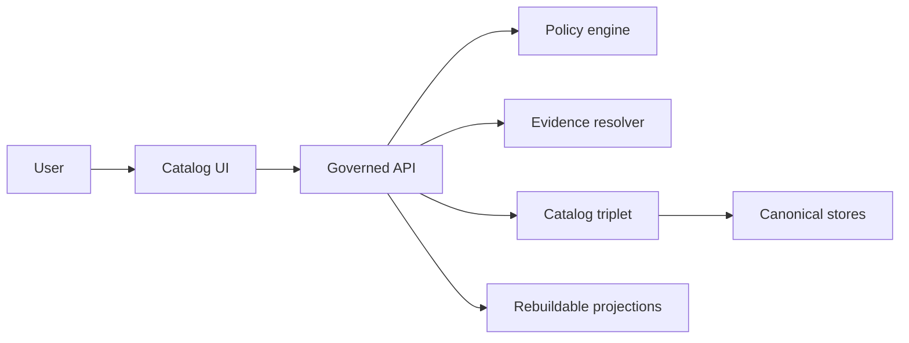
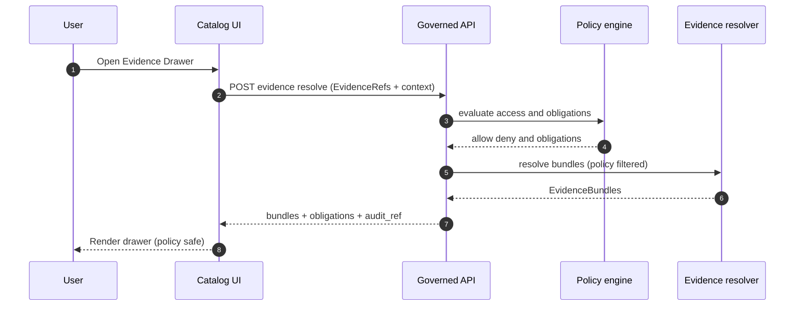

<!-- [KFM_META_BLOCK_V2]
doc_id: kfm://doc/0b957b54-102d-4e30-861c-61694d75a2dd
title: apps/catalog/src — Catalog UI source
type: standard
version: v1
status: draft
owners: TBD (UI) / TBD (Gov steward)
created: 2026-03-03
updated: 2026-03-03
policy_label: public
related:
  - apps/catalog/README.md
  - apps/ui/README.md
  - apps/api/src/api/README.md
  - packages/catalog/README.md
  - packages/ingest/README.md
tags: [kfm, catalog, ui]
notes:
  - Directory-level contract for Catalog UI source code.
  - Update directory tree + commands once scaffolding exists in-repo.
[/KFM_META_BLOCK_V2] -->

<a id="top"></a>

# `apps/catalog/src` — Catalog UI source

**Purpose:** Source code for the **Catalog UI**: dataset discovery + dataset-version transparency + evidence/provenance inspection as a **governed client**.

**Status:** draft • **Owners:** TBD • **Policy label:** `public` (this README)


> [!IMPORTANT]
> **This directory is UI source only.**
> - Catalog **generation/validation** belongs upstream (e.g., ingest + catalog tooling), not in the UI.
> - The UI must not bypass the governed API boundary (no direct DB/object storage access).

---

## Quick navigation

- [Purpose](#purpose)
- [Where this fits](#where-this-fits)
- [Directory contract](#directory-contract)
- [Non-negotiable invariants](#non-negotiable-invariants)
- [Architecture](#architecture)
- [Module responsibilities](#module-responsibilities)
- [Evidence Drawer integration](#evidence-drawer-integration)
- [Policy-safe UX rules](#policy-safe-ux-rules)
- [Directory layout](#directory-layout)
- [Testing and quality gates](#testing-and-quality-gates)
- [Local development](#local-development)
- [Minimum verification steps](#minimum-verification-steps)
- [Glossary](#glossary)

---

## Purpose

`apps/catalog/src/` holds the implementation for Catalog UI behaviors such as:

- dataset and version browsing (search, filter, sort)
- viewing DCAT/STAC/PROV-backed metadata (through the governed API)
- a consistent **Evidence Drawer** experience for “what is this layer/claim based on?”
- policy-aware rendering (labels, notices, and obligation explanations)

**Non-goal:** building catalogs, applying transformations, or enforcing policy decisions in the client.
The UI **displays** policy outcomes; the API **enforces** them.

[Back to top](#top)

---

## Where this fits

The Catalog UI is a **governed client surface**. Its data access posture is constrained by the **trust membrane**: all access crosses the governed API boundary.


```mermaid
flowchart LR
U[User] --> CUI[Catalog UI]
CUI --> API[Governed API]
API --> PE[Policy engine]
API --> ER[Evidence resolver]
API --> CAT[Catalog triplet]
CAT --> CAN[Canonical stores]
API --> IDX[Rebuildable projections]
```

[Back to top](#top)

---

## Directory contract

### Acceptable inputs

✅ OK in `apps/catalog/src/`:

- routes/pages, UI components, styling, client-side state
- typed API client code that implements the **governed API contract**
- evidence UI (drawer, citation chips, provenance panels)
- a11y and governance UX tests (policy notices, evidence resolution flows)

### Exclusions

❌ Not OK in `apps/catalog/src/`:

- ingestion, normalization, promotion, or catalog generation logic
- direct connections to storage/DB/search/tiles that bypass the governed API
- secrets, long-lived credentials, private keys, partner-restricted configs
- “shadow policy” logic meant to “improve UX” by inferring restricted details

> [!WARNING]
> If you add a new outbound network origin in the UI, treat it as a **trust membrane change**:
> route it through a governed adapter/API or reject it.

[Back to top](#top)

---

## Non-negotiable invariants

These must be enforceable by tests (fail closed):

1. **Governed client**
   - UI renders what the API returns.
   - UI never embeds privileged credentials.
   - UI never reads from canonical stores directly.

2. **Evidence-first UX**
   - Evidence Drawer is reachable from every dataset version view.
   - No “claim panels” without resolvable EvidenceRefs (or a fail-closed explanation).

3. **Policy-safe behavior**
   - Errors and empty states must not leak restricted existence via messaging or timing.
   - Redactions/generalizations are made visible via notices (no “silent restriction”).

4. **Contract stability**
   - API DTOs are schema-driven (don’t “guess” fields).
   - Breaking changes require versioned contracts and migration paths.

[Back to top](#top)

---

## Architecture

### Evidence resolution loop (UI view)


```mermaid
sequenceDiagram
autonumber
participant U as User
participant UI as Catalog UI
participant API as Governed API
participant PE as Policy engine
participant ER as Evidence resolver

U->>UI: Open Evidence Drawer
UI->>API: POST evidence resolve (EvidenceRefs + context)
API->>PE: evaluate access and obligations
PE-->>API: allow deny and obligations
API->>ER: resolve bundles (policy filtered)
ER-->>API: EvidenceBundles
API-->>UI: bundles + obligations + audit_ref
UI-->>U: Render drawer (policy safe)
```

### Design rule

The Catalog UI must be usable with **≤ 2 calls** to render evidence for a dataset/version view:
- 1 call to get page data (datasets / details)
- 1 call to resolve evidence references for the drawer

If more calls are required, treat it as a contract smell and push logic behind the governed API.

[Back to top](#top)

---

## Module responsibilities

A pragmatic module boundary map (update to match your actual structure):

| Module | Responsibility | Must NOT do |
|---|---|---|
| `api/` | typed client, DTO validation, stable error mapping | embed secrets; bypass API |
| `evidence/` | Evidence Drawer UI + EvidenceRef formatting/parsing helpers | enforce policy; fetch storage directly |
| `pages/` or `routes/` | route-level composition + loading states | implement business logic that belongs in API |
| `components/` | reusable UI primitives (cards, filters, tables) | leak restricted existence via “helpful hints” |
| `state/` | query state, URL state, caching | invent data; cache restricted data across roles |
| `policy/` | policy notice rendering + obligation explanation copy | decide policy outcomes |
| `styles/` | tokens, layout, theming | N/A |
| `__tests__/` | unit + integration + a11y smoke tests | rely on live network by default |

[Back to top](#top)

---

## Evidence Drawer integration

### EvidenceRef conventions

The UI should treat EvidenceRefs as **opaque identifiers** unless the contract explicitly defines a parseable structure.

Recommended behavior:
- display stable short forms (e.g., scheme + id)
- copy-to-clipboard citation snippets when allowed
- always resolve through `POST /api/v1/evidence/resolve` (or equivalent)

### Evidence Drawer minimum display contract

The drawer should display at minimum:

- bundle identifier + digest
- dataset version identifier
- license + rights holder + attribution text
- freshness/validation status (as returned by API)
- provenance chain links (run receipt/prov)
- artifacts (only if policy allows)
- obligations applied (generalization/redaction), with user-facing explanation
- `audit_ref` (for steward review and reproducibility)

[Back to top](#top)

---

## Policy-safe UX rules

1. **Fail closed, explain safely**
   - If evidence cannot be resolved: show a policy-safe explanation and offer next steps.
2. **No existence leaks**
   - Avoid UI branching that reveals restricted dataset presence (status codes, copy, timing).
3. **Make governance visible**
   - Always show license/attribution and policy label (public-safe form) if provided.
4. **Exports inherit policy**
   - Exports must include attribution + license and must be blocked if disallowed.
5. **Accessibility is part of governance**
   - Evidence Drawer must be keyboard navigable and screen-reader friendly.

[Back to top](#top)

---

## Directory layout

> [!NOTE]
> Replace this with the actual output of:
> `tree apps/catalog/src -L 3` (or equivalent) once scaffolding exists.

```text
apps/catalog/src/                                      # Catalog UI source: dataset discovery + provenance views with evidence-first trust surfaces and policy/obligation-aware UX
├─ README.md                                            # Directory contract + invariants (policy-safe rendering, cite-or-abstain UX, denial behavior, test expectations)
├─ pages/                                               # Page routing layer (or routes/ — TBD) defining navigable views and URL structure
│  ├─ catalog/                                          # Dataset discovery views (search, filters, facets, result lists; policy-aware visibility)
│  └─ datasets/                                         # Dataset + version detail views (metadata, provenance, receipts, obligations, export affordances)
├─ components/                                          # Reusable UI components (compose pages; keep business logic out)
│  ├─ catalog/                                          # Catalog-specific components (dataset cards, filter controls, tables, facets, sort/paging)
│  └─ shared/                                           # Shared primitives (buttons, layout, typography, forms, empty/error states, spinners)
├─ evidence/                                            # Evidence UX: user-facing proof paths for claims/metadata (trust surface)
│  ├─ EvidenceDrawer/                                   # Evidence drawer UI + renderers (bundles, citations, source previews, resolver status)
│  └─ refs/                                             # EvidenceRef formatting helpers (stable display strings, badges, link builders, safe truncation)
├─ api/                                                 # Client boundary: typed API access + schema-driven validation + policy-safe error handling
│  ├─ client.ts                                         # API client wrapper (fetcher, base URL, auth headers, request_id propagation, retries/backoff)
│  ├─ dtos/                                             # DTO types + validators (schema-driven decoding; reject unknown/unsafe shapes; fail-closed)
│  └─ errors.ts                                         # Stable error mapping (policy-safe messages, reason codes, denial UX helpers; no restricted inference)
├─ policy/                                              # Obligation/label UX: render policy notices and required user-facing obligations consistently
│  └─ PolicyNotice.tsx                                  # Obligation explanation component (show_notice, generalized, restricted, export blocked, etc.)
├─ state/                                               # State model for discovery (URL-driven queries, caching, and deterministic view-state)
│  └─ queryState.ts                                     # Filters + URL state + caching rules (canonical serialization; avoids hash drift; debounced fetch)
├─ styles/                                              # Styling primitives (tokens + globals) for consistent theming across trust surfaces
│  ├─ tokens.css                                        # Design tokens (TBD): colors/spacing/typography scales; keep stable for consistent UX
│  └─ globals.css                                       # App-wide styles (TBD): base resets, typography defaults, utility classes as needed
└─ __tests__/                                           # UI tests focused on trust surfaces and safe failure behavior (synthetic fixtures)
   ├─ evidenceDrawer.test.tsx                           # Tests evidence drawer behavior (rendering, resolver states, citation formatting, safe fallbacks)
   └─ policySafeErrors.test.ts                          # Tests policy-safe errors/denials (no restricted inference; consistent reason codes/messages)
```

[Back to top](#top)

---

## Testing and quality gates

### Must-pass checks for Catalog UI changes

- [ ] DTO/schema validation tests pass (no “guessing” fields)
- [ ] Evidence resolver integration test passes (representative EvidenceRef resolves)
- [ ] Policy-safe error model test passes (no existence leaks via copy/status branching)
- [ ] Accessibility smoke test: Evidence Drawer keyboard navigation works
- [ ] Export (if present) includes attribution + license automatically, and blocks when disallowed
- [ ] Link checks (if implemented) verify DCAT ↔ STAC ↔ PROV navigation surfaces are consistent (as returned by API)

### Test data rules

- fixtures must be tiny and synthetic
- do not commit restricted/sensitive coordinates
- do not commit “sample datasets” without explicit license/sensitivity metadata

[Back to top](#top)

---

## Local development

> [!IMPORTANT]
> Commands are placeholders until verified against this repo’s tooling.

```bash
# from repo root (TBD)
cd apps/catalog

# install (choose repo standard)
pnpm install   # or: npm ci | yarn install

# dev server (if this app exists as a runnable UI)
pnpm dev

# tests
pnpm test
```

Environment variables (placeholder names; confirm in code once implemented):

- `KFM_API_BASE_URL` — governed API base URL
- `KFM_BUILD_SHA` — optional build identity surfaced in “About”

[Back to top](#top)

---

## Minimum verification steps

If any part of this README is wrong, do these smallest checks and update it:

1. Confirm whether `apps/catalog` is a standalone UI app or folded into `apps/ui`.
2. Confirm the actual routing framework (`pages/` vs `routes/` vs `src/app/`) and update the tree.
3. Confirm the governed API endpoints used for catalog discovery and evidence resolution.
4. Confirm error mapping rules for policy-safe behavior (especially 403/404 alignment).
5. Replace placeholder commands/badges with real scripts and CI workflow links.

[Back to top](#top)

---

## Glossary

- **Governed client:** a UI that never bypasses the governed API and never decides policy.
- **EvidenceRef:** a resolvable reference used for citations and evidence drawer lookups.
- **EvidenceBundle:** policy-aware evidence payload returned by the resolver (renderable card + metadata).
- **Catalog triplet:** DCAT + STAC + PROV, treated as a contract surface between pipelines and runtime.
- **Trust membrane:** the boundary rule that forces all runtime access through governed APIs + policy enforcement.

---

Back to top ↑
