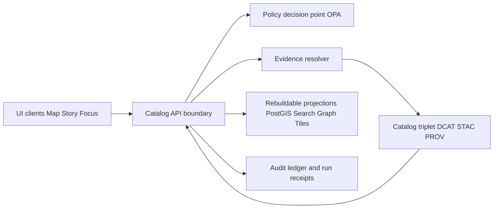

<!-- [KFM_META_BLOCK_V2]
doc_id: kfm://doc/5edda0aa-7e60-4c64-8065-9bfe36906f61
title: Catalog API
type: standard
version: v1
status: draft
owners: TODO
created: 2026-02-26
updated: 2026-02-26
policy_label: public
related:
  - docs/templates/TEMPLATE__API_CONTRACT_EXTENSION.md
  - docs/MASTER_GUIDE_v13.md
tags: [kfm, api, catalog, governance]
notes:
  - This README describes the API boundary inside apps/catalog/src/api. Confirm framework/router conventions in this repo and update “How to run” + directory layout accordingly.
[/KFM_META_BLOCK_V2] -->

# Catalog API
_Governed, contract-first API boundary for dataset discovery, STAC access, and evidence resolution._

**Path:** `apps/catalog/src/api/`  
**Status:** draft • **Owners:** TODO • **Policy label:** public


## Navigation
- [Purpose](#purpose)
- [Where this fits](#where-this-fits)
- [Non-negotiable invariants](#non-negotiable-invariants)
- [Minimal API surface](#minimal-api-surface)
- [Contract requirements](#contract-requirements)
- [Evidence resolution](#evidence-resolution)
- [Policy enforcement model](#policy-enforcement-model)
- [Directory layout](#directory-layout)
- [Testing and CI gates](#testing-and-ci-gates)
- [Change management](#change-management)
- [Back to top](#catalog-api)

## Related docs (expected repo paths)
- `docs/MASTER_GUIDE_v13.md` — repository governance + canonical pipeline ordering (contract-first / evidence-first)
- `docs/templates/TEMPLATE__API_CONTRACT_EXTENSION.md` — required template when adding/changing endpoints
- `docs/standards/` — DCAT/STAC/PROV profile docs (if present)
- `schemas/` — JSON Schemas for contracts, catalogs, and Story Nodes (if present)

## Purpose
This directory implements the **governed API boundary** for the Catalog experience:

- **Discover datasets and versions** (DCAT-backed)  
- **Query spatiotemporal assets** (STAC-backed)  
- **Resolve citations/evidence** into policy-checked, digest-pinned bundles (PROV/run-receipt backed)  
- **Emit audit references** for any governed operation (e.g., evidence resolution, Focus Mode, Story publish)

> NOTE  
> In KFM, catalogs are not “nice metadata.” They are a **contract surface** between pipelines and runtime.

## Where this fits
KFM’s end-to-end “truth path” is:

`Upstream → RAW → WORK/QUARANTINE → PROCESSED → CATALOG/TRIPLET → projections → Governed API → UI`

This folder is the **“Governed API”** node in that chain — the point where policy, versioning, redaction obligations, and evidence resolution are enforced consistently before anything reaches UI clients.

### Conceptual flow


## Non-negotiable invariants
These are architectural rules that keep the **trust membrane** intact:

1) **Clients never access storage/DB directly.** Everything goes through governed APIs that apply policy/redaction/logging.  
2) **Domain logic never talks directly to infrastructure.** It talks through interfaces/contracts.  
3) **Only promoted dataset versions are servable.** Runtime surfaces only serve versions with processed artifacts, validated catalogs, run receipts, and an assigned policy label.  
4) **Policy semantics match in CI and runtime.** If CI says “allowed,” runtime must agree (fixtures-driven).  
5) **Fail closed.** If we cannot prove a response is policy-safe + evidence-backed, we abstain or deny.

> WARNING  
> “Metadata-only reference” is allowed when rights don’t permit mirroring assets — but downloads/exports must still enforce rights and attribution.

## Minimal API surface
The KFM v1 “buildable minimum” endpoint set includes:

| Endpoint | Purpose | Notes |
|---|---|---|
| `GET /api/v1/datasets` | Dataset discovery | DCAT-backed; policy filtering server-side |
| `GET /api/v1/stac/collections` | STAC Collections | Policy filtering before returning assets |
| `GET /api/v1/stac/items` | STAC Items | Supports bbox/time/collection queries |
| `POST /api/v1/evidence/resolve` | Evidence resolution | Resolve EvidenceRef → EvidenceBundle; fail closed if unauthorized/unresolvable |
| `GET/POST /api/v1/story` | Story Nodes | Versioned; publishing requires citations + review |
| `POST /api/v1/focus/ask` | Focus Mode Q&A | Must cite or abstain; returns audit_ref |
| `GET /api/v1/lineage/status` | Freshness/health | Feeds UI trust badges |
| `GET /api/v1/lineage/stream` | Lineage stream | (Optional) for near-real-time monitoring |
| `GET /api/v1/tiles/...` | Tile delivery | Only policy-safe tiles; cache varies by auth/policy |
| `GET /assets/pmtiles/...` | PMTiles bundles | Prefer static hosting when possible (policy-gated or public-only) |

> TIP  
> Treat this list as the “contract target.” Your actual router/framework may differ (Next.js route handlers vs Express/Fastify), but the **surface behavior** must match.

## Contract requirements
Every endpoint in this directory must meet these contract requirements:

### Response envelope fields
Whenever applicable, responses should include:

- `dataset_version_id`
- `policy_label` (public-safe)
- artifact `digest` values (when returning or linking artifacts)
- `audit_ref` for governed operations (evidence resolution, focus, story publish, etc.)

### Error model
Errors must use a stable, policy-safe model:

- `error_code`
- `message` (policy-safe; do not leak restricted existence)
- `audit_ref`
- optional remediation hints

Example (policy-safe) error payload:
```json
{
  "error_code": "POLICY_DENY",
  "message": "Restricted evidence is not available to your role.",
  "audit_ref": "kfm://audit/entry/123",
  "remediation": [
    "Try a public dataset.",
    "Broaden your time range.",
    "Contact a steward for access."
  ]
}
```

> IMPORTANT  
> Avoid “ghost metadata.” 403 vs 404 behavior must be designed so callers cannot infer restricted existence unless policy explicitly allows.

### Versioning policy
- Freeze `/api/v1` semantics; add only backwards-compatible fields.
- Introduce `/api/v2` only for breaking changes.
- Version your schemas (DCAT/STAC/PROV profiles) independently from the API route version.

## Evidence resolution
Evidence resolution is central: the resolver accepts an **EvidenceRef** (or structured reference), applies policy, and returns an **EvidenceBundle** that UI components can render in ≤ 2 calls.

An EvidenceBundle should contain:
- bundle digest/id
- dataset + dataset_version_id
- policy decision + obligations applied (redactions/generalizations)
- license + attribution text
- provenance pointers (run_id / receipt)
- artifact list (hrefs and digests) — *only if policy allows*
- validation signals (catalog_valid, links_ok, etc.)
- `audit_ref`

Example response shape (illustrative, not canonical):
```json
{
  "bundle_id": "sha256:…",
  "dataset_version_id": "2026-02.abcd1234",
  "title": "Example evidence bundle",
  "policy": {
    "decision": "allow",
    "policy_label": "public",
    "obligations_applied": []
  },
  "license": {
    "spdx": "CC-BY-4.0",
    "attribution": "Source organization"
  },
  "provenance": { "run_id": "kfm://run/…" },
  "artifacts": [
    { "href": "processed/…/events.parquet", "digest": "sha256:…", "media_type": "application/x-parquet" }
  ],
  "checks": { "catalog_valid": true, "links_ok": true },
  "audit_ref": "kfm://audit/entry/123"
}
```

### Story publishing gate
If this app participates in Story Node publishing:

- **Publishing MUST be blocked** if any cited EvidenceRef fails to resolve through the evidence resolver.

## Policy enforcement model
### Policy-as-code architecture
Recommended pattern:

- **PDP (Policy Decision Point):** OPA (in-process or sidecar)
- **PEPs (Policy Enforcement Points):**
  - CI: schema validation + policy tests block merges
  - Runtime API: policy checks before serving data
  - Evidence resolver: policy checks before resolving evidence and rendering bundles
  - UI: displays badges/notices; **never makes policy decisions**

### Default rules (baseline posture)
- Default deny for restricted or sensitive-location datasets.
- If any public representation is allowed, publish a separate `public_generalized` dataset version.
- Never leak restricted metadata through error differences or payload fields.
- Treat redaction/generalization as a first-class transform recorded in PROV.

### Audit + observability
Every governed operation must emit a log record that includes at minimum:

- who (principal, role)
- what (endpoint, parameters)
- when (time)
- why (purpose, if declared)
- inputs/outputs (by digest)
- policy decisions (allow/deny, obligations, reason codes)

> NOTE  
> Audit logs are themselves sensitive. Apply log redaction + retention policy.

## Directory layout
Because repo conventions vary, treat the following as a **PROPOSED** layout that you should align to existing patterns in this codebase:

```text
apps/catalog/src/api/
├── README.md                      # you are here
├── routes/                        # route declarations (or Next.js route handlers)
├── handlers/                      # request handlers/controllers (thin)
├── dto/                           # request/response DTOs (runtime validation)
├── contracts/                     # OpenAPI/GraphQL schemas and fixtures
├── policy/                        # PEP helpers, policy client, obligation applicators
├── evidence/                      # evidence resolver client + EvidenceRef parsing
├── services/                      # use-case services (thin; calls domain modules)
├── adapters/                      # gateways to catalog stores/indexes via interfaces
├── errors/                        # stable error model + mapping
└── __tests__/                     # contract + integration tests
```

### What belongs here
- HTTP boundary code: routes, handlers, DTO validation, contract tests
- Policy enforcement hooks (PEP) and obligation application (e.g., geometry generalization wrappers)
- Evidence resolution orchestration (calling resolver, shaping bundles)
- API-level caching strategy (keyed by policy/auth where relevant)

### What must NOT live here
- Direct DB/storage access that bypasses repositories/adapters
- Domain rules (keep in domain modules)  
- One-off scripts, notebooks, or data dumps  
- Secrets, tokens, private keys, credentials  
- “Convenience” endpoints that return ungoverned/raw artifacts

## How to run locally (TODO: confirm repo conventions)
Because `apps/catalog/` often lives in a monorepo, the exact dev commands depend on your workspace tooling.
Update this section with the real commands once confirmed.

1. Install dependencies (choose the repo’s package manager):
   - `pnpm install` _or_ `npm install` _or_ `yarn install`
2. Start the app/API in dev mode:
   - `pnpm dev` _or_ `npm run dev` _or_ `yarn dev`
3. Smoke test (update host/port as needed):
   - `curl http://localhost:<PORT>/api/v1/datasets`

> NOTE  
> If your API requires auth, provide a policy-safe “public mode” smoke test (e.g., calling a public-only endpoint or using mocked fixtures).

## Testing and CI gates
Minimum test categories to keep this boundary trustworthy:

- Unit tests: error mapping, DTO validation, policy obligation application
- Schema tests: DCAT/STAC/PROV profile validation (fixtures)
- Policy tests: fixture-driven allow/deny/obligation outcomes
- Contract tests: OpenAPI schema diff + endpoint response validation
- Integration tests: evidence resolver resolves sample refs for public + restricted cases

> TIP  
> Make policy + contract tests merge-blocking. If CI and runtime diverge, CI guarantees are meaningless.

## Change management
### Adding/changing an endpoint (checklist)
- [ ] Update the API contract (OpenAPI/GraphQL) and include examples/fixtures.
- [ ] Add/extend policy fixtures for allow/deny/obligations.
- [ ] Add contract tests that prove public + restricted behaviors.
- [ ] Ensure responses include required envelope fields (`policy_label`, `audit_ref`, etc.).
- [ ] Verify error behavior does not leak restricted existence (“ghost metadata”).
- [ ] Update this README if the endpoint changes developer ergonomics.

### Data-release boundary reminders
If an endpoint serves dataset content (not just metadata), it must:
- Reference **promoted** dataset versions only
- Prefer digests over mutable URLs
- Provide license + attribution automatically for exports/downloads

---

<details>
<summary>Appendix: Quick “abstain” patterns (UI-safe)</summary>

When policy denies or evidence cannot be resolved, return a policy-safe message and an audit_ref:

- “Restricted evidence not available to your role.”
- “This item cannot be shown publicly.”
- “Insufficient evidence to answer safely.”

Never return subtle differences that allow callers to infer the existence of restricted records.

</details>

[Back to top](#catalog-api)
