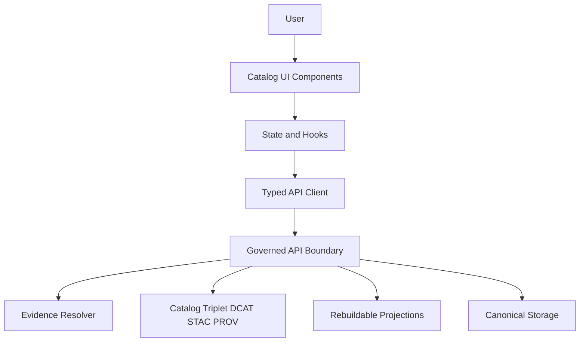

<!-- [KFM_META_BLOCK_V2]
doc_id: kfm://doc/5306143f-d942-4de5-8df5-35805f8b08f9
title: Catalog UI Components
type: standard
version: v1
status: draft
owners: TBD
created: 2026-02-26
updated: 2026-02-26
policy_label: public
related:
  - apps/catalog/README.md
  - apps/catalog/src/README.md
tags: [kfm, ui, catalog, components]
notes:
  - Directory README for reusable UI components in the Catalog app.
  - Keep the directory tree + component registry in sync with code changes.
[/KFM_META_BLOCK_V2] -->

# Catalog UI Components
Reusable, governed UI building blocks for the **Catalog** application surfaces (Map · Story · Focus).


> **NOTE**
> This README is intentionally **conservative** about repo specifics. If you move files, change tooling, or rename exports,
> update the “Directory layout” and “Component registry” sections immediately.

---

## Navigation
- [Purpose](#purpose)
- [Where this fits](#where-this-fits)
- [Acceptable inputs](#acceptable-inputs)
- [Exclusions](#exclusions)
- [Directory layout](#directory-layout)
- [Component registry](#component-registry)
- [Trust surfaces and governance rules](#trust-surfaces-and-governance-rules)
- [Accessibility](#accessibility)
- [Testing](#testing)
- [Adding a new component](#adding-a-new-component)
- [Common anti-patterns](#common-anti-patterns)
- [References](#references)

---

## Purpose
This directory contains **reusable UI components** used by the Catalog app. Components here should be:
- **Composable** (small, focused, predictable inputs/outputs)
- **Governed-by-construction** (surface policy + evidence instead of hiding it)
- **Safe defaults** (fail closed, render “restricted/unavailable” states explicitly)

---

## Where this fits
KFM’s UI is a *trust surface*: it makes policy, provenance, and evidence visible, but **does not** make policy decisions.



### Design invariants
- **Trust membrane:** UI components must never read directly from storage/DB; access flows through governed APIs.
- **Evidence-first UX:** layers, claims, and UI outputs should open into evidence (version, license/rights, policy label, provenance, checksums).
- **Cite-or-abstain alignment:** when a view cannot be backed by resolvable evidence (or is unauthorized), the UI should **abstain** or reduce scope.

---

## Acceptable inputs
✅ Things that belong in this directory:
- React components (presentational or container components) that are used in multiple screens/routes within the Catalog app
- “Trust surface” widgets (policy badges, evidence viewers, provenance summaries, restricted-state notices)
- Component-local assets (CSS modules, small icons) **scoped to the component**
- Component-level tests and Storybook stories (if Storybook is used in this repo)

---

## Exclusions
🚫 Things that must *not* live here:
- Direct calls to storage endpoints, object-store URLs, database queries, or “secret” backdoors
- Business logic that belongs in domain modules, API clients, or shared services
- Ad-hoc data transforms that should be handled upstream (pipelines) or in governed APIs
- Large binary assets (put in the appropriate static/public asset location)
- Any component that requires embedding precise sensitive locations or restricted metadata in the UI

---

## Directory layout

### Current tree (fill in from repo)
Run:

```bash
# from repo root
tree apps/catalog/src/components -L 3
```

…and paste/update the snapshot below.

```text
apps/catalog/src/components/
├── README.md
└── TODO__REPLACE_WITH_REAL_TREE.txt
```

### Recommended layout (proposed)
If you are adding new components and there is no established pattern yet, prefer:

```text
apps/catalog/src/components/                           # UI component library for Catalog app (governed, reusable)
├── README.md                                          # Component conventions, patterns, and governance notes
├── index.ts                                           # Public exports barrel (stable API surface)
├── _shared/                                           # Shared types + helpers for components
│   ├── types.ts                                       # Shared component/DTO/view-model typings
│   └── testUtils.tsx                                  # Shared test helpers (render wrappers, providers, mocks)
└── <ComponentName>/                                   # Single component folder (one responsibility)
    ├── <ComponentName>.tsx                             # Component implementation (typed props, accessible by default)
    ├── <ComponentName>.module.css                      # Scoped styles (CSS modules)
    ├── <ComponentName>.test.tsx                        # Component tests (behavior + a11y + edge cases)
    ├── <ComponentName>.stories.tsx                     # Storybook stories (states, variants, fixtures)
    └── README.md                                       # Usage, props, examples, and governance/evidence expectations
```

> **TIP**
> Keep component folders small. If a component grows beyond ~300–500 LOC, consider splitting it into subcomponents.

---

## Component registry
Maintain this table as the **human index** for what exists here and why.

| Component / Folder | Category | Used by | Evidence / Policy touchpoint | Owner | Notes |
|---|---|---|---|---|---|
| `TODO` | `TODO` | `TODO` | `TODO` | `TODO` | Replace with real entries |

Suggested categories:
- `trust-surface` (policy badge, restricted notice, evidence viewer/drawer)
- `catalog` (dataset cards, filters, coverage summaries)
- `map` (layer list, timeline controls, feature inspect panels)
- `story` (citation blocks, story node viewers)
- `shared` (layout, formatting, skeletons/spinners)

---

## Trust surfaces and governance rules
These rules exist to preserve KFM’s **evidence-first** posture.

### 1) UI never makes policy decisions
- The UI may **display** policy labels/badges and show obligations (e.g., “generalized to 1 km”), but it should not decide “allow vs deny”.
- If a user is unauthorized, render a **policy-safe** message and provide a path to request access (if that workflow exists).

### 2) Evidence is always one click away
Any UI element that implies a claim (a layer, a statistic, a highlighted feature, a story citation) should link to an evidence view:
- dataset version id
- license/rights + attribution
- policy label + obligations
- provenance/run receipt reference
- artifact digests/checksums (where applicable)

### 3) Fail closed in the UI
When evidence cannot be resolved or validation fails:
- Show an “Untrusted / Unverified” state
- Avoid partial renderings that look authoritative
- Prefer “Not available” over guessing

### 4) Avoid sensitive-location leakage
- Do not render precise coordinates for restricted or sensitive data.
- Do not “infer” sensitive existence through different error messages or UI states (align forbidden vs not-found UX where required).

### 5) Security guardrails for rendering evidence
When displaying externally sourced text/HTML/links:
- Do **not** use `dangerouslySetInnerHTML` (unless sanitized and explicitly approved).
- External links must use `rel="noopener noreferrer"` and open in a new tab/window.

---

## Accessibility
Minimum expectations for components in this directory:
- Keyboard navigation works (including drawers, layer lists, and modal dialogs)
- Proper semantic headings/landmarks (screen-reader friendly)
- Focus order is predictable; focus is trapped in modals/drawers
- Color contrast meets WCAG targets (confirm using your existing tooling)

> **NOTE**
> If a component is a “trust surface” (evidence, policy, provenance), accessibility is not optional — it is part of trust.

---

## Testing
Follow the repo’s established testing stack (Jest/Vitest + Testing Library, etc.).

Minimum recommended tests:
- **Unit tests** for render + state transitions (especially restricted/unavailable states)
- **Contract-ish tests** for evidence bundle rendering (valid vs invalid payloads)
- **A11y checks** for common interactive components (drawer/modals/forms)

Example test naming convention (adjust to repo standards):
```text
<ComponentName>.test.tsx
<ComponentName>.a11y.test.tsx
```

---

## Adding a new component
Use this checklist for PRs that add or significantly change components.

### Definition of Done (component PR)
- [ ] Component has a clear purpose and is placed in the correct category
- [ ] Props are typed and documented (JSDoc or component README)
- [ ] “Restricted / unavailable / unverified” states are explicit and tested
- [ ] No direct storage/DB access; API access is via the governed API client
- [ ] Evidence link/view is present where the component implies a claim
- [ ] Keyboard + screen-reader basics work (tab order, focus, labels)
- [ ] Tests added/updated (including at least one negative case)
- [ ] Registry row added/updated in this README

---

## Common anti-patterns
- ❌ “Quick” fetch to a raw dataset URL because it’s “faster”
- ❌ Rendering policy-unsafe details (precise coordinates, restricted metadata) in tooltips
- ❌ Hiding validation failures (silently dropping fields and showing the rest)
- ❌ UI logic that attempts to replicate backend policy logic
- ❌ Copy-paste components that drift (prefer shared components + clear ownership)

---

## References
These links are expected to exist somewhere in the repo; update if paths differ:
- `docs/MASTER_GUIDE_v13.md` (system overview, invariants, and repo map)
- `docs/templates/TEMPLATE__API_CONTRACT_EXTENSION.md` (how to evolve API shapes safely)
- `docs/templates/TEMPLATE__STORY_NODE_V3.md` (story/citation requirements)

---

<a id="back-to-top"></a>
**Back to top:** [Navigation](#navigation)
