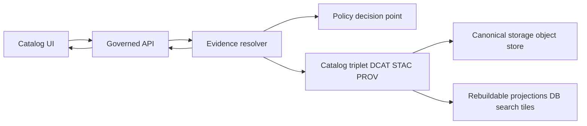

<!-- [KFM_META_BLOCK_V2]
doc_id: kfm://doc/5f5b7a1a-7ff0-4acb-9c7c-6ef0d7c2f98d
title: Evidence module (Catalog app)
type: standard
version: v1
status: draft
owners: TODO
created: 2026-02-26
updated: 2026-02-26
policy_label: internal
related:
  - kfm://doc/kfm-gdg-2026-02-20
tags: [kfm, catalog, evidence]
notes:
  - Evidence-first UX depends on deterministic, policy-governed evidence resolution.
[/KFM_META_BLOCK_V2] -->

# Evidence (Catalog App)

**Purpose:** Convert *EvidenceRefs* into *policy-governed EvidenceBundles* and render them as user-facing trust surfaces (Evidence Drawer, citations, attribution).


**Jump to:** [What this is](#what-this-is) • [How it fits](#how-it-fits-in-kfm) • [Contracts](#contracts-and-data-shapes) • [Evidence drawer](#evidence-drawer-ux-contract) • [CI gates](#ci--gates) • [Directory standard](#directory-standard-what-belongs-here) • [Contributing](#contributing)

> [!IMPORTANT]
> This module is part of the **trust membrane**: *clients do not access storage directly*. Evidence must be resolved through a governed API that applies policy and returns policy-safe results.

---

## What this is

This directory is the **Catalog app’s evidence integration layer**, intended to support:

- **Evidence resolution**: take one or more `EvidenceRef` strings and resolve them to an `EvidenceBundle`.
- **Evidence UX**: render evidence “cards” (dataset version, provenance/run receipt links, artifact links, rights/license, policy notices).
- **Citation reliability**: support “cite-or-abstain” surfaces by making “citation resolves ✅ / fails ❌” a **hard gate** in CI and in story publishing flows.

### Truth status tags used in this README

- **CONFIRMED (design):** statements anchored in the KFM design/governance docs.
- **PROPOSED (design):** suggested patterns that may not be implemented yet.
- **UNKNOWN (repo):** requires checking the actual code in this directory.

This README is written to be useful even when **repo state is UNKNOWN**; treat anything under “UNKNOWN” as a TODO verification.

---

## How it fits in KFM

KFM treats evidence resolution as central: evidence drawers, Story Nodes, and Focus Mode all route through the same evidence contract.



### Responsibilities split

| Layer | Must do | Must NOT do |
|---|---|---|
| UI (this module) | Render evidence + policy outcomes; show attribution; show “why” in policy-safe terms | Make policy decisions; infer restricted existence; fetch directly from storage/DB |
| Governed API | Enforce policy; resolve refs; return bundles; return policy-safe errors | Let clients bypass policy; leak restricted metadata in errors |
| Evidence resolver (backend concept) | Apply policy and produce a bundle with cards + machine metadata + digests + audit refs | Return restricted artifacts to unauthorized roles; “best-effort” partial results without clear fail semantics |

---

## Core concepts

### EvidenceRef

An **EvidenceRef** is an *opaque reference string* carried by UI interactions, citations, and/or story claims. The only supported interpretation is via the evidence resolver.

**Illustrative kinds** (do not assume all are implemented in this repo):

- `dcat://...` (dataset record / distribution)
- `stac://...` (collection / item / asset)
- `prov://...` (activity/run provenance)
- `doc://...` (governed docs)
- `graph://...` (lineage graph slice)
- `url://...` (**discouraged**; should be wrapped into governed evidence if possible)

> [!NOTE]
> “Free-floating” features/claims without evidence are not allowed in Story Nodes. If evidence is unavailable, the feature/claim should be treated as **uncited**.

### EvidenceBundle

An **EvidenceBundle** is the resolved, policy-governed package returned to the UI.

- **Human-facing:** renderable “cards” and user-facing policy notices
- **Machine-facing:** digests, dataset_version_id, provenance links, rights metadata, audit refs
- **Governance:** bundles are intended to be immutable by digest; they must not include restricted artifacts for unauthorized users

---

## Contracts and data shapes

> [!TIP]
> Treat contracts as **schema-first**. The safest pattern is to generate types from OpenAPI/JSON Schema and validate at runtime where needed.

### API entrypoint (illustrative)

- `POST /api/v1/evidence/resolve`
  - Input: `EvidenceResolveRequest { refs: string[] }`
  - Output: `EvidenceBundle[]` or an error with an `audit_ref`

### Minimal request/response examples (illustrative)

```json
{
  "refs": [
    "dcat://noaa_ncei_storm_events@2026-02.abcd1234",
    "prov://run/2026-02-20T12:00:00Z.abcd"
  ]
}
```

```json
{
  "bundle_id": "sha256:bundle...",
  "dataset_version_id": "2026-02.abcd1234",
  "title": "Storm event record: 2026-02-19",
  "policy": {
    "decision": "allow",
    "policy_label": "public",
    "obligations_applied": []
  },
  "license": { "spdx": "CC-BY-4.0", "attribution": "Source org" },
  "provenance": { "run_id": "kfm://run/2026-02-20T12:00:00Z.abcd" },
  "artifacts": [
    {
      "href": "processed/events.parquet",
      "digest": "sha256:2222",
      "media_type": "application/x-parquet"
    }
  ],
  "checks": { "catalog_valid": true, "links_ok": true },
  "audit_ref": "kfm://audit/entry/123"
}
```

### Policy object (expected behavior)

The UI must treat the policy result as authoritative:

- `decision: allow|deny`
- `policy_label: public|public_generalized|restricted|...`
- `obligations: []` (render as notices + “what was changed”)

> [!WARNING]
> Errors must be **policy-safe**. Do not display “ghost metadata” (e.g., “dataset X exists but you can’t access it”) unless the policy explicitly allows revealing that.

---

## Evidence Drawer UX contract

The evidence drawer is a required trust surface that should be accessible from:

- Layer panel (dataset version per layer)
- Feature inspect (attributes + evidence refs)
- Story claims (inline citations)
- Focus Mode (citations list)

### Required minimum fields

The drawer should display, at minimum:

1. Evidence bundle ID + digest
2. DatasetVersion ID + dataset name
3. License and rights holder (with attribution text)
4. Freshness (last run timestamp) and validation status
5. Provenance chain (run receipt link)
6. Artifact links (**only if policy allows**)
7. Redactions / generalizations applied (obligations), with user-facing explanation

### Accessibility requirements (non-optional)

- Keyboard navigation for drawer open/close and within cards
- No color-only meaning for policy badges
- Safe markdown rendering for narrative text (sanitized)

---

## CI / Gates

This module participates in the primary “anti-hallucination gate”:

### Citation verification (must fail closed)

CI should validate citations by:

- Syntax check for EvidenceRefs
- Resolver check (in a test environment)
- Policy check (citations are allowed for the intended policy label)
- Rights check (media requires rights metadata)

A Story Node should not merge (or publish) if citations do not resolve.

### Test categories to expect (design)

- Unit tests (parsing, canonicalization helpers, controlled vocab validation)
- Schema tests (OpenAPI/JSON Schema shapes)
- Policy tests (fixture-driven allow/deny/obligations)
- Integration tests (resolver resolves sample refs end-to-end)
- E2E UI tests (layer -> evidence drawer -> shows attribution; story -> citations resolve)

---

## Directory standard: what belongs here

### Where it fits in the repo

`apps/catalog/src/evidence/` is part of the **Catalog** app. It should contain **only** evidence-related UI + client logic.

### Acceptable inputs

Examples of what is appropriate to place here:

- EvidenceRef parsing/validation helpers (client-side)
- API client(s) for evidence resolution (governed API only)
- Evidence Drawer UI components (cards, policy notices, attribution blocks)
- DTOs/types generated from the governed API contract (or hand-authored with schema tests)
- Test fixtures for evidence rendering and policy notices

### Exclusions (do NOT put here)

- Direct calls to storage (S3/GCS/filesystem) or databases
- Any “policy engine” logic (OPA/Rego evaluation belongs server-side)
- Ad-hoc fetching of external URLs as “evidence”
- Story authoring logic unrelated to evidence/citations
- Secrets, tokens, or credential material

### Suggested directory tree (UNKNOWN in repo; update once verified)

```text
apps/catalog/src/evidence/
  README.md
  client/                 # fetch wrappers for /api/v1/evidence/resolve (TODO confirm)
  components/             # EvidenceDrawer, EvidenceCard, PolicyBadge (TODO confirm)
  model/                  # EvidenceRef, EvidenceBundle types (TODO confirm)
  __tests__/              # unit + rendering tests (TODO confirm)
```

---

## Contributing

### When you add a new evidence “card”

1. Define the card’s **data contract** (what fields are required, what can be absent under deny).
2. Add at least:
   - a **valid** fixture
   - an **invalid** fixture (missing required fields)
3. Add rendering + a11y tests
4. Confirm policy notices render correctly for:
   - `public`
   - `public_generalized` (obligation notice shown)
   - `restricted` (deny posture; policy-safe messaging)

### Definition of Done

- [ ] No direct storage/DB calls introduced
- [ ] Evidence drawer renders required minimum fields
- [ ] Policy-safe errors verified (no restricted leakage)
- [ ] Citation verification test(s) added or updated
- [ ] A11y checks pass for drawer interactions

---

## FAQ

### Why can’t the UI “just link to the file”?

Because evidence is **governed**: policy, licensing, and redaction obligations must be applied consistently before exposing artifacts.

### What should the UI do on deny?

- Show a policy-safe reason (“evidence not available for your role”)
- Provide an `audit_ref` so stewards can review
- Suggest safe alternatives (different time window, public datasets)

### How many calls should evidence resolution take?

Design goal: the UI should be able to resolve and render evidence in **≤ 2 calls** (batch refs where possible).

---

<details>
<summary>Appendix: Practical examples</summary>

### Example: batching refs to reduce chattiness

```json
{ "refs": ["stac://...", "prov://...", "dcat://..."] }
```

### Example: “uncited” behavior (UI)

- Render a neutral “Uncited” badge
- Block Story Node publish until evidence exists (or the claim is removed)

</details>

---

**Back to top:** [Evidence (Catalog App)](#evidence-catalog-app)
