<!-- [KFM_META_BLOCK_V2]
doc_id: kfm://doc/31c08e63-4c99-47ec-ac2e-8224fb369392
title: apps/catalog/src/pages
type: standard
version: v1
status: draft
owners: UI/Frontend (TBD)
created: 2026-02-26
updated: 2026-02-26
policy_label: public
related:
  - TODO: link-to-router-entry (e.g., apps/catalog/src/router.*)
  - TODO: link-to-api-client-layer (e.g., apps/catalog/src/api/*)
  - TODO: link-to-evidence-drawer-component (shared)
tags: [kfm, ui, catalog, pages]
notes:
  - This README is a directory contract + build checklist for route-level pages.
  - Replace TODO placeholders once the actual router + API contracts are confirmed in-repo.
[/KFM_META_BLOCK_V2] -->

# `apps/catalog/src/pages`

> Route-level **page components** for the Catalog web app: map-first, time-aware, and governed UI surfaces.

**Status:** draft • **Owners:** UI/Frontend (TBD) • **Scope:** route pages only • **Policy label:** public

[](#)
[](#)
[](#)
[](#)

---

## Quick navigation

- [Purpose](#purpose)
- [Where this fits](#where-this-fits)
- [Directory contract](#directory-contract)
- [Non-negotiables](#non-negotiables)
- [Page template](#page-template)
- [Add a new page](#add-a-new-page)
- [Pages registry](#pages-registry)
- [Testing checklist](#testing-checklist)
- [Appendix: Evidence bundle cheat-sheet](#appendix-evidence-bundle-cheat-sheet)

---

## Purpose

This folder holds **route-level pages** (aka “screens”) for the Catalog UI. Pages:

- coordinate layout and page-level state
- call the **governed API boundary** (never direct databases / object stores)
- surface “trust UI” (policy badge, dataset version, evidence link, provenance link)
- fail closed: if rights/citations are unclear, show safe fallback states instead of guessing

---

## Where this fits

**Typical layering** (conceptual; update to match the repo):

- `pages/` = route-level containers
- shared UI lives elsewhere (e.g., `components/`, `ui/`)
- API clients live elsewhere (e.g., `api/`, `services/`)
- domain logic belongs outside the UI (do not bury policy / provenance rules inside pages)

### Trust membrane view (what pages may and may not do)

```mermaid
flowchart TB
  subgraph Browser
    Page[Route page] --> View[UI layout]
    Page --> ApiClient[API client]
    Page --> Drawer[Evidence drawer]
  end

  subgraph Backend
    ApiClient --> GovAPI[Governed API]
    GovAPI --> Policy[Policy evaluation]
    GovAPI --> Evidence[Evidence resolver]
  end

  subgraph Canonical
    Evidence --> CatalogTriplet[Catalog triplet]
    Evidence --> Artifacts[Promoted artifacts]
    Evidence --> Audit[Run receipts]
  end
```



> NOTE: The router entrypoint is intentionally not referenced by filename here because it is **not confirmed in-repo**. Add a real link once you locate it.

---

## Directory contract

### ✅ What belongs here

- Page components that map to a route (e.g., `/catalog`, `/datasets/:id`)
- Page-scoped layout components (only if they are not reusable elsewhere)
- Page-scoped hooks for composing view state (thin wrappers; keep business logic out)
- Route loaders / data-fetch helpers (if your router supports this pattern)

### 🚫 What must NOT go here

- Reusable UI primitives (buttons, modals, form controls) → put in shared UI folders
- API client implementations → keep in a dedicated API/service layer
- Domain logic (policy rules, provenance interpretation, redaction algorithms)
- Secrets, credentials, direct DB access, direct object-store URLs
- “General chatbot” experiences (Focus Mode is governed evidence Q&A, not open chat)

---

## Non-negotiables

These are platform invariants that pages must uphold (treat as merge-blocking requirements):

1. **Trust membrane**
   - Pages **must not** access databases/object storage directly.
   - Pages **must** go through the governed API boundary.

2. **Evidence-first UX**
   - Every dataset-backed view must offer a way to open an evidence view that includes:
     dataset version, license/rights, policy label + obligations, provenance/run receipt, and artifact links/checksums.
   - The evidence drawer is a primary trust surface (not “nice to have”).

3. **Cite-or-abstain Focus Mode**
   - If this app includes a Focus Mode page, it must only answer from resolvable evidence bundles or abstain.

4. **Policy labels + obligations**
   - Treat policy as more than allow/deny:
     - “allow” may still require obligations (generalization/redaction steps)
     - “deny” must be handled with a safe UX (no leaking through errors or cached views)

---

## Page template

A minimal page should:

- read route params
- call the API layer
- render a policy-aware UI state machine (loading → ready → denied/not-found)
- attach evidence/provenance affordances

```tsx
// PSEUDOCODE — adapt imports + routing to this repo

export function ExamplePage() {
  // 1) Parse route params (id, bbox, time window, etc.)
  // 2) Fetch from governed API (never direct DB/object store)
  // 3) Render: policy badge + dataset version + evidence drawer entrypoint
  // 4) Fail closed on policy deny / missing evidence

  return null;
}
```

---

## Add a new page

1. **Create the page component**
   - File location: `apps/catalog/src/pages/<YourPage>/...`
   - Naming: `<Thing>Page.tsx` (or match existing convention)

2. **Register the route**
   - Update the router config (TODO: link once known)

3. **Wire to governed APIs**
   - Prefer calling a typed API client wrapper rather than `fetch()` ad-hoc
   - Ensure request paths are consistent with the API contract

4. **Add evidence affordance**
   - If the page renders dataset-backed content, it must link to evidence resolution:
     - an `EvidenceRef` → `EvidenceBundle`
     - show policy badge + obligations (when present)

5. **Update the pages registry**
   - Add a row to [Pages registry](#pages-registry)

### Definition of done (DoD)

- [ ] Page does **not** call DB/object storage directly (only governed APIs)
- [ ] Page surfaces dataset version + policy badge for dataset-backed views
- [ ] Evidence drawer/route exists for every dataset-backed chart/map/table
- [ ] Deny/not-found/unresolvable states are safe and user-comprehensible
- [ ] Tests added/updated (see [Testing checklist](#testing-checklist))

---

## Pages registry

> TODO: Replace placeholder rows with actual pages discovered in this folder.

| Route | Page component | Primary API calls | Evidence surface | Notes |
|---|---|---|---|---|
| `/catalog` | `TODO` | `GET /api/v1/catalog/datasets` (illustrative) | list item → evidence drawer | dataset discovery |
| `/datasets/:datasetVersionId` | `TODO` | `GET /api/v1/datasets/{dataset_version_id}/query` (illustrative) | evidence drawer + provenance panel | slice/query view |
| `/focus` | `TODO` | `POST /api/v1/focus/ask` (illustrative) | citations verified or abstain | governed Q&A |

---

## Testing checklist

At minimum, changes in this folder should be covered by:

- **Unit tests** for page-level state machines (loading/ready/denied)
- **Contract-ish tests** (mocked API layer) for evidence resolution flows
- **E2E tests** for navigation + “trust UI” (policy badge + evidence open)
- **Network assertions**: requests go only to the governed API origin/proxy

> TIP: If your repo has an E2E harness (e.g., Playwright), prefer to assert that the browser never requests DB/object-store URLs directly.

---

## Appendix: Evidence bundle cheat-sheet

<details>
<summary><strong>EvidenceBundle template (illustrative)</strong></summary>

```json
{
  "bundle_id": "sha256:bundle...",
  "dataset_version_id": "2026-02.abcd1234",
  "title": "Storm event record: 2026-02-19",
  "policy": {
    "decision": "allow",
    "policy_label": "public",
    "obligations_applied": []
  },
  "license": { "spdx": "CC-BY-4.0", "attribution": "Source org" },
  "provenance": { "run_id": "kfm://run/2026-02-20T12:00:00Z.abcd" },
  "artifacts": [
    {
      "href": "processed/events.parquet",
      "digest": "sha256:2222",
      "media_type": "application/x-parquet"
    }
  ],
  "checks": { "catalog_valid": true, "links_ok": true },
  "audit_ref": "kfm://audit/entry/123"
}
```

</details>

---

⬆️ **Back to top:** [Quick navigation](#quick-navigation)
