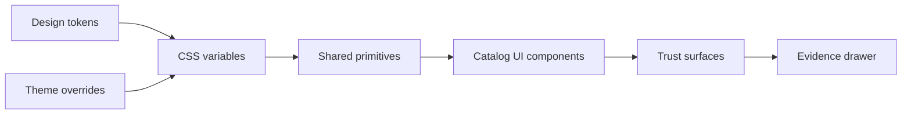

<!-- [KFM_META_BLOCK_V2]
doc_id: kfm://doc/2d2e3f74-3d9a-4d11-9c79-6b2cc0c58d6a
title: Catalog UI Styles Directory README
type: guide
version: v1
status: draft
owners: TBD
created: 2026-02-26
updated: 2026-02-26
policy_label: public
related:
  - kfm://doc/TODO-master-guide
  - kfm://doc/TODO-ui-design-system
tags:
  - kfm
  - ui
  - styles
  - design-tokens
notes:
  - Token-first styling + theming conventions for the Catalog UI.
  - Accessibility (keyboard + contrast) is a non-negotiable baseline.
[/KFM_META_BLOCK_V2] -->

# Catalog UI Styles
> Design tokens, themes, and shared styling primitives for the Catalog UI.

**Status:** draft • **Owners:** TBD • **Policy label:** public (update if needed)


---

## Quick navigation
- [Overview](#overview)
- [Directory boundaries](#directory-boundaries)
- [Design tokens](#design-tokens)
- [Themes](#themes)
- [Recommended layout](#recommended-layout)
- [Conventions](#conventions)
- [Change checklist](#change-checklist)
- [Testing and gates](#testing-and-gates)
- [Troubleshooting](#troubleshooting)
- [Appendix](#appendix)

---

## Overview

This directory is the **styling boundary** for the Catalog UI:
- **Design tokens** (colors, typography, spacing, radii, elevation, motion)
- **Theme definitions** (light/dark/high-contrast, etc.)
- **Global primitives** (resets, base typography, shared utilities)
- **Shared UI patterns** that must remain consistent across surfaces (e.g., badges, focus rings, evidence drawer chrome)

> NOTE  
> KFM prioritizes a UI design system built around **tokens** and **keyboard navigation**, starting with the Evidence Drawer. If styles regress keyboard navigation or visibility, the change is not acceptable.

[Back to top](#catalog-ui-styles)

---

## Directory boundaries

### What belongs here
- Token sources (CSS variables, JSON token sets, or TS constants — **pick one canonical source of truth**)
- Theme maps / overrides (per theme)
- Base styles (reset, typography defaults, layout primitives)
- Shared “trust surface” styling (policy badges, dataset version chips, citation affordances)
- Optional: map style definitions (only if the Catalog UI owns them)

### What must NOT go here
- Business logic, components, API clients, data transforms
- Page- or feature-specific CSS that isn’t reused (co-locate with the component instead)
- Third-party compiled/minified CSS blobs checked into git
- Generated artifacts (build output, hashed files, etc.)

[Back to top](#catalog-ui-styles)

---

## Design tokens

**Goal:** tokens are the only stable interface for color/typography/spacing decisions.

### Token rules
- **No hard-coded colors** in component styles unless explicitly documented as an exception.
- Prefer **semantic tokens** (e.g., `--color-surface`, `--color-text-muted`) over raw palette tokens (e.g., `--blue-500`) at usage sites.
- New UI primitives (badges, panels, focus ring) must be token-driven so they work across themes.

### Suggested token categories
| Category | Examples | Notes |
|---|---|---|
| Color | `--color-surface`, `--color-text`, `--color-accent`, `--color-danger` | Include hover/active states as tokens where it matters |
| Typography | `--font-body`, `--font-mono`, `--text-sm`, `--text-lg` | Keep readable defaults for map + tables |
| Spacing | `--space-1` … `--space-8` | Use for padding/gaps consistently |
| Radius | `--radius-sm`, `--radius-md` | Badges + panels should be consistent |
| Elevation | `--shadow-sm`, `--shadow-md` | Avoid “random shadows” per component |
| Motion | `--duration-fast`, `--easing-standard` | Must honor reduced motion |

### Token naming scheme (recommended)
- Prefix shared tokens with `--kfm-` if collisions are likely across apps.
- Favor `--kfm-color-*`, `--kfm-space-*`, etc.

<details>
<summary><strong>Example token file (illustrative)</strong></summary>

```css
/* tokens.css (illustrative only — align with the repo’s actual approach) */
:root {
  --kfm-color-surface: white;
  --kfm-color-text: black;

  --kfm-space-1: 0.25rem;
  --kfm-space-2: 0.5rem;

  --kfm-radius-sm: 0.25rem;

  --kfm-focus-ring-width: 2px;
}
```
</details>

[Back to top](#catalog-ui-styles)

---

## Themes

KFM UI should support theming (e.g., light/dark/high-contrast) **without changing functionality**.

### Theme strategy (recommended)
- Define baseline tokens in `:root`
- Apply theme overrides using a **theme class** on `<body>` (or `<html>`) such as `.theme-dark`
- Theme overrides should **only** change variables/tokens, not component logic

```css
/* theme-dark.css (illustrative) */
body.theme-dark {
  --kfm-color-surface: black;
  --kfm-color-text: white;
}
```

### Accessibility requirements for themes
- Maintain contrast for:
  - body text
  - muted text (still readable)
  - focus rings (must be visible)
  - policy badges and “trust surface” UI elements (dataset version, license, etc.)

[Back to top](#catalog-ui-styles)

---

## Recommended layout

> This is a **suggested** layout. If this directory already has a structure, update this README to match reality.

```text
src/styles/
  README.md               # this file
  index.(css|ts)          # style entry point imported by the app
  tokens/                 # design tokens (single source of truth)
    tokens.(css|json|ts)
    tokens.generated.*    # optional (if generated from a build step)
  themes/
    theme-light.*
    theme-dark.*
    theme-high-contrast.* # optional
  base/
    reset.*
    typography.*
    layout.*
  components/
    badge.*
    panel.*
    focus-ring.*
  utilities/
    visually-hidden.*
    sr-only.*
    z-index.*
```

[Back to top](#catalog-ui-styles)

---

## Conventions

### Keep “trust surface” UI consistent
KFM UI surfaces are expected to make trust visible (dataset version, license, policy badges, evidence access). Styles here should provide consistent primitives for:
- Policy badges (color + shape + text)
- Dataset version chips
- Evidence/citation affordances (links, icons, hover/focus states)
- Evidence Drawer container styling (spacing, typography, scroll behavior)

### Prefer local styles for local concerns
- If a style is only used by one component, co-locate it with that component.
- If a style is used across surfaces (Catalog + Map + Story + Focus), it belongs in shared primitives/tokens.

### Motion and reduced motion
- Any animation must respect `prefers-reduced-motion`.
- Never use motion as the only indicator of state change.

[Back to top](#catalog-ui-styles)

---

## Change checklist

Use this checklist for PRs that touch anything in `src/styles/`.

### ✅ For any change
- [ ] Uses tokens instead of hard-coded values (or documents the exception)
- [ ] Does not remove/obscure focus outlines
- [ ] Verified in at least one non-default theme (if themes exist)
- [ ] No global selector changes that unintentionally bleed into unrelated components

### 🎨 Adding or changing a token
- [ ] Token name is semantic and stable
- [ ] Token has a clear “when to use” note (in this README or a tokens doc)
- [ ] Theme overrides updated (if needed)
- [ ] Visual review completed (before/after screenshots or story)

### ♿ Evidence Drawer and keyboard navigation (high priority)
- [ ] Tab order still works
- [ ] Focus ring is visible at every step
- [ ] Scroll + overflow behavior does not trap focus
- [ ] Drawer controls are readable and meet contrast requirements

> TIP  
> If you need to introduce a new styling technology (e.g., CSS-in-JS, new preprocessor), do a “repo reality check” first:
> confirm the build system, conventions, and CI gates before adding a new toolchain.

[Back to top](#catalog-ui-styles)

---

## Testing and gates

Recommended (wire up to whatever CI is already present):
- **Style linting** (e.g., Stylelint) and formatting (e.g., Prettier)
- **Accessibility smoke tests** (keyboard navigation + Evidence Drawer critical paths)
- Optional: visual regression tests for theme + badge primitives

If a style change breaks keyboard navigation, it should be treated as a failing gate.

[Back to top](#catalog-ui-styles)

---

## Troubleshooting

### “My token changes don’t show up”
- Confirm the app imports the style entry file (`index.(css|ts)` or equivalent).
- Confirm there isn’t a more specific selector overriding your variables.
- Confirm theme overrides aren’t re-defining the token after your base definition.

### “Dark theme text is unreadable”
- Fix at the token layer, not by special-casing component CSS.
- Ensure focus ring tokens are also theme-aware.

[Back to top](#catalog-ui-styles)

---

## Appendix

<details>
<summary><strong>Mermaid: style system flow (conceptual)</strong></summary>


</details>

<details>
<summary><strong>Glossary</strong></summary>

- **Token:** a named design value (semantic interface), usually surfaced as a CSS variable.
- **Theme:** a set of token overrides that changes visual style without changing behavior.
- **Trust surface:** UI elements that communicate provenance/trust (policy badge, dataset version, evidence link).
</details>
