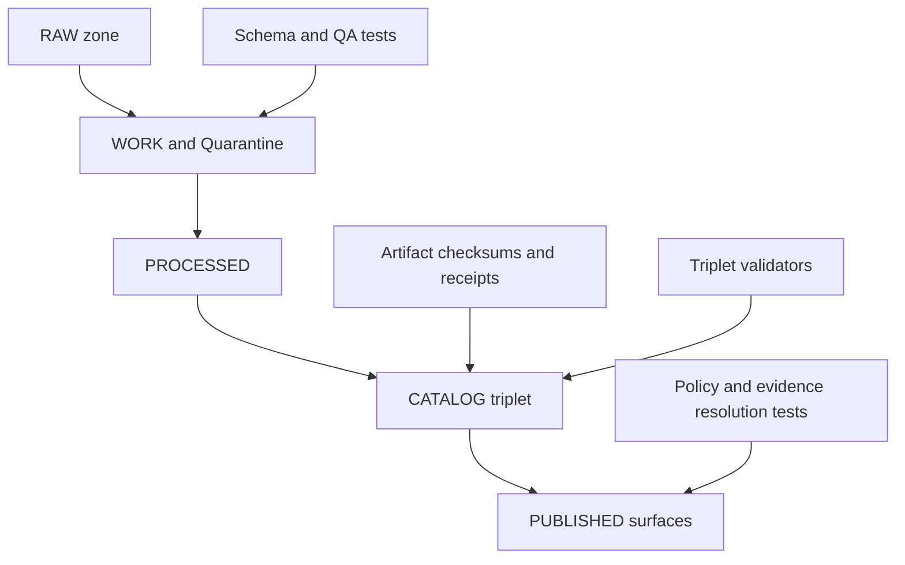

<!-- [KFM_META_BLOCK_V2]
doc_id: kfm://doc/319544eb-afb2-4cd9-8f5c-c9783c8d095a
title: apps/catalog/tests — Test Suite Guide
type: standard
version: v1
status: draft
owners: TODO
created: 2026-02-26
updated: 2026-02-26
policy_label: restricted
related:
  - apps/catalog
tags: [kfm, catalog, tests]
notes:
  - This README defines the intent + conventions for catalog tests. Replace TODO placeholders once the repo wiring (runner/CI paths) is confirmed.
[/KFM_META_BLOCK_V2] -->

<a id="top"></a>

# apps/catalog/tests
**Purpose:** Automated tests for the **Catalog** layer (DCAT + STAC + PROV + run receipts) and **policy-aware evidence resolution**. These tests are intended to **fail closed** and act as gates for promotion into governed runtime surfaces.

> **Status:** draft • **Owners:** TODO • **Policy label:** restricted (default; update if this directory is safe for public exposure)


 <!-- TODO: replace with real CI badge -->
 <!-- TODO: replace with real coverage badge -->

**Quick links**
- [Directory contract](#directory-contract)
- [Suite map](#suite-map)
- [Run tests](#run-tests)
- [Gate coverage checklist](#gate-coverage-checklist)
- [Fixtures and test data rules](#fixtures-and-test-data-rules)
- [Adding a new test](#adding-a-new-test)
- [Troubleshooting](#troubleshooting)
- [Appendix](#appendix)

---

## Directory contract

### Where this fits
This folder contains tests that protect the **catalog/provenance contract surface**: the metadata and lineage artifacts that sit between pipelines and governed runtime (API + UI).

### What belongs here
✅ **Acceptable inputs**
- Deterministic fixtures (small JSON/JSON-LD/YAML/CSV/etc.) for:
  - DCAT dataset/distribution records
  - STAC collections/items/assets
  - PROV bundles / run lineage snippets
  - Policy decision fixtures (allow/deny + obligations) for contract testing
- “Golden” expected outputs for strict validation / regression tests (small + stable)
- Minimal harness code for the catalog validators / evidence resolver integration tests

🚫 **Exclusions**
- No production datasets or full-resolution sensitive geometries
- No secrets, credentials, API tokens, or private keys
- No large binaries (unless explicitly justified and reviewed)
- No fixtures that would violate rights, licensing, or community constraints

> **WARNING**: If a fixture might encode a sensitive location, do **not** store exact coordinates. Use generalized geometry or synthetic data. Default-deny when uncertain.

[↑ Back to top](#top)

---

## Suite map

The catalog sits in the “triplet” layer and is directly tied to promotion gates. Tests here should focus on strict validation and deterministic resolution.



### Recommended layout
> **NOTE:** Update this tree to match the actual repo structure once confirmed.

```text
apps/catalog/tests/
├─ README.md
├─ fixtures/                 # small deterministic inputs (no secrets)
│  ├─ dcat/
│  ├─ stac/
│  ├─ prov/
│  └─ policy/
├─ golden/                   # expected outputs / snapshots
├─ unit/                     # pure functions (fast)
├─ contract/                 # schema/profile + cross-link validation
├─ integration/              # integration with validators/evidence resolver (no network by default)
└─ e2e/                      # optional: full flow tests (if supported)
```

[↑ Back to top](#top)

---

## Run tests

> **Unknown (repo-specific):** The exact runner and command depend on how `apps/catalog` is implemented (Node, Python, Go, etc.). The goal is to make this section **one command** once confirmed.

### Fast path (TODO: replace with the authoritative command)
```sh
# TODO: replace with the real command once verified in CI
# examples (do not assume):
#   pnpm -C apps/catalog test
#   npm --prefix apps/catalog test
#   pytest apps/catalog/tests -q
#   go test ./apps/catalog/...
echo "TODO: wire to real catalog test command"
```

### Discover the authoritative command (one-time)
Use whichever matches your repo conventions:

```sh
# 1) Look for CI wiring
ls -la .github/workflows 2>/dev/null || true

# 2) Look for a root test runner (Makefile / task runner / package manager)
ls -la 2>/dev/null || true

# 3) Search for catalog test scripts or targets (pick one tool you have)
# rg "test:catalog|catalog.*test|apps/catalog" -n . || true
# grep -R "test:catalog\|apps/catalog" -n . || true
```

After you find the real command, **edit this README** so contributors don’t guess.

[↑ Back to top](#top)

---

## Gate coverage checklist

Catalog tests should map to Promotion Contract gates that matter for catalog correctness, policy safety, and evidence resolvability.

> **Goal:** If a dataset version is promoted, CI must prove the triplet validates, links resolve, policy tests pass, and evidence resolution works at least once.

### Minimum gate coverage (recommended)
- [ ] **Gate A — Identity and versioning:** stable dataset identity + immutable version identity (no drift)
- [ ] **Gate B — Licensing/rights metadata:** license present, rights captured, fail closed on unclear
- [ ] **Gate C — Sensitivity + redaction plan:** policy_label assigned, obligations recorded when needed
- [ ] **Gate D — Triplet validation:** DCAT/STAC/PROV validate + cross-links resolvable
- [ ] **Gate E — Run receipts + checksums:** receipts exist; inputs/outputs enumerated with digests
- [ ] **Gate F — Policy + contract tests:** OPA/policy fixtures pass; evidence resolver resolves at least one EvidenceRef; API contracts/schemas validate

### How tests in this folder should prove gates (suggested mapping)

| Gate | What to test | Typical artifact |
|---|---|---|
| A | deterministic ID/version derivation; “same spec → same version id” | spec fixtures + expected IDs |
| B | DCAT rights fields present; deny promotion when unclear | DCAT fixture matrix |
| C | policy_label required; obligations applied to geometry/fields | policy fixtures + redacted outputs |
| D | profile validation + cross-links (DCAT↔STAC↔PROV) | triplet fixture bundles |
| E | run receipt schema; checksums exist for referenced assets | receipt fixtures + digest lists |
| F | policy tests pass; evidence resolution produces EvidenceBundle; contracts validate | evidence fixtures + bundle snapshots |

[↑ Back to top](#top)

---

## Fixtures and test data rules

### Determinism rules
- Tests MUST be deterministic across machines and time.
- Freeze time when generating timestamps (avoid “now” unless explicitly controlled).
- Avoid calling external services; use fixtures and local fakes.

### Safety and governance rules
- Treat policy and redaction as first-class test concerns.
- Prefer synthetic or generalized geometries for any location-like fixture.
- If rights/sensitivity are unclear, tests should validate that the system **blocks promotion/publishing**.

### Fixture naming (recommended)
- `fixtures/dcat/<case>.jsonld`
- `fixtures/stac/<collection_or_item>/<case>.json`
- `fixtures/prov/<case>.json`
- `fixtures/policy/<case>.json`
- `golden/<suite>/<case>.expected.json`

[↑ Back to top](#top)

---

## Adding a new test

### 1) Pick the gate(s) you’re covering
Write down which gate(s) the new test protects (A–F). If you can’t name a gate, reconsider why the test exists.

### 2) Add fixtures first
- Add the smallest fixture that demonstrates the behavior.
- Add (or update) golden outputs if validation output is meant to be stable.

### 3) Make the failure mode crisp
- Fail with actionable messages: *what failed*, *why*, *where the evidence is*.
- Prefer “one assertion per invariant” over mega-tests.

### 4) Update this README if you added a new suite
Keep the suite map and directory tree accurate.

[↑ Back to top](#top)

---

## Troubleshooting

### Common issues
- **Validation failures after a schema/profile update**  
  Update fixtures and goldens together, and ensure failures are intentional.

- **Non-deterministic snapshots / goldens**  
  Normalize key ordering, timestamps, and floating point formatting; freeze time; avoid random seeds unless pinned.

- **Policy tests passing locally but failing in CI**  
  Ensure fixtures and policy bundles are committed; avoid environment-dependent logic.

### When in doubt
- Start from the gate checklist and ask: “Which gate is this failing, and what should block promotion?”

[↑ Back to top](#top)

---

## Appendix

<details>
<summary><strong>Glossary (KFM terms used here)</strong></summary>

- **Catalog triplet:** DCAT (dataset metadata), STAC (asset metadata), PROV (lineage), cross-linked so evidence is navigable without guessing.
- **EvidenceRef:** scheme-based reference (e.g., dcat://, stac://, prov://, doc://) resolvable by the evidence resolver.
- **EvidenceBundle:** resolved evidence payload (human + machine fields), including the policy decision, plus digests and audit references.
- **Run receipt:** machine-readable run record with inputs/outputs (by digest), environment, validation results, and policy decisions.

</details>

<details>
<summary><strong>Template: new test case header</strong></summary>

```text
Case: <short name>
Gate(s): A / B / C / D / E / F
Purpose: <one sentence>
Fixtures: <list paths>
Expected: <what passes / what fails>
Notes: <any special policy obligations or redactions>
```

</details>
