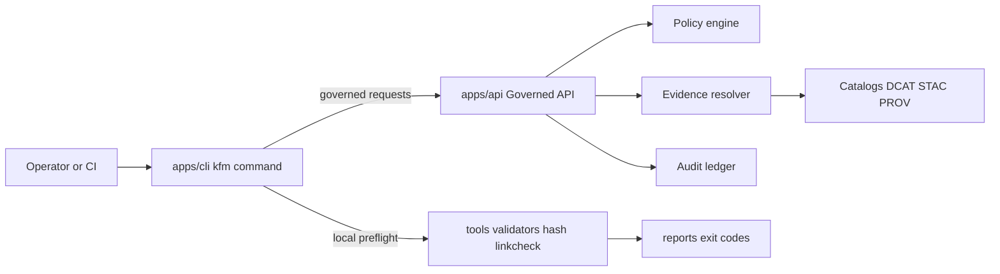
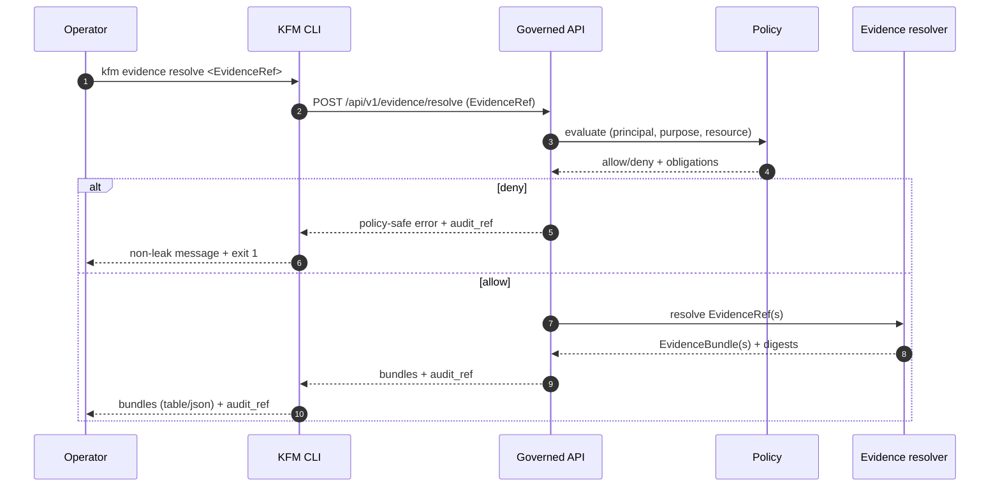

<!-- [KFM_META_BLOCK_V2]
doc_id: kfm://doc/7bb15efa-6c26-436c-bef7-0c165457d121
title: apps/cli — KFM Command Line Interface
type: standard
version: v1
status: draft
owners: KFM Engineering (see .github/CODEOWNERS)
created: 2026-02-23
updated: 2026-02-23
policy_label: public
related:
  - ../../README.md
  - ../../CONTRIBUTING.md
  - ../../.github/README.md
  - ../api/README.md
  - ../ui/README.md
  - ../../tools/README.md
tags: [kfm, cli]
notes:
  - Contract-first README; implementation wiring TBD.
[/KFM_META_BLOCK_V2] -->

<a id="top"></a>

# apps/cli — KFM Command Line Interface

**Purpose:** a **governed**, **policy-aware**, **fail-closed** CLI for Kansas Frontier Matrix (KFM) that helps humans and automation:
- interact with the **Governed API** (datasets, catalogs, evidence, story workflows)
- run **local preflight checks** (hashing, validation, linkcheck) without bypassing the trust membrane
- produce **deterministic, auditable outputs** suitable for CI and stewardship review

**Status:** `DRAFT` (vNext) • **Owners:** see [`/.github/CODEOWNERS`](../../.github/CODEOWNERS) • **Audience:** engineers, data/policy stewards, CI


---

## Quick navigation

- **Foundations**
  - [Overview](#overview)
  - [Directory boundaries](#directory-boundaries)
  - [Non-negotiables](#non-negotiables)
  - [Architecture](#architecture)
- **Using the CLI**
  - [Install and run](#install-and-run)
  - [Configuration](#configuration)
  - [Command registry](#command-registry)
  - [Output formats](#output-formats)
  - [Exit codes](#exit-codes)
- **Engineering + governance**
  - [Security and governance notes](#security-and-governance-notes)
  - [Testing](#testing)
  - [Definition of Done](#definition-of-done)
- **Appendix**
  - [Appendix: Proposed directory layout](#appendix-proposed-directory-layout)
  - [References](#references)

> [!NOTE]
> This README is written as a **contract**. It may describe **PROPOSED** command surfaces until implementation lands.
> Treat any section marked **PROPOSED** as a design option that must be reconciled with the actual repo state.

[Back to top](#top)

---

## Overview

`apps/cli` is the canonical place for a **single “front door” CLI** for KFM operations.

### What this CLI is

- A **policy-aware client** of the governed API (and its evidence resolver), intended for:
  - maintainers and stewards operating promotion/review workflows
  - power users doing repeatable research workflows (exporting citations, generating reports)
  - CI steps that need stable, deterministic tooling (when a pure tool under `tools/` is not enough)

- A **coordinator**, not a new source of truth:
  - it can *run validators* and *generate reports*
  - it can *request* governed operations from the API
  - it must **not** create “shadow publish paths” that bypass promotion gates

### What this CLI is not

- **Not a backdoor** to databases, object stores, tile buckets, or “raw” artifacts.
- **Not an ETL pipeline runner** (those belong in pipelines/workers, with receipts and promotion gates).
- **Not an ungoverned scraper**. If the CLI fetches remote sources, it must do so explicitly and record provenance.

[Back to top](#top)

---

## Directory boundaries

### Where it fits in the repo

Expected location (confirm against repo reality):

```text
repo-root/
└─ apps/
   ├─ api/      # governed API boundary (policy + evidence + audit)
   ├─ ui/       # governed map/story/focus client
   ├─ studio/   # governed story authoring/review
   └─ cli/      # ← YOU ARE HERE
```

### Acceptable inputs

What belongs in `apps/cli/`:

- CLI entrypoint + subcommands for interacting with **governed surfaces**
- Thin orchestration over **repo-local tools** (hash/validators/linkcheck) where it improves ergonomics
- Deterministic, testable output format definitions (JSON schemas, fixtures)
- Documentation and examples for steward-safe operations (promotion planning, evidence linting)

### Exclusions

What must **not** live in `apps/cli/`:

- Direct DB queries or object-store reads that bypass the governed API (**trust membrane violation**)
- Secrets (API tokens, private keys, credentials). Only `.env.example` with placeholders is allowed.
- “Publish now” shortcuts that skip promotion manifests, catalogs, validation, and policy review
- Long-lived datasets or large artifacts (those belong in the data lifecycle zones)

[Back to top](#top)

---

## Non-negotiables

These requirements are inherited from KFM’s repo-wide posture and apply **strictly** to the CLI.

### Trust membrane

- The CLI **MUST NOT** read from storage/DB/search/tiles directly.
- The CLI **MUST** use governed APIs (or deterministic, repo-local artifacts) so policy and audit are applied consistently.

### Default-deny and policy-safe behavior

- The CLI **MUST** fail closed when:
  - auth context is missing or unclear
  - policy label/sensitivity is unclear
  - evidence cannot be resolved
  - validation/linkcheck fails
- The CLI **MUST** preserve the **non-leak rule**:
  - do not reveal restricted existence through different error messages, different exit codes, or timing side-channels

### Evidence-first

- Any command that prints or exports “answers” **MUST** include (or be able to emit) resolvable evidence references:
  - `dataset_version_id` (when applicable)
  - `EvidenceRef` values or `EvidenceBundle` summaries (policy-filtered)
  - `audit_ref` for governed operations

### Determinism

- For automation and CI, output must be stable:
  - stable key ordering for JSON
  - stable sorting for lists
  - stable timestamps handling (UTC, explicit)
  - a `--json` / `--ndjson` mode that is deterministic across platforms

[Back to top](#top)

---

## Architecture

### Boundary diagram



### Typical governed request flow



[Back to top](#top)

---

## Install and run

> [!NOTE]
> Packaging and runtime are **not yet standardized** for this CLI on every branch.
> This section provides a **PROPOSED** shape—update it once `apps/cli` has a manifest (`package.json`, `pyproject.toml`, etc.).

### PROPOSED install patterns

Pick one, once the repo standard is chosen:

- **Node/TypeScript (PROPOSED)**
  ```bash
  # from repo root
  npm install
  npm run -w apps/cli build
  npm run -w apps/cli kfm -- --help
  ```

- **Python (PROPOSED)**
  ```bash
  # from repo root
  python -m venv .venv
  source .venv/bin/activate
  pip install -e apps/cli
  kfm --help
  ```

### PROPOSED: fast local smoke check

```bash
kfm doctor
```

[Back to top](#top)

---

## Configuration

### Environment variables

These names align with other vNext docs and are **PROPOSED** until confirmed:

- `KFM_API_BASE_URL` — base URL for the governed API
- `KFM_AUTH_MODE` — auth mode (e.g., `oidc`, `token`, `none` for local mocks)
- `KFM_AUTH_TOKEN` — bearer token **(do not commit; do not log)**
- `KFM_PURPOSE` — optional declared purpose for audit context (e.g., `research`, `steward_review`)

### Config file

**PROPOSED**: `~/.config/kfm/config.json` (or OS-appropriate path)

Minimal shape (illustrative):

```json
{
  "apiBaseUrl": "http://localhost:8080",
  "authMode": "token",
  "purpose": "steward_review",
  "output": { "format": "table", "color": "auto" }
}
```

### Secret handling

- Never store secrets in repo files.
- Prefer OS keychain integration or environment injection (CI secret store).

[Back to top](#top)

---

## Command registry

> The registry below is intentionally written as **PROPOSED** until commands exist in code.
> Once implemented, keep this table accurate and stable: it becomes a contract for CI and operators.

### Core commands

| Category | Command | Primary job | Talks to API | Writes files | Status |
|---|---|---|:---:|:---:|---|
| Core | `kfm --help` | show help |  |  | PROPOSED |
| Core | `kfm --version` | print version + git commit (if available) |  |  | PROPOSED |
| Core | `kfm doctor` | environment + connectivity checks | ✅ |  | PROPOSED |
| Identity | `kfm whoami` | show auth principal + role (policy-safe) | ✅ |  | PROPOSED |

### Data + catalog discovery

| Category | Command | Primary job | Talks to API | Writes files | Status |
|---|---|---|:---:|:---:|---|
| Catalog | `kfm datasets list` | list datasets and latest versions | ✅ |  | PROPOSED |
| Catalog | `kfm datasets show <dataset_id>` | show dataset + version metadata | ✅ |  | PROPOSED |
| STAC | `kfm stac search --bbox ... --time ...` | search STAC items | ✅ |  | PROPOSED |

### Evidence and citations

| Category | Command | Primary job | Talks to API | Writes files | Status |
|---|---|---|:---:|:---:|---|
| Evidence | `kfm evidence resolve <EvidenceRef...>` | resolve EvidenceRefs into EvidenceBundles | ✅ |  | PROPOSED |
| Evidence | `kfm evidence lint <path>` | lint citation references in a doc/story |  | ✅ | PROPOSED |
| Stories | `kfm story lint <story.md>` | validate Story Node citations and sidecar | ✅ | ✅ | PROPOSED |

### Local preflight (wrapping repo-local tools)

| Category | Command | Primary job | Talks to API | Writes files | Status |
|---|---|---|:---:|:---:|---|
| Hash | `kfm hash spec <spec.json>` | compute spec_hash (canonical JSON) |  |  | PROPOSED |
| Validate | `kfm validate dcat <path>` | validate DCAT profile (fail closed) |  |  | PROPOSED |
| Validate | `kfm validate stac <path>` | validate STAC profile (fail closed) |  |  | PROPOSED |
| Validate | `kfm validate prov <path>` | validate PROV profile (fail closed) |  |  | PROPOSED |
| Linkcheck | `kfm linkcheck catalogs <path>` | verify cross-links and EvidenceRefs resolve |  | ✅ | PROPOSED |

### Promotion helpers (no bypass)

| Category | Command | Primary job | Talks to API | Writes files | Status |
|---|---|---|:---:|:---:|---|
| Promote | `kfm promote plan <dataset_slug>` | produce a promotion plan + checklist | ✅ | ✅ | PROPOSED |
| Promote | `kfm promote manifest --dry-run` | generate a promotion manifest draft |  | ✅ | PROPOSED |

<details>
<summary><strong>Example: machine output mode (PROPOSED)</strong></summary>

```bash
# JSON output for CI parsing (deterministic)
kfm evidence resolve dcat://kfm.example/dataset/noaa_storm_events --json

# NDJSON for streaming large results
kfm stac search --bbox "-101,36.8,-94.6,40" --time "1934-01-01/1936-12-31" --ndjson
```

</details>

[Back to top](#top)

---

## Output formats

### Human mode

- default format should be readable and policy-safe (no restricted leaks)
- tables should be stable-sorted
- errors should be actionable without revealing restricted existence

### Machine mode

Provide a stable machine-readable mode:

- `--json` — single JSON object (deterministic key ordering)
- `--ndjson` — newline-delimited JSON (streaming)
- `--quiet` — suppress non-essential logs

**PROPOSED response envelope** (align with API envelopes):

```json
{
  "data": { "…": "…" },
  "meta": {
    "policy_label": "public",
    "dataset_version_id": "kfm://dataset/@…",
    "audit_ref": "kfm://audit/entry/…",
    "request_id": "…"
  }
}
```

[Back to top](#top)

---

## Exit codes

To be CI-safe and predictable:

- `0` — success
- `1` — expected failure condition (validation failed, policy denied, evidence unresolved)
- `2` — CLI misuse (bad args/config)
- `>=3` — unexpected runtime error (treated as failure)

> [!IMPORTANT]
> Exit codes must not become a side-channel that leaks restricted existence. Keep deny/unresolved behavior stable.

[Back to top](#top)

---

## Security and governance notes

### Sensitive locations and restricted knowledge

If a command might handle sensitive locations (archaeology, culturally restricted sites, vulnerable infrastructure):

- default to **deny** unless policy allows
- prefer generalized geometries and aggregated outputs
- never print precise coordinates in logs by default
- ensure exports include policy notices and obligations where applicable

### Logging rules

- Never log auth tokens or secrets.
- Avoid printing restricted values in errors.
- Prefer stable error codes (`POLICY_DENY`, `EVIDENCE_UNRESOLVABLE`, `VALIDATION_FAILED`) with policy-safe messages.

### Network access

- CLI should talk to the governed API by design.
- Any additional network access (fetching external URLs for linkcheck) should be:
  - **off by default**
  - allowlist-only
  - recorded in a run record / receipt

[Back to top](#top)

---

## Testing

Recommended test layers (once implementation exists):

- **Unit tests**
  - command parsing, output formatting determinism
  - stable sorting and canonicalization helpers
- **Contract tests**
  - governed API response envelopes (`audit_ref`, `policy_label`, `dataset_version_id`)
  - non-leak error behavior (deny vs not-found indistinguishable where required)
- **Golden fixtures**
  - expected JSON outputs (byte-for-byte)
  - expected exit codes for known scenarios

[Back to top](#top)

---

## Definition of Done

A CLI change is “done” only if:

- [ ] `--help` and `--version` work (non-interactive)
- [ ] commands have stable, documented exit codes
- [ ] machine output mode exists (`--json` or `--ndjson`) and is deterministic
- [ ] no trust-membrane bypass paths were introduced
- [ ] policy deny and evidence unresolved cases **fail closed**
- [ ] logs are policy-safe and do not leak secrets/restricted values
- [ ] tests exist proportional to risk (unit + contract + at least one golden fixture)
- [ ] docs updated (this README + examples), and links are maintained

[Back to top](#top)

---

## Appendix: Proposed directory layout

> This is **PROPOSED** until code lands.

```text
apps/cli/
├─ README.md
├─ src/
│  ├─ main.*              # CLI entrypoint
│  ├─ commands/           # subcommands (datasets, evidence, validate, story, ...)
│  ├─ api/                # client for governed API (no direct DB/storage)
│  ├─ output/             # table/json formatting; deterministic ordering
│  └─ policy_safe_errors/ # error code registry + messaging
├─ tests/
│  ├─ unit/
│  ├─ contract/
│  └─ fixtures/
├─ schemas/               # output schemas for CI parsing (optional)
└─ .env.example           # placeholders only (no secrets)
```

[Back to top](#top)

---

## References

- Repo root operating model: [`README.md`](../../README.md)
- Contribution workflow + doc requirements: [`CONTRIBUTING.md`](../../CONTRIBUTING.md)
- Governed API boundary contract: [`apps/api/README.md`](../api/README.md)
- Governed UI contract: [`apps/ui/README.md`](../ui/README.md)
- Tooling contracts (validators/hash/linkcheck): [`tools/README.md`](../../tools/README.md)
